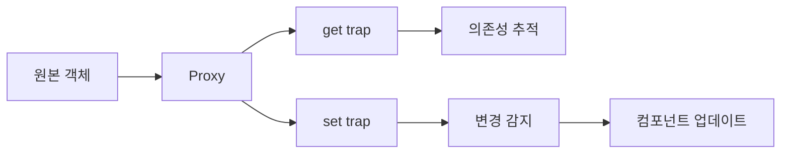

# Reactivity Deep Dive

## 학습 목표
- Vue 3 Reactivity System의 내부 동작 원리 이해
- Proxy 기반 반응성 메커니즘 파악
- watch, watchEffect의 차이와 활용법 학습

## 개념 설명

### Vue 3 Reactivity System

Vue 3는 ES6 Proxy를 활용한 완전히 새로운 반응성 시스템을 도입했습니다.



### Vue 2 vs Vue 3 Reactivity

| 특성 | Vue 2 (Object.defineProperty) | Vue 3 (Proxy) |
|------|------------------------------|---------------|
| 새 속성 추가 | `Vue.set()` 필요 | 자동 감지 |
| 배열 인덱스 | 감지 안 됨 | 자동 감지 |
| 성능 | 모든 속성 사전 변환 | Lazy (필요 시만) |
| 브라우저 지원 | IE11+ | Modern only |

### ref vs reactive 내부 구조

```typescript
// ref 내부 구조 (단순화)
class RefImpl<T> {
  private _value: T

  get value() {
    track(this, 'value')  // ✅ 의존성 추적
    return this._value
  }

  set value(newVal) {
    this._value = newVal
    trigger(this, 'value')  // ✅ 변경 알림
  }
}

// reactive 내부 구조 (단순화)
function reactive(target) {
  return new Proxy(target, {
    get(target, key) {
      track(target, key)  // ✅ 의존성 추적
      return Reflect.get(target, key)
    },
    set(target, key, value) {
      const result = Reflect.set(target, key, value)
      trigger(target, key)  // ✅ 변경 알림
      return result
    }
  })
}
```

## Portal Universe 코드 분석

### 1. App.vue - watch 활용

```vue
<script setup lang="ts">
import { ref, computed, watch } from "vue";
import { useRoute } from "vue-router";
import { useThemeStore } from "./store/theme.ts";

const route = useRoute();
const themeStore = useThemeStore();
const sidebarCollapsed = ref(localStorage.getItem('sidebar-collapsed') === 'true');

// ✅ Computed: 자동 의존성 추적
const mainClass = computed(() => ({
  'lg:ml-64': !sidebarCollapsed.value,
  'lg:ml-16': sidebarCollapsed.value,
  'pt-14 lg:pt-0': true,
}));

// ✅ watch: 특정 값 변경 감지
watch(() => route.path, () => {
  resetDataService();
});

// ✅ watch: Store 상태 변경 감지
watch(() => themeStore.isDark, (newVal) => {
  if (newVal) {
    document.documentElement.classList.add('dark');
  } else {
    document.documentElement.classList.remove('dark');
  }
  updateDataTheme();
});

// ✅ watch: 여러 값 동시 감지
watch(
  [() => route.path, () => themeStore.isDark],
  ([newPath, newIsDark], [oldPath, oldIsDark]) => {
    console.log('Route or theme changed');
  }
);
</script>
```

### 2. Store Adapter - watch 기반 Subscribe

```typescript
// src/store/storeAdapter.ts
export const authAdapter = {
  subscribe: (callback: (state: AuthState) => void): UnsubscribeFn => {
    const store = useAuthStore()

    // ✅ watch: Pinia Store 변경 구독
    const unwatch = watch(
      () => store.user,
      () => callback(authAdapter.getState()),
      { immediate: true, deep: true }  // 옵션 활용
    )

    return unwatch  // 구독 해제 함수 반환
  }
}
```

**핵심 포인트:**
- `immediate: true`: 즉시 콜백 실행
- `deep: true`: 깊은 객체 감지
- `unwatch`: 구독 해제 함수

### 3. useHealthCheck - 반응형 상태 관리

```typescript
// src/composables/useHealthCheck.ts
export function useHealthCheck(options: UseHealthCheckOptions = {}) {
  const store = useServiceStatusStore();

  // ✅ Local State (ref)
  const intervalId = ref<number | null>(null);
  const isLoading = ref(false);

  // ✅ Computed from Store
  const services = computed(() => store.allServices);
  const healthyServices = computed(() => store.healthyServices);

  // ✅ Reactive Method
  async function refresh() {
    isLoading.value = true;  // 반응형 업데이트
    try {
      await store.checkAllServices();
    } finally {
      isLoading.value = false;
    }
  }

  return {
    services,        // ComputedRef
    healthyServices, // ComputedRef
    isLoading,       // Ref
    refresh          // Function
  };
}
```

## watch vs watchEffect

### watch - 명시적 의존성

```typescript
import { ref, watch } from 'vue'

const count = ref(0)
const message = ref('Hello')

// ✅ 단일 소스 감시
watch(count, (newVal, oldVal) => {
  console.log(`count changed from ${oldVal} to ${newVal}`)
})

// ✅ 여러 소스 감시
watch([count, message], ([newCount, newMsg], [oldCount, oldMsg]) => {
  console.log(`count: ${newCount}, message: ${newMsg}`)
})

// ✅ Getter 함수 사용
const user = reactive({ name: 'John', age: 30 })
watch(() => user.age, (newAge) => {
  console.log(`age changed to ${newAge}`)
})

// ✅ 옵션
watch(
  count,
  (newVal) => {
    console.log(newVal)
  },
  {
    immediate: true,  // 즉시 실행
    deep: true,       // 깊은 감시
    flush: 'post'     // DOM 업데이트 후 실행
  }
)
```

### watchEffect - 자동 의존성

```typescript
import { ref, watchEffect } from 'vue'

const count = ref(0)
const doubled = ref(0)

// ✅ 자동 의존성 추적 (count 변경 시 자동 재실행)
watchEffect(() => {
  doubled.value = count.value * 2
  console.log(`doubled: ${doubled.value}`)
})
// ❌ 위 코드는 computed로 대체 가능
// const doubled = computed(() => count.value * 2)

// ✅ watchEffect 적합한 경우: Side Effect
const userId = ref(1)

watchEffect(() => {
  // userId 변경 시 자동으로 API 호출
  fetch(`/api/users/${userId.value}`)
    .then(res => res.json())
    .then(data => {
      console.log(data)
    })
})
```

### watch vs watchEffect 비교

| 특성 | watch | watchEffect |
|------|-------|-------------|
| 의존성 | 명시적 지정 | 자동 추적 |
| Old/New Value | 제공 | 제공 안 함 |
| 초기 실행 | 옵션 (`immediate`) | 기본 즉시 실행 |
| 사용 시점 | 특정 값 감시 | Side Effect 수행 |

## 실습 예제

### 예제 1: Reactivity 기본

```typescript
import { ref, reactive, computed } from 'vue'

// ✅ ref: Primitive 값
const count = ref(0)
count.value++  // 반응형 업데이트

// ✅ reactive: 객체
const state = reactive({
  count: 0,
  nested: {
    value: 10
  }
})
state.count++  // 반응형 업데이트
state.nested.value++  // 깊은 반응형

// ✅ computed: 자동 캐싱
const doubled = computed(() => count.value * 2)
console.log(doubled.value)  // 계산
console.log(doubled.value)  // 캐시 사용 (재계산 안 함)

count.value++  // count 변경
console.log(doubled.value)  // 재계산
```

### 예제 2: 깊은 반응성

```typescript
const user = reactive({
  profile: {
    name: 'John',
    address: {
      city: 'Seoul'
    }
  }
})

// ✅ 깊은 속성도 반응형
watch(() => user.profile.address.city, (newCity) => {
  console.log(`City changed to ${newCity}`)
})

user.profile.address.city = 'Busan'  // 감지됨
```

### 예제 3: 배열 반응성

```typescript
const items = ref([1, 2, 3])

// ✅ 배열 메서드 모두 반응형
items.value.push(4)        // 감지됨
items.value.splice(0, 1)   // 감지됨
items.value[0] = 10        // 감지됨 (Vue 3)

// ❌ 재할당 시 .value 필요
items.value = [5, 6, 7]  // ✅ OK
items = [5, 6, 7]        // ❌ 반응성 소실
```

### 예제 4: watch Options

```typescript
const user = reactive({
  name: 'John',
  age: 30
})

// ✅ deep: true (깊은 감시)
watch(
  user,
  (newVal) => {
    console.log('User changed:', newVal)
  },
  { deep: true }
)

user.age++  // 감지됨

// ✅ flush: 'post' (DOM 업데이트 후)
watch(
  count,
  async () => {
    // DOM이 업데이트된 후 실행
    await nextTick()
    console.log(document.querySelector('.count')?.textContent)
  },
  { flush: 'post' }
)
```

### 예제 5: watchEffect Cleanup

```typescript
const userId = ref(1)

watchEffect((onCleanup) => {
  const controller = new AbortController()

  fetch(`/api/users/${userId.value}`, {
    signal: controller.signal
  })
    .then(res => res.json())
    .then(data => console.log(data))
    .catch(err => {
      if (err.name !== 'AbortError') {
        console.error(err)
      }
    })

  // ✅ Cleanup: userId 변경 시 이전 요청 취소
  onCleanup(() => {
    controller.abort()
  })
})
```

### 예제 6: Shallow Reactivity

```typescript
import { shallowRef, shallowReactive } from 'vue'

// ✅ shallowRef: .value만 반응형
const state = shallowRef({
  count: 0,
  nested: { value: 10 }
})

state.value.count++  // ❌ 감지 안 됨
state.value = { count: 1, nested: { value: 20 } }  // ✅ 감지됨

// ✅ shallowReactive: 최상위만 반응형
const user = shallowReactive({
  name: 'John',
  profile: { age: 30 }
})

user.name = 'Jane'  // ✅ 감지됨
user.profile.age++  // ❌ 감지 안 됨
user.profile = { age: 31 }  // ✅ 감지됨
```

## 핵심 요약

### Reactivity System 핵심
1. **Proxy 기반**: ES6 Proxy로 자동 감지
2. **의존성 추적**: track() → trigger() 메커니즘
3. **Lazy Evaluation**: 필요할 때만 변환
4. **깊은 반응성**: 중첩 객체도 자동 처리

### watch 패턴
```typescript
// 단일 소스
watch(source, callback, options)

// 여러 소스
watch([source1, source2], callback, options)

// Getter 함수
watch(() => obj.prop, callback, options)
```

### watchEffect 패턴
```typescript
// 자동 의존성
watchEffect(() => {
  // 사용된 모든 ref/reactive 추적
})

// Cleanup
watchEffect((onCleanup) => {
  // 부수 효과
  onCleanup(() => {
    // 정리 작업
  })
})
```

### Best Practices

#### ✅ DO
```typescript
// computed 우선 고려
const doubled = computed(() => count.value * 2)

// watch는 Side Effect용
watch(userId, (id) => {
  fetchUserData(id)
})

// Deep watch 최소화 (성능)
watch(() => user.name, callback)  // ✅ 특정 속성만
```

#### ❌ DON'T
```typescript
// ❌ computed 대신 watch 남용
watch(count, (val) => {
  doubled.value = val * 2  // computed 사용!
})

// ❌ 불필요한 deep watch
watch(bigObject, callback, { deep: true })  // 성능 저하
```

### Portal Shell Reactivity 패턴
- **Pinia Store**: reactive/ref로 상태 관리
- **Computed**: 파생 상태 (displayName, isAdmin)
- **watch**: Route 변경, Theme 변경 감지
- **Store Adapter**: watch 기반 Subscribe 구현

## 관련 문서
- [Composition API Deep Dive](./composition-api-deep-dive.md)
- [Pinia State Management](./pinia-state-management.md)
- [Composables Pattern](./composables-pattern.md)
