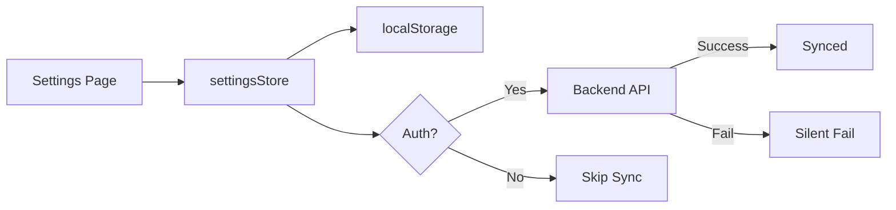

# ADR-009: Settings Page 아키텍처 설계

## 상태
**Accepted** | 2026-01-21

---

## Context (배경)

Portal Shell (Vue 3 Host App)에 사용자 설정 페이지를 추가하려고 합니다. 다음과 같은 요구사항이 있습니다:

### 기능 요구사항
1. **테마 설정**: Dark/Light/System 모드 지원
2. **언어 설정**: 한국어/영어 (향후 확장 가능)
3. **알림 수신 설정**: 이메일 알림, 푸시 알림 on/off
4. **데이터 저장**: localStorage 우선, 선택적으로 백엔드 동기화

### 기술 제약
- 기존 `theme.ts` store를 최대한 활용
- JWT/인증 로직 수정 최소화 (auth 작업과 충돌 회피)
- 비회원도 설정 사용 가능
- 백엔드 API 호출 최소화 (네트워크 실패에도 동작)

### 현재 상태
- `frontend/portal-shell/src/store/theme.ts`: 테마 관리 (dark/light/system)
- `frontend/portal-shell/src/components/ThemeToggle.vue`: 테마 토글 컴포넌트
- localStorage 기반 테마 저장 이미 구현

---

## Decision Drivers (결정 요인)

1. **빠른 응답성**: 설정 변경 시 즉시 반영 (네트워크 지연 없음)
2. **오프라인 지원**: 네트워크 없이도 설정 동작
3. **코드 재사용**: 기존 `theme.ts` 로직 활용
4. **확장성**: 새로운 설정 추가 용이
5. **비회원 지원**: 로그인 없이도 설정 가능
6. **다중 디바이스 동기화**: 회원은 디바이스 간 설정 동기화
7. **JWT 독립성**: auth 로직 수정 최소화

---

## Considered Options (검토한 대안)

### Option 1: Backend-First (백엔드 우선)

**설명**: 모든 설정을 백엔드 API로 관리

```typescript
// 설정 변경 시마다 API 호출
const updateTheme = async (mode: ThemeMode) => {
  await api.put('/api/auth/users/me/settings', { theme: mode });
  themeStore.setMode(mode);
};
```

**장점**:
- ✅ 다중 디바이스 동기화 보장
- ✅ 데이터 일관성

**단점**:
- ❌ 네트워크 지연으로 UX 저하
- ❌ 오프라인에서 동작 불가
- ❌ 비회원 사용 불가
- ❌ API 서버 부하 증가

**평가**: ❌ 기각 - 응답성과 비회원 지원 요구사항 미충족

---

### Option 2: localStorage-Only (로컬 전용)

**설명**: localStorage만 사용, 백엔드 동기화 없음

```typescript
const updateTheme = (mode: ThemeMode) => {
  themeStore.setMode(mode);
  localStorage.setItem('theme', mode);
};
```

**장점**:
- ✅ 즉시 반영, 빠른 응답
- ✅ 오프라인 지원
- ✅ 비회원 지원
- ✅ 백엔드 부하 없음

**단점**:
- ❌ 다중 디바이스 동기화 불가
- ❌ 브라우저 변경 시 설정 손실

**평가**: 🟡 부분 채택 - 다중 디바이스 동기화 요구사항 미충족

---

### Option 3: Local-First with Optional Sync (로컬 우선 + 선택적 동기화) ✅

**설명**: localStorage를 primary로, 백엔드는 선택적 동기화 레이어

```typescript
const updateTheme = async (mode: ThemeMode) => {
  // 1. 즉시 로컬 적용 (동기)
  themeStore.setMode(mode);
  localStorage.setItem('theme', mode);

  // 2. 백엔드 동기화 (비동기, 실패 허용)
  if (authStore.isAuthenticated) {
    try {
      await api.put('/api/auth/users/me/settings', { theme: mode });
    } catch (error) {
      // Silent fail - localStorage 설정은 이미 적용됨
      console.warn('Settings sync failed:', error);
    }
  }
};
```

**장점**:
- ✅ 즉시 반영, 빠른 응답
- ✅ 오프라인 지원
- ✅ 비회원 지원
- ✅ 회원은 다중 디바이스 동기화 (Best Effort)
- ✅ 네트워크 실패에도 기능 동작

**단점**:
- 🟡 백엔드 동기화 실패 시 디바이스 간 불일치 (일시적)

**평가**: ✅ **채택** - 모든 요구사항 충족, 트레이드오프 수용 가능

---

## Decision (최종 결정)

**Option 3: Local-First with Optional Sync** 방식을 채택합니다.

### 아키텍처 설계

#### 1. Store 구조

```
stores/
├── theme.ts          # 기존 (확장)
├── settings.ts       # 신규 (통합 설정 관리)
└── auth.ts           # 기존 (변경 없음)
```

**theme.ts (확장)**:
- 기존 기능 유지: `toggle()`, `setMode()`, `applyTheme()`
- localStorage 저장 기능 이미 존재

**settings.ts (신규)**:
```typescript
export interface UserSettings {
  theme: ThemeMode;
  locale: 'ko' | 'en';
  notifications: {
    email: boolean;
    push: boolean;
  };
}

export const useSettingsStore = defineStore('settings', () => {
  const authStore = useAuthStore();
  const themeStore = useThemeStore();

  const settings = ref<UserSettings>({
    theme: 'dark',
    locale: 'ko',
    notifications: { email: true, push: false }
  });

  // 로컬 저장
  const saveLocal = () => {
    localStorage.setItem('userSettings', JSON.stringify(settings.value));
  };

  // 백엔드 동기화 (선택적, Silent Fail)
  const syncToBackend = async () => {
    if (!authStore.isAuthenticated) return;

    try {
      await api.put('/api/auth/users/me/settings', settings.value);
    } catch (error) {
      console.warn('Settings sync failed:', error);
    }
  };

  // 설정 변경
  const updateSettings = async (partial: Partial<UserSettings>) => {
    Object.assign(settings.value, partial);
    saveLocal();
    await syncToBackend();
  };

  return { settings, updateSettings };
});
```

#### 2. 컴포넌트 구조

```
pages/
└── SettingsPage.vue        # 라우트 페이지

components/settings/
├── ThemeSection.vue        # 테마 설정 섹션
├── LocaleSection.vue       # 언어 설정 섹션
└── NotificationSection.vue # 알림 설정 섹션
```

#### 3. 백엔드 API (선택적)

**엔드포인트**:
```
GET    /api/auth/users/me/settings  # 설정 조회
PUT    /api/auth/users/me/settings  # 설정 업데이트
```

**Entity** (Auth Service):
```java
@Entity
@Table(name = "user_settings")
public class UserSettings {
    @Id
    @GeneratedValue(strategy = GenerationType.IDENTITY)
    private Long id;

    @OneToOne
    @JoinColumn(name = "user_id")
    private User user;

    @Column(length = 10)
    private String theme; // dark, light, system

    @Column(length = 5)
    private String locale; // ko, en

    @Column(columnDefinition = "JSON")
    private String notificationsJson;

    // getters/setters
}
```

#### 4. 데이터 흐름



#### 5. 초기화 로직

```typescript
// App.vue 또는 main.ts
const initializeSettings = async () => {
  const settingsStore = useSettingsStore();
  const authStore = useAuthStore();

  // 1. localStorage 설정 로드
  const localSettings = localStorage.getItem('userSettings');
  if (localSettings) {
    settingsStore.settings.value = JSON.parse(localSettings);
  }

  // 2. 인증된 사용자는 백엔드 설정 로드 (우선순위 높음)
  if (authStore.isAuthenticated) {
    try {
      const backendSettings = await api.get('/api/auth/users/me/settings');
      settingsStore.settings.value = backendSettings.data;
      settingsStore.saveLocal(); // 백엔드 설정을 로컬에 캐시
    } catch (error) {
      // 실패 시 localStorage 설정 사용
      console.warn('Failed to load backend settings:', error);
    }
  }

  // 3. 테마 적용
  themeStore.setMode(settingsStore.settings.value.theme);
};
```

---

## Consequences (영향)

### 긍정적 영향

1. **빠른 응답성**: localStorage 읽기/쓰기는 즉시 반영 (< 1ms)
2. **오프라인 지원**: 네트워크 없이도 모든 설정 동작
3. **비회원 친화**: 로그인 없이도 설정 가능 (UX 향상)
4. **낮은 결합도**: JWT 로직 수정 불필요, auth 작업과 독립적
5. **확장 용이**: 새 설정 추가 시 `UserSettings` 인터페이스만 확장
6. **다중 디바이스 동기화**: 회원은 Best Effort 동기화 제공
7. **장애 허용**: 백엔드 실패 시에도 기능 동작

### 부정적 영향 (트레이드오프)

1. **동기화 불일치**: 백엔드 API 실패 시 디바이스 간 일시적 불일치
   - **완화 방안**: 다음 로그인 시 백엔드 설정으로 동기화
2. **브라우저 의존**: localStorage 접근 불가 시 설정 손실
   - **완화 방안**: 기본값 제공, 세션 메모리 사용
3. **추가 테이블**: `user_settings` 테이블 필요 (Auth Service)
   - **완화 방안**: 간단한 스키마, 복잡도 낮음

---

## Implementation Plan (구현 계획)

### Phase 1: 로컬 설정 (즉시 사용 가능)
1. `settingsStore.ts` 생성
2. `SettingsPage.vue` 및 섹션 컴포넌트 생성
3. localStorage 기반 설정 저장/로드
4. 테스트: 비회원 사용자 시나리오

### Phase 2: 백엔드 동기화 (선택적)
1. Auth Service에 `user_settings` 테이블 추가
2. Settings API 엔드포인트 구현
3. `syncToBackend()` 로직 통합
4. 테스트: 회원 사용자 다중 디바이스 시나리오

### Phase 3: 고도화 (향후)
1. 동기화 충돌 해결 (Last-Write-Wins)
2. 설정 변경 히스토리 (Audit Log)
3. 설정 내보내기/가져오기

---

## Related Decisions (관련 결정)

- [ADR-005 민감 데이터 관리 전략](./ADR-005-sensitive-data-management.md) - localStorage 사용 패턴
- [Vue 3 Patterns](.claude/rules/vue.md) - Pinia Store 구조

---

## References

- [SCENARIO-007 Settings Page 사용자 설정 관리](../scenarios/SCENARIO-007-settings-page.md)
- [기존 theme.ts 구현](../../frontend/portal-shell/src/store/theme.ts)
- [Local-First Software Principles](https://www.inkandswitch.com/local-first/)

---

**최종 업데이트**: 2026-01-21
