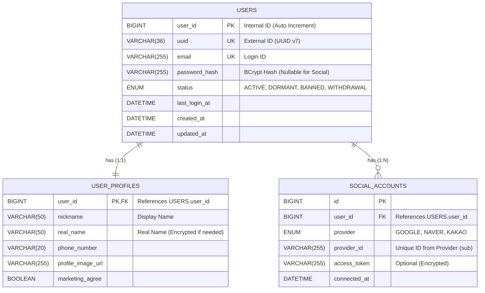

# Portal Universe - Authentication System Architecture

## 1. 개요
본 문서는 Portal Universe의 **회원 시스템(Identity System)** 아키텍처 및 데이터 모델 설계를 다룹니다.
구글, 네이버 등 대규모 포털 사이트의 아키텍처를 벤치마킹하여 **식별(Identity), 속성(Attribute), 자산(Assets)**의 책임을 분리하는 것을 목표로 합니다.

---

## 2. 핵심 설계 원칙

### 2.1 영역의 분리 (Separation of Concerns)
| 영역 | 책임 서비스 | 테이블 | 데이터 성격 |
|:---:|:---:|:---:|:---|
| **Core Identity** | `auth-service` | `users` | 인증, 보안, 계정 상태 (변경 빈도 낮음) |
| **User Profile** | `auth-service` | `user_profiles` | 닉네임, 프로필 사진 등 노출 정보 (변경 빈도 중간) |
| **Social Linkage** | `auth-service` | `social_accounts` | 소셜 로그인 연동 정보 (N:1 확장) |
| **Points/Assets** | `point-service` | 별도 DB | 자산 가치, 트랜잭션 무결성 (변경 빈도 높음) |

### 2.2 식별자 전략
- **Internal ID (`BIGINT`)**: DB 내부 조인 및 인덱싱 성능 최적화를 위해 사용. 외부 노출 금지.
- **External ID (`UUID`)**: API 응답 및 URL 파라미터로 사용. 사용자 수 추정 방지 및 보안 강화.

---

## 3. Entity Relationship Diagram (ERD)

---

## 4. 테이블 상세 명세

### 4.1 Users (Core Identity)
시스템 내부 식별과 인증만을 담당하는 가장 중요하고 무거운 테이블입니다.

| Column Name | Type | Key | Nullable | Description |
| :--- | :--- | :--- | :--- | :--- |
| `user_id` | `BIGINT` | PK | N | 내부 식별자 (Auto Increment) |
| `uuid` | `VARCHAR(36)` | UK | N | 외부 노출용 식별자 (UUID v7 권장) |
| `email` | `VARCHAR(255)` | UK | N | 로그인 이메일 |
| `password_hash` | `VARCHAR(255)` | | Y | 비밀번호 해시 (소셜 회원은 NULL 가능) |
| `status` | `ENUM` | | N | 계정 상태 (`ACTIVE`, `DORMANT` 등) |
| `last_login_at` | `DATETIME` | | Y | 마지막 로그인 일시 |
| `created_at` | `DATETIME` | | N | 계정 생성 일시 |
| `updated_at` | `DATETIME` | | N | 정보 수정 일시 |

### 4.2 User Profiles (Attribute)
사용자의 개인정보 및 부가 정보입니다. `users` 테이블의 경량화를 위해 1:1로 분리합니다.

| Column Name | Type | Key | Nullable | Description |
| :--- | :--- | :--- | :--- | :--- |
| `user_id` | `BIGINT` | PK, FK | N | `users.user_id` 참조 |
| `nickname` | `VARCHAR(50)` | | N | 표시용 닉네임 |
| `real_name` | `VARCHAR(50)` | | Y | 실명 (필요 시 암호화) |
| `phone_number` | `VARCHAR(20)` | | Y | 전화번호 |
| `profile_image_url` | `VARCHAR(255)` | | Y | 프로필 이미지 URL |
| `marketing_agree` | `BOOLEAN` | | N | 마케팅 수신 동의 여부 |

### 4.3 Social Accounts (Linkage)
한 명의 사용자가 구글, 네이버, 카카오 등 여러 계정을 연동할 수 있는 N:1 구조입니다.

| Column Name | Type | Key | Nullable | Description |
| :--- | :--- | :--- | :--- | :--- |
| `id` | `BIGINT` | PK | N | PK |
| `user_id` | `BIGINT` | FK | N | `users.user_id` 참조 |
| `provider` | `ENUM` | | N | 공급자 (`GOOGLE`, `NAVER`, `KAKAO`) |
| `provider_id` | `VARCHAR(255)` | | N | 공급자 측 식별자 (OpenID sub) |
| `access_token` | `VARCHAR(255)` | | Y | (Optional) 오프라인 액세스용 |
| `connected_at` | `DATETIME` | | N | 연동 일시 |
| **Index** | | UK | | `(provider, provider_id)` |

---

## 5. 포인트 및 자산 관리 (Reference)

**Rule:** 포인트는 절대 `users` 테이블의 컬럼으로 관리하지 않습니다.
`point-service`라는 별도 마이크로서비스에서 **Double Entry(복식 부기)** 방식으로 관리해야 합니다.

*   `point_wallets`: 현재 잔액 (조회 성능용)
*   `point_ledger`: 모든 입/출금 내역 (Log, 절대 삭제 불가, 데이터 무결성 검증용)