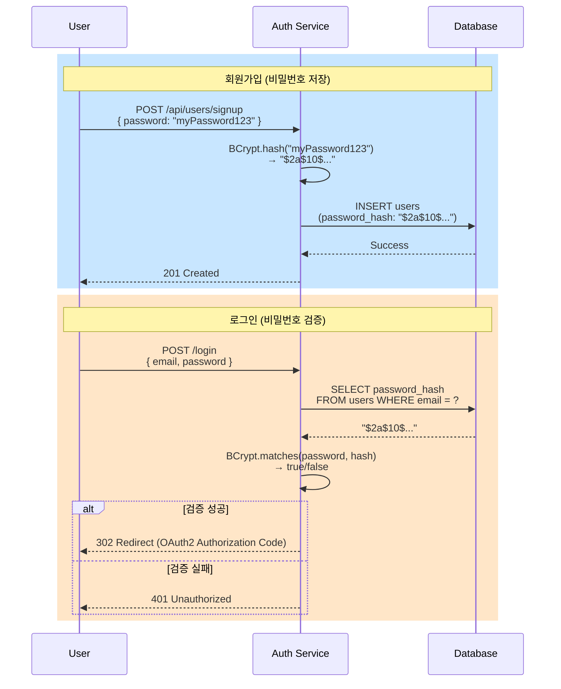
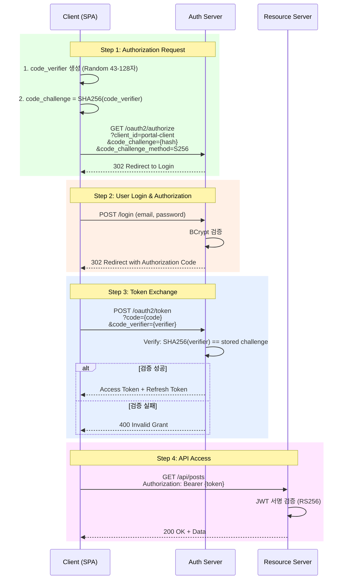
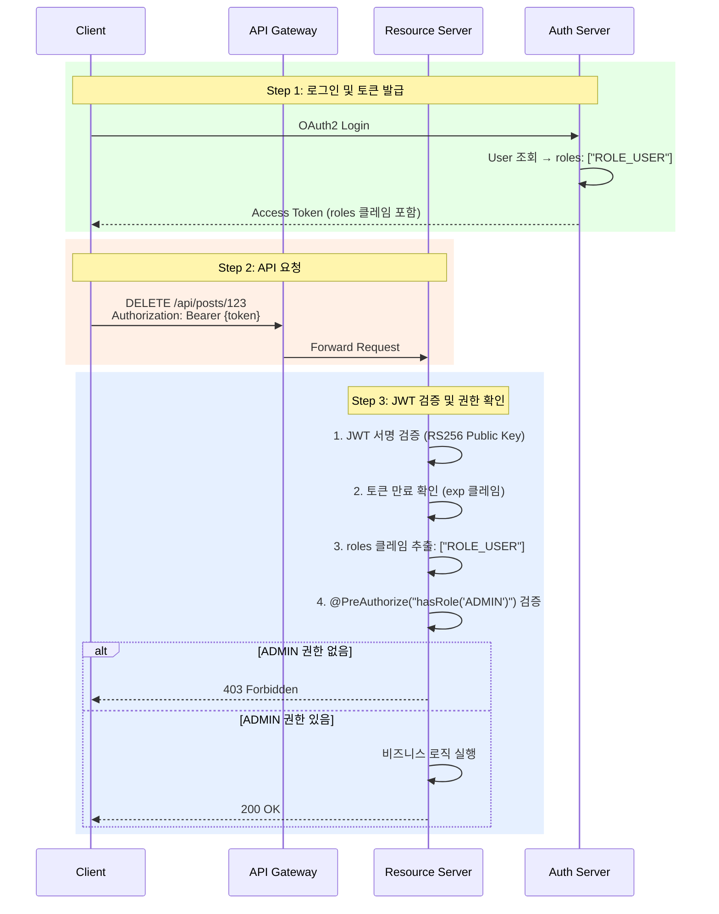
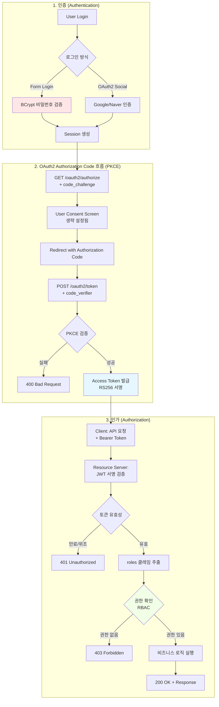
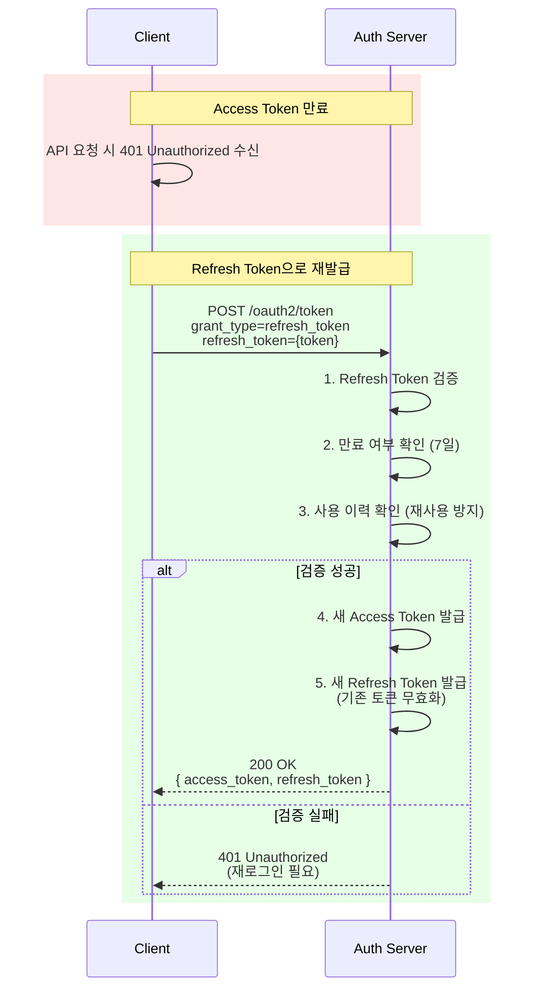

# Portal Universe - 암호화 및 보안 전략 아키텍처

## 1. 개요

본 문서는 Portal Universe의 **보안 및 암호화 전략**을 다룹니다.
OAuth2 인증 서버를 기반으로 JWT 토큰 보안(RS256), 비밀번호 보안(BCrypt), PKCE를 통한 Public Client 보호, RBAC 기반 권한 제어를 구현합니다.

---

## 2. 암호화 전략 개요

Portal Universe는 다층 보안 전략을 채택하여 인증(Authentication)과 인가(Authorization)를 안전하게 처리합니다.

| 보안 영역 | 기술 스택 | 적용 범위 |
|:---:|:---:|:---|
| **JWT 토큰 보안** | RS256 (비대칭 암호화) | Access Token, ID Token 서명 |
| **비밀번호 보안** | BCrypt (해싱 알고리즘) | 사용자 비밀번호 저장 |
| **Public Client 보호** | PKCE (RFC 7636) | SPA, 모바일 앱 인증 흐름 |
| **권한 제어** | RBAC (Role-Based Access Control) | API 엔드포인트 접근 제어 |

---

## 3. JWT 토큰 보안 (RS256)

### 3.1 RS256 비대칭 암호화

Portal Universe는 **RS256 (RSA Signature with SHA-256)** 알고리즘을 사용하여 JWT 토큰을 서명합니다.

#### 특징
- **비대칭 키 쌍**: Private Key로 서명, Public Key로 검증
- **토큰 위변조 방지**: Private Key 없이는 유효한 토큰 생성 불가
- **분산 검증**: Resource Server들이 Public Key만으로 독립적으로 토큰 검증 가능

#### 설정 위치
```java
// AuthorizationServerConfig.java
.tokenSettings(TokenSettings.builder()
    .idTokenSignatureAlgorithm(SignatureAlgorithm.RS256)
    .accessTokenTimeToLive(Duration.ofMinutes(2))
    .refreshTokenTimeToLive(Duration.ofDays(7))
    .reuseRefreshTokens(false)
    .build()
)
```

### 3.2 토큰 구조

#### JWT 구성 요소
```
[Header].[Payload].[Signature]
```

| 구성 요소 | 설명 | 예시 |
|:---:|:---|:---|
| **Header** | 알고리즘 및 토큰 타입 | `{"alg":"RS256","typ":"JWT"}` |
| **Payload** | 클레임(사용자 정보, 권한 등) | `{"sub":"user-uuid","roles":["ROLE_USER"],"exp":1234567890}` |
| **Signature** | Private Key로 서명된 값 | `RSA_SHA256(base64(header).base64(payload), privateKey)` |

#### 토큰 종류 및 수명

| 토큰 종류 | 용도 | 유효 기간 | 재사용 여부 |
|:---:|:---|:---:|:---:|
| **Access Token** | API 요청 인증 | 2분 | - |
| **Refresh Token** | Access Token 갱신 | 7일 | ❌ (Rotation) |
| **ID Token** | 사용자 식별 정보 | Access Token과 동일 | - |

### 3.3 JWT 클레임 커스터마이징

Access Token에 사용자 권한(roles)을 포함시켜 Resource Server에서 즉시 권한 검증이 가능합니다.

```java
// AuthorizationServerConfig.java
@Bean
public OAuth2TokenCustomizer<JwtEncodingContext> jwtCustomizer() {
    return context -> {
        if (context.getTokenType().equals(OAuth2TokenType.ACCESS_TOKEN)) {
            Authentication principal = context.getPrincipal();
            Set<String> authorities = principal.getAuthorities().stream()
                    .map(GrantedAuthority::getAuthority)
                    .collect(Collectors.toSet());

            // 토큰에 'roles' 클레임 추가
            context.getClaims().claim("roles", authorities);
        }
    };
}
```

#### Access Token Payload 예시
```json
{
  "sub": "550e8400-e29b-41d4-a716-446655440000",
  "iss": "http://localhost:8081",
  "roles": ["ROLE_USER"],
  "exp": 1705738800,
  "iat": 1705738680
}
```

---

## 4. 비밀번호 보안 (BCrypt)

### 4.1 BCrypt 해싱 알고리즘

사용자 비밀번호는 **BCrypt** 해싱 알고리즘을 통해 암호화되어 저장됩니다.

#### BCrypt 특징
- **단방향 해시**: 복호화 불가능, 오직 비교만 가능
- **Salt 자동 생성**: Rainbow Table 공격 방어
- **Adaptive Cost Factor**: 연산 비용 조절 가능 (기본값: 10)
- **느린 해싱**: Brute Force 공격 방어

#### 설정 위치
```java
// SecurityConfig.java
@Bean
public PasswordEncoder passwordEncoder() {
    return new BCryptPasswordEncoder();
}
```

### 4.2 비밀번호 처리 흐름



### 4.3 BCrypt 해시 포맷

```
$2a$10$N9qo8uLOickgx2ZMRZoMyeIjZAgcfl7p92ldGxad68LJZdL17lhWy
│  │  │                                                  │
│  │  └─ Salt (22자)                          └─ Hash (31자)
│  └─ Cost Factor (10 = 2^10 rounds)
└─ Algorithm Version (2a = BCrypt)
```

---

## 5. PKCE (Public Client 보호)

### 5.1 PKCE 개요

**PKCE (Proof Key for Code Exchange, RFC 7636)**는 Authorization Code 탈취 공격을 방지하기 위한 보안 확장입니다.

#### 적용 대상
- SPA (Single Page Application)
- 모바일 앱
- Client Secret을 안전하게 저장할 수 없는 Public Client

#### 설정 위치
```java
// AuthorizationServerConfig.java
.clientSettings(ClientSettings.builder()
    .requireProofKey(true)  // PKCE 강제
    .requireAuthorizationConsent(false)
    .build()
)
```

### 5.2 PKCE 인증 흐름



### 5.3 PKCE vs Client Secret

| 항목 | Client Secret | PKCE |
|:---:|:---|:---|
| **저장 위치** | 서버 사이드 (안전) | 클라이언트 사이드 (노출 가능) |
| **보안 방식** | 고정된 Secret | 요청마다 다른 Code Verifier |
| **적용 대상** | Confidential Client | Public Client (SPA, Mobile) |
| **탈취 시 위험** | 모든 클라이언트 위험 | 해당 요청만 위험 |

---

## 6. RBAC (역할 기반 접근 제어)

### 6.1 역할 정의

Portal Universe는 **RBAC (Role-Based Access Control)** 모델을 사용하여 사용자 권한을 관리합니다.

```java
// Role.java
public enum Role {
    USER("ROLE_USER"),    // 일반 사용자
    ADMIN("ROLE_ADMIN");  // 관리자

    private final String key;
}
```

### 6.2 권한 검증 방법

#### 방법 1: SecurityFilterChain에서 URL 패턴 기반 검증
```java
// SecurityConfig.java
.authorizeHttpRequests(authorize -> authorize
    .requestMatchers("/api/admin/**").hasRole("ADMIN")
    .requestMatchers("/api/users/**").hasAnyRole("USER", "ADMIN")
    .anyRequest().authenticated()
)
```

#### 방법 2: @PreAuthorize 어노테이션 사용 (메서드 레벨)
```java
@PreAuthorize("hasRole('ADMIN')")
@DeleteMapping("/{id}")
public ResponseEntity<ApiResponse<Void>> deletePost(@PathVariable String id) {
    postService.deletePost(id);
    return ResponseEntity.ok(ApiResponse.success());
}
```

### 6.3 JWT 기반 권한 검증 흐름



### 6.4 역할별 접근 권한 예시

| 엔드포인트 | USER | ADMIN | 비고 |
|:---|:---:|:---:|:---|
| `GET /api/posts` | ✅ | ✅ | 게시글 목록 조회 |
| `POST /api/posts` | ✅ | ✅ | 게시글 작성 |
| `PUT /api/posts/{id}` | ✅ (본인만) | ✅ | 게시글 수정 |
| `DELETE /api/posts/{id}` | ❌ | ✅ | 게시글 삭제 (관리자만) |
| `GET /api/admin/users` | ❌ | ✅ | 사용자 관리 |

---

## 7. 보안 흐름 종합 다이어그램

### 7.1 전체 인증/인가 흐름



### 7.2 토큰 갱신 흐름 (Refresh Token Rotation)



---

## 8. 보안 설정 위치 요약

| 보안 요소 | 설정 파일 | 핵심 설정 |
|:---:|:---|:---|
| **RS256 서명** | `AuthorizationServerConfig.java` | `.idTokenSignatureAlgorithm(SignatureAlgorithm.RS256)` |
| **PKCE 강제** | `AuthorizationServerConfig.java` | `.requireProofKey(true)` |
| **BCrypt** | `SecurityConfig.java` | `new BCryptPasswordEncoder()` |
| **RBAC** | `SecurityConfig.java`, Controller | `.hasRole("ADMIN")`, `@PreAuthorize` |
| **토큰 수명** | `AuthorizationServerConfig.java` | `accessTokenTimeToLive(Duration.ofMinutes(2))` |

---

## 9. 보안 권장 사항

### 9.1 운영 환경 체크리스트

- [ ] HTTPS 강제 적용 (HTTP → HTTPS 자동 리다이렉트)
- [ ] JWT Private Key 안전한 저장 (Vault, KMS 사용)
- [ ] CORS 정책 최소 권한 원칙 적용
- [ ] Rate Limiting 적용 (로그인 시도, API 요청)
- [ ] Access Token 수명 최소화 (현재: 2분)
- [ ] Refresh Token Rotation 활성화 (현재: ✅)

### 9.2 모니터링 항목

- 실패한 로그인 시도 횟수 추적
- 비정상적인 토큰 갱신 패턴 감지
- JWT 검증 실패 로그 수집
- 권한 없는 API 접근 시도 기록

---

## 10. 참고 문서

- [OAuth2 인증 시스템 설계](./auth-system-design.md)
- [RFC 7636 - PKCE](https://datatracker.ietf.org/doc/html/rfc7636)
- [RFC 7519 - JWT](https://datatracker.ietf.org/doc/html/rfc7519)
- [Spring Authorization Server 공식 문서](https://docs.spring.io/spring-authorization-server/reference/index.html)
