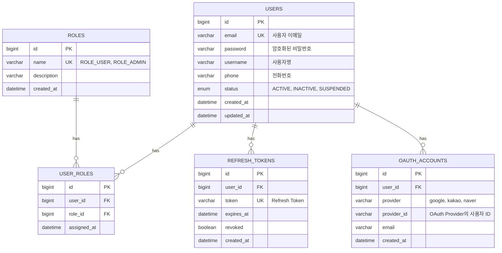

# Auth 시스템 ERD

## 개요

auth-service의 데이터베이스 Entity Relationship Diagram입니다.

## ERD



## 테이블 설명

### USERS

사용자 기본 정보를 저장합니다.

| 컬럼 | 타입 | 설명 |
|------|------|------|
| id | BIGINT | Primary Key |
| email | VARCHAR(255) | 로그인 이메일 (Unique) |
| password | VARCHAR(255) | BCrypt 암호화된 비밀번호 |
| username | VARCHAR(50) | 사용자 표시명 |
| phone | VARCHAR(20) | 전화번호 |
| status | ENUM | ACTIVE, INACTIVE, SUSPENDED |

### ROLES

권한 역할을 정의합니다.

| 역할 | 설명 |
|------|------|
| ROLE_USER | 일반 사용자 |
| ROLE_ADMIN | 관리자 |

### USER_ROLES

사용자-역할 다대다 관계 테이블입니다.

### REFRESH_TOKENS

JWT Refresh Token을 관리합니다.

- Access Token 갱신에 사용
- `revoked` 플래그로 토큰 무효화 가능
- 만료 시간 관리

### OAUTH_ACCOUNTS

소셜 로그인 계정을 연결합니다.

- 지원 Provider: Google, Kakao, Naver
- 하나의 User에 여러 OAuth 계정 연결 가능

## 인덱스

```sql
-- Users
CREATE INDEX idx_users_email ON users(email);
CREATE INDEX idx_users_status ON users(status);

-- Refresh Tokens
CREATE INDEX idx_refresh_tokens_user_id ON refresh_tokens(user_id);
CREATE INDEX idx_refresh_tokens_token ON refresh_tokens(token);
CREATE INDEX idx_refresh_tokens_expires_at ON refresh_tokens(expires_at);

-- OAuth Accounts
CREATE INDEX idx_oauth_accounts_provider ON oauth_accounts(provider, provider_id);
```

## 관련 문서

- [Architecture - Auth System Design](../../architecture/auth-system-design.md)
- [Architecture - Signup Flow](../../architecture/signup-flow.md)
- [ADR-003 Authorization Strategy](../../adr/ADR-003-authorization-strategy.md)
