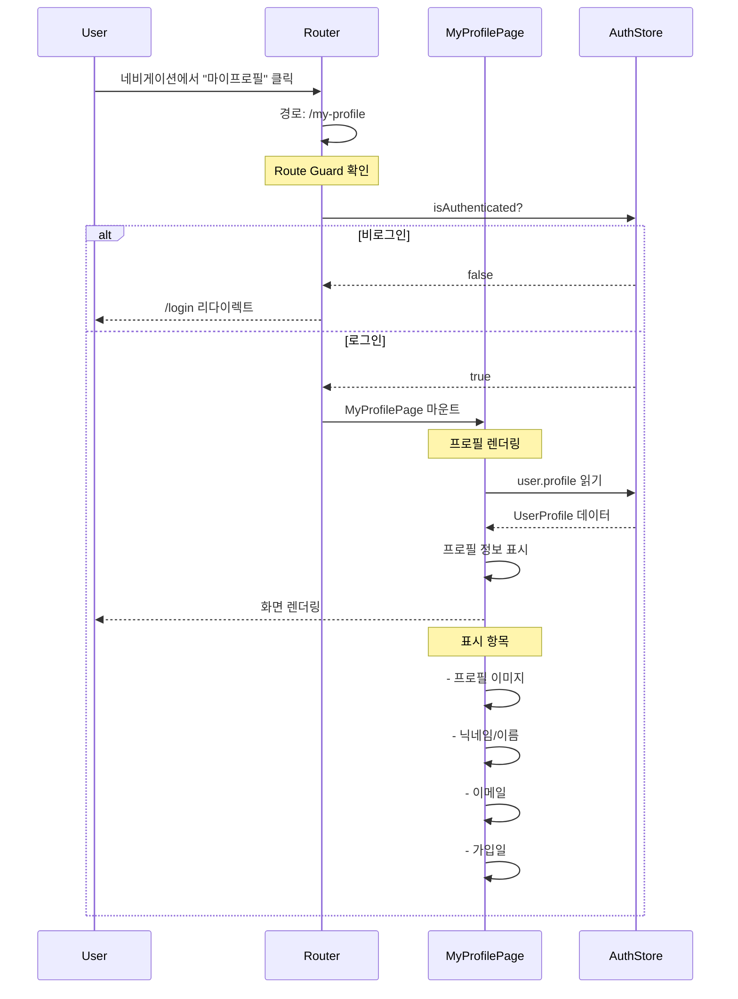
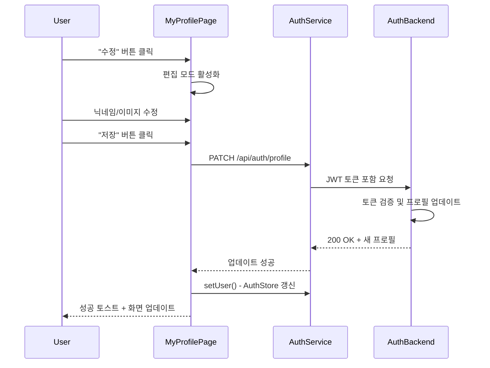

# SCENARIO-003: 마이프로필 조회 및 관리

## Overview

Portal Shell의 마이프로필 페이지에서 **로그인한 사용자의 정보를 조회하고 관리**하는 시나리오입니다. Phase 1에서는 읽기 전용으로 구현하고, Phase 2(JWT 작업 완료 후)에서 수정/삭제 기능을 추가합니다.

---

## Actors

| Actor | 역할 | 책임 |
|-------|------|------|
| **로그인 사용자** | 프로필 조회자 | 자신의 프로필 정보 조회 |
| **Portal Shell** | UI 제공 | 프로필 페이지 렌더링 |
| **Auth Store** | 데이터 소스 | 로그인 시 저장된 사용자 정보 제공 |
| **Auth Service** | 인증 제공자 | (Phase 2) JWT 토큰 기반 API 호출 |

---

## Triggers

| 트리거 | 조건 | 결과 |
|--------|------|------|
| 페이지 접근 | 사용자가 `/my-profile` 경로 방문 | 프로필 페이지 렌더링 |
| 로그인 상태 | 인증된 사용자만 접근 | Auth Store의 user 데이터 표시 |
| 비로그인 상태 | 인증되지 않은 사용자 접근 | `/login`으로 리다이렉트 |
| 프로필 수정 클릭 | (Phase 2) 수정 버튼 클릭 | 편집 모드 진입 |

---

## Flow

### Phase 1: 읽기 전용 프로필 (현재)



### Phase 2: 프로필 수정 (향후)



---

## Business Rules

| ID | 규칙 | 설명 | Phase |
|----|------|------|-------|
| **BR-001** | 로그인 필수 | 비로그인 사용자는 접근 불가 | Phase 1 |
| **BR-002** | 본인 정보만 | 자신의 프로필만 조회 가능 | Phase 1 |
| **BR-003** | Auth Store 우선 | Phase 1에서는 API 호출 없이 Store 데이터 사용 | Phase 1 |
| **BR-004** | 수정 권한 | 본인만 프로필 수정 가능 | Phase 2 |
| **BR-005** | 이메일 불변 | 이메일은 변경 불가 (OAuth2 Sub) | Phase 2 |
| **BR-006** | 닉네임 검증 | 2-20자, 특수문자 제한 | Phase 2 |

---

## Phase 1: 읽기 전용 구현

### 화면 구성

```
┌─────────────────────────────────────┐
│         마이프로필 페이지            │
├─────────────────────────────────────┤
│                                     │
│    [프로필 이미지]                   │
│                                     │
│    닉네임: 홍길동                    │
│    이메일: hong@example.com         │
│    가입일: 2026-01-15               │
│                                     │
│    연결된 소셜 계정:                 │
│    • Google (hong@gmail.com)        │
│    • Naver (홍길동)                 │
│                                     │
│    [돌아가기]                        │
│                                     │
└─────────────────────────────────────┘
```

### 표시 정보

| 필드 | 데이터 소스 | 표시 방식 |
|------|------------|----------|
| 프로필 이미지 | `user.profile.picture` | Avatar 컴포넌트 |
| 닉네임 | `user.profile.nickname \|\| user.profile.name` | Text |
| 이메일 | `user.profile.email` | Text (읽기 전용) |
| 가입일 | `user._issuedAt` | Formatted Date |
| 소셜 연결 | `user.profile` (provider 정보) | 아이콘 + 텍스트 |

### 컴포넌트 구조

```
MyProfilePage.vue
├── ProfileHeader (프로필 이미지 + 닉네임)
├── ProfileInfo (기본 정보 목록)
└── SocialConnections (연결된 소셜 계정)
```

---

## Phase 2: 수정/삭제 기능 (JWT 작업 후)

### 추가 화면 구성

```
┌─────────────────────────────────────┐
│         마이프로필 페이지            │
├─────────────────────────────────────┤
│                                     │
│    [프로필 이미지] [변경]           │
│                                     │
│    닉네임: [홍길동___] [수정]       │
│    이메일: hong@example.com         │
│           (변경 불가)                │
│                                     │
│    [비밀번호 변경]                  │
│    [회원 탈퇴]                      │
│                                     │
└─────────────────────────────────────┘
```

### 추가 기능

| 기능 | API | 설명 |
|------|-----|------|
| 프로필 수정 | `PATCH /api/auth/profile` | 닉네임, 이미지 변경 |
| 비밀번호 변경 | `POST /api/auth/password/change` | 현재/새 비밀번호 |
| 회원 탈퇴 | `DELETE /api/auth/account` | 확인 후 계정 삭제 |
| 소셜 연결 | `POST /api/auth/oauth2/link/{provider}` | 추가 소셜 계정 연결 |
| 소셜 해제 | `DELETE /api/auth/oauth2/unlink/{provider}` | 소셜 계정 연결 해제 |

---

## Error Cases

### Phase 1 에러

| 에러 | 원인 | 처리 |
|------|------|------|
| 비로그인 | Auth Store에 user 없음 | `/login` 리다이렉트 |
| 데이터 없음 | user.profile 손상 | 에러 페이지, 재로그인 안내 |

### Phase 2 에러 (예정)

| 에러 코드 | HTTP | 원인 | 사용자 메시지 |
|----------|------|------|-------------|
| A401 | 401 | JWT 만료 | "로그인이 만료되었습니다. 다시 로그인해주세요" |
| A403 | 403 | 타인 프로필 수정 시도 | "본인의 프로필만 수정할 수 있습니다" |
| A409 | 409 | 닉네임 중복 | "이미 사용 중인 닉네임입니다" |
| A400 | 400 | 유효성 검증 실패 | "닉네임은 2-20자여야 합니다" |

---

## Output

### Phase 1: 읽기 전용

| 컴포넌트 | 상태 변화 |
|----------|----------|
| **MyProfilePage** | 마운트 시 Auth Store에서 데이터 읽기 |
| **Auth Store** | 변화 없음 (읽기만) |
| **UI** | 사용자 정보 표시 |

### Phase 2: 수정 가능

| 컴포넌트 | 상태 변화 |
|----------|----------|
| **Auth Service** | `PATCH /profile` 호출 |
| **Auth Backend** | DB에 프로필 업데이트 |
| **JWT** | 새 토큰 발급 (닉네임 변경 시) |
| **Auth Store** | `setUser()` 호출로 갱신 |
| **UI** | 즉시 반영 |

---

## Technical Implementation

### Phase 1: 파일 구조

```
frontend/portal-shell/src/
├── pages/
│   └── MyProfilePage.vue          # 프로필 페이지
├── components/
│   └── profile/
│       ├── ProfileHeader.vue      # 헤더 (이미지 + 닉네임)
│       ├── ProfileInfo.vue        # 정보 목록
│       └── SocialConnections.vue  # 소셜 계정
├── store/
│   └── auth.ts                    # (기존) 수정 없음
└── router/
    └── index.ts                   # 라우트 추가
```

### 라우트 설정

```typescript
// router/index.ts
{
  path: '/my-profile',
  name: 'MyProfile',
  component: () => import('@/pages/MyProfilePage.vue'),
  meta: {
    requiresAuth: true, // Route Guard
  }
}
```

### MyProfilePage.vue 기본 구조

```vue
<script setup lang="ts">
import { computed } from 'vue'
import { useAuthStore } from '@/store/auth'
import { useRouter } from 'vue-router'

const authStore = useAuthStore()
const router = useRouter()

// ✅ Auth Store에서 직접 읽기 (API 호출 없음)
const user = computed(() => authStore.user)

// 비로그인 처리
if (!authStore.isAuthenticated) {
  router.push('/login')
}

// 가입일 포맷팅
const joinedDate = computed(() => {
  if (!user.value?._issuedAt) return '-'
  return new Date(user.value._issuedAt * 1000).toLocaleDateString('ko-KR')
})
</script>

<template>
  <div class="my-profile-page">
    <h1>마이프로필</h1>

    <!-- 프로필 헤더 -->
    <div class="profile-header">
      
      <h2>{{ user?.profile.nickname || user?.profile.name || '사용자' }}</h2>
    </div>

    <!-- 기본 정보 -->
    <div class="profile-info">
      <div class="info-item">
        <span class="label">이메일</span>
        <span class="value">{{ user?.profile.email }}</span>
      </div>
      <div class="info-item">
        <span class="label">가입일</span>
        <span class="value">{{ joinedDate }}</span>
      </div>
    </div>

    <!-- 소셜 계정 (Phase 2) -->
    <!-- 수정 버튼 (Phase 2) -->
  </div>
</template>
```

---

## Phase 2 구현 계획 (JWT 작업 후)

### 추가 API 구현

```java
// AuthController.java
@RestController
@RequestMapping("/api/auth")
public class AuthController {

    @PatchMapping("/profile")
    @PreAuthorize("isAuthenticated()")
    public ApiResponse<UserProfileResponse> updateProfile(
        @Valid @RequestBody ProfileUpdateRequest request,
        Authentication authentication) {

        String userEmail = authentication.getName();
        return ApiResponse.success(
            authService.updateProfile(userEmail, request)
        );
    }
}
```

### ProfileUpdateRequest DTO

```java
public record ProfileUpdateRequest(
    @Size(min = 2, max = 20, message = "닉네임은 2-20자여야 합니다")
    @Pattern(regexp = "^[a-zA-Z0-9가-힣_]+$", message = "닉네임은 영문/한글/숫자/_만 사용 가능합니다")
    String nickname,

    @URL(message = "올바른 URL 형식이어야 합니다")
    String picture
) {}
```

---

## Learning Points

### 1. Phase 분리 전략

**문제**: JWT 작업이 진행 중이어서 API 호출이 불안정
**해결**: Phase 1에서는 Auth Store만 사용, Phase 2에서 API 추가

| Phase | 데이터 소스 | 장점 | 제약 |
|-------|------------|------|------|
| Phase 1 | Auth Store (메모리) | 빠름, 안정적 | 읽기만 가능 |
| Phase 2 | API + JWT | 수정 가능 | JWT 작업 완료 후 |

### 2. 기존 코드 보호

**제약**: `auth.ts`, `authService.ts` 수정 금지 (JWT 작업과 충돌)
**해결**:
- 새 컴포넌트로 격리 (`MyProfilePage.vue`)
- Auth Store의 공개 API만 사용 (`user`, `isAuthenticated`)
- 내부 구현에 의존하지 않음

### 3. 트레이드오프

| 선택 | 대안 | 선택 이유 |
|------|------|----------|
| Phase 분리 | 한 번에 완성 | JWT 작업 충돌 회피 |
| Store 직접 참조 | API 즉시 구현 | 안정적, 빠른 개발 |
| 읽기 전용 | 기본 CRUD | 핵심 기능 우선 제공 |

### 관련 학습 문서
- [ADR-014 마이프로필 단계별 구현 전략](../adr/ADR-014-my-profile-phased-approach.md)

---

## Testing Checklist

### Phase 1
- [ ] 로그인 상태에서 프로필 페이지 접근
- [ ] 비로그인 시 `/login` 리다이렉트
- [ ] 프로필 정보 정확히 표시
- [ ] 프로필 이미지 기본값 처리
- [ ] 가입일 포맷팅

### Phase 2 (예정)
- [ ] 닉네임 수정 성공
- [ ] 닉네임 중복 에러 처리
- [ ] 프로필 이미지 업로드
- [ ] 비밀번호 변경
- [ ] 회원 탈퇴 (확인 다이얼로그)

---

## Related

- **ADR**: [ADR-014 마이프로필 단계별 구현 전략](../adr/ADR-014-my-profile-phased-approach.md)
- **Architecture**: [Portal Shell 구조](../architecture/portal-shell-architecture.md)
- **Types**: `frontend/portal-shell/src/types/user.ts`
- **Store**: `frontend/portal-shell/src/store/auth.ts`

---

## Revision History

| 날짜 | 변경 내용 | 작성자 |
|------|----------|--------|
| 2026-01-21 | 초안 작성 (Phase 1 중심) | Laze |
