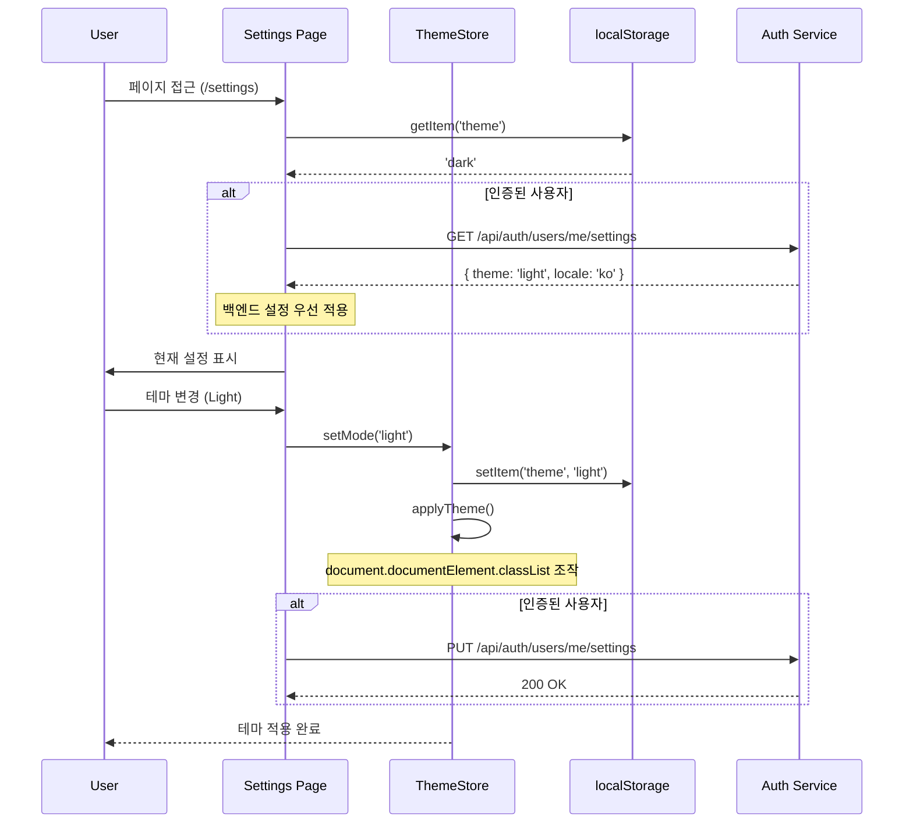

# SCENARIO-007: Settings Page 사용자 설정 관리

## Overview

Portal Shell 사용자가 테마, 언어, 알림 수신 설정을 관리하는 시나리오입니다. 설정은 localStorage에 우선 저장되며, 인증된 사용자의 경우 백엔드 동기화를 지원합니다.

---

## Actors

| Actor | 역할 | 설명 |
|-------|------|------|
| 비회원 사용자 | 익명 사용자 | localStorage만 사용 |
| 회원 사용자 | 인증된 사용자 | localStorage + 백엔드 동기화 |
| Portal Shell | Host Application | 설정 상태 관리 및 적용 |
| Auth Service | 백엔드 서비스 | 사용자 설정 저장/조회 (선택적) |

---

## Triggers

| 트리거 | 조건 | 결과 |
|--------|------|------|
| 페이지 접근 | `/settings` 경로 이동 | Settings 페이지 렌더링 |
| 테마 변경 | Dark/Light/System 선택 | 전역 테마 적용 |
| 언어 변경 | 한국어/영어 선택 | i18n locale 변경 |
| 알림 설정 | Email/Push 토글 | 알림 수신 설정 변경 |
| 페이지 로드 | Portal Shell 초기화 | localStorage 설정 복원 |

---

## Flow

### 정상 흐름 (비회원 사용자)

1. 사용자가 `/settings` 페이지 접근
2. 현재 설정값을 localStorage에서 읽어 UI에 표시
3. 사용자가 테마를 "Dark"에서 "Light"로 변경
4. `themeStore.setMode('light')` 호출
5. localStorage에 `theme: 'light'` 저장
6. 전역 테마 클래스 적용 (`document.documentElement.classList`)
7. 페이지 새로고침 시 설정 유지

### 정상 흐름 (회원 사용자)

1. 사용자가 로그인 상태로 `/settings` 페이지 접근
2. localStorage 설정 + 백엔드 설정 병합 (백엔드 우선)
3. 사용자가 언어를 "한국어"에서 "영어"로 변경
4. `settingsStore.setLocale('en')` 호출
5. localStorage에 저장
6. **선택적**: 백엔드 API 호출 (`PUT /api/auth/users/me/settings`)
7. i18n locale 변경
8. 다른 디바이스에서 로그인 시 동기화된 설정 적용

### 시퀀스 다이어그램



---

## Business Rules

| 규칙 | 설명 | 위반 시 |
|------|------|---------|
| BR-001 | 테마는 dark/light/system 중 하나 | Validation 에러 |
| BR-002 | System 모드는 OS 설정 따름 | - |
| BR-003 | 비회원은 localStorage만 사용 | - |
| BR-004 | 회원은 백엔드 동기화 선택 가능 | - |
| BR-005 | 언어는 지원 목록(ko, en)만 가능 | 기본값(ko) 사용 |

---

## Error Cases

| 에러 | 원인 | 처리 |
|------|------|------|
| localStorage 없음 | 브라우저 지원 없음 | 기본값 사용, 세션 내 메모리 저장 |
| API 호출 실패 | 네트워크/서버 에러 | localStorage 설정만 적용, 재시도 안함 |
| 유효하지 않은 값 | 수동 조작 | 기본값으로 리셋 |
| JWT 만료 | 토큰 만료 | localStorage만 사용, 에러 미표시 |

---

## Output

### 성공 시

**로컬 상태**:
- localStorage에 설정 저장:
  - `theme`: 'dark' | 'light' | 'system'
  - `locale`: 'ko' | 'en'
  - `notifications`: '{ email: true, push: false }'

**백엔드 상태** (회원 전용):
- `user_settings` 테이블 업데이트
- 다른 디바이스에서 로그인 시 동기화

**UI 반영**:
- 테마: 전역 CSS 클래스 변경
- 언어: i18n locale 변경, 모든 텍스트 번역
- 알림: 설정에 따라 알림 수신

### 실패 시

- localStorage 읽기/쓰기 실패: 기본값 사용
- API 호출 실패: localStorage 설정만 적용 (사용자에게 에러 미표시)

---

## Learning Points

### 상태 관리 패턴

**Local-First Architecture**:
- localStorage를 primary storage로 사용
- 백엔드는 선택적 동기화 레이어
- 네트워크 실패에도 기능 동작

**관련 문서**: [ADR-009 Settings Page 아키텍처](../adr/ADR-009-settings-page-architecture.md)

### 트레이드오프

| 선택 | 대안 | 선택 이유 |
|------|------|----------|
| localStorage First | Backend First | 빠른 응답, 네트워크 무관 |
| 선택적 동기화 | 강제 동기화 | 비회원 지원, 실패 허용 |
| Pinia Store 확장 | 새 Store 생성 | 기존 theme.ts 재사용 |
| 즉시 저장 | Debounce + 저장 | UX 반응성 우선 |

### 다크모드 구현 (Linear Style)

- **Default**: Dark mode (Linear 스타일)
- **System 모드**: `prefers-color-scheme` 미디어 쿼리 사용
- **클래스 기반**: Tailwind CSS `dark:` prefix

```typescript
// theme.ts
if (mode === 'system') {
  isDark = window.matchMedia('(prefers-color-scheme: dark)').matches;
}
document.documentElement.classList.toggle('dark', isDark);
```

---

## Related

- [ADR-009 Settings Page 아키텍처](../adr/ADR-009-settings-page-architecture.md)
- [theme.ts 소스 코드](../../frontend/portal-shell/src/store/theme.ts)

---

## User Journey Map

```
[비회원 사용자]
1. Portal 방문
2. 기본 Dark 테마로 표시
3. Settings 페이지 이동
4. Light 테마 선택
5. 즉시 적용, localStorage 저장
6. 다음 방문 시 Light 테마 유지

[회원 사용자]
1. Portal 로그인
2. 백엔드에서 저장된 설정 로드
3. 데스크탑에서 언어를 영어로 변경
4. 모바일에서 로그인
5. 영어 설정 자동 동기화
```

---

**최종 업데이트**: 2026-01-21
