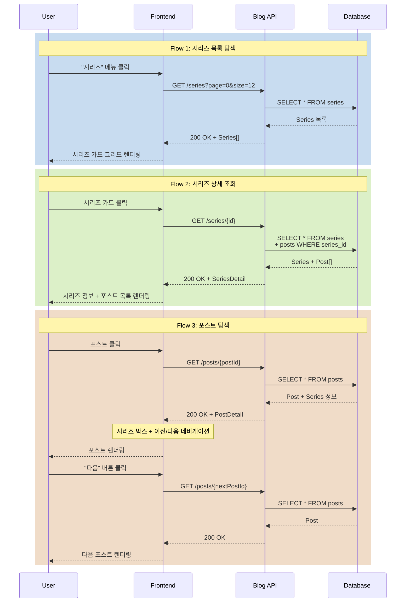

# 시리즈 탐색 시나리오

## Overview

사용자가 시리즈 목록을 탐색하고, 특정 시리즈의 게시글들을 순서대로 읽는 시나리오입니다. 시리즈 내 포스트 간 이동을 쉽게 하여 연속된 콘텐츠 소비 경험을 제공합니다.

## Actors

| Actor | 역할 | 설명 |
|-------|------|------|
| 독자 | 콘텐츠 소비자 | 시리즈 탐색 및 포스트 읽기 |
| 작성자 | 콘텐츠 제공자 | 시리즈 생성 및 포스트 연결 |
| 시스템 | 제공자 | 시리즈 목록 및 순서 관리 |

## User Stories

### Story 1: 시리즈 목록 탐색
```
As a 독자
I want 시리즈 목록을 확인
So that 흥미로운 시리즈를 찾을 수 있음
```

### Story 2: 시리즈 내 포스트 읽기
```
As a 독자
I want 시리즈의 첫 번째 포스트부터 순서대로 읽기
So that 체계적인 학습이 가능함
```

### Story 3: 시리즈 내 탐색
```
As a 독자
I want 현재 포스트에서 이전/다음 포스트로 쉽게 이동
So that 연속된 콘텐츠를 끊김 없이 소비할 수 있음
```

## Triggers

| 트리거 | 조건 | 결과 |
|--------|------|------|
| 시리즈 메뉴 클릭 | 헤더 네비게이션 | 시리즈 목록 페이지로 이동 |
| 시리즈 카드 클릭 | 시리즈 목록 페이지 | 해당 시리즈 상세 페이지로 이동 |
| 포스트 제목 클릭 | 시리즈 상세 페이지 | 해당 포스트 상세 페이지로 이동 |
| 이전/다음 버튼 클릭 | 포스트 상세 페이지 (시리즈 포함) | 시리즈 내 이전/다음 포스트로 이동 |
| 시리즈 박스 클릭 | 포스트 상세 페이지 | 시리즈 상세 페이지로 이동 |

## Flow

### 정상 흐름 1: 시리즈 목록 탐색

1. 사용자가 헤더의 "시리즈" 메뉴 클릭
2. 시리즈 목록 페이지 로드 (`/series`)
3. API 요청: `GET /api/v1/series?page=0&size=12&sort=createdDate,desc`
4. 시리즈 카드 그리드 렌더링
   - 시리즈 썸네일
   - 제목
   - 설명
   - 포스트 수
   - 생성일/수정일
5. 무한 스크롤 또는 페이지네이션으로 추가 로드

### 정상 흐름 2: 시리즈 상세 조회

1. 사용자가 시리즈 카드 클릭
2. 시리즈 상세 페이지 로드 (`/series/{seriesId}`)
3. API 요청: `GET /api/v1/series/{seriesId}`
4. 시리즈 정보 렌더링
   - 제목, 설명
   - 총 포스트 수
   - 전체 읽기 예상 시간
5. 시리즈 내 포스트 목록 렌더링 (순서대로)
   - 순번 (1, 2, 3, ...)
   - 제목
   - 요약
   - 읽기 시간
   - 발행일
6. 사용자가 포스트 클릭 → 해당 포스트 상세로 이동

### 정상 흐름 3: 시리즈 포스트 읽기 및 탐색

1. 사용자가 시리즈 내 포스트 상세 페이지 진입
2. API 요청: `GET /api/v1/posts/{postId}`
3. 포스트 상단에 시리즈 정보 박스 렌더링
   - 시리즈 제목
   - 현재 포스트 위치 (3/10)
   - 진행률 바
4. 포스트 하단에 이전/다음 네비게이션 렌더링
   - "← 이전: [포스트 제목]"
   - "다음: [포스트 제목] →"
5. 사용자가 "다음" 클릭
6. 다음 포스트로 이동 (페이지 전환)
7. 반복 (시리즈 끝까지)

### 시퀀스 다이어그램



## Business Rules

| 규칙 | 설명 | 위반 시 |
|------|------|---------|
| BR-001 | 시리즈는 최소 1개 이상의 포스트 포함 | 포스트 없는 시리즈는 목록에 노출 안 됨 |
| BR-002 | 시리즈 내 포스트는 order 순으로 정렬 | 순서 보장 |
| BR-003 | 비공개 포스트는 작성자만 시리즈에서 확인 가능 | 일반 사용자에게 숨김 |
| BR-004 | 시리즈 삭제 시 포스트는 유지 (series_id만 NULL) | Soft delete |

## API Endpoints

### 1. 시리즈 목록 조회

**Request**
```http
GET /api/v1/series?page=0&size=12&sort=createdDate,desc
```

**Response**
```json
{
  "success": true,
  "data": {
    "content": [
      {
        "id": 1,
        "title": "Spring Boot 완벽 가이드",
        "description": "Spring Boot를 처음부터 끝까지",
        "thumbnail": "https://cdn.example.com/thumbnail.jpg",
        "postCount": 10,
        "totalReadingTime": 120,
        "createdDate": "2026-01-01T00:00:00",
        "updatedDate": "2026-01-15T12:00:00"
      }
    ],
    "pageable": {
      "pageNumber": 0,
      "pageSize": 12,
      "totalElements": 25,
      "totalPages": 3
    }
  }
}
```

### 2. 시리즈 상세 조회

**Request**
```http
GET /api/v1/series/{seriesId}
```

**Response**
```json
{
  "success": true,
  "data": {
    "id": 1,
    "title": "Spring Boot 완벽 가이드",
    "description": "Spring Boot를 처음부터 끝까지 배우는 시리즈입니다.",
    "thumbnail": "https://cdn.example.com/thumbnail.jpg",
    "postCount": 10,
    "totalReadingTime": 120,
    "posts": [
      {
        "id": 101,
        "title": "1. Spring Boot 소개",
        "summary": "Spring Boot란 무엇인가",
        "order": 1,
        "readingTime": 10,
        "publishedDate": "2026-01-01T00:00:00"
      },
      {
        "id": 102,
        "title": "2. 프로젝트 설정",
        "summary": "Spring Initializr로 프로젝트 생성",
        "order": 2,
        "readingTime": 15,
        "publishedDate": "2026-01-02T00:00:00"
      }
    ]
  }
}
```

### 3. 포스트 상세 (시리즈 정보 포함)

**Request**
```http
GET /api/v1/posts/{postId}
```

**Response**
```json
{
  "success": true,
  "data": {
    "id": 102,
    "title": "2. 프로젝트 설정",
    "content": "...",
    "series": {
      "id": 1,
      "title": "Spring Boot 완벽 가이드",
      "currentOrder": 2,
      "totalPosts": 10,
      "previousPost": {
        "id": 101,
        "title": "1. Spring Boot 소개"
      },
      "nextPost": {
        "id": 103,
        "title": "3. 첫 번째 REST API"
      }
    }
  }
}
```

## Error Cases

| 에러 코드 | HTTP Status | 원인 | Frontend 처리 |
|-----------|-------------|------|--------------|
| B003 | 404 | 시리즈 없음 | "시리즈를 찾을 수 없습니다" 페이지 |
| B004 | 404 | 시리즈 내 포스트 없음 | "포스트를 찾을 수 없습니다" 메시지 |
| B005 | 403 | 비공개 시리즈 접근 | "권한이 없습니다" 메시지 |
| C001 | 500 | 서버 오류 | 재시도 버튼 제공 |

## UI Components

### Vue 컴포넌트 구조

```
SeriesListPage.vue                # 시리즈 목록 페이지
├── SeriesCard.vue                # 시리즈 카드 컴포넌트
└── InfiniteScroll.vue            # 무한 스크롤 (선택)

SeriesDetailPage.vue              # 시리즈 상세 페이지
├── SeriesHeader.vue              # 시리즈 정보
└── SeriesPostList.vue            # 포스트 목록
    └── SeriesPostItem.vue        # 포스트 아이템

PostDetailPage.vue                # 포스트 상세 페이지
├── SeriesNavigationBox.vue       # 시리즈 정보 박스
│   ├── 시리즈 제목
│   ├── 진행률 (3/10)
│   └── 진행률 바
└── SeriesPrevNextNav.vue         # 이전/다음 네비게이션
    ├── 이전 포스트 버튼
    └── 다음 포스트 버튼
```

### 컴포넌트 위치

- **SeriesListPage.vue**: `frontend/blog-frontend/src/views/SeriesListPage.vue`
- **SeriesDetailPage.vue**: `frontend/blog-frontend/src/views/SeriesDetailPage.vue`
- **SeriesNavigationBox.vue**: `frontend/blog-frontend/src/components/series/SeriesNavigationBox.vue`
- **SeriesPrevNextNav.vue**: `frontend/blog-frontend/src/components/series/SeriesPrevNextNav.vue`

### 라우팅

```typescript
{
  path: '/series',
  name: 'SeriesList',
  component: SeriesListPage
},
{
  path: '/series/:id',
  name: 'SeriesDetail',
  component: SeriesDetailPage
}
```

## Output

### 성공 시

**시리즈 목록 페이지**
- 시리즈 카드 그리드 (2-3-4 컬럼, 반응형)
- 페이지네이션 또는 무한 스크롤

**시리즈 상세 페이지**
- 시리즈 헤더 (제목, 설명, 썸네일)
- 포스트 목록 (순번, 제목, 요약, 읽기 시간)

**포스트 상세 페이지**
- 시리즈 정보 박스 (상단)
  - "Spring Boot 완벽 가이드"
  - "3 / 10 (30%)"
  - 진행률 바
- 이전/다음 네비게이션 (하단)
  - 이전: "2. 프로젝트 설정"
  - 다음: "4. 데이터베이스 연동"

## Learning Points

### 시리즈 순서 관리

**방식**: Order 컬럼 사용
```java
@Entity
public class Post {
    @ManyToOne
    private Series series;

    private Integer seriesOrder;  // 시리즈 내 순서
}
```

**쿼리**
```java
List<Post> findBySeriesOrderBySeriesOrderAsc(Series series);
```

### 이전/다음 포스트 조회 최적화

**방식 1: 서브쿼리 (단순)**
```sql
-- 이전 포스트
SELECT * FROM posts
WHERE series_id = ? AND series_order < ?
ORDER BY series_order DESC
LIMIT 1;

-- 다음 포스트
SELECT * FROM posts
WHERE series_id = ? AND series_order > ?
ORDER BY series_order ASC
LIMIT 1;
```

**방식 2: 한 번에 조회 (효율적)**
```sql
SELECT * FROM posts
WHERE series_id = ?
  AND series_order IN (? - 1, ?, ? + 1)
ORDER BY series_order;
```

### UX 개선 포인트

1. **읽기 진행률 저장**: LocalStorage 또는 서버에 읽은 포스트 저장
2. **자동 다음 포스트**: 포스트 끝에 도달 시 자동으로 다음 포스트 제안
3. **키보드 단축키**: ← → 키로 이전/다음 포스트 이동

## Related

- [PRD-001 Blog Service 요구사항](../prd/PRD-001-blog-service.md)
- [API-001 Blog API 명세](../api/API-001-blog-api.md)
- [SCENARIO-005 좋아요 시나리오](./SCENARIO-005-like-post.md)
