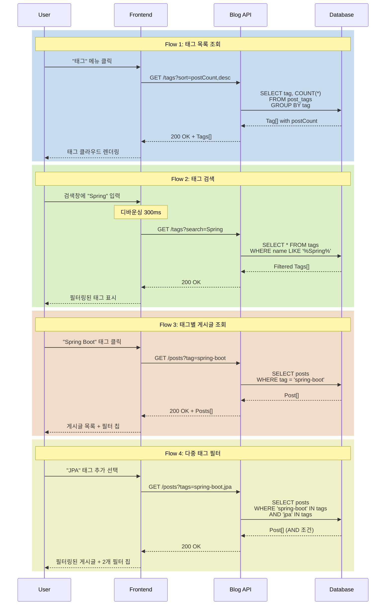

# 태그 탐색 시나리오

## Overview

사용자가 태그를 통해 관심 있는 주제의 게시글을 발견하는 시나리오입니다. 태그별 게시글 수를 확인하고, 정렬/필터를 적용하여 원하는 콘텐츠를 효율적으로 탐색합니다.

## Actors

| Actor | 역할 | 설명 |
|-------|------|------|
| 독자 | 콘텐츠 탐색자 | 태그로 게시글 검색 |
| 작성자 | 태그 생성자 | 게시글 작성 시 태그 추가 |
| 시스템 | 태그 관리자 | 태그별 게시글 수 집계 및 제공 |

## User Stories

### Story 1: 태그 클라우드 탐색
```
As a 독자
I want 전체 태그 목록을 확인
So that 어떤 주제의 글이 있는지 파악할 수 있음
```

### Story 2: 인기 태그 확인
```
As a 독자
I want 게시글 수가 많은 태그를 확인
So that 인기 있는 주제를 빠르게 찾을 수 있음
```

### Story 3: 태그별 게시글 조회
```
As a 독자
I want 특정 태그의 게시글만 필터링
So that 관심 주제의 글만 모아볼 수 있음
```

### Story 4: 다중 태그 필터링
```
As a 독자
I want 여러 태그를 조합하여 검색
So that 더 구체적인 주제의 글을 찾을 수 있음
```

## Triggers

| 트리거 | 조건 | 결과 |
|--------|------|------|
| 태그 메뉴 클릭 | 헤더 네비게이션 | 태그 목록 페이지로 이동 |
| 태그 클릭 (게시글 상세) | 포스트 하단 태그 영역 | 해당 태그 게시글 목록으로 이동 |
| 태그 클릭 (태그 클라우드) | 태그 목록 페이지 | 해당 태그 게시글 목록으로 이동 |
| 정렬 옵션 변경 | 태그 목록 페이지 | 태그 재정렬 |
| 태그 검색 입력 | 태그 목록 페이지 검색창 | 태그 필터링 |

## Flow

### 정상 흐름 1: 태그 목록 탐색

1. 사용자가 헤더의 "태그" 메뉴 클릭
2. 태그 목록 페이지 로드 (`/tags`)
3. API 요청: `GET /api/v1/tags?sort=postCount,desc`
4. 태그 클라우드 렌더링
   - 태그명
   - 게시글 수
   - 크기 차등 (게시글 수에 비례)
5. 정렬 옵션 제공
   - 인기순 (게시글 수 많은 순)
   - 이름순 (가나다/ABC 순)
   - 최신순 (최근 사용된 순)

### 정상 흐름 2: 태그 검색 및 필터링

1. 사용자가 태그 검색창에 키워드 입력 (예: "Spring")
2. 실시간 필터링 (디바운싱 300ms)
3. API 요청: `GET /api/v1/tags?search=Spring`
4. 일치하는 태그만 표시
   - Spring
   - Spring Boot
   - Spring Security

### 정상 흐름 3: 태그별 게시글 조회

1. 사용자가 태그 클릭 (예: "Spring Boot")
2. 게시글 목록 페이지로 이동 (`/posts?tag=spring-boot`)
3. API 요청: `GET /api/v1/posts?tag=spring-boot&page=0&size=20`
4. 선택된 태그로 필터링된 게시글 목록 렌더링
5. 상단에 필터 칩 표시
   - "Spring Boot × (12개)"
6. 추가 태그 선택 가능 (다중 필터)

### 정상 흐름 4: 다중 태그 필터링

1. 사용자가 "Spring Boot" 태그로 필터링된 상태
2. 추가 태그 선택 (예: "JPA")
3. URL 업데이트: `/posts?tags=spring-boot,jpa`
4. API 요청: `GET /api/v1/posts?tags=spring-boot,jpa&page=0`
5. 두 태그를 모두 포함하는 게시글만 표시 (AND 조건)
6. 필터 칩 표시
   - "Spring Boot × (12개)"
   - "JPA × (8개)"
7. 태그 제거 시 필터 칩의 × 버튼 클릭

### 시퀀스 다이어그램



## Business Rules

| 규칙 | 설명 | 위반 시 |
|------|------|---------|
| BR-001 | 태그는 게시글이 1개 이상 있을 때만 노출 | 게시글 없는 태그는 숨김 |
| BR-002 | 태그명은 소문자 kebab-case로 정규화 | "Spring Boot" → "spring-boot" |
| BR-003 | 태그는 중복 생성 불가 | 기존 태그 재사용 |
| BR-004 | 다중 태그 필터는 AND 조건 | 모든 태그를 포함하는 게시글만 표시 |
| BR-005 | 비공개 게시글은 태그 집계에서 제외 | 공개 게시글 수만 카운트 |

## API Endpoints

### 1. 태그 목록 조회

**Request**
```http
GET /api/v1/tags?sort=postCount,desc&search=Spring
```

**Query Parameters**
- `sort`: `postCount,desc` | `name,asc` | `updatedDate,desc`
- `search`: 태그명 검색 키워드 (선택)

**Response**
```json
{
  "success": true,
  "data": [
    {
      "id": 1,
      "name": "spring-boot",
      "displayName": "Spring Boot",
      "postCount": 24,
      "color": "#6DB33F",
      "description": "Spring Boot 관련 게시글"
    },
    {
      "id": 2,
      "name": "java",
      "displayName": "Java",
      "postCount": 18,
      "color": "#007396",
      "description": "Java 프로그래밍"
    }
  ]
}
```

### 2. 태그별 게시글 조회

**Request**
```http
GET /api/v1/posts?tags=spring-boot,jpa&page=0&size=20&sort=publishedDate,desc
```

**Query Parameters**
- `tags`: 쉼표로 구분된 태그 목록 (AND 조건)
- `page`, `size`: 페이지네이션
- `sort`: 정렬 옵션

**Response**
```json
{
  "success": true,
  "data": {
    "content": [
      {
        "id": 101,
        "title": "Spring Boot JPA 완벽 가이드",
        "summary": "JPA를 활용한 데이터베이스 연동",
        "author": {
          "id": 1,
          "name": "Laze"
        },
        "tags": [
          {
            "name": "spring-boot",
            "displayName": "Spring Boot"
          },
          {
            "name": "jpa",
            "displayName": "JPA"
          }
        ],
        "likeCount": 42,
        "commentCount": 8,
        "viewCount": 1250,
        "publishedDate": "2026-01-15T10:00:00"
      }
    ],
    "pageable": {
      "pageNumber": 0,
      "pageSize": 20,
      "totalElements": 8,
      "totalPages": 1
    }
  }
}
```

### 3. 인기 태그 조회 (상위 N개)

**Request**
```http
GET /api/v1/tags/popular?limit=10
```

**Response**
```json
{
  "success": true,
  "data": [
    {
      "name": "spring-boot",
      "displayName": "Spring Boot",
      "postCount": 24
    },
    {
      "name": "java",
      "displayName": "Java",
      "postCount": 18
    }
  ]
}
```

## Error Cases

| 에러 코드 | HTTP Status | 원인 | Frontend 처리 |
|-----------|-------------|------|--------------|
| B006 | 404 | 태그 없음 | "태그를 찾을 수 없습니다" 메시지 |
| B007 | 400 | 잘못된 태그 형식 | "올바른 태그 형식이 아닙니다" 메시지 |
| C001 | 500 | 서버 오류 | 재시도 버튼 제공 |

## UI Components

### Vue 컴포넌트 구조

```
TagListPage.vue                   # 태그 목록 페이지
├── TagSearchBar.vue              # 태그 검색창
├── TagSortDropdown.vue           # 정렬 옵션
└── TagCloud.vue                  # 태그 클라우드
    └── TagItem.vue               # 개별 태그 아이템

PostListPage.vue                  # 게시글 목록 페이지
├── TagFilterChips.vue            # 선택된 태그 필터 칩
│   └── TagChip.vue               # 개별 필터 칩
└── PostList.vue
    └── PostCard.vue
        └── PostTagList.vue       # 게시글 태그 목록

PostDetailPage.vue                # 게시글 상세 페이지
└── PostTags.vue                  # 게시글 하단 태그
    └── TagBadge.vue              # 태그 뱃지 (클릭 가능)
```

### 컴포넌트 위치

- **TagListPage.vue**: `frontend/blog-frontend/src/views/TagListPage.vue`
- **TagCloud.vue**: `frontend/blog-frontend/src/components/tag/TagCloud.vue`
- **TagFilterChips.vue**: `frontend/blog-frontend/src/components/tag/TagFilterChips.vue`
- **PostTagList.vue**: `frontend/blog-frontend/src/components/post/PostTagList.vue`

### 라우팅

```typescript
{
  path: '/tags',
  name: 'TagList',
  component: TagListPage
},
{
  path: '/posts',
  name: 'PostList',
  component: PostListPage,
  // Query: ?tags=spring-boot,jpa
}
```

## Output

### 태그 목록 페이지

**레이아웃**
- 검색창 (상단)
- 정렬 드롭다운 (우측 상단)
- 태그 클라우드 (그리드 또는 플렉스)
  - 게시글 수에 따라 폰트 크기 차등
  - 호버 시 툴팁: "24개의 게시글"
  - 클릭 시 해당 태그 게시글로 이동

**태그 아이템 예시**
```
[Spring Boot] (24)
[Java] (18)
[JPA] (12)
[React] (10)
```

### 게시글 목록 페이지 (태그 필터 적용)

**필터 칩 영역**
```
🔍 필터: [Spring Boot ×] [JPA ×]   전체 8개
```

**게시글 카드**
- 제목, 요약, 작성자
- 태그 목록 (하단)
- 좋아요, 댓글, 조회수

## Learning Points

### 태그 검색 성능 최적화

**방식 1: Full-Text Index (MySQL)**
```sql
CREATE FULLTEXT INDEX idx_tag_name ON tags(name);

SELECT * FROM tags
WHERE MATCH(name) AGAINST('Spring*' IN BOOLEAN MODE);
```

**방식 2: Elasticsearch (대규모)**
- 태그 자동완성 (prefix 쿼리)
- 관련 태그 추천 (similar 쿼리)

### 태그 클라우드 시각화

**폰트 크기 계산**
```javascript
const minCount = Math.min(...tags.map(t => t.postCount))
const maxCount = Math.max(...tags.map(t => t.postCount))

const getFontSize = (count) => {
  const minSize = 14
  const maxSize = 32
  const ratio = (count - minCount) / (maxCount - minCount)
  return minSize + ratio * (maxSize - minSize)
}
```

### 다중 태그 쿼리 최적화

**N+1 문제 방지**
```java
@Query("SELECT DISTINCT p FROM Post p " +
       "JOIN FETCH p.tags t " +
       "WHERE t.name IN :tagNames " +
       "GROUP BY p.id " +
       "HAVING COUNT(DISTINCT t.name) = :tagCount")
List<Post> findByAllTags(
    @Param("tagNames") List<String> tagNames,
    @Param("tagCount") long tagCount
);
```

### UX 개선 포인트

1. **태그 자동완성**: 입력 중 태그 제안
2. **관련 태그 추천**: "Spring Boot"를 본 사람들이 많이 본 태그
3. **태그 조합 추천**: "Spring Boot + JPA", "React + TypeScript"
4. **최근 본 태그**: LocalStorage에 저장

## Related

- [PRD-001 Blog Service 요구사항](../prd/PRD-001-blog-service.md)
- [API-001 Blog API 명세](../api/API-001-blog-api.md)
- [SCENARIO-005 좋아요 시나리오](./SCENARIO-005-like-post.md)
- [SCENARIO-008 트렌딩 게시글 시나리오](./SCENARIO-008-trending-posts.md)
