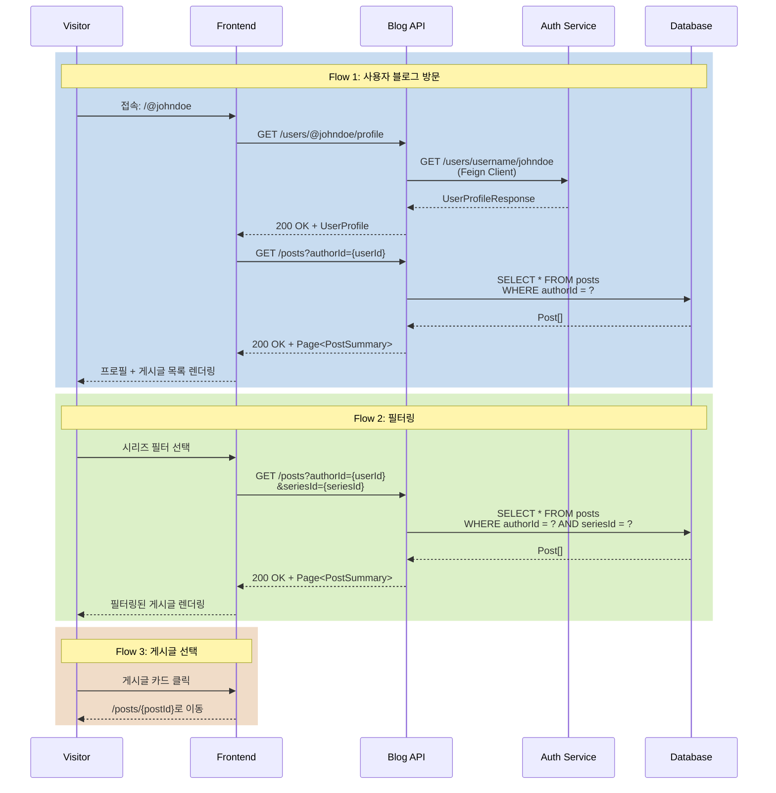

# 사용자 블로그 방문 시나리오

## Overview

방문자가 특정 사용자의 블로그 페이지(`/@username`)에 접속하여 해당 사용자의 프로필과 작성한 게시글 목록을 탐색하는 시나리오입니다.

## Actors

| Actor | 역할 | 설명 |
|-------|------|------|
| 방문자 | 콘텐츠 탐색자 | 특정 작성자의 블로그 방문 및 게시글 탐색 |
| 블로그 소유자 | 콘텐츠 작성자 | 블로그 주인 (username을 가진 사용자) |
| 시스템 | 정보 제공자 | 사용자 정보 및 게시글 목록 제공 |

## User Stories

### Story 1: 사용자 블로그 첫 방문
```
As a 방문자
I want /@username 경로로 특정 사용자의 블로그에 접속
So that 그 사용자가 작성한 모든 글을 볼 수 있음
```

### Story 2: 프로필 정보 확인
```
As a 방문자
I want 블로그 주인의 프로필 정보를 확인
So that 작성자에 대해 알 수 있음
```

### Story 3: 게시글 목록 탐색
```
As a 방문자
I want 작성자의 게시글 목록을 시리즈/태그별로 필터링
So that 원하는 주제의 글을 빠르게 찾을 수 있음
```

### Story 4: 게시글 선택 및 읽기
```
As a 방문자
I want 게시글을 선택하여 상세 페이지로 이동
So that 전체 내용을 읽을 수 있음
```

## Triggers

| 트리거 | 조건 | 결과 |
|--------|------|------|
| URL 직접 입력 | `/@username` 입력 | 사용자 블로그 페이지 로드 |
| 작성자 이름 클릭 | 게시글 카드의 작성자 클릭 | 해당 사용자 블로그로 이동 |
| 댓글 작성자 클릭 | 댓글의 `@username` 클릭 | 해당 사용자 블로그로 이동 |
| 프로필 공유 | 사용자 블로그 URL 공유 | 다른 사람이 블로그 방문 |

## Flow

### 정상 흐름 1: 사용자 블로그 첫 방문

1. 방문자가 `/@johndoe` URL 입력
2. Frontend가 라우터 매칭 (`/\@:username`)
3. API 요청: `GET /api/v1/blog/users/@johndoe/profile`
4. Backend가 username으로 사용자 조회
   - auth-service에서 사용자 정보 조회 (Feign Client)
   - 사용자 존재 확인
5. 프로필 정보 응답 반환
   - userId, username, displayName
   - profileImageUrl, bio
   - 게시글 수, 팔로워 수 (향후)
6. Frontend가 프로필 헤더 렌더링
7. 게시글 목록 자동 로드
   - API 요청: `GET /api/v1/blog/posts?authorId={userId}&page=0&size=20`
8. 게시글 카드 목록 표시
   - 썸네일, 제목, 요약
   - 작성일, 조회수, 좋아요 수, 댓글 수
   - 태그 목록

### 정상 흐름 2: 필터링 및 정렬

1. 방문자가 필터 옵션 선택
   - 전체 / 시리즈 / 태그
2. 시리즈 필터 선택 시:
   - 시리즈 목록 드롭다운 표시
   - 시리즈 선택
   - API 요청: `GET /api/v1/blog/posts?authorId={userId}&seriesId={seriesId}`
3. 태그 필터 선택 시:
   - 태그 목록 표시 (해당 작성자가 사용한 태그만)
   - 태그 선택
   - API 요청: `GET /api/v1/blog/posts?authorId={userId}&tag={tagName}`
4. 정렬 옵션 변경:
   - 최신순 / 인기순 (좋아요) / 조회순
   - URL 쿼리 파라미터 업데이트
5. 필터링된 게시글 목록 렌더링

### 정상 흐름 3: 게시글 선택

1. 방문자가 게시글 카드 클릭
2. 게시글 상세 페이지로 이동
   - URL: `/posts/{postId}`
3. 상세 페이지에서 작성자 정보 표시
   - 프로필 이미지, 이름, username
   - "다른 글 보기" 버튼 → `/@username`으로 이동

### 정상 흐름 4: 무한 스크롤

1. 방문자가 페이지 하단으로 스크롤
2. Intersection Observer 감지
3. 다음 페이지 로드
   - API 요청: `GET /api/v1/blog/posts?authorId={userId}&page=1&size=20`
4. 기존 목록에 추가 렌더링
5. 마지막 페이지 도달 시 "더 이상 게시글이 없습니다" 메시지

### 시퀀스 다이어그램



## Business Rules

| 규칙 | 설명 | 위반 시 |
|------|------|---------|
| BR-001 | username은 고유해야 함 | 중복 불가 |
| BR-002 | 공개 게시글만 표시 | 비공개/임시저장 제외 |
| BR-003 | username 미설정 사용자는 블로그 페이지 없음 | 404 반환 |
| BR-004 | 게시글 목록은 최신순 기본 정렬 | publishedAt DESC |
| BR-005 | 본인 블로그 방문 시에도 공개 게시글만 표시 | 비공개 게시글은 마이페이지에서만 |

## API Endpoints

### 1. 사용자 프로필 조회

**Request**
```http
GET /api/v1/blog/users/@johndoe/profile
```

**Response**
```json
{
  "success": true,
  "data": {
    "userId": "user-uuid-1234",
    "username": "johndoe",
    "displayName": "John Doe",
    "bio": "Backend Developer interested in Spring Boot",
    "profileImageUrl": "https://cdn.example.com/profile/johndoe.jpg",
    "postCount": 42,
    "followerCount": 128,
    "followingCount": 56,
    "createdAt": "2025-01-15T10:00:00",
    "socialLinks": {
      "github": "https://github.com/johndoe",
      "twitter": "https://twitter.com/johndoe"
    }
  }
}
```

### 2. 작성자별 게시글 목록 조회

**Request**
```http
GET /api/v1/blog/posts?authorId=user-uuid-1234&page=0&size=20&sort=publishedAt,desc
```

**Query Parameters**
- `authorId`: 작성자 ID (필수)
- `seriesId`: 시리즈 ID (선택)
- `tag`: 태그 이름 (선택)
- `sort`: 정렬 (publishedAt,desc | likeCount,desc | viewCount,desc)
- `page`, `size`: 페이지네이션

**Response**
```json
{
  "success": true,
  "data": {
    "content": [
      {
        "id": "post-id-1",
        "title": "Spring Boot 3.2 새로운 기능",
        "summary": "Spring Boot 3.2의 주요 변경사항을...",
        "thumbnailUrl": "https://cdn.example.com/thumbnails/post1.jpg",
        "author": {
          "id": "user-uuid-1234",
          "username": "johndoe",
          "displayName": "John Doe",
          "profileImageUrl": "https://cdn.example.com/profile/johndoe.jpg"
        },
        "tags": ["spring-boot", "java"],
        "series": {
          "id": "series-id-1",
          "name": "Spring Boot 완벽 가이드"
        },
        "viewCount": 1250,
        "likeCount": 42,
        "commentCount": 8,
        "publishedAt": "2026-01-21T08:00:00"
      }
    ],
    "pageable": {
      "pageNumber": 0,
      "pageSize": 20,
      "totalElements": 42,
      "totalPages": 3
    }
  }
}
```

### 3. 작성자의 시리즈 목록 조회

**Request**
```http
GET /api/v1/blog/series?authorId=user-uuid-1234
```

**Response**
```json
{
  "success": true,
  "data": {
    "content": [
      {
        "id": "series-id-1",
        "name": "Spring Boot 완벽 가이드",
        "description": "Spring Boot의 A to Z",
        "thumbnailUrl": "https://cdn.example.com/series/spring.jpg",
        "postCount": 12,
        "createdAt": "2025-12-01T00:00:00"
      }
    ]
  }
}
```

### 4. 작성자의 태그 목록 조회

**Request**
```http
GET /api/v1/blog/tags?authorId=user-uuid-1234
```

**Response**
```json
{
  "success": true,
  "data": [
    {
      "name": "spring-boot",
      "postCount": 15
    },
    {
      "name": "java",
      "postCount": 20
    },
    {
      "name": "kotlin",
      "postCount": 7
    }
  ]
}
```

## Error Cases

| 에러 코드 | HTTP Status | 원인 | Frontend 처리 |
|-----------|-------------|------|--------------|
| B030 | 404 | 존재하지 않는 username | "사용자를 찾을 수 없습니다" 페이지 |
| B031 | 404 | username 미설정 사용자 | "블로그가 아직 생성되지 않았습니다" 메시지 |
| A001 | 404 | auth-service에서 사용자 미조회 | "사용자를 찾을 수 없습니다" 페이지 |
| C001 | 500 | 서버 오류 | "일시적인 오류가 발생했습니다" + 재시도 버튼 |

## UI Components

### Vue 컴포넌트 구조

```
UserBlogPage.vue                    # 사용자 블로그 메인 페이지
├── UserProfileHeader.vue           # 프로필 헤더
│   ├── UserAvatar.vue              # 프로필 이미지
│   ├── UserStats.vue               # 통계 (게시글 수, 팔로워 수)
│   └── FollowButton.vue            # 팔로우 버튼 (향후)
├── PostFilterBar.vue               # 필터/정렬 바
│   ├── FilterDropdown.vue          # 필터 드롭다운 (전체/시리즈/태그)
│   └── SortDropdown.vue            # 정렬 드롭다운 (최신/인기/조회)
└── PostListSection.vue             # 게시글 목록 섹션
    ├── PostCard.vue                # 게시글 카드
    └── InfiniteScroll.vue          # 무한 스크롤
```

### 컴포넌트 위치

- **UserBlogPage.vue**: `frontend/blog-frontend/src/views/UserBlogPage.vue`
- **UserProfileHeader.vue**: `frontend/blog-frontend/src/components/user/UserProfileHeader.vue`
- **PostFilterBar.vue**: `frontend/blog-frontend/src/components/post/PostFilterBar.vue`

### 라우팅

```typescript
{
  path: '/@:username',
  name: 'UserBlog',
  component: UserBlogPage,
  props: true,
  meta: {
    title: (route) => `@${route.params.username}`
  }
}
```

## Output

### 사용자 블로그 페이지 UI

**프로필 헤더**
```
┌─────────────────────────────────────────────┐
│  [프로필 이미지]                             │
│                                              │
│  John Doe  @johndoe                         │
│  Backend Developer interested in Spring Boot│
│                                              │
│  📝 42개 게시글  👥 128 팔로워  💼 56 팔로잉│
│                                              │
│  [팔로우] [공유]  🐙 GitHub  🐦 Twitter     │
└─────────────────────────────────────────────┘
```

**필터 바**
```
┌─────────────────────────────────────────────┐
│  [전체 ▼] [시리즈 ▼] [태그 ▼]   [최신순 ▼] │
└─────────────────────────────────────────────┘
```

**게시글 카드**
```
┌─────────────────────────────────────────────┐
│  [썸네일]                                    │
│                                              │
│  Spring Boot 3.2 새로운 기능                 │
│  Spring Boot 3.2의 주요 변경사항을...        │
│                                              │
│  #spring-boot #java                          │
│  📚 Spring Boot 완벽 가이드                  │
│                                              │
│  2026.01.21  👁 1,250  ❤️ 42  💬 8         │
└─────────────────────────────────────────────┘
```

### 빈 상태 (게시글 없음)

```
┌─────────────────────────────────────────────┐
│            📝                                │
│                                              │
│     아직 작성한 게시글이 없습니다            │
│                                              │
│  [메인 페이지로 이동]                        │
└─────────────────────────────────────────────┘
```

### 404 페이지 (사용자 없음)

```
┌─────────────────────────────────────────────┐
│            🔍                                │
│                                              │
│     사용자를 찾을 수 없습니다                │
│     @johndoe                                 │
│                                              │
│  [메인 페이지로 이동]                        │
└─────────────────────────────────────────────┘
```

## Learning Points

### username vs userId

**username**
- 사용자가 설정하는 고유한 문자열
- URL에 노출되는 친화적 식별자 (`/@johndoe`)
- 변경 가능 여부: 최초 1회만 설정, 이후 변경 불가 (Phase 1-B)
- 인덱스 필수: `unique index on username`

**userId**
- 시스템이 부여하는 고유 ID (UUID)
- 내부 참조용 (DB relations, API 호출)
- 변경 불가

**트레이드오프**
| 항목 | username 사용 | userId 사용 |
|------|--------------|-------------|
| URL 가독성 | 높음 (`/@johndoe`) | 낮음 (`/user/uuid-1234`) |
| 변경 허용 | 어려움 (URL 변경) | 쉬움 |
| SEO | 유리 | 불리 |
| 구현 복잡도 | 중간 (중복 검증 필요) | 낮음 |

**선택 이유**: Velog, Medium 등 블로그 플랫폼은 username 기반 URL을 사용하여 사용자 친화적 경험 제공

### Feign Client vs Kafka Event

**사용자 프로필 조회 시 Feign Client 선택**

**이유**
- 실시간 조회 필요 (최신 정보)
- 요청-응답 패턴 적합
- 단순 조회 작업

**대안: Kafka Event**
- auth-service가 사용자 생성/수정 시 이벤트 발행
- blog-service가 사용자 정보 캐싱
- 장점: auth-service 장애 시에도 조회 가능
- 단점: 데이터 동기화 복잡도 증가, Eventual Consistency

**참고 문서**
- [학습 노트: Synchronous vs Asynchronous Communication](../learning/sync-vs-async-communication.md)

### 무한 스크롤 vs 페이지네이션

**무한 스크롤 선택**
- 모바일 친화적
- 연속적인 콘텐츠 탐색에 적합
- Velog 스타일 벤치마킹

**구현 방식**
- Intersection Observer API
- 마지막 요소 감지 시 다음 페이지 로드
- 로딩 상태 표시

## Related

- [SCENARIO-010 마이페이지 관리 시나리오](./SCENARIO-010-my-page.md)
- [SCENARIO-008 트렌딩 게시글 시나리오](./SCENARIO-008-trending-posts.md)
- [PRD: Phase 1-A Blog UX Enhancement](../prd/phase1a-blog-ux.md)
