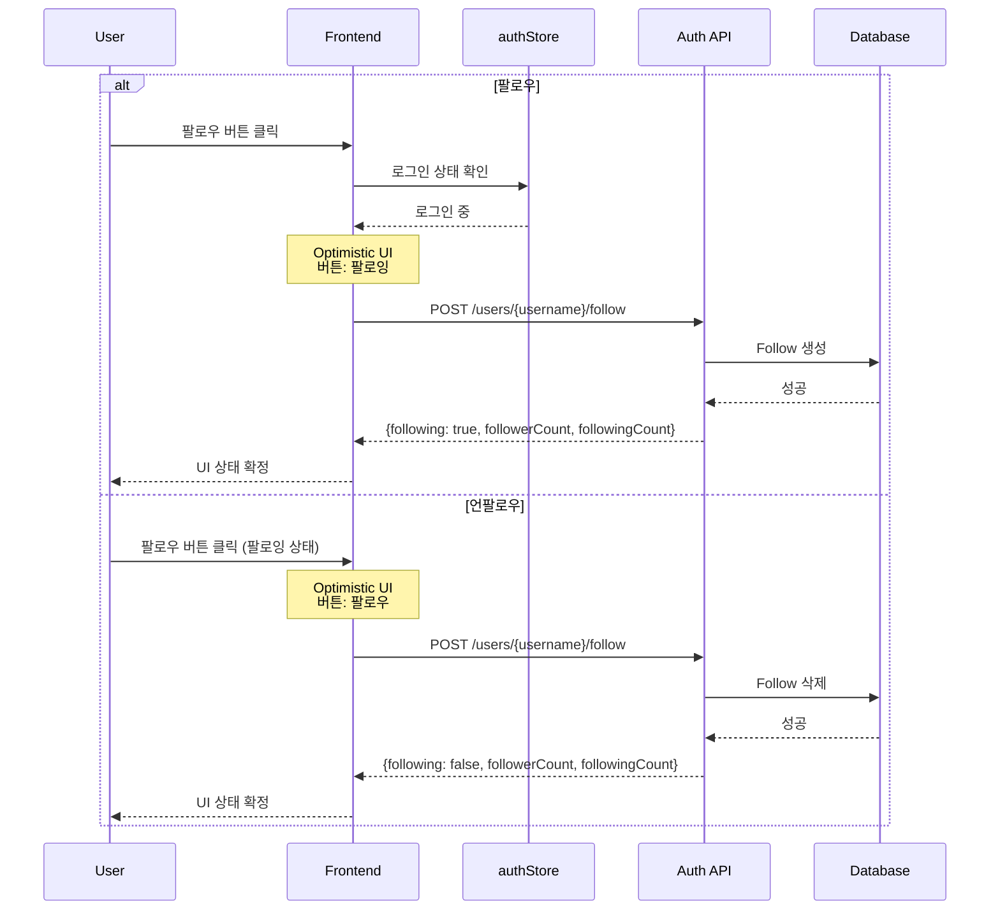

# 사용자 팔로우 기능 시나리오

## Overview

사용자가 다른 사용자를 팔로우하거나 언팔로우하는 시나리오입니다. 팔로우 기능을 통해 관심 있는 사용자의 게시글을 피드에서 확인할 수 있습니다.

## Actors

| Actor | 역할 | 설명 |
|-------|------|------|
| 비로그인 사용자 | 게스트 | 팔로우 버튼 클릭 시 로그인 유도 |
| 로그인 사용자 | 팔로워 | 팔로우/언팔로우 토글 |
| 대상 사용자 | 팔로잉 대상 | 팔로우 수신자 |
| 시스템 | 처리자 | 팔로우 관계 관리 |

## User Stories

### Story 1: 팔로우
```
As a 로그인 사용자
I want 관심 있는 사용자를 팔로우
So that 그 사용자의 새 게시글을 피드에서 볼 수 있음
```

### Story 2: 언팔로우
```
As a 로그인 사용자
I want 팔로우한 사용자를 언팔로우
So that 더 이상 그 사용자의 게시글을 피드에서 보지 않음
```

### Story 3: 팔로워/팔로잉 목록 확인
```
As a 모든 사용자
I want 특정 사용자의 팔로워/팔로잉 목록을 확인
So that 해당 사용자의 네트워크를 파악할 수 있음
```

## Triggers

| 트리거 | 조건 | 결과 |
|--------|------|------|
| 팔로우 버튼 클릭 (비로그인) | 인증 토큰 없음 | 로그인 유도 메시지 |
| 팔로우 버튼 클릭 (로그인) | 팔로우 안 한 상태 | 팔로우 생성 |
| 팔로우 버튼 클릭 (로그인) | 팔로우 한 상태 | 팔로우 삭제 (언팔로우) |
| 자기 자신 팔로우 시도 | 본인 프로필 | 에러 메시지 |
| 팔로워/팔로잉 수 클릭 | 프로필 페이지 | 목록 모달 표시 |

## Flow

### 정상 흐름 1: 팔로우

1. 사용자가 대상 프로필 페이지 방문
2. 팔로우 버튼 클릭
3. Frontend에서 Optimistic UI로 버튼 상태 변경 ("팔로우" → "팔로잉")
4. API 요청: `POST /api/users/{username}/follow`
5. 서버가 Follow 엔티티 생성
6. 성공 응답 수신 (팔로워/팔로잉 카운트 포함)
7. UI 상태 확정

### 정상 흐름 2: 언팔로우

1. 사용자가 팔로잉 중인 프로필 방문
2. 팔로우 버튼 클릭 (현재 "팔로잉" 상태)
3. Frontend에서 Optimistic UI로 버튼 상태 변경 ("팔로잉" → "팔로우")
4. API 요청: `POST /api/users/{username}/follow` (토글 방식)
5. 서버가 Follow 엔티티 삭제
6. 성공 응답 수신
7. UI 상태 확정

### 정상 흐름 3: 팔로워 목록 조회

1. 사용자가 프로필 페이지에서 팔로워 수 클릭
2. 팔로워 목록 모달 표시
3. API 요청: `GET /api/users/{username}/followers`
4. 팔로워 사용자 목록 표시
5. 각 사용자에 팔로우 버튼 표시 (자신 제외)

### 시퀀스 다이어그램



## Business Rules

| 규칙 | 설명 | 위반 시 |
|------|------|---------|
| BR-001 | 팔로우는 로그인 사용자만 가능 | 401 Unauthorized |
| BR-002 | 자기 자신을 팔로우할 수 없음 | 400 Bad Request (A016) |
| BR-003 | 중복 팔로우 방지 (Unique Constraint) | 토글 방식으로 처리 |
| BR-004 | 존재하지 않는 사용자 팔로우 불가 | 404 Not Found (A017) |

## API Endpoints

### 1. 팔로우 토글

**Request**
```http
POST /api/users/{username}/follow
Authorization: Bearer {token}
```

**Response (팔로우 성공)**
```json
{
  "success": true,
  "data": {
    "following": true,
    "followerCount": 125,
    "followingCount": 89
  },
  "error": null
}
```

**Response (언팔로우 성공)**
```json
{
  "success": true,
  "data": {
    "following": false,
    "followerCount": 124,
    "followingCount": 89
  },
  "error": null
}
```

### 2. 팔로워 목록 조회

**Request**
```http
GET /api/users/{username}/followers?page=0&size=20
```

**Response**
```json
{
  "success": true,
  "data": {
    "users": [
      {
        "uuid": "user-uuid-1",
        "username": "john_doe",
        "nickname": "John",
        "profileImageUrl": "https://...",
        "bio": "Developer"
      }
    ],
    "page": 0,
    "size": 20,
    "totalElements": 125,
    "totalPages": 7,
    "hasNext": true
  },
  "error": null
}
```

### 3. 팔로잉 목록 조회

**Request**
```http
GET /api/users/{username}/following?page=0&size=20
```

### 4. 팔로우 상태 확인

**Request**
```http
GET /api/users/{username}/follow/status
Authorization: Bearer {token}
```

**Response**
```json
{
  "success": true,
  "data": {
    "isFollowing": true
  },
  "error": null
}
```

### 5. 내 팔로잉 ID 목록 (피드용)

**Request**
```http
GET /api/users/me/following/ids
Authorization: Bearer {token}
```

**Response**
```json
{
  "success": true,
  "data": {
    "followingIds": ["uuid-1", "uuid-2", "uuid-3"]
  },
  "error": null
}
```

## Error Cases

| 에러 코드 | HTTP Status | 원인 | Frontend 처리 |
|-----------|-------------|------|--------------|
| A014 | 409 | 이미 팔로우 중 | 토글 방식으로 무시 |
| A015 | 404 | 팔로우하지 않음 | 토글 방식으로 무시 |
| A016 | 400 | 자기 자신 팔로우 | 에러 메시지 표시 |
| A017 | 404 | 대상 사용자 없음 | "사용자를 찾을 수 없습니다" |

## UI Components

### Vue 컴포넌트 구조

```
FollowButton.vue              # 팔로우 버튼 컴포넌트
├── props
│   ├── username: string
│   ├── targetUuid: string
│   ├── initialFollowing?: boolean
│   └── size?: 'sm' | 'md' | 'lg'
├── state
│   ├── following: Ref<boolean>
│   └── loading: Ref<boolean>
└── methods
    └── handleToggle()

FollowerModal.vue             # 팔로워/팔로잉 목록 모달
├── props
│   ├── username: string
│   ├── isOpen: boolean
│   └── type: 'followers' | 'following'
├── state
│   ├── users: Ref<FollowUserResponse[]>
│   └── hasNext: Ref<boolean>
└── methods
    ├── loadData()
    └── loadMore()

UserProfileCard.vue           # 프로필 카드 (팔로우 통합)
├── 팔로우 버튼
├── 팔로워/팔로잉 카운트
└── 클릭 시 모달 열기
```

### 컴포넌트 위치

- `frontend/blog-frontend/src/components/FollowButton.vue`
- `frontend/blog-frontend/src/components/FollowerModal.vue`
- `frontend/blog-frontend/src/components/UserProfileCard.vue`
- `frontend/blog-frontend/src/stores/followStore.ts`

## Output

### 성공 시

**Database**
- Follow 엔티티 생성/삭제
- 연관된 사용자들의 follower/following 카운트 업데이트

**Frontend**
- 팔로우 버튼 상태 변경
- 팔로워/팔로잉 카운트 업데이트
- followStore의 followingIds 목록 업데이트

### 실패 시

- Optimistic UI 롤백
- 에러 메시지 토스트 표시

## Related

- [SCENARIO-015 피드 기능](./SCENARIO-015-feed.md)
- [사용자 프로필 페이지](./SCENARIO-012-user-blog-view.md)
