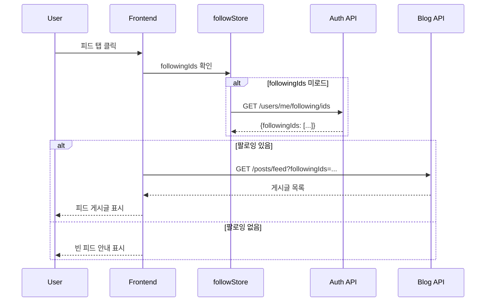

# 피드 기능 시나리오

## Overview

로그인한 사용자가 팔로잉 중인 사용자들의 게시글을 피드 탭에서 확인하는 시나리오입니다. 피드는 팔로잉 사용자들의 최신 게시글을 시간순으로 보여줍니다.

## Actors

| Actor | 역할 | 설명 |
|-------|------|------|
| 로그인 사용자 | 피드 소비자 | 팔로잉 사용자들의 게시글 확인 |
| 팔로잉 사용자들 | 콘텐츠 제공자 | 피드에 표시될 게시글 작성자들 |
| 시스템 | 처리자 | 피드 데이터 집계 및 제공 |

## User Stories

### Story 1: 피드 조회
```
As a 로그인 사용자
I want 팔로잉 사용자들의 최신 게시글을 피드에서 확인
So that 관심 있는 사용자들의 콘텐츠를 한눈에 볼 수 있음
```

### Story 2: 빈 피드 안내
```
As a 팔로잉이 없는 사용자
I want 피드가 비어있을 때 안내 메시지를 확인
So that 팔로우 기능을 이해하고 사용자를 팔로우할 수 있음
```

### Story 3: 무한 스크롤
```
As a 피드 사용자
I want 스크롤을 내리면 자동으로 더 많은 게시글이 로드
So that 끊김 없이 피드를 탐색할 수 있음
```

## Triggers

| 트리거 | 조건 | 결과 |
|--------|------|------|
| 피드 탭 클릭 (로그인) | 팔로잉 있음 | 팔로잉 사용자 게시글 로드 |
| 피드 탭 클릭 (로그인) | 팔로잉 없음 | 빈 피드 안내 표시 |
| 피드 탭 클릭 (비로그인) | - | 탭 자체가 미표시 |
| 스크롤 끝 도달 | 더 있음 | 다음 페이지 로드 |
| 새로고침 | 피드 탭 활성화 | 최신 피드 다시 로드 |

## Flow

### 정상 흐름 1: 피드 조회 (팔로잉 있음)

1. 사용자가 블로그 메인 페이지 접속
2. 피드 탭 클릭 (로그인 상태만 표시)
3. Frontend에서 followStore의 followingIds 확인
4. 로드되지 않았으면 `GET /api/users/me/following/ids` 호출
5. followingIds로 `GET /api/blog/posts/feed` 호출
6. 피드 게시글 목록 표시 (PostCard 컴포넌트)
7. 스크롤 시 무한 스크롤로 추가 로드

### 정상 흐름 2: 빈 피드 (팔로잉 없음)

1. 사용자가 피드 탭 클릭
2. followingIds 조회 → 빈 배열
3. 빈 피드 상태 UI 표시
4. "관심 있는 사용자를 팔로우해보세요!" 안내
5. "트렌딩 게시글 보기" 버튼으로 이동 유도

### 시퀀스 다이어그램



## Business Rules

| 규칙 | 설명 | 위반 시 |
|------|------|---------|
| BR-001 | 피드는 로그인 사용자만 접근 가능 | 피드 탭 미표시 |
| BR-002 | 발행된(PUBLISHED) 게시글만 피드에 표시 | 초안 제외 |
| BR-003 | 최신순 정렬 (publishedAt DESC) | - |
| BR-004 | 팔로잉 없으면 빈 피드 표시 | 트렌딩으로 유도 |

## API Endpoints

### 1. 피드 조회

**Request**
```http
GET /api/blog/posts/feed?followingIds=uuid1,uuid2,uuid3&page=0&size=10
```

**Response**
```json
{
  "success": true,
  "data": {
    "content": [
      {
        "id": "post-123",
        "title": "새로운 글 제목",
        "summary": "게시글 요약...",
        "authorId": "user-uuid-1",
        "authorName": "John Doe",
        "tags": ["javascript", "react"],
        "category": "tech",
        "thumbnailUrl": "https://...",
        "viewCount": 150,
        "likeCount": 25,
        "publishedAt": "2026-01-21T10:30:00",
        "estimatedReadTime": 5
      }
    ],
    "number": 0,
    "size": 10,
    "totalElements": 45,
    "totalPages": 5,
    "first": true,
    "last": false,
    "empty": false
  },
  "error": null
}
```

### 2. 내 팔로잉 ID 목록 (피드용)

**Request**
```http
GET /api/users/me/following/ids
Authorization: Bearer {token}
```

**Response**
```json
{
  "success": true,
  "data": {
    "followingIds": ["uuid-1", "uuid-2", "uuid-3"]
  },
  "error": null
}
```

## UI Components

### 피드 탭 위치

블로그 메인 페이지 (`PostListPage.vue`)의 탭 시스템에 추가:

```
탭 순서 (로그인 시):
📬 피드 | 🔥 트렌딩 | 🕐 최신

탭 순서 (비로그인 시):
🔥 트렌딩 | 🕐 최신
```

### 상태별 UI

**1. 로딩 중**
- 스피너 + "게시글을 불러오는 중..." 메시지

**2. 피드 있음**
- PostCard 그리드로 게시글 표시
- 무한 스크롤 지원

**3. 빈 피드 (팔로잉 없음)**
```
👋
팔로우하는 사용자가 없습니다
관심 있는 사용자를 팔로우해보세요!

[트렌딩 게시글 보기]
```

**4. 빈 피드 (팔로잉 있지만 게시글 없음)**
```
👋
피드가 비어있습니다
팔로우한 사용자들이 아직 게시글을 작성하지 않았습니다.
```

### 컴포넌트 수정 사항

**PostListPage.vue**
- TabType에 'feed' 추가
- 피드 탭 버튼 추가 (로그인 시만 표시)
- loadPosts 함수에 피드 로직 추가
- 빈 피드 상태 UI 추가

**followStore.ts**
- followingIds 상태 관리
- loadFollowingIds() 액션

## URL 구조

| URL | 쿼리 파라미터 | 설명 |
|-----|--------------|------|
| `/blog` | `?tab=feed` | 피드 탭 활성화 |
| `/blog` | `?tab=trending&period=week` | 트렌딩 탭 (기본) |
| `/blog` | `?tab=recent` | 최신 탭 |

## Output

### 성공 시

**Frontend**
- 팔로잉 사용자들의 게시글 목록 표시
- 무한 스크롤로 추가 로드
- 각 게시글에 좋아요/조회수 표시

### 실패 시

- 에러 메시지 표시
- "다시 시도" 버튼 제공

## Performance Considerations

### 피드 최적화

1. **followingIds 캐싱**: followStore에서 한 번 로드 후 재사용
2. **페이징**: 10개씩 로드하여 초기 로드 시간 단축
3. **Lazy Loading**: 이미지는 뷰포트 진입 시 로드
4. **Intersection Observer**: 무한 스크롤 효율적 구현

### 확장 고려사항

추후 피드 개선 시:
- 팔로잉 사용자 게시글을 별도 테이블에 캐싱
- Redis를 활용한 피드 캐시
- 실시간 피드 업데이트 (WebSocket)

## Related

- [SCENARIO-014 팔로우 기능](./SCENARIO-014-follow-user.md)
- [SCENARIO-011 트렌딩 게시글](./SCENARIO-011-trending-posts.md)
- [사용자 프로필 페이지](./SCENARIO-012-user-blog-view.md)
