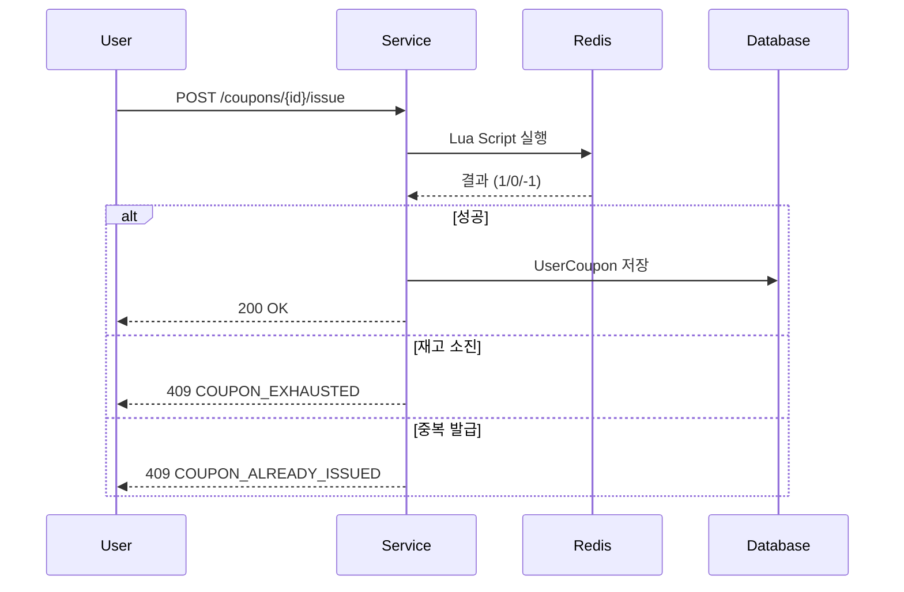

# Scenario 문서 작성 가이드

## 개요

시나리오 문서는 기능의 **비즈니스 맥락**을 정의합니다. 코드 구현 전에 "왜 이 기능이 필요한가?"를 명확히 하여 올바른 설계를 유도합니다.

## 파일 규칙

### 위치
```
docs/scenarios/SCENARIO-XXX-[feature].md
```

### 명명 규칙
- 패턴: `SCENARIO-XXX-[feature].md`
- 번호: 3자리 (001, 002, ...)
- feature: kebab-case (coupon-issue, order-saga, ...)

### 예시
```
SCENARIO-001-coupon-issue.md
SCENARIO-002-order-saga.md
SCENARIO-003-timedeal-purchase.md
```

## 필수 메타데이터

```yaml
---
id: SCENARIO-XXX
title: [시나리오 제목]
type: scenario
status: draft | review | approved | current
created: YYYY-MM-DD
updated: YYYY-MM-DD
author: [작성자]
tags:
  - [관련 태그]
related:
  - [관련 문서 ID]
---
```

## 필수 섹션

### 1. Overview (개요)
한 줄로 시나리오를 요약합니다.

```markdown
## Overview

마케팅 이벤트 시 선착순으로 쿠폰을 발급받는 시나리오입니다.
```

### 2. Actors (행위자)
이 시나리오에 관련된 모든 행위자를 나열합니다.

```markdown
## Actors

| Actor | 역할 | 설명 |
|-------|------|------|
| 마케팅팀 | 쿠폰 생성자 | 프로모션 쿠폰 생성 |
| 사용자 | 쿠폰 발급자 | 쿠폰 발급 요청 |
| 시스템 | 처리자 | 재고 확인 및 발급 |
```

### 3. Triggers (트리거)
시나리오가 시작되는 조건입니다.

```markdown
## Triggers

| 트리거 | 조건 | 결과 |
|--------|------|------|
| 프로모션 시작 | 이벤트 시작 시간 도달 | 사용자 발급 가능 |
| 사용자 요청 | 발급 버튼 클릭 | 쿠폰 발급 시도 |
```

### 4. Flow (흐름)
단계별 처리 흐름을 시퀀스 다이어그램과 함께 설명합니다.

```markdown
## Flow

### 정상 흐름

1. 마케팅팀이 쿠폰 생성 (수량: 10,000개)
2. 이벤트 시작 시간에 발급 페이지 활성화
3. 사용자가 발급 요청
4. 시스템이 재고 확인 및 발급
5. 사용자에게 발급 완료 알림

### 시퀀스 다이어그램


```

### 5. Business Rules (비즈니스 규칙)
반드시 지켜야 할 규칙들입니다.

```markdown
## Business Rules

| 규칙 | 설명 | 위반 시 |
|------|------|---------|
| BR-001 | 1인 1쿠폰 | S604 에러 반환 |
| BR-002 | 재고 초과 발급 금지 | S602 에러 반환 |
| BR-003 | 유효기간 내 발급 | S603/S605 에러 반환 |
```

### 6. Error Cases (에러 케이스)
발생 가능한 에러와 처리 방법입니다.

```markdown
## Error Cases

| 에러 | 원인 | 처리 |
|------|------|------|
| S601 | 쿠폰 없음 | 404 반환 |
| S602 | 재고 소진 | 409 반환, 안내 메시지 |
| S604 | 중복 발급 | 409 반환, 기존 쿠폰 안내 |
```

### 7. Output (결과)
시나리오 완료 시 기대되는 결과입니다.

```markdown
## Output

### 성공 시
- 사용자: UserCoupon 엔티티 생성
- 쿠폰: issuedQuantity 증가
- Redis: 발급 사용자 Set에 추가

### 실패 시
- 상태 변화 없음 (원자적 처리)
- 적절한 에러 메시지 반환
```

### 8. Learning Points (학습 포인트)
이 시나리오에서 배울 수 있는 기술적 포인트입니다.

```markdown
## Learning Points

### 동시성 제어
- Redis Lua 스크립트로 원자성 보장
- 관련 문서: [Redis Lua Script 학습 노트](../learning/redis-lua-script-atomicity.md)

### 트레이드오프
| 선택 | 대안 | 선택 이유 |
|------|------|----------|
| Redis Lua | DB Lock | 높은 처리량 필요 |
| Pessimistic Lock | Optimistic Lock | 인기 상품 특성 |
```

### 9. Related (관련 문서)
관련된 다른 문서 링크입니다.

```markdown
## Related

- [ADR-003 쿠폰 동시성 전략](../adr/ADR-003-coupon-concurrency.md)
- [PRD-002 쿠폰 시스템](../prd/PRD-002-coupon-system.md)
```

## 작성 팁

1. **Actor부터 시작**: 누가 사용하는지 명확히 하면 나머지가 쉬워집니다
2. **다이어그램 필수**: 시퀀스 다이어그램은 복잡한 흐름을 이해하는 데 필수입니다
3. **에러 케이스 상세히**: 실제 운영에서 에러 케이스가 더 중요합니다
4. **학습 포인트 기록**: 왜 이런 기술을 선택했는지 기록하면 나중에 도움됩니다

## 체크리스트

- [ ] 필수 메타데이터 포함
- [ ] 모든 필수 섹션 작성
- [ ] 시퀀스 다이어그램 포함
- [ ] 에러 케이스 정의
- [ ] 학습 포인트 기록
- [ ] README.md 인덱스 업데이트
- [ ] 관련 문서 링크
