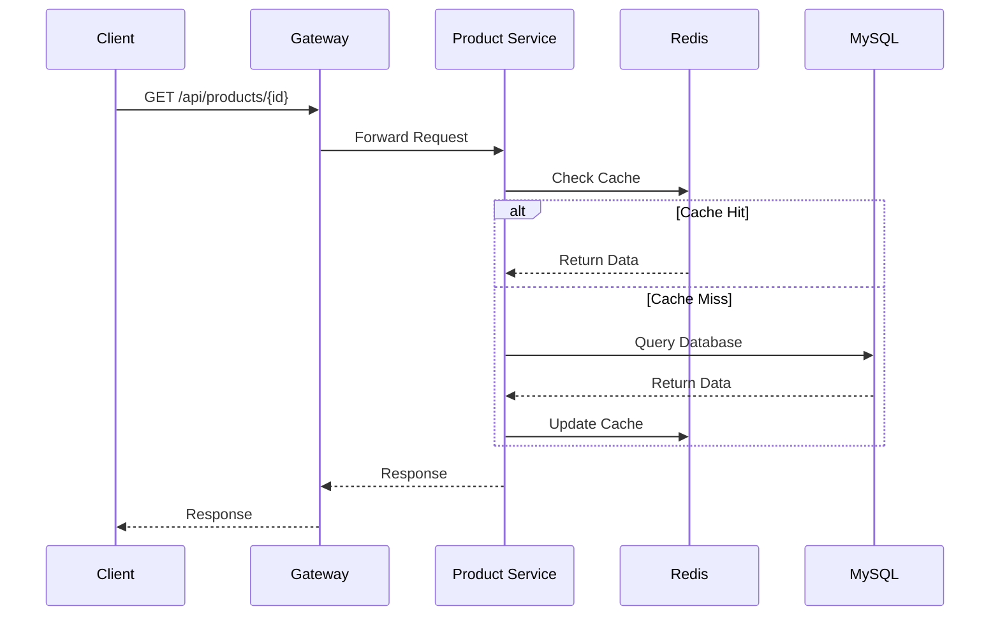
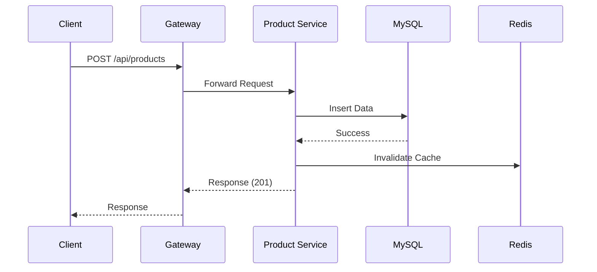

# 📊 Data Flow

## 상품 조회 흐름

```mermaid
sequenceDiagram
    participant C as Client
    participant G as Gateway
    participant S as Product Service
    participant R as Redis
    participant D as MySQL

    C->>G: GET /api/products/{id}
    G->>S: Forward Request
    S->>R: Check Cache
    alt Cache Hit
        R-->>S: Return Data
    else Cache Miss
        S->>D: Query Database
        D-->>S: Return Data
        S->>R: Update Cache
    end
    S-->>G: Response
    G-->>C: Response
```

## 상품 등록 흐름

```mermaid
sequenceDiagram
    participant C as Client
    participant G as Gateway
    participant S as Product Service
    participant D as MySQL
    participant R as Redis

    C->>G: POST /api/products
    G->>S: Forward Request
    S->>D: Insert Data
    D-->>S: Success
    S->>R: Invalidate Cache
    S-->>G: Response (201)
    G-->>C: Response
```
