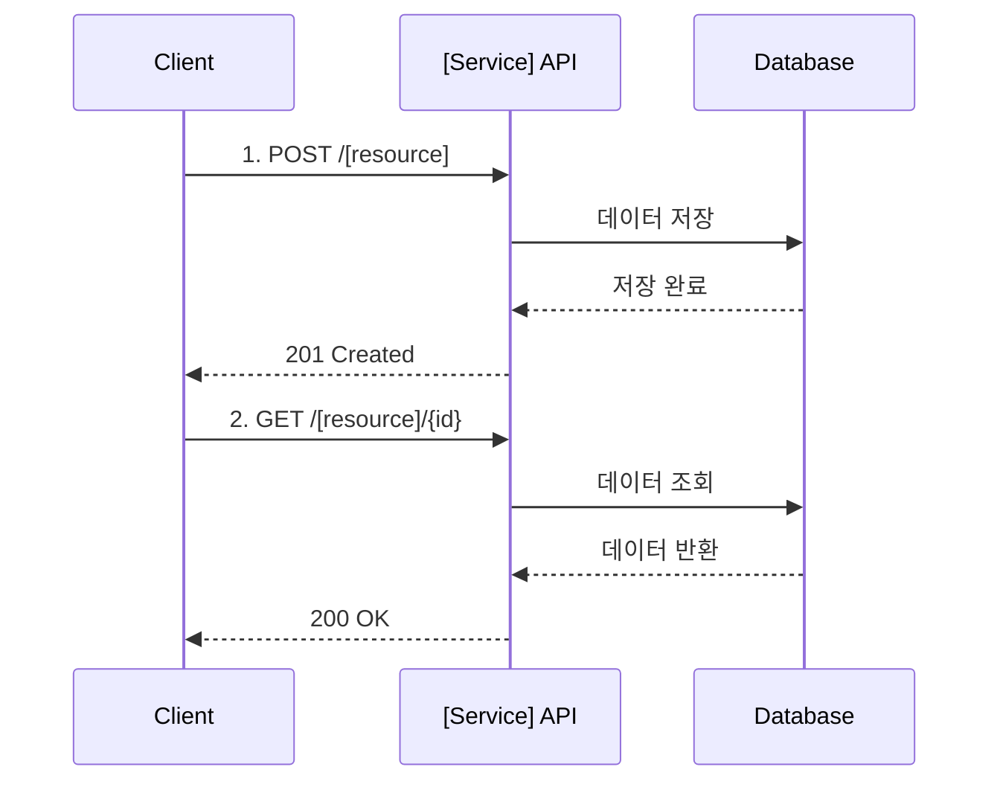

# [서비스명] API Reference

> [서비스 설명 한 줄]

**Base URL**: `/api/[service]`
**인증**: Bearer JWT
**응답 형식**: JSON

---

## 🔍 Quick Reference

### [도메인 1] (예: Product)
| Method | Endpoint | 설명 | 인증 |
|--------|----------|------|------|
| GET | /products | 상품 목록 조회 | PUBLIC |
| GET | /products/{id} | 상품 상세 조회 | PUBLIC |
| POST | /products | 상품 등록 | ADMIN |
| PUT | /products/{id} | 상품 수정 | ADMIN |
| DELETE | /products/{id} | 상품 삭제 | ADMIN |

### [도메인 2] (예: Cart)
| Method | Endpoint | 설명 | 인증 |
|--------|----------|------|------|
| GET | /cart | 장바구니 조회 | USER |
| POST | /cart/items | 아이템 추가 | USER |
| PUT | /cart/items/{id} | 수량 변경 | USER |
| DELETE | /cart/items/{id} | 아이템 삭제 | USER |
| POST | /cart/checkout | 체크아웃 | USER |

### [도메인 3] (예: Order)
| Method | Endpoint | 설명 | 인증 |
|--------|----------|------|------|
| POST | /orders | 주문 생성 | USER |
| GET | /orders | 주문 목록 조회 | USER |
| GET | /orders/{orderNumber} | 주문 상세 조회 | USER |
| POST | /orders/{orderNumber}/cancel | 주문 취소 | USER |

---

## 📌 자주 사용하는 API

### 목록 조회 (페이징)
```bash
curl -X GET "http://localhost:8080/api/[service]/[resource]?page=0&size=20" \
  -H "Authorization: Bearer $TOKEN"
```

### 생성
```bash
curl -X POST "http://localhost:8080/api/[service]/[resource]" \
  -H "Authorization: Bearer $TOKEN" \
  -H "Content-Type: application/json" \
  -d '{
    "field1": "value1",
    "field2": "value2"
  }'
```

### 수정
```bash
curl -X PUT "http://localhost:8080/api/[service]/[resource]/{id}" \
  -H "Authorization: Bearer $TOKEN" \
  -H "Content-Type: application/json" \
  -d '{
    "field1": "updated_value"
  }'
```

### 삭제
```bash
curl -X DELETE "http://localhost:8080/api/[service]/[resource]/{id}" \
  -H "Authorization: Bearer $TOKEN"
```

---

## 🔐 인증

모든 API는 JWT Bearer Token 인증이 필요합니다 (PUBLIC 제외).

```http
Authorization: Bearer {access_token}
```

### 토큰 획득
Auth Service의 `/auth/login` 엔드포인트를 통해 토큰 발급

### 권한 레벨
- `PUBLIC`: 인증 불필요
- `USER`: 일반 사용자
- `ADMIN`: 관리자

---

## 📊 공통 응답 형식

### 성공 (200, 201)
```json
{
  "success": true,
  "data": {
    // 실제 데이터
  },
  "timestamp": "2026-02-05T10:00:00Z"
}
```

### 페이징 응답
```json
{
  "success": true,
  "data": {
    "content": [ /* 데이터 배열 */ ],
    "page": {
      "number": 0,
      "size": 20,
      "totalElements": 100,
      "totalPages": 5
    }
  },
  "timestamp": "2026-02-05T10:00:00Z"
}
```

### 에러 (4xx, 5xx)
```json
{
  "success": false,
  "code": "E001",
  "message": "에러 메시지",
  "timestamp": "2026-02-05T10:00:00Z"
}
```

---

## ⚠️ 공통 에러 코드

| Code | HTTP Status | 설명 |
|------|-------------|------|
| `C001` | 401 | 인증 필요 (토큰 없음 또는 만료) |
| `C002` | 403 | 권한 없음 |
| `C003` | 404 | 리소스를 찾을 수 없음 |
| `C004` | 400 | 잘못된 요청 (Validation 실패) |
| `C005` | 409 | 충돌 (중복된 리소스) |
| `C006` | 500 | 서버 내부 오류 |

---

## 📚 Detailed API Documentation

<details>
<summary><b>📦 [도메인 1] API</b></summary>

### GET /[resource]
목록을 조회합니다.

**Query Parameters**:
| 파라미터 | 타입 | 필수 | 설명 | 기본값 |
|---------|------|------|------|--------|
| `page` | number | N | 페이지 번호 (0부터) | 0 |
| `size` | number | N | 페이지 크기 | 20 |
| `sort` | string | N | 정렬 (field,asc/desc) | createdAt,desc |
| `search` | string | N | 검색어 | - |

**Response (200)**:
```json
{
  "success": true,
  "data": {
    "content": [
      {
        "id": "uuid",
        "name": "이름",
        "status": "ACTIVE",
        "createdAt": "2026-02-05T10:00:00Z"
      }
    ],
    "page": {
      "number": 0,
      "size": 20,
      "totalElements": 100,
      "totalPages": 5
    }
  }
}
```

**Error (401)**:
```json
{
  "success": false,
  "code": "C001",
  "message": "인증이 필요합니다"
}
```

---

### GET /[resource]/{id}
상세 정보를 조회합니다.

**Path Parameters**:
| 파라미터 | 타입 | 필수 | 설명 |
|---------|------|------|------|
| `id` | UUID | Y | 리소스 ID |

**Response (200)**:
```json
{
  "success": true,
  "data": {
    "id": "uuid",
    "name": "이름",
    "description": "설명",
    "status": "ACTIVE",
    "createdAt": "2026-02-05T10:00:00Z",
    "updatedAt": "2026-02-05T11:00:00Z"
  }
}
```

**Error (404)**:
```json
{
  "success": false,
  "code": "C003",
  "message": "리소스를 찾을 수 없습니다"
}
```

---

### POST /[resource]
새 리소스를 생성합니다.

**Request Body**:
```json
{
  "name": "이름 (required, max 100)",
  "description": "설명 (optional, max 500)",
  "status": "ACTIVE | INACTIVE"
}
```

**Field 설명**:
| 필드 | 타입 | 필수 | 설명 | 제약조건 |
|------|------|------|------|----------|
| `name` | string | Y | 리소스 이름 | 1-100자, 중복 불가 |
| `description` | string | N | 설명 | 최대 500자 |
| `status` | string | N | 상태 | ACTIVE, INACTIVE (기본: ACTIVE) |

**Response (201)**:
```json
{
  "success": true,
  "data": {
    "id": "uuid",
    "name": "이름",
    "description": "설명",
    "status": "ACTIVE",
    "createdAt": "2026-02-05T10:00:00Z"
  }
}
```

**Error (400)** - Validation:
```json
{
  "success": false,
  "code": "C004",
  "message": "이름은 필수입니다",
  "field": "name"
}
```

**Error (409)** - Duplicate:
```json
{
  "success": false,
  "code": "C005",
  "message": "이미 존재하는 이름입니다"
}
```

---

### PUT /[resource]/{id}
리소스를 수정합니다.

**Path Parameters**:
| 파라미터 | 타입 | 필수 | 설명 |
|---------|------|------|------|
| `id` | UUID | Y | 리소스 ID |

**Request Body**:
```json
{
  "name": "수정된 이름",
  "description": "수정된 설명",
  "status": "INACTIVE"
}
```

**Response (200)**:
```json
{
  "success": true,
  "data": {
    "id": "uuid",
    "name": "수정된 이름",
    "description": "수정된 설명",
    "status": "INACTIVE",
    "updatedAt": "2026-02-05T12:00:00Z"
  }
}
```

---

### DELETE /[resource]/{id}
리소스를 삭제합니다.

**Path Parameters**:
| 파라미터 | 타입 | 필수 | 설명 |
|---------|------|------|------|
| `id` | UUID | Y | 리소스 ID |

**Response (204)**:
No Content

**Error (403)**:
```json
{
  "success": false,
  "code": "C002",
  "message": "삭제 권한이 없습니다"
}
```

</details>

<details>
<summary><b>🛒 [도메인 2] API</b></summary>

### GET /[resource2]
[도메인 2의 첫 번째 엔드포인트]

[동일한 형식으로 Request/Response 작성]

---

### POST /[resource2]
[도메인 2의 두 번째 엔드포인트]

[동일한 형식으로 작성]

</details>

<details>
<summary><b>📋 [도메인 3] API</b></summary>

### GET /[resource3]
[도메인 3의 첫 번째 엔드포인트]

[동일한 형식으로 작성]

---

### POST /[resource3]
[도메인 3의 두 번째 엔드포인트]

[동일한 형식으로 작성]

</details>

---

## 🔄 워크플로우

주요 비즈니스 플로우를 다이어그램으로 표시:



---

## 🧪 테스트

### Postman Collection
[Postman Collection 링크 또는 파일 경로]

### 테스트 계정
- **일반 사용자**: `test@example.com` / `password123`
- **관리자**: `admin@example.com` / `admin123`

### 로컬 환경 설정
```bash
# 환경 변수 설정
export API_BASE_URL=http://localhost:8080
export AUTH_TOKEN=[발급받은_토큰]

# 테스트 실행
curl -X GET "$API_BASE_URL/api/[service]/[resource]" \
  -H "Authorization: Bearer $AUTH_TOKEN"
```

---

## 📈 Rate Limiting

| 엔드포인트 유형 | 제한 | 기간 |
|---------------|------|------|
| 조회 (GET) | 1000 요청 | 1시간 |
| 생성/수정 (POST/PUT) | 100 요청 | 1시간 |
| 삭제 (DELETE) | 50 요청 | 1시간 |

**초과 시**: `429 Too Many Requests`

```json
{
  "success": false,
  "code": "C007",
  "message": "요청 한도를 초과했습니다. 1시간 후 다시 시도하세요.",
  "retryAfter": 3600
}
```

---

## 📖 관련 문서

- [서비스 아키텍처](../architecture/[service]/README.md)
- [인증 시스템](../architecture/system/auth-system-design.md)
- [배포 가이드](../guides/deployment/[service]-deploy.md)
- [Troubleshooting](../troubleshooting/README.md)

---

## 📝 변경 이력

| 버전 | 날짜 | 변경 내용 | 작성자 |
|------|------|-----------|--------|
| v1.0 | 2026-02-05 | 초기 버전 | [이름] |

---

**마지막 업데이트**: 2026-02-05
