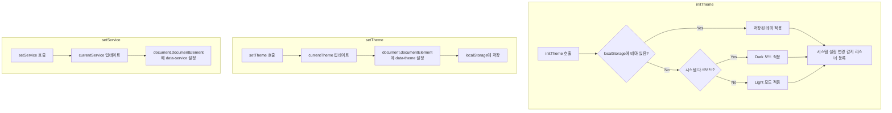

# Composables API

> useTheme, useToast - Vue 3 Composition API 유틸리티

---

## 📋 개요

Design System은 Vue 3 Composition API 기반의 재사용 가능한 Composables를 제공합니다.

| Composable | 용도 | 상태 관리 |
|------------|------|----------|
| useTheme | 테마 관리 (Light/Dark, 서비스별) | 전역 |
| useToast | 토스트 알림 관리 | 전역 |

---

## 1️⃣ useTheme

테마 상태 관리 Composable

### Import

```typescript
import { useTheme } from '@portal/design-system'
import type { ThemeMode, ServiceType } from '@portal/design-system'
```

### 반환 값

```typescript
interface UseThemeReturn {
  // 상태 (Reactive)
  currentTheme: Ref<ThemeMode>      // 'light' | 'dark'
  currentService: Ref<ServiceType>   // 'portal' | 'blog' | 'shopping'
  isDark: ComputedRef<boolean>       // 다크 모드 여부
  isLight: ComputedRef<boolean>      // 라이트 모드 여부

  // 메서드
  setTheme: (mode: ThemeMode) => void
  toggleTheme: () => void
  setService: (service: ServiceType) => void
  initTheme: () => void
}
```

### Types

```typescript
type ThemeMode = 'light' | 'dark'
type ServiceType = 'portal' | 'blog' | 'shopping'
```

### 메서드 상세

| Method | Parameters | Description |
|--------|------------|-------------|
| `setTheme` | `mode: ThemeMode` | 테마 모드 설정 |
| `toggleTheme` | - | Light ↔ Dark 토글 |
| `setService` | `service: ServiceType` | 서비스 테마 설정 |
| `initTheme` | - | 테마 초기화 (localStorage + 시스템 설정) |

### 기본 사용 예시

```vue
<script setup lang="ts">
import { useTheme } from '@portal/design-system'

const {
  currentTheme,
  currentService,
  isDark,
  setTheme,
  toggleTheme,
  setService
} = useTheme()
</script>

<template>
  <div>
    <p>현재 테마: {{ currentTheme }}</p>
    <p>현재 서비스: {{ currentService }}</p>
    <p>다크 모드: {{ isDark ? '예' : '아니오' }}</p>

    <!-- 테마 토글 버튼 -->
    <button @click="toggleTheme">
      {{ isDark ? '☀️ Light' : '🌙 Dark' }}
    </button>

    <!-- 명시적 테마 설정 -->
    <button @click="setTheme('light')">Light</button>
    <button @click="setTheme('dark')">Dark</button>

    <!-- 서비스 전환 -->
    <button @click="setService('blog')">Blog</button>
    <button @click="setService('shopping')">Shopping</button>
  </div>
</template>
```

### 루트 컴포넌트 초기화

```vue
<!-- App.vue -->
<script setup lang="ts">
import { onMounted } from 'vue'
import { useTheme } from '@portal/design-system'

const { initTheme } = useTheme()

onMounted(() => {
  // localStorage에서 저장된 테마 복원
  // 없으면 시스템 설정(prefers-color-scheme) 반영
  // 시스템 설정 변경 감지 리스너 등록
  initTheme()
})
</script>

<template>
  <router-view />
</template>
```

### 라우트 기반 서비스 전환

```vue
<!-- App.vue (Portal Shell) -->
<script setup lang="ts">
import { watch } from 'vue'
import { useRoute } from 'vue-router'
import { useTheme } from '@portal/design-system'

const route = useRoute()
const { setService, initTheme } = useTheme()

// 초기화
onMounted(() => initTheme())

// 라우트 변경 시 서비스 테마 자동 전환
watch(
  () => route.path,
  (newPath) => {
    if (newPath.startsWith('/blog')) {
      setService('blog')
    } else if (newPath.startsWith('/shopping')) {
      setService('shopping')
    } else {
      setService('portal')
    }
  },
  { immediate: true }
)
</script>
```

### 테마 토글 컴포넌트

```vue
<script setup lang="ts">
import { useTheme } from '@portal/design-system'
import { Button, Switch } from '@portal/design-system'

const { isDark, toggleTheme } = useTheme()
</script>

<template>
  <!-- 버튼 방식 -->
  <Button variant="ghost" @click="toggleTheme">
    <span v-if="isDark">☀️</span>
    <span v-else>🌙</span>
  </Button>

  <!-- 스위치 방식 -->
  <Switch
    :modelValue="isDark"
    @update:modelValue="toggleTheme"
    label="다크 모드"
  />
</template>
```

### 내부 동작



---

## 2️⃣ useToast

토스트 알림 관리 Composable

### Import

```typescript
import { useToast } from '@portal/design-system'
import type { ToastOptions, ToastInstance } from '@portal/design-system'
```

### 반환 값

```typescript
interface UseToastReturn {
  // 상태 (Reactive)
  toasts: Ref<ToastInstance[]>

  // 메서드
  add: (options: ToastOptions) => string    // 토스트 ID 반환
  remove: (id: string) => void
  clear: () => void
  success: (message: string, options?: Partial<ToastOptions>) => string
  error: (message: string, options?: Partial<ToastOptions>) => string
  warning: (message: string, options?: Partial<ToastOptions>) => string
  info: (message: string, options?: Partial<ToastOptions>) => string
}
```

### Types

```typescript
interface ToastOptions {
  type: 'success' | 'error' | 'warning' | 'info'
  message: string
  title?: string
  duration?: number       // ms, 기본값 3000, 0이면 자동 닫힘 없음
  closable?: boolean      // 기본값 true
  action?: {
    label: string
    onClick: () => void
  }
}

interface ToastInstance extends ToastOptions {
  id: string
  createdAt: number
}
```

### 메서드 상세

| Method | Parameters | Description |
|--------|------------|-------------|
| `add` | `ToastOptions` | 새 토스트 추가, ID 반환 |
| `remove` | `id: string` | 특정 토스트 제거 |
| `clear` | - | 모든 토스트 제거 |
| `success` | `message, options?` | 성공 토스트 단축 메서드 |
| `error` | `message, options?` | 오류 토스트 단축 메서드 |
| `warning` | `message, options?` | 경고 토스트 단축 메서드 |
| `info` | `message, options?` | 정보 토스트 단축 메서드 |

### 기본 사용 예시

```vue
<script setup lang="ts">
import { useToast } from '@portal/design-system'
import { Button } from '@portal/design-system'

const toast = useToast()

// 기본 add 메서드
const showBasicToast = () => {
  toast.add({
    type: 'success',
    message: '저장되었습니다!',
    duration: 3000
  })
}

// 단축 메서드
const showSuccess = () => toast.success('성공!')
const showError = () => toast.error('오류가 발생했습니다.')
const showWarning = () => toast.warning('주의하세요.')
const showInfo = () => toast.info('참고 정보입니다.')

// 제목이 있는 토스트
const showWithTitle = () => {
  toast.add({
    type: 'error',
    title: '저장 실패',
    message: '네트워크 오류로 저장에 실패했습니다.',
    duration: 5000
  })
}

// 액션이 있는 토스트
const showWithAction = () => {
  toast.add({
    type: 'warning',
    message: '변경사항이 저장되지 않았습니다.',
    duration: 0,  // 자동 닫힘 없음
    action: {
      label: '저장하기',
      onClick: () => {
        saveChanges()
        toast.clear()
      }
    }
  })
}

// 특정 토스트 제거
const showRemovable = () => {
  const id = toast.info('이 토스트는 3초 후 프로그래밍적으로 제거됩니다.', {
    duration: 0
  })

  setTimeout(() => {
    toast.remove(id)
  }, 3000)
}
</script>

<template>
  <div class="flex gap-2">
    <Button @click="showSuccess">성공</Button>
    <Button @click="showError">오류</Button>
    <Button @click="showWarning">경고</Button>
    <Button @click="showInfo">정보</Button>
    <Button @click="showWithTitle">제목 포함</Button>
    <Button @click="showWithAction">액션 포함</Button>
    <Button @click="toast.clear">모두 지우기</Button>
  </div>
</template>
```

### ToastProvider 설정

루트 컴포넌트에서 ToastProvider를 설정해야 합니다.

```vue
<!-- App.vue -->
<script setup lang="ts">
import { ToastProvider } from '@portal/design-system'
</script>

<template>
  <ToastProvider
    position="top-right"
    :max="5"
    :offset="16"
  >
    <router-view />
  </ToastProvider>
</template>
```

### ToastProvider Props

| Prop | Type | Default | Description |
|------|------|---------|-------------|
| `position` | `'top-left' \| 'top-right' \| 'top-center' \| 'bottom-left' \| 'bottom-right' \| 'bottom-center'` | `'top-right'` | 토스트 표시 위치 |
| `max` | `number` | `5` | 동시 표시 최대 개수 |
| `offset` | `number` | `16` | 화면 가장자리로부터의 간격 (px) |

### API 호출과 함께 사용

```vue
<script setup lang="ts">
import { ref } from 'vue'
import { useToast } from '@portal/design-system'
import { Button } from '@portal/design-system'

const toast = useToast()
const isLoading = ref(false)

const saveData = async () => {
  isLoading.value = true

  try {
    await api.saveData(formData)
    toast.success('데이터가 저장되었습니다.')
  } catch (error) {
    if (error.response?.status === 401) {
      toast.error('인증이 만료되었습니다. 다시 로그인해주세요.')
    } else if (error.response?.status === 403) {
      toast.warning('이 작업을 수행할 권한이 없습니다.')
    } else {
      toast.error('저장 중 오류가 발생했습니다.', {
        action: {
          label: '재시도',
          onClick: saveData
        }
      })
    }
  } finally {
    isLoading.value = false
  }
}
</script>

<template>
  <Button :loading="isLoading" @click="saveData">
    저장
  </Button>
</template>
```

### 폼 유효성 검사와 함께 사용

```vue
<script setup lang="ts">
import { useToast } from '@portal/design-system'

const toast = useToast()

const validateAndSubmit = () => {
  const errors: string[] = []

  if (!formData.name) errors.push('이름을 입력하세요')
  if (!formData.email) errors.push('이메일을 입력하세요')
  if (!formData.password) errors.push('비밀번호를 입력하세요')

  if (errors.length > 0) {
    errors.forEach(error => {
      toast.warning(error)
    })
    return
  }

  submitForm()
}
</script>
```

---

## 🔄 Composable 조합

여러 Composable을 함께 사용하는 패턴:

```vue
<script setup lang="ts">
import { useTheme, useToast } from '@portal/design-system'
import { Button } from '@portal/design-system'

const { toggleTheme, isDark } = useTheme()
const toast = useToast()

const handleThemeToggle = () => {
  toggleTheme()
  toast.info(isDark.value ? '다크 모드로 전환했습니다.' : '라이트 모드로 전환했습니다.')
}
</script>

<template>
  <Button @click="handleThemeToggle">
    {{ isDark ? '☀️ Light 모드로' : '🌙 Dark 모드로' }}
  </Button>
</template>
```

---

## 🔗 관련 문서

- [테마 가이드](../guides/theming-guide.md) - 테마 시스템 상세 가이드
- [테마 아키텍처](../architecture/theming.md) - 테마 시스템 아키텍처
- [피드백 컴포넌트](./components-feedback.md) - Toast 컴포넌트 상세

---

**최종 업데이트**: 2026-01-18
