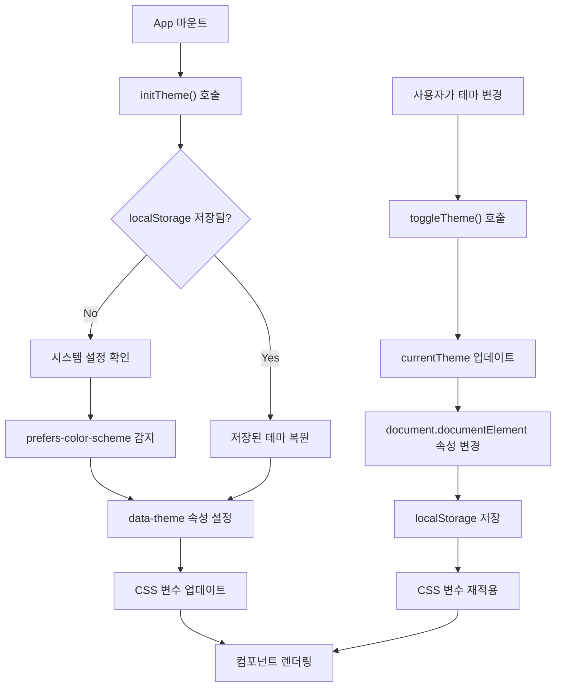

# Theming Guide

Design System의 테마 시스템을 이용한 서비스별 커스터마이징 및 다크 모드 관리 가이드입니다.

## 개요

Design System은 다음 테마 기능을 제공합니다:

- **서비스별 테마**: Blog (Green), Shopping (Orange) 등 브랜드 색상 분리
- **다크 모드 지원**: Light/Dark 테마 자동 전환
- **동적 테마 전환**: 런타임에 테마 변경 가능
- **localStorage 지속성**: 사용자 설정 저장 및 복원

## 서비스별 테마

### 기본 개념

동일한 컴포넌트와 토큰 이름을 사용하면서 `data-service` 속성으로 테마를 구분합니다:

```html
<!-- Blog 서비스 -->
<div data-service="blog">
  <button class="bg-brand-primary">버튼</button>
  <!-- brand-primary → Green (#12B886) -->
</div>

<!-- Shopping 서비스 -->
<div data-service="shopping">
  <button class="bg-brand-primary">버튼</button>
  <!-- brand-primary → Orange (#FD7E14) -->
</div>
```

### Blog 서비스 (Green Theme)

**주색상**: Green-600 (`#12B886`)

```json
{
  "brand": {
    "primary": "#12B886",
    "primaryHover": "#039D6E",
    "primaryLight": "#66BB6A",
    "secondary": "#4CAF50"
  }
}
```

**사용 범위:**
- 메인 액션 버튼 (발행, 저장)
- 성공 상태 표시
- 하이라이트 텍스트

### Shopping 서비스 (Orange Theme)

**주색상**: Orange-600 (`#FD7E14`)

```json
{
  "brand": {
    "primary": "#FD7E14",
    "primaryHover": "#F76707",
    "primaryLight": "#FFA726",
    "secondary": "#FF9800"
  }
}
```

**사용 범위:**
- 구매 버튼
- 가격 하이라이트
- 특가 배지

### Portal 서비스 (Blue Theme)

**주색상**: Blue-600 (`#1976D2`)

```json
{
  "brand": {
    "primary": "#1976D2",
    "primaryHover": "#1565C0",
    "primaryLight": "#42A5F5",
    "secondary": "#2196F3"
  }
}
```

## 다크 모드

### Light/Dark 모드 토큰

모든 Semantic 토큰은 Light/Dark 모드를 지원합니다:

```css
/* Light Mode (기본) */
:root {
  --color-text-body: #212121;
  --color-bg-page: #FFFFFF;
  --color-bg-card: #FFFFFF;
  --color-border-default: #BDBDBD;
}

/* Dark Mode */
[data-theme="dark"] {
  --color-text-body: #ECECEC;
  --color-bg-page: #0F0F0F;
  --color-bg-card: #1A1A1A;
  --color-border-default: #424242;
}
```

### 자동 감지 및 전환

사용자 시스템 설정에 따른 자동 다크 모드:

```typescript
import { useTheme } from '@portal/design-system'

const { currentTheme, setTheme, initTheme } = useTheme()

// 컴포넌트 마운트 시
onMounted(() => {
  initTheme() // localStorage 또는 시스템 설정에서 복원
})

// 시스템 다크 모드 변경 감지
const prefersDark = window.matchMedia('(prefers-color-scheme: dark)').matches
setTheme(prefersDark ? 'dark' : 'light')
```

### 다크 모드 토글 구현

```vue
<template>
  <button @click="toggleTheme" class="flex items-center gap-2">
    <span v-if="currentTheme === 'light'">
      🌙 다크 모드
    </span>
    <span v-else>
      ☀️ 라이트 모드
    </span>
  </button>
</template>

<script setup lang="ts">
import { useTheme } from '@portal/design-system'

const { currentTheme, toggleTheme } = useTheme()
</script>
```

## useTheme Composable

`useTheme` 훅을 통해 테마를 관리합니다.

### API 메서드

| 메서드 | 설명 | 예제 |
|--------|------|------|
| `setService(service)` | 서비스 컨텍스트 변경 | `setService('shopping')` |
| `setTheme(mode)` | Light/Dark 모드 설정 | `setTheme('dark')` |
| `toggleTheme()` | Light ↔ Dark 전환 | `toggleTheme()` |
| `initTheme()` | 테마 초기화 (저장된 설정 복원) | `initTheme()` |

### 반응형 상태

| 속성 | 타입 | 설명 |
|------|------|------|
| `currentService` | Ref<ServiceType> | 현재 서비스 |
| `currentTheme` | Ref<ThemeMode> | 현재 테마 모드 |

### 사용 예제

```vue
<script setup lang="ts">
import { useTheme } from '@portal/design-system'

const { currentService, currentTheme, setService, setTheme, toggleTheme, initTheme } = useTheme()

// 초기화
onMounted(() => {
  initTheme()
})

// 서비스 변경
const switchToShopping = () => {
  setService('shopping')
}

// 테마 변경
const switchToDarkMode = () => {
  setTheme('dark')
}

// 테마 토글
const handleThemeToggle = () => {
  toggleTheme()
}
</script>

<template>
  <div>
    <p>현재 서비스: {{ currentService }}</p>
    <p>현재 테마: {{ currentTheme }}</p>
    
    <select @change="(e) => setService(e.target.value as any)">
      <option value="portal">Portal</option>
      <option value="blog">Blog</option>
      <option value="shopping">Shopping</option>
    </select>

    <button @click="toggleTheme">
      테마 전환
    </button>
  </div>
</template>
```

## 글로벌 설정

### App.vue에서 테마 초기화

```vue
<template>
  <div :data-service="currentService" :data-theme="currentTheme">
    <RouterView />
  </div>
</template>

<script setup lang="ts">
import { useTheme } from '@portal/design-system'
import { onMounted } from 'vue'
import { RouterView } from 'vue-router'

const { currentService, currentTheme, initTheme } = useTheme()

onMounted(() => {
  initTheme()
})
</script>
```

### Tailwind CSS 다크 모드 설정

```javascript
// tailwind.config.js
export default {
  darkMode: 'class',
  theme: {
    extend: {
      colors: {
        'brand-primary': 'var(--color-brand-primary)',
        'text-body': 'var(--color-text-body)',
        'bg-card': 'var(--color-bg-card)'
      }
    }
  }
}
```

## 서비스별 테마 커스터마이징

### Blog 서비스 커스터마이징

```vue
<template>
  <!-- Blog 레이아웃 -->
  <div data-service="blog" :data-theme="currentTheme">
    <BlogHeader />
    <!-- 자동으로 Green 테마 적용 -->
    <Button class="bg-brand-primary">발행하기</Button>
  </div>
</template>

<script setup lang="ts">
import { useTheme } from '@portal/design-system'

const { currentTheme, setService } = useTheme()

onMounted(() => {
  setService('blog')
})
</script>
```

### Shopping 서비스 커스터마이징

```vue
<template>
  <!-- Shopping 레이아웃 -->
  <div data-service="shopping" :data-theme="currentTheme">
    <ShoppingHeader />
    <!-- 자동으로 Orange 테마 적용 -->
    <Button class="bg-brand-primary">구매하기</Button>
  </div>
</template>

<script setup lang="ts">
import { useTheme } from '@portal/design-system'

const { currentTheme, setService } = useTheme()

onMounted(() => {
  setService('shopping')
})
</script>
```

## 다크 모드 반응형 스타일

### CSS-in-JS

```vue
<script setup lang="ts">
import { computed } from 'vue'
import { useTheme } from '@portal/design-system'

const { currentTheme } = useTheme()

const cardStyle = computed(() => ({
  backgroundColor: currentTheme.value === 'dark' ? '#1A1A1A' : '#FFFFFF',
  borderColor: currentTheme.value === 'dark' ? '#424242' : '#BDBDBD'
}))
</script>

<template>
  <div :style="cardStyle">
    다크 모드 반응형 카드
  </div>
</template>
```

### Tailwind CSS Dark Mode

```vue
<template>
  <div class="bg-white dark:bg-slate-900 text-slate-900 dark:text-slate-50">
    <h2 class="text-2xl font-bold text-text-body">
      다크 모드 지원 제목
    </h2>
    <p class="text-text-body dark:text-slate-300">
      자동으로 다크 모드 적용됩니다.
    </p>
  </div>
</template>
```

## 서비스 간 테마 전환

여러 서비스를 동시에 표시할 때 테마 분리:

```vue
<template>
  <div class="grid grid-cols-2 gap-4">
    <!-- Blog 섹션 -->
    <div data-service="blog" :data-theme="currentTheme">
      <BlogModule />
      <!-- Green 테마 자동 적용 -->
    </div>

    <!-- Shopping 섹션 -->
    <div data-service="shopping" :data-theme="currentTheme">
      <ShoppingModule />
      <!-- Orange 테마 자동 적용 -->
    </div>
  </div>
</template>

<script setup lang="ts">
import { useTheme } from '@portal/design-system'

const { currentTheme } = useTheme()
</script>
```

## 테마 저장소 (localStorage)

### 자동 저장

사용자가 테마를 변경하면 자동으로 localStorage에 저장됩니다:

```typescript
// setTheme 호출 시 자동 저장
localStorage.setItem('portal-theme', 'dark')
localStorage.setItem('portal-service', 'shopping')
```

### 수동 로드

```typescript
const { setTheme, setService } = useTheme()

// 저장된 설정 로드
const savedTheme = localStorage.getItem('portal-theme')
const savedService = localStorage.getItem('portal-service')

if (savedTheme) setTheme(savedTheme as ThemeMode)
if (savedService) setService(savedService as ServiceType)
```

## 테마 시스템 플로우



## 테마 최적화

### CSS 변수 성능

```css
/* Good: 변수 사용 (성능 최적) */
.button {
  background-color: var(--color-brand-primary);
}

/* Avoid: 직접 색상 지정 (변경 불가능) */
.button {
  background-color: #12B886;
}
```

### 다크 모드 토글 애니메이션

```css
/* 전환 애니메이션 */
:root {
  transition: background-color 200ms ease-in-out, color 200ms ease-in-out;
}
```

## 브라우저 호환성

| 브라우저 | Light Mode | Dark Mode | CSS Variables |
|----------|-----------|-----------|----------------|
| Chrome | ✓ | ✓ | ✓ |
| Firefox | ✓ | ✓ | ✓ |
| Safari | ✓ | ✓ | ✓ |
| Edge | ✓ | ✓ | ✓ |
| IE 11 | ✗ | ✗ | ✗ |

## 타입 정의

```typescript
export type ServiceType = 'portal' | 'blog' | 'shopping'
export type ThemeMode = 'light' | 'dark'

export interface ThemeConfig {
  service: ServiceType
  mode: ThemeMode
}
```

## 문제 해결

### 테마가 적용되지 않음

1. `data-service` 속성 확인
2. `data-theme` 속성 확인
3. CSS 로드 여부 확인

```vue
<!-- 확인: HTML에 올바른 속성이 있는지 -->
<div data-service="shopping" data-theme="dark">
  <!-- 콘텐츠 -->
</div>
```

### 다크 모드에서 텍스트가 보이지 않음

```css
/* 다크 모드 텍스트 색상 설정 */
[data-theme="dark"] {
  --color-text-body: #ECECEC; /* 밝은 색상 */
}
```

## 다음 단계

- [USAGE.md](./USAGE.md) - 통합 가이드
- [TOKENS.md](./TOKENS.md) - 토큰 상세 정보