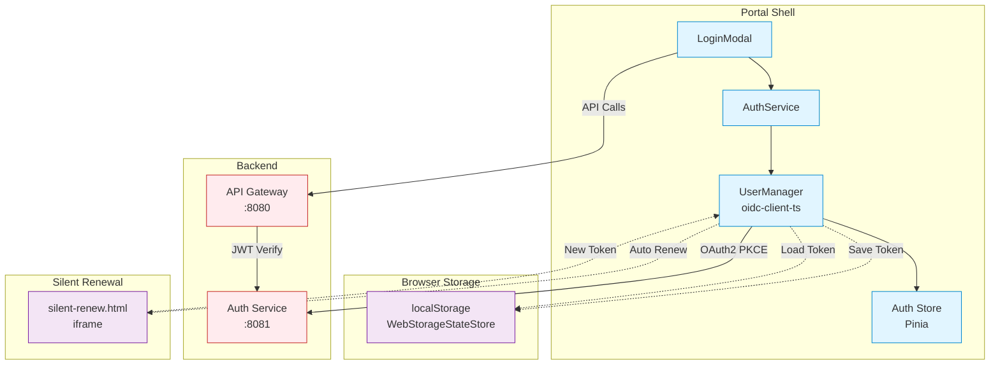
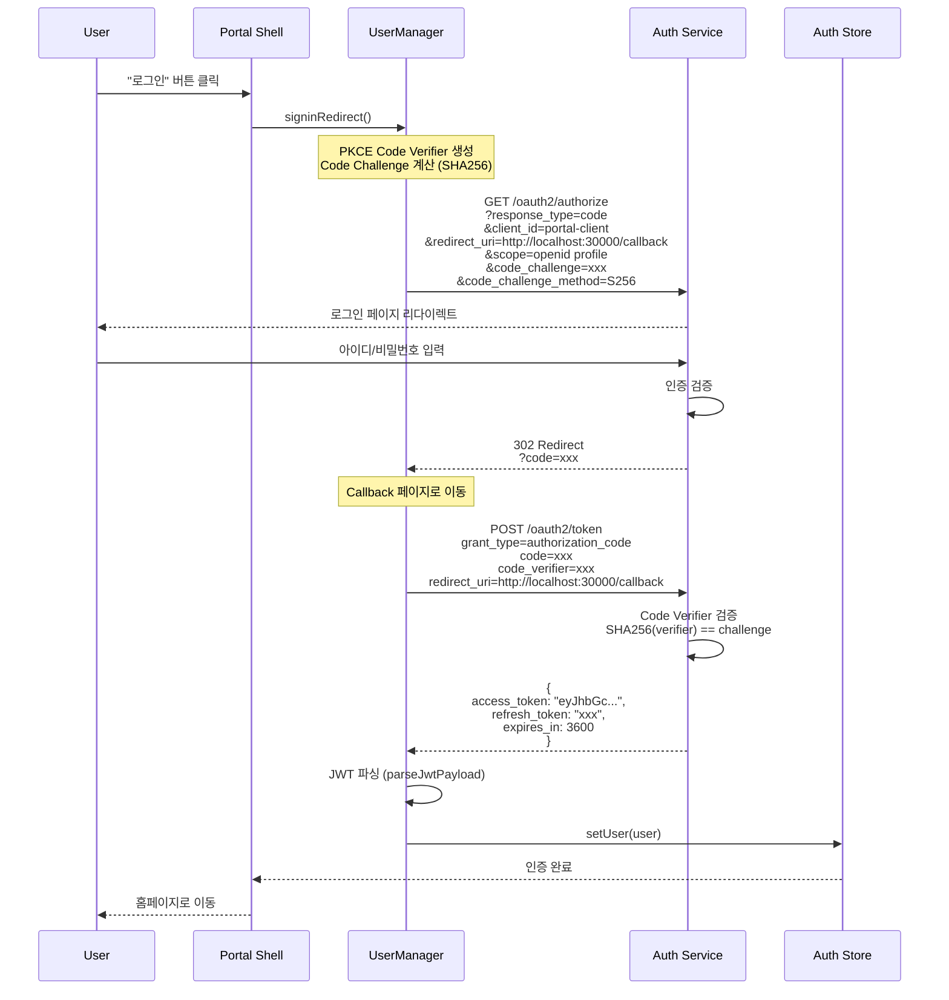
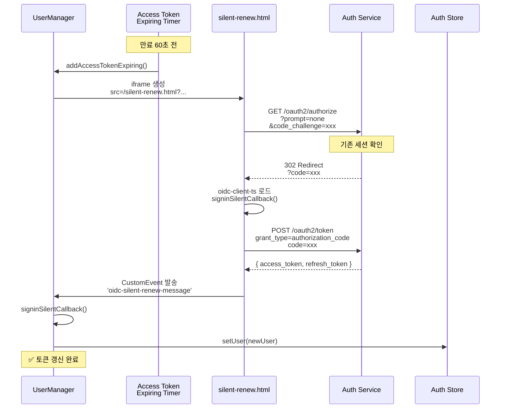
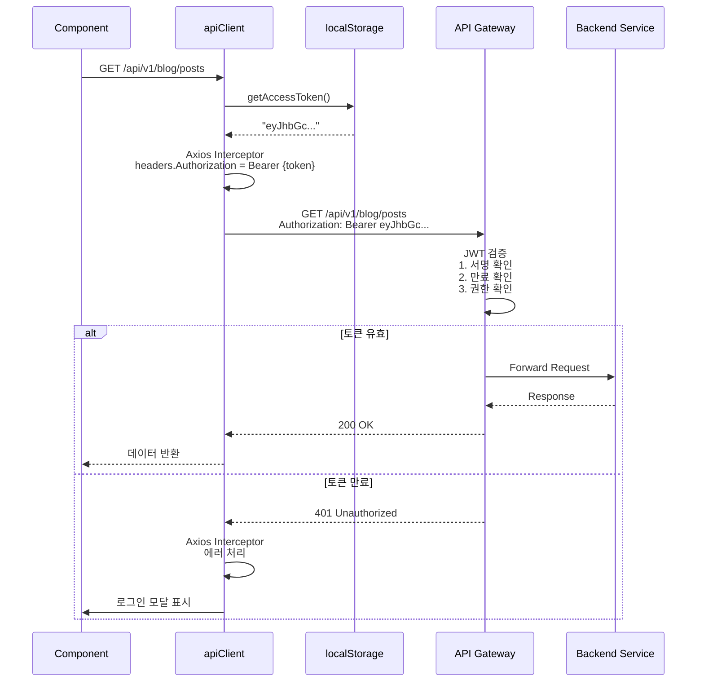
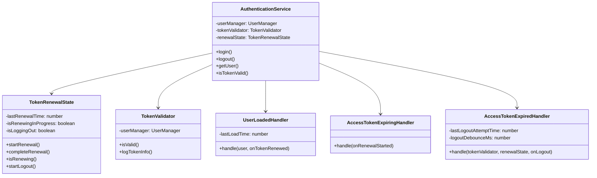

# Authentication Architecture

## 📋 개요

Portal Shell은 OAuth2 Authorization Code + PKCE Flow를 사용하여 사용자 인증을 처리합니다. Spring Authorization Server와 oidc-client-ts 라이브러리를 통해 표준 OIDC 프로토콜을 구현하며, Silent Renewal을 통해 사용자 경험을 최적화합니다.

---

## 🔐 인증 방식

### OAuth2 Authorization Code + PKCE

| 항목 | 내용 |
|------|------|
| **프로토콜** | OAuth 2.0 + OpenID Connect (OIDC) |
| **Flow** | Authorization Code + PKCE |
| **토큰 타입** | JWT (Access Token, Refresh Token) |
| **라이브러리** | oidc-client-ts |
| **Authorization Server** | Spring Authorization Server (Auth Service) |

---

## 🏗️ 인증 아키텍처



---

## 🔄 인증 흐름

### 1. 로그인 (Authorization Code + PKCE)



---

### 2. Silent Renewal (자동 토큰 갱신)



---

### 3. 토큰 검증 및 API 호출



---

## 🛠️ AuthService 구현

### 클래스 구조

Portal Shell의 `authService.ts`는 객체지향 설계 원칙(SOLID)을 따릅니다.



---

### 핵심 이벤트 핸들러

#### 1. UserLoaded

```typescript
userManager.events.addUserLoaded((user: User) => {
  console.log('✅ User loaded');

  // Pinia Store에 사용자 정보 저장
  const authStore = useAuthStore();
  authStore.setUser(user);

  // 토큰 갱신 상태 완료
  renewalState.completeRenewal();
});
```

#### 2. AccessTokenExpiring

```typescript
userManager.events.addAccessTokenExpiring(() => {
  console.log('⏰ Token expiring soon, auto-renewing...');

  // Silent Renewal 시작
  renewalState.startRenewal();
});
```

#### 3. AccessTokenExpired

```typescript
userManager.events.addAccessTokenExpired(async () => {
  console.log('❌ Access Token Expired');

  // 1. 토큰 유효성 재확인 (Silent Renewal 성공 여부)
  const isValid = await tokenValidator.isValid();
  if (isValid) {
    console.log('✅ Token was renewed, staying logged in');
    return;
  }

  // 2. Debounce: 3초 이내 중복 로그아웃 방지
  if (!renewalState.startLogout()) {
    return;
  }

  // 3. 로그아웃 처리
  await userManager.removeUser();
  authStore.logout();
});
```

#### 4. SilentRenewError

```typescript
userManager.events.addSilentRenewError((error) => {
  console.error('❌ Silent renew failed:', error.message);

  // 에러 분류 및 처리
  if (isNetworkError(error)) {
    console.log('📡 Network error - will retry');
  } else if (isAuthError(error)) {
    console.log('🚨 Authorization error - logging out');
    authStore.logout();
  }
});
```

---

## 🗄️ Auth Store (Pinia)

### State 구조

```typescript
export const useAuthStore = defineStore('auth', () => {
  // State
  const user = ref<PortalUser | null>(null);

  // Getters
  const isAuthenticated = computed(() => user.value !== null);
  const displayName = computed(() => {
    if (!user.value) return 'Guest';
    const p = user.value.profile;
    return p.nickname || p.username || p.name || p.email;
  });
  const isAdmin = computed(() => hasRole('ROLE_ADMIN'));

  // Actions
  function setUser(oidcUser: User) {
    const payload = parseJwtPayload(oidcUser.access_token);

    user.value = {
      profile: {
        sub: payload.sub,
        email: payload.sub,
        username: payload.preferred_username,
        name: payload.name,
        nickname: payload.nickname,
        // ...
      },
      authority: {
        roles: payload.roles || [],
        scopes: payload.scope?.split(' ') || [],
      },
      preferences: {
        theme: 'light',
        language: 'ko',
        notifications: true,
      },
      _accessToken: oidcUser.access_token,
      _refreshToken: oidcUser.refresh_token,
      _expiresAt: oidcUser.expires_at,
    };
  }

  function logout() {
    user.value = null;
  }

  function hasRole(role: string): boolean {
    return user.value?.authority.roles.includes(role) || false;
  }

  return {
    user,
    isAuthenticated,
    displayName,
    isAdmin,
    hasRole,
    setUser,
    logout,
  };
});
```

---

## 🔑 JWT 구조

### Access Token Payload

```json
{
  "sub": "user@example.com",
  "iss": "http://localhost:8081",
  "aud": ["portal-client"],
  "exp": 1737273600,
  "iat": 1737270000,
  "scope": "openid profile",
  "roles": ["ROLE_USER", "ROLE_ADMIN"],
  "preferred_username": "johndoe",
  "name": "John Doe",
  "nickname": "JD",
  "email_verified": true,
  "locale": "ko"
}
```

### JWT 파싱

```typescript
// src/utils/jwt.ts
export function parseJwtPayload(token: string): any | null {
  try {
    const base64Url = token.split('.')[1];
    const base64 = base64Url.replace(/-/g, '+').replace(/_/g, '/');
    const jsonPayload = decodeURIComponent(
      atob(base64)
        .split('')
        .map(c => '%' + ('00' + c.charCodeAt(0).toString(16)).slice(-2))
        .join('')
    );
    return JSON.parse(jsonPayload);
  } catch (err) {
    console.error('Failed to parse JWT:', err);
    return null;
  }
}
```

---

## ⚙️ OIDC 설정

### 환경변수 (.env)

```bash
# Auth Service
VITE_OIDC_AUTHORITY=http://localhost:8081
VITE_OIDC_CLIENT_ID=portal-client
VITE_OIDC_REDIRECT_URI=http://localhost:30000/callback
VITE_OIDC_POST_LOGOUT_REDIRECT_URI=http://localhost:30000
VITE_OIDC_RESPONSE_TYPE=code
VITE_OIDC_SCOPE=openid profile
VITE_OIDC_DISABLE_PKCE=false
```

### UserManager 설정

```typescript
const settings = {
  authority: 'http://localhost:8081',
  client_id: 'portal-client',
  redirect_uri: 'http://localhost:30000/callback',
  post_logout_redirect_uri: 'http://localhost:30000',
  response_type: 'code',
  scope: 'openid profile',

  // Storage
  userStore: new WebStorageStateStore({ store: window.localStorage }),

  // Silent Renewal
  automaticSilentRenew: true,
  silent_redirect_uri: window.location.origin + '/silent-renew.html',
  accessTokenExpiringNotificationTimeInSeconds: 60,

  // PKCE
  disablePKCE: false,
};

const userManager = new UserManager(settings);
```

---

## 🔒 보안 고려사항

### 1. PKCE (Proof Key for Code Exchange)

- Code Verifier: 무작위 문자열 (43-128자)
- Code Challenge: SHA256(Code Verifier)
- Authorization Code 탈취 공격 방지

### 2. Token 저장

- localStorage에 저장 (WebStorageStateStore)
- XSS 공격 주의: CSP(Content Security Policy) 적용 필요
- Refresh Token은 HttpOnly Cookie 권장 (미래 개선)

### 3. Silent Renewal 보안

- iframe의 `prompt=none` 파라미터로 자동 갱신
- 세션 쿠키가 있어야 성공
- 실패 시 자동 로그아웃

### 4. JWT 검증

- API Gateway에서 서명 검증
- 만료 시간 확인
- Audience(aud) 클레임 검증

---

## ⚠️ 주의사항

### 1. Silent Renewal 무한 루프 방지

**문제:** `AccessTokenExpired` 이벤트가 연속 발생하여 무한 로그아웃

**해결:**
- Debounce 메커니즘: 3초 내 중복 로그아웃 방지
- 토큰 갱신 상태 추적 (`TokenRenewalState`)
- 갱신 성공 여부 재확인 (`tokenValidator.isValid()`)

### 2. silent-renew.html 로드 실패

**문제:** iframe에서 oidc-client-ts 로드 실패

**해결:**
1. CDN URL 확인
2. Browser Cache 클리어
3. Network DevTools 확인

### 3. CORS 에러

**문제:** Auth Service와 Portal Shell의 Origin이 다름

**해결:**
- Auth Service에서 CORS 허용
```yaml
spring:
  cloud:
    gateway:
      globalcors:
        corsConfigurations:
          '[/**]':
            allowedOrigins: "http://localhost:30000"
            allowedMethods: "*"
```

---

## 📊 인증 흐름 타이밍

| 단계 | 예상 시간 | 비고 |
|------|-----------|------|
| 로그인 리다이렉트 | < 500ms | Auth Service로 이동 |
| 사용자 입력 | 가변 | 사용자 행동 |
| Token 발급 | < 300ms | Auth Service 처리 |
| Silent Renewal | < 500ms | iframe 로드 포함 |
| API 호출 (인증 포함) | < 200ms | JWT 검증 포함 |

---

## 🔗 관련 문서

- [System Overview](./system-overview.md)
- [Auth Service API 명세](../../../services/auth-service/docs/api/)
- [oidc-client-ts 공식 문서](https://github.com/authts/oidc-client-ts)
- [OAuth 2.0 PKCE RFC](https://datatracker.ietf.org/doc/html/rfc7636)

---

**최종 업데이트**: 2026-01-18
