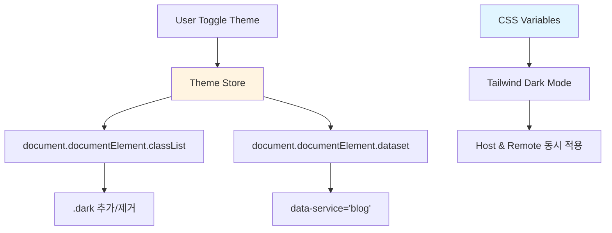

# Theme Synchronization

## 학습 목표
- Host-Remote 간 테마 동기화 메커니즘 이해
- CSS Variables와 data-* 속성 활용법 학습
- Service-specific 테마 전환 구현 방법 파악

## 개념 설명

### Theme Synchronization이란?
Host 앱의 테마 설정(다크모드, 서비스별 컬러)을 Remote 앱과 실시간으로 동기화하여 일관된 UI/UX를 제공하는 패턴입니다.



### 테마 계층

| 계층 | 역할 | 예시 |
|------|------|------|
| **Global Theme** | 다크/라이트 모드 | `.dark` class |
| **Service Theme** | 서비스별 브랜드 컬러 | `data-service="blog"` |
| **Component Theme** | 컴포넌트 스타일 | `bg-brand-primary` |

## Portal Universe 코드 분석

### 1. Theme Store

```typescript
// src/store/theme.ts
import { defineStore } from 'pinia';

export type ThemeMode = 'dark' | 'light' | 'system';

export const useThemeStore = defineStore('theme', {
  state: () => ({
    // ✅ Dark mode first (Linear style)
    isDark: true,
    mode: 'dark' as ThemeMode,
  }),

  actions: {
    /**
     * Toggle dark/light mode
     */
    toggle() {
      this.isDark = !this.isDark;
      this.mode = this.isDark ? 'dark' : 'light';
      this.applyTheme();
    },

    /**
     * Set specific mode
     */
    setMode(mode: ThemeMode) {
      this.mode = mode;
      if (mode === 'system') {
        this.isDark = window.matchMedia('(prefers-color-scheme: dark)').matches;
      } else {
        this.isDark = mode === 'dark';
      }
      this.applyTheme();
    },

    /**
     * Apply theme to DOM
     */
    applyTheme() {
      // ✅ 1. classList 조작
      if (this.isDark) {
        document.documentElement.classList.remove('light');
        document.documentElement.classList.add('dark');
      } else {
        document.documentElement.classList.remove('dark');
        document.documentElement.classList.add('light');
      }

      // ✅ 2. localStorage 영속화
      localStorage.setItem('theme', this.mode);
    },

    /**
     * Initialize theme from localStorage
     */
    initialize() {
      const saved = localStorage.getItem('theme') as ThemeMode | null;

      if (saved === 'system') {
        this.mode = 'system';
        this.isDark = window.matchMedia('(prefers-color-scheme: dark)').matches;
      } else if (saved === 'light') {
        this.mode = 'light';
        this.isDark = false;
      } else {
        // Default to dark mode (Linear style)
        this.mode = 'dark';
        this.isDark = true;
      }

      this.applyTheme();

      // ✅ 3. System theme change listener
      window.matchMedia('(prefers-color-scheme: dark)')
        .addEventListener('change', (e) => {
          if (this.mode === 'system') {
            this.isDark = e.matches;
            this.applyTheme();
          }
        });
    }
  }
});
```

**핵심 포인트:**
- **classList 조작**: `.dark` / `.light` 클래스로 Tailwind 다크모드 활성화
- **localStorage 영속화**: 테마 설정 유지
- **System theme listener**: OS 테마 변경 감지

### 2. App.vue - 테마 적용

```vue
<script setup lang="ts">
import { useThemeStore } from "./store/theme.ts";
import { onMounted, watch } from "vue";
import { useRoute } from "vue-router";

const themeStore = useThemeStore();
const route = useRoute();

/**
 * Update data-theme attribute
 */
function updateDataTheme() {
  const isDark = document.documentElement.classList.contains('dark');
  document.documentElement.setAttribute('data-theme', isDark ? 'dark' : 'light');
}

/**
 * Reset data-service to 'portal' when navigating to host routes
 */
function resetDataService() {
  if (!route.meta.remoteName) {
    document.documentElement.setAttribute('data-service', 'portal');
    forceReflowToApplyCSSChanges();
  }
}

/**
 * Force CSS reflow for immediate CSS variable update
 */
function forceReflowToApplyCSSChanges() {
  const html = document.documentElement;
  void html.offsetHeight;  // Trigger reflow
}

onMounted(() => {
  themeStore.initialize();
  resetDataService();
  updateDataTheme();
});

// ✅ Watch theme changes
watch(() => themeStore.isDark, (newVal) => {
  if (newVal) {
    document.documentElement.classList.add('dark');
  } else {
    document.documentElement.classList.remove('dark');
  }
  updateDataTheme();
  forceReflowToApplyCSSChanges();
});

// ✅ Watch route changes (for service theme)
watch(() => route.path, () => {
  resetDataService();
});
</script>

<template>
  <div class="min-h-screen bg-bg-page text-text-body transition-colors">
    <Sidebar />
    <main>
      <router-view />
    </main>
  </div>
</template>
```

### 3. RemoteWrapper - Service Theme

```vue
<script setup lang="ts">
import { watch } from 'vue'
import type { RemoteConfig } from '@/config/remoteRegistry'

const props = defineProps<{
  config: RemoteConfig
}>()

// ✅ Set data-service attribute for service-specific theme
watch(
  () => props.config.key,
  (key) => {
    document.documentElement.setAttribute('data-service', key)
    // Force reflow
    void document.documentElement.offsetHeight
  },
  { immediate: true }
)
</script>

<template>
  <Suspense>
    <template #default>
      <RemoteApp :initial-path="initialPath" />
    </template>
    <template #fallback>
      <div class="loading">Loading {{ config.displayName }}...</div>
    </template>
  </Suspense>
</template>
```

### 4. Design System - CSS Variables

```scss
// design-system-vue/src/styles/tokens.scss
:root {
  /* ============================================
   * Base Tokens (Primitive Colors)
   * ============================================ */
  --color-blue-500: #3B82F6;
  --color-blue-600: #2563EB;
  --color-green-500: #10B981;
  --color-green-600: #059669;
  --color-gray-50: #F9FAFB;
  --color-gray-900: #111827;

  /* ============================================
   * Semantic Tokens (Light Mode Default)
   * ============================================ */
  --brand-primary: var(--color-blue-600);
  --brand-secondary: var(--color-blue-500);

  --bg-page: var(--color-gray-50);
  --bg-card: #FFFFFF;

  --text-body: var(--color-gray-900);
  --text-meta: var(--color-gray-600);

  --border-default: var(--color-gray-200);
}

/* ============================================
 * Dark Mode
 * ============================================ */
.dark {
  --brand-primary: var(--color-blue-500);
  --brand-secondary: var(--color-blue-400);

  --bg-page: #0A0A0A;
  --bg-card: #1A1A1A;

  --text-body: #E5E7EB;
  --text-meta: #9CA3AF;

  --border-default: #2A2A2A;
}

/* ============================================
 * Service-Specific Themes
 * ============================================ */
[data-service="blog"] {
  --brand-primary: var(--color-blue-600);
  --brand-secondary: var(--color-blue-500);
}

[data-service="shopping"] {
  --brand-primary: var(--color-green-600);
  --brand-secondary: var(--color-green-500);
}

[data-service="portal"] {
  --brand-primary: var(--color-blue-600);
  --brand-secondary: var(--color-blue-500);
}
```

### 5. Tailwind Config

```javascript
// tailwind.config.js
module.exports = {
  darkMode: 'class',  // ✅ .dark 클래스로 다크모드 활성화
  theme: {
    extend: {
      colors: {
        // ✅ CSS Variables 매핑
        'brand-primary': 'var(--brand-primary)',
        'brand-secondary': 'var(--brand-secondary)',

        'bg-page': 'var(--bg-page)',
        'bg-card': 'var(--bg-card)',

        'text-body': 'var(--text-body)',
        'text-meta': 'var(--text-meta)',

        'border-default': 'var(--border-default)',
      },
      transitionDuration: {
        'normal': '200ms',
      }
    }
  }
}
```

## Remote에서 테마 사용하기

### 1. Vue Remote (Blog)

```vue
<script setup lang="ts">
import { useThemeStore } from 'portal/stores'
import { storeToRefs } from 'pinia'

const themeStore = useThemeStore()
const { isDark } = storeToRefs(themeStore)

function toggleTheme() {
  themeStore.toggle()
}
</script>

<template>
  <div class="blog-header bg-bg-card border-b border-border-default">
    <h1 class="text-brand-primary">Blog</h1>
    <button
      @click="toggleTheme"
      class="p-2 rounded hover:bg-bg-page transition-colors"
    >
      {{ isDark ? '🌙' : '☀️' }}
    </button>
  </div>
</template>

<style scoped>
/* ✅ Tailwind 유틸리티 클래스 사용 */
/* CSS Variables가 자동으로 적용됨 */
</style>
```

### 2. React Remote (Shopping)

```tsx
// hooks/useTheme.ts
import { useEffect, useState } from 'react'
import { themeAdapter, type ThemeState } from 'portal/stores'

export function useTheme() {
  const [state, setState] = useState<ThemeState>(() =>
    themeAdapter.getState()
  )

  useEffect(() => {
    const unsubscribe = themeAdapter.subscribe(setState)
    return () => unsubscribe()
  }, [])

  return {
    isDark: state.isDark,
    toggle: themeAdapter.toggle
  }
}
```

```tsx
// components/Header.tsx
import { useTheme } from '../hooks/useTheme'

export function Header() {
  const { isDark, toggle } = useTheme()

  return (
    <header className="bg-bg-card border-b border-border-default px-4 py-3">
      <h1 className="text-brand-primary text-2xl font-bold">Shopping</h1>
      <button
        onClick={toggle}
        className="p-2 rounded hover:bg-bg-page transition-colors"
      >
        {isDark ? '🌙' : '☀️'}
      </button>
    </header>
  )
}
```

## 실습 예제

### 예제 1: Theme Toggle Component (Vue)

```vue
<script setup lang="ts">
import { useThemeStore } from '@/store/theme'
import { computed } from 'vue'

const themeStore = useThemeStore()

const icon = computed(() => {
  switch (themeStore.mode) {
    case 'dark': return '🌙'
    case 'light': return '☀️'
    case 'system': return '💻'
  }
})

function cycleTheme() {
  const modes: ThemeMode[] = ['dark', 'light', 'system']
  const currentIndex = modes.indexOf(themeStore.mode)
  const nextMode = modes[(currentIndex + 1) % modes.length]
  themeStore.setMode(nextMode)
}
</script>

<template>
  <button
    @click="cycleTheme"
    class="p-2 rounded-lg bg-bg-card hover:bg-bg-page border border-border-default"
    :title="`Current: ${themeStore.mode}`"
  >
    <span class="text-2xl">{{ icon }}</span>
  </button>
</template>
```

### 예제 2: Service Badge (React)

```tsx
// components/ServiceBadge.tsx
import { useEffect, useState } from 'react'

export function ServiceBadge() {
  const [service, setService] = useState('portal')

  useEffect(() => {
    // ✅ data-service 속성 감지
    const observer = new MutationObserver(() => {
      const current = document.documentElement.dataset.service || 'portal'
      setService(current)
    })

    observer.observe(document.documentElement, {
      attributes: true,
      attributeFilter: ['data-service']
    })

    // 초기값
    setService(document.documentElement.dataset.service || 'portal')

    return () => observer.disconnect()
  }, [])

  const colors: Record<string, string> = {
    portal: 'bg-blue-500',
    blog: 'bg-blue-600',
    shopping: 'bg-green-600'
  }

  return (
    <span className={`px-2 py-1 rounded text-white text-xs ${colors[service]}`}>
      {service.toUpperCase()}
    </span>
  )
}
```

### 예제 3: Animated Theme Transition

```css
/* styles/transitions.css */

/* ✅ 부드러운 색상 전환 */
:root {
  --transition-duration: 200ms;
  --transition-easing: cubic-bezier(0.4, 0, 0.2, 1);
}

body,
.bg-bg-page,
.bg-bg-card,
.text-text-body {
  transition:
    background-color var(--transition-duration) var(--transition-easing),
    color var(--transition-duration) var(--transition-easing),
    border-color var(--transition-duration) var(--transition-easing);
}

/* ✅ Dark mode transition delay (모든 요소가 동시에 전환) */
.dark * {
  transition-delay: 0ms;
}
```

## 핵심 요약

### 테마 동기화 흐름
```
1. User Toggle → Theme Store
2. Store → classList.add('dark')
3. Tailwind → .dark:bg-gray-900
4. CSS Variables → --bg-page: #0A0A0A
5. Remote Apps → Auto Update
```

### 3-Layer Theme System

```
Layer 1: Global Theme (.dark/.light)
    ↓
Layer 2: Service Theme ([data-service="blog"])
    ↓
Layer 3: Component Styles (Tailwind classes)
```

### CSS Variables Hierarchy

| 우선순위 | Selector | 예시 |
|---------|---------|------|
| 1 (High) | `.dark[data-service="blog"]` | 서비스 다크모드 |
| 2 | `.dark` | 글로벌 다크모드 |
| 3 | `[data-service="blog"]` | 서비스 라이트모드 |
| 4 (Low) | `:root` | 기본값 |

### Best Practices

#### ✅ DO
```typescript
// Store로 테마 관리
const themeStore = useThemeStore()
themeStore.toggle()

// CSS Variables 사용
color: var(--brand-primary)

// Tailwind 유틸리티 클래스
className="bg-bg-card text-text-body"

// data-service 활용
[data-service="shopping"] {
  --brand-primary: #10B981;
}
```

#### ❌ DON'T
```typescript
// ❌ 직접 classList 조작 (Store 사용)
document.documentElement.classList.add('dark')

// ❌ Hard-coded colors
color: #3B82F6

// ❌ 중복 테마 로직
// Remote에서 독립적인 테마 관리 X

// ❌ Inline styles
style={{ color: isDark ? 'white' : 'black' }}
```

### 테마 동기화 체크리스트
- [ ] Theme Store로 중앙 관리
- [ ] CSS Variables (3-tier: Base, Semantic, Component)
- [ ] Tailwind Dark Mode (class strategy)
- [ ] data-service로 서비스별 브랜딩
- [ ] localStorage 영속화
- [ ] System theme preference 감지
- [ ] Smooth transition (200ms)

### 다크모드 전환 과정
```css
/* 1. Root Variables */
:root {
  --bg-page: #F9FAFB;
}

/* 2. Dark Override */
.dark {
  --bg-page: #0A0A0A;
}

/* 3. Tailwind Mapping */
/* tailwind.config.js */
colors: {
  'bg-page': 'var(--bg-page)'
}

/* 4. Usage */
<div class="bg-bg-page">
  <!-- Auto dark mode! -->
</div>
```

## 관련 문서
- [Shell Architecture](./shell-architecture.md)
- [Shared State](./shared-state.md)
- [Pinia State Management](../vue/pinia-state-management.md)
