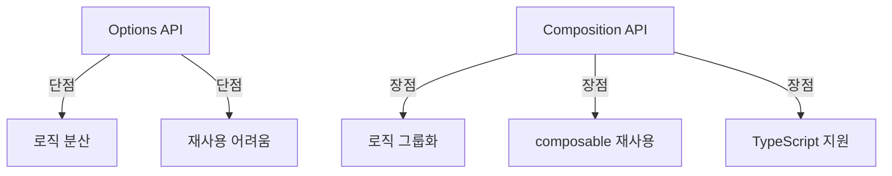

# Composition API Deep Dive

## 학습 목표
- Vue 3 Composition API의 핵심 개념 이해
- `setup`, `ref`, `reactive`의 동작 원리 파악
- Portal Shell 코드에서의 실제 활용 패턴 분석

## 개념 설명

### Composition API란?
Vue 3에서 도입된 새로운 API로, Options API의 한계를 극복하고 로직 재사용성을 향상시키는 방식입니다.



### setup() 함수
컴포넌트의 진입점이며, 반응형 상태와 메서드를 정의하는 공간입니다.

```typescript
// setup() signature
setup(props, context) {
  // props: 부모에게 전달받은 props (reactive)
  // context: { attrs, slots, emit, expose }

  // return된 값은 템플릿에서 사용 가능
  return {
    // 상태, computed, methods
  }
}
```

### ref vs reactive

| 특성 | ref | reactive |
|------|-----|----------|
| 사용처 | 원시값 (string, number, boolean) | 객체, 배열 |
| 접근 방식 | `.value` 필요 (script), 자동 언래핑 (template) | 직접 접근 |
| 재할당 | 가능 (`ref.value = newValue`) | 불가능 (새 객체 할당 시 반응성 소실) |
| TypeScript | 타입 추론 용이 | 타입 추론 제한적 |

## Portal Universe 코드 분석

### 1. App.vue - Script Setup 패턴

```vue
<script setup lang="ts">
import { useThemeStore } from "./store/theme.ts";
import { useSettingsStore } from "./store/settings.ts";
import { onMounted, onBeforeUnmount, watch, ref, computed } from "vue";
import { useRoute } from "vue-router";

const themeStore = useThemeStore();
const settingsStore = useSettingsStore();
const route = useRoute();

// ✅ ref: 원시값 반응형 상태
const showQuickActions = ref(false);
const sidebarCollapsed = ref(localStorage.getItem('sidebar-collapsed') === 'true');

// ✅ computed: 파생 상태
const mainClass = computed(() => ({
  'lg:ml-64': !sidebarCollapsed.value,
  'lg:ml-16': sidebarCollapsed.value,
  'pt-14 lg:pt-0': true,
}));

// ✅ 함수 정의
function updateDataTheme() {
  const isDark = document.documentElement.classList.contains('dark');
  document.documentElement.setAttribute('data-theme', isDark ? 'dark' : 'light');
}

// ✅ Lifecycle Hooks
onMounted(() => {
  themeStore.initialize();
  settingsStore.initialize();
  updateDataTheme();
});

onBeforeUnmount(() => {
  // cleanup
});

// ✅ Watchers
watch(() => route.path, () => {
  resetDataService();
});

watch(() => themeStore.isDark, (newVal) => {
  if (newVal) {
    document.documentElement.classList.add('dark');
  } else {
    document.documentElement.classList.remove('dark');
  }
  updateDataTheme();
});
</script>
```

**핵심 포인트:**
- `<script setup>`: 간결한 문법으로 보일러플레이트 감소
- `ref()`: 원시값 상태 관리 (boolean)
- `computed()`: 반응형 계산 속성
- Lifecycle Hooks: Options API의 생명주기 메서드 대체
- `watch()`: 상태 변경 감지 및 부수 효과 실행

### 2. useHealthCheck Composable - 로직 재사용

```typescript
// src/composables/useHealthCheck.ts
export function useHealthCheck(options: UseHealthCheckOptions = {}) {
  const { autoStart = true, pollInterval = 10000 } = options;

  const store = useServiceStatusStore();
  const intervalId = ref<number | null>(null);
  const isLoading = ref(false);

  // ✅ computed from store
  const services = computed(() => store.allServices);
  const healthyServices = computed(() => store.healthyServices);
  const overallStatus = computed(() => store.overallStatus);

  // ✅ Actions
  async function refresh() {
    isLoading.value = true;
    try {
      await store.checkAllServices();
    } finally {
      isLoading.value = false;
    }
  }

  function startPolling() {
    if (intervalId.value !== null) return;
    store.startPolling();
    refresh();

    intervalId.value = window.setInterval(() => {
      if (store.isPolling) {
        refresh();
      }
    }, pollInterval);
  }

  // ✅ Lifecycle
  onMounted(() => {
    if (autoStart) {
      startPolling();
    }
  });

  onUnmounted(() => {
    stopPolling();
  });

  return {
    services,
    healthyServices,
    overallStatus,
    isLoading,
    refresh,
    startPolling,
    stopPolling,
  };
}
```

**핵심 포인트:**
- Composable은 `use` 접두사로 시작
- 상태, computed, 메서드를 모두 반환
- Lifecycle Hooks 내장 (onMounted, onUnmounted)
- 옵션 기반 초기화 (autoStart, pollInterval)

## 실습 예제

### 예제 1: Counter Composable

```typescript
// composables/useCounter.ts
import { ref, computed } from 'vue'

export function useCounter(initialValue = 0) {
  const count = ref(initialValue)
  const doubleCount = computed(() => count.value * 2)

  function increment() {
    count.value++
  }

  function decrement() {
    count.value--
  }

  function reset() {
    count.value = initialValue
  }

  return {
    count,
    doubleCount,
    increment,
    decrement,
    reset
  }
}
```

**사용:**
```vue
<script setup lang="ts">
import { useCounter } from '@/composables/useCounter'

const { count, doubleCount, increment, decrement, reset } = useCounter(10)
</script>

<template>
  <div>
    <p>Count: {{ count }}</p>
    <p>Double: {{ doubleCount }}</p>
    <button @click="increment">+</button>
    <button @click="decrement">-</button>
    <button @click="reset">Reset</button>
  </div>
</template>
```

### 예제 2: ref vs reactive

```typescript
import { ref, reactive } from 'vue'

// ✅ ref - 원시값
const count = ref(0)
const message = ref('Hello')

console.log(count.value) // 0
count.value++ // OK

// ✅ reactive - 객체
const state = reactive({
  count: 0,
  message: 'Hello'
})

console.log(state.count) // 0 (직접 접근)
state.count++ // OK

// ❌ 재할당 시 반응성 소실
state = reactive({ count: 10 }) // 반응성 X

// ✅ ref로 객체 래핑 시 재할당 가능
const stateRef = ref({ count: 0 })
stateRef.value = { count: 10 } // OK
```

## 핵심 요약

### Composition API 장점
1. **로직 그룹화**: 관련 코드를 한 곳에 모음
2. **재사용성**: Composable 패턴으로 로직 공유
3. **TypeScript 지원**: 타입 추론 강화
4. **유연성**: Options API보다 자유로운 구조

### Portal Shell 패턴
- `<script setup>` 전면 채택
- Composable 함수로 로직 분리 (useHealthCheck)
- Store와 Composable 조합 (Pinia + Composition API)
- ref 위주 사용 (TypeScript 타입 안전성)

### Best Practices
1. **원시값은 ref, 객체는 reactive 또는 ref**
2. **Composable은 `use` 접두사**
3. **setup에서 return하거나 `<script setup>` 사용**
4. **watch 대신 computed 우선 고려**
5. **Lifecycle Hooks는 setup 내부에서만 호출**

## 관련 문서
- [Pinia State Management](./pinia-state-management.md)
- [Composables Pattern](./composables-pattern.md)
- [Reactivity Deep Dive](./reactivity-deep-dive.md)
- [Vue Router Advanced](./vue-router-advanced.md)
