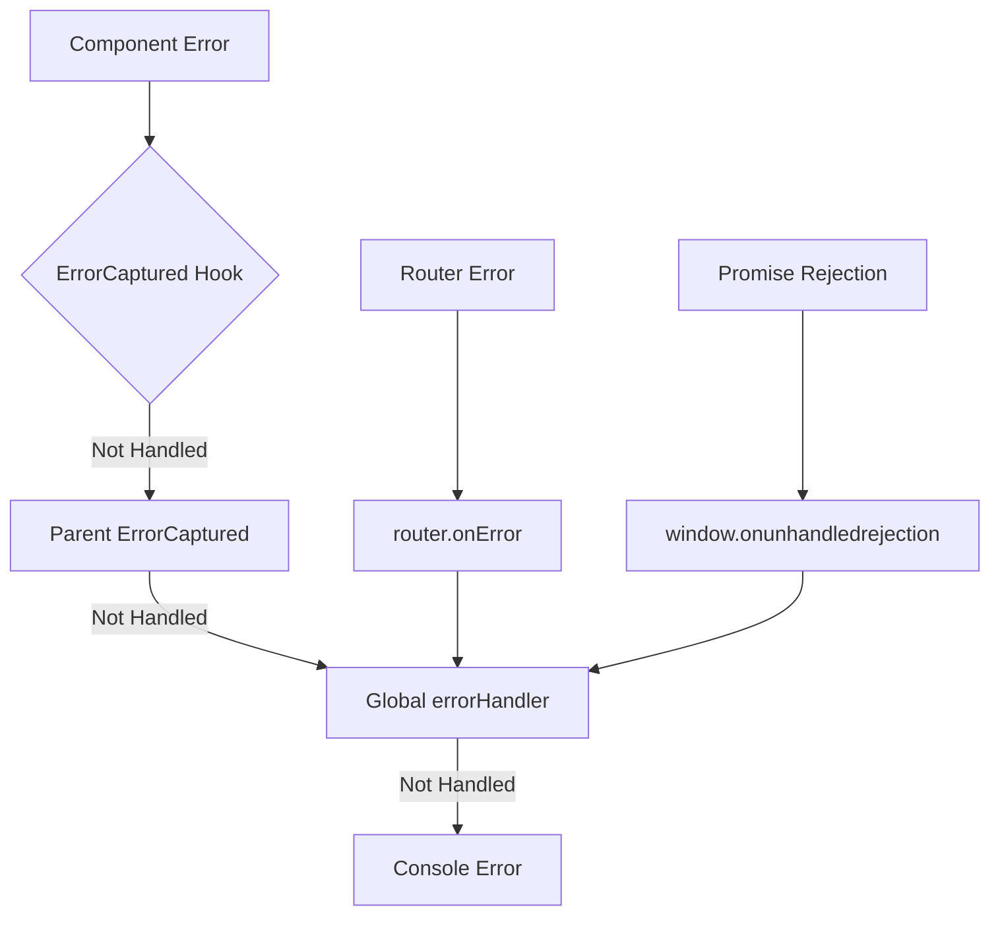

# Error Handling in Vue

## 학습 목표
- Vue 3의 에러 처리 메커니즘 이해
- ErrorCaptured Hook과 ErrorBoundary 패턴 학습
- Portal Shell의 전역 에러 처리 전략 분석

## 개념 설명

### Vue의 에러 처리 계층



### 에러 처리 우선순위
1. **Component Level**: `onErrorCaptured()` Hook
2. **Global Level**: `app.config.errorHandler`
3. **Router Level**: `router.onError()`
4. **Window Level**: `window.onerror`, `window.onunhandledrejection`

## Portal Universe 코드 분석

### 1. Global Error Handler

```typescript
// src/main.ts
import { type ComponentPublicInstance, createApp } from 'vue'
import { createPinia } from 'pinia';
import router from './router'
import AppVue from './App.vue';

const app = createApp(AppVue);
const pinia = createPinia();

// ✅ Global error handler (protect portal-shell)
app.config.errorHandler = (
  err: unknown,
  instance: ComponentPublicInstance | null,
  info: string
) => {
  console.error('❌ Global error caught:', err);
  console.error('   Error info:', info);

  if (instance) {
    console.error('   Component:', instance.$options.name);
    console.error('   Props:', instance.$props);
  }

  // ✅ 에러를 상위로 전파하지 않음 (Portal Shell 보호)
  // Remote 앱에서 에러가 발생해도 Shell은 계속 동작
};

// ✅ Promise rejection handler
window.addEventListener('unhandledrejection', (event) => {
  console.error('❌ Unhandled promise rejection:', event.reason);
  event.preventDefault();  // 기본 에러 표시 방지
});

app.use(router);
app.use(pinia);
app.mount('#app');
```

**핵심 포인트:**
- **Global errorHandler**: 모든 컴포넌트 에러 캐치
- **Component 정보**: 에러 발생 위치 추적
- **Promise rejection**: 비동기 에러 처리
- **Portal Shell 보호**: Remote 앱 에러가 Shell 크래시 방지

### 2. Router Error Handler

```typescript
// src/router/index.ts
import { createRouter, createWebHistory } from 'vue-router';

const router = createRouter({
  history: createWebHistory(),
  routes,
});

// ✅ Router Error Handler
router.onError((error) => {
  console.error('❌ Router error:', error);

  // ✅ Module Federation 로드 실패 처리
  if (error.message.includes('Failed to fetch dynamically imported module')) {
    console.error('   Remote module load failed');
    // 사용자에게 알림 또는 fallback 페이지 표시
  }

  // Portal Shell은 계속 동작
});

export default router;
```

**핵심 포인트:**
- **Module Federation 에러**: Remote 앱 로드 실패 감지
- **Graceful Degradation**: Shell은 정상 작동 유지
- **사용자 경험**: 에러 메시지 표시 또는 대체 UI

## Component Level Error Handling

### onErrorCaptured Hook

```vue
<script setup lang="ts">
import { onErrorCaptured, ref } from 'vue'

const error = ref<Error | null>(null)

// ✅ 자식 컴포넌트의 에러 캐치
onErrorCaptured((err, instance, info) => {
  console.error('ErrorCaptured:', err)
  console.error('Component:', instance?.$options.name)
  console.error('Info:', info)

  error.value = err as Error

  // ✅ false 반환: 에러 전파 중단
  // ✅ true 반환 또는 생략: 상위로 전파
  return false
})
</script>

<template>
  <div>
    <div v-if="error" class="error-boundary">
      <h2>⚠️ Something went wrong</h2>
      <p>{{ error.message }}</p>
      <button @click="error = null">Retry</button>
    </div>
    <slot v-else />
  </div>
</template>
```

## ErrorBoundary 패턴

### Reusable ErrorBoundary Component

```vue
<script setup lang="ts">
import { ref, onErrorCaptured } from 'vue'

const props = withDefaults(
  defineProps<{
    fallback?: boolean
    onError?: (error: Error, info: string) => void
  }>(),
  {
    fallback: true
  }
)

const error = ref<Error | null>(null)
const errorInfo = ref<string>('')

onErrorCaptured((err, instance, info) => {
  error.value = err as Error
  errorInfo.value = info

  // 커스텀 에러 핸들러 호출
  if (props.onError) {
    props.onError(err as Error, info)
  }

  // 에러 전파 중단
  return false
})

function reset() {
  error.value = null
  errorInfo.value = ''
}
</script>

<template>
  <div class="error-boundary">
    <!-- ✅ 에러 발생 시 Fallback UI -->
    <div v-if="error && fallback" class="error-display">
      <div class="error-icon">⚠️</div>
      <h2 class="error-title">Something went wrong</h2>
      <p class="error-message">{{ error.message }}</p>
      <details class="error-details">
        <summary>Error Details</summary>
        <pre>{{ error.stack }}</pre>
        <pre>Info: {{ errorInfo }}</pre>
      </details>
      <button @click="reset" class="error-retry">
        Try Again
      </button>
    </div>

    <!-- ✅ 에러 없을 때 자식 컴포넌트 렌더링 -->
    <slot v-else />
  </div>
</template>

<style scoped>
.error-boundary {
  width: 100%;
  height: 100%;
}

.error-display {
  padding: 2rem;
  text-align: center;
  background: #fef2f2;
  border: 1px solid #fecaca;
  border-radius: 8px;
}

.error-icon {
  font-size: 3rem;
  margin-bottom: 1rem;
}

.error-title {
  font-size: 1.5rem;
  font-weight: bold;
  color: #991b1b;
  margin-bottom: 0.5rem;
}

.error-message {
  color: #dc2626;
  margin-bottom: 1rem;
}

.error-details {
  text-align: left;
  margin: 1rem 0;
  padding: 1rem;
  background: white;
  border-radius: 4px;
}

.error-details pre {
  overflow-x: auto;
  font-size: 0.875rem;
  color: #4b5563;
}

.error-retry {
  padding: 0.5rem 1rem;
  background: #3b82f6;
  color: white;
  border: none;
  border-radius: 4px;
  cursor: pointer;
  font-weight: 500;
}

.error-retry:hover {
  background: #2563eb;
}
</style>
```

### 사용 예제

```vue
<template>
  <ErrorBoundary
    :on-error="handleError"
    :fallback="true"
  >
    <RemoteApp />
  </ErrorBoundary>
</template>

<script setup lang="ts">
function handleError(error: Error, info: string) {
  console.error('Remote app error:', error)
  // 에러 로깅 서비스에 전송
  // logErrorToService(error, info)
}
</script>
```

## 실습 예제

### 예제 1: Try-Catch in Async Function

```vue
<script setup lang="ts">
import { ref } from 'vue'

const data = ref(null)
const loading = ref(false)
const error = ref<Error | null>(null)

async function fetchData() {
  loading.value = true
  error.value = null

  try {
    const response = await fetch('/api/data')

    if (!response.ok) {
      throw new Error(`HTTP error! status: ${response.status}`)
    }

    data.value = await response.json()
  } catch (e) {
    error.value = e as Error
    console.error('Fetch error:', e)
  } finally {
    loading.value = false
  }
}
</script>

<template>
  <div>
    <button @click="fetchData">Fetch Data</button>

    <div v-if="loading">Loading...</div>
    <div v-else-if="error" class="error">
      Error: {{ error.message }}
    </div>
    <div v-else-if="data">
      <pre>{{ data }}</pre>
    </div>
  </div>
</template>
```

### 예제 2: Component Error Boundary

```vue
<!-- RemoteWrapper.vue -->
<script setup lang="ts">
import { ref, onErrorCaptured, defineAsyncComponent } from 'vue'

const props = defineProps<{
  remoteUrl: string
}>()

const error = ref<Error | null>(null)
const retryCount = ref(0)

const RemoteApp = defineAsyncComponent({
  loader: () => import(/* @vite-ignore */ props.remoteUrl),
  onError(err, retry, fail, attempts) {
    console.error('Remote load error:', err)

    if (attempts <= 3) {
      console.log(`Retry attempt ${attempts}`)
      retry()
    } else {
      fail()
      error.value = err as Error
    }
  }
})

onErrorCaptured((err, instance, info) => {
  console.error('Remote runtime error:', err)
  error.value = err as Error
  return false  // 상위로 전파 방지
})

function retry() {
  error.value = null
  retryCount.value++
}
</script>

<template>
  <div class="remote-wrapper">
    <div v-if="error" class="error-state">
      <h3>Failed to load remote application</h3>
      <p>{{ error.message }}</p>
      <button @click="retry">Retry ({{ retryCount }})</button>
    </div>

    <Suspense v-else>
      <template #default>
        <RemoteApp :key="retryCount" />
      </template>
      <template #fallback>
        <div class="loading">Loading remote app...</div>
      </template>
    </Suspense>
  </div>
</template>
```

### 예제 3: Axios Interceptor Error Handling

```typescript
// src/api/apiClient.ts
apiClient.interceptors.response.use(
  (response) => response,
  async (error: AxiosError) => {
    const originalRequest = error.config as InternalAxiosRequestConfig & { _retry?: boolean };

    // ✅ 401 Unauthorized
    if (error.response?.status === 401 && !originalRequest._retry) {
      originalRequest._retry = true;

      try {
        const newToken = await authService.refresh();
        originalRequest.headers.Authorization = `Bearer ${newToken}`;
        return apiClient.request(originalRequest);
      } catch (refreshError) {
        authService.clearTokens();
        window.location.href = '/?login=required';
        return Promise.reject(refreshError);
      }
    }

    // ✅ Backend 에러 메시지 파싱
    const backendError = (error.response?.data as ApiErrorResponse)?.error;
    if (backendError) {
      error.message = backendError.message;
      (error as any).code = backendError.code;
    }

    console.error('[API Client] Response error:', {
      status: error.response?.status,
      code: backendError?.code,
      message: backendError?.message || error.message,
    });

    return Promise.reject(error);
  }
);
```

### 예제 4: Form Validation Errors

```vue
<script setup lang="ts">
import { ref, reactive } from 'vue'

interface FormData {
  email: string
  password: string
}

interface FormErrors {
  email?: string
  password?: string
  general?: string
}

const formData = reactive<FormData>({
  email: '',
  password: ''
})

const errors = reactive<FormErrors>({})
const loading = ref(false)

function validateEmail(email: string): boolean {
  const re = /^[^\s@]+@[^\s@]+\.[^\s@]+$/
  return re.test(email)
}

function validate(): boolean {
  // 에러 초기화
  Object.keys(errors).forEach(key => delete errors[key as keyof FormErrors])

  let isValid = true

  if (!formData.email) {
    errors.email = 'Email is required'
    isValid = false
  } else if (!validateEmail(formData.email)) {
    errors.email = 'Invalid email format'
    isValid = false
  }

  if (!formData.password) {
    errors.password = 'Password is required'
    isValid = false
  } else if (formData.password.length < 8) {
    errors.password = 'Password must be at least 8 characters'
    isValid = false
  }

  return isValid
}

async function handleSubmit() {
  if (!validate()) {
    return
  }

  loading.value = true
  errors.general = undefined

  try {
    const response = await fetch('/api/login', {
      method: 'POST',
      headers: { 'Content-Type': 'application/json' },
      body: JSON.stringify(formData)
    })

    if (!response.ok) {
      const data = await response.json()
      throw new Error(data.message || 'Login failed')
    }

    // 성공 처리
    console.log('Login successful')
  } catch (error) {
    errors.general = (error as Error).message
  } finally {
    loading.value = false
  }
}
</script>

<template>
  <form @submit.prevent="handleSubmit">
    <div v-if="errors.general" class="error-banner">
      {{ errors.general }}
    </div>

    <div>
      <label>Email</label>
      <input
        v-model="formData.email"
        type="email"
        :class="{ error: errors.email }"
      />
      <span v-if="errors.email" class="error-text">
        {{ errors.email }}
      </span>
    </div>

    <div>
      <label>Password</label>
      <input
        v-model="formData.password"
        type="password"
        :class="{ error: errors.password }"
      />
      <span v-if="errors.password" class="error-text">
        {{ errors.password }}
      </span>
    </div>

    <button type="submit" :disabled="loading">
      {{ loading ? 'Loading...' : 'Login' }}
    </button>
  </form>
</template>
```

## 핵심 요약

### Vue 에러 처리 계층
```
Component Level (onErrorCaptured)
    ↓
Parent Component (onErrorCaptured)
    ↓
Global (app.config.errorHandler)
    ↓
Router (router.onError)
    ↓
Window (window.onerror, onunhandledrejection)
```

### Portal Shell 에러 전략
1. **Global errorHandler**: 모든 컴포넌트 에러 캐치
2. **router.onError**: Module Federation 로드 실패 처리
3. **window.onunhandledrejection**: Promise rejection 처리
4. **Shell 보호**: Remote 에러가 Shell 크래시 방지

### ErrorBoundary 패턴
```vue
<ErrorBoundary>
  <RemoteApp />
</ErrorBoundary>
```

### Best Practices

#### ✅ DO
```typescript
// Try-Catch in async functions
try {
  await apiCall()
} catch (error) {
  console.error(error)
}

// onErrorCaptured for child errors
onErrorCaptured((err) => {
  handleError(err)
  return false  // 전파 중단
})

// Global error handler 설정
app.config.errorHandler = (err, instance, info) => {
  logError(err, instance, info)
}
```

#### ❌ DON'T
```typescript
// ❌ 에러 무시
try {
  await apiCall()
} catch {}  // 빈 catch

// ❌ 모든 에러를 상위로 전파
onErrorCaptured(() => {
  return true  // 항상 전파
})

// ❌ 에러 로깅 없음
app.config.errorHandler = () => {}
```

### 에러 처리 체크리스트
- [ ] Global error handler 설정
- [ ] Promise rejection handler 설정
- [ ] Router error handler 설정
- [ ] Remote 앱 에러 격리 (ErrorBoundary)
- [ ] 사용자 친화적 에러 메시지
- [ ] 에러 로깅 (개발/운영 환경)

## 관련 문서
- [Async Components](./async-components.md)
- [Vue Router Advanced](./vue-router-advanced.md)
- [Error Boundary MFE](../mfe/error-boundary-mfe.md)
