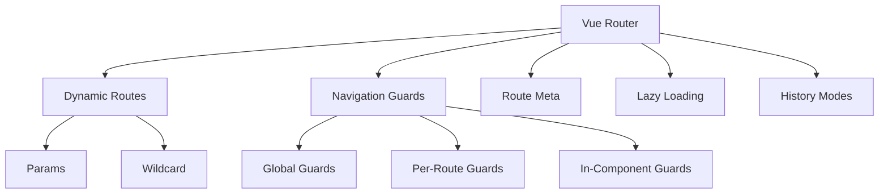

# Vue Router Advanced

## 학습 목표
- Vue Router 4의 고급 기능 이해
- 동적 라우트, Navigation Guards 활용법 학습
- Portal Shell의 Remote 라우팅 시스템 분석

## 개념 설명

### Vue Router 4의 주요 기능



### History Modes

| Mode | URL 형태 | 서버 설정 | 브라우저 지원 |
|------|----------|----------|--------------|
| Hash | `/#/users` | 불필요 | 모든 브라우저 |
| HTML5 | `/users` | 필요 (fallback) | 모던 브라우저 |
| Memory | N/A | N/A | SSR 환경 |

## Portal Universe 코드 분석

### 1. Router 설정

```typescript
// src/router/index.ts
import { createRouter, createWebHistory } from 'vue-router';
import RemoteWrapper from '../components/RemoteWrapper.vue';
import { getRemoteConfigs } from '../config/remoteRegistry';

// ✅ Remote 라우트 동적 생성
function createRemoteRoutes() {
  const configs = getRemoteConfigs();

  return configs.map(config => ({
    path: `${config.basePath}/:pathMatch(.*)*`,  // 와일드카드 매칭
    name: config.key,
    component: RemoteWrapper,
    props: (route: any) => ({
      config,  // RemoteConfig 객체 전달
      initialPath: route.path.substring(config.basePath.length) || '/'
    }),
    meta: {
      remoteName: config.key,
      icon: config.icon,
      keepAlive: true  // Remote 앱 캐싱
    }
  }));
}

const routes = [
  {
    path: '/',
    name: 'Home',
    component: HomePage,
    meta: { title: '홈' }
  },
  {
    path: '/dashboard',
    name: 'Dashboard',
    component: DashboardPage,
    meta: { title: '대시보드', requiresAuth: true }
  },
  {
    path: '/oauth2/callback',
    name: 'OAuth2Callback',
    component: OAuth2Callback,
    meta: { title: 'OAuth2 로그인 처리 중', requiresAuth: false }
  },

  // ✅ Remote 라우트 (Blog, Shopping)
  ...createRemoteRoutes(),

  // 404 페이지
  {
    path: '/:pathMatch(.*)*',
    name: 'NotFound',
    component: () => import('../views/NotFound.vue')
  }
];

const router = createRouter({
  history: createWebHistory(),  // HTML5 History Mode
  routes,
});

// ✅ Global Error Handler
router.onError((error) => {
  console.error('❌ Router error:', error);
  // Portal Shell은 계속 동작
});

export default router;
```

**핵심 포인트:**
- **동적 라우트 생성**: `createRemoteRoutes()`로 Remote 앱 라우트 자동 등록
- **와일드카드 매칭**: `/:pathMatch(.*)*`로 하위 경로 모두 캐치
- **Props 함수**: 동적으로 props 생성 (config, initialPath)
- **Route Meta**: `remoteName`, `keepAlive`, `requiresAuth` 등 메타데이터
- **에러 처리**: `router.onError()`로 전역 에러 핸들링

### 2. Remote Config 레지스트리

```typescript
// src/config/remoteRegistry.ts
interface RemoteConfig {
  key: string
  displayName: string
  basePath: string
  remoteUrl: string
  icon: string
  color: string
}

export function getRemoteConfigs(): RemoteConfig[] {
  return [
    {
      key: 'blog',
      displayName: 'Blog',
      basePath: '/blog',
      remoteUrl: import.meta.env.VITE_BLOG_REMOTE_URL,
      icon: '📝',
      color: '#3B82F6'
    },
    {
      key: 'shopping',
      displayName: 'Shopping',
      basePath: '/shopping',
      remoteUrl: import.meta.env.VITE_SHOPPING_REMOTE_URL,
      icon: '🛒',
      color: '#10B981'
    }
  ]
}
```

### 3. Navigation Guards 활용

```typescript
// 예제: Auth Guard
import { useAuthStore } from '@/store/auth'

router.beforeEach((to, from, next) => {
  const authStore = useAuthStore()

  // ✅ 인증이 필요한 라우트
  if (to.meta.requiresAuth && !authStore.isAuthenticated) {
    console.warn('🔒 Auth required for:', to.path)
    next({
      path: '/',
      query: { redirect: to.fullPath }  // 리다이렉트 경로 저장
    })
    return
  }

  // ✅ Remote 앱 진입 시 로깅
  if (to.meta.remoteName) {
    console.log(`🚀 Entering remote: ${to.meta.remoteName}`)
  }

  next()
})
```

### 4. App.vue에서 Route 활용

```vue
<script setup lang="ts">
import { useRoute } from "vue-router";
import { watch } from "vue";

const route = useRoute();

/**
 * data-service 초기화
 * Remote 앱 이동 시 테마 변경
 */
function resetDataService() {
  if (!route.meta.remoteName) {
    document.documentElement.setAttribute('data-service', 'portal');
  }
}

// ✅ 경로 변경 감지
watch(() => route.path, () => {
  resetDataService();
});
</script>

<template>
  <Suspense>
    <template #default>
      <router-view v-slot="{ Component, route }">
        <!-- ✅ KeepAlive: Remote 앱 캐싱 -->
        <KeepAlive v-if="route.meta.keepAlive" :max="3">
          <component
            :is="Component"
            :key="route.meta.remoteName || route.name"
          />
        </KeepAlive>
        <component
          v-else
          :is="Component"
          :key="route.name"
        />
      </router-view>
    </template>
    <template #fallback>
      <div class="loading">Loading...</div>
    </template>
  </Suspense>
</template>
```

**핵심 포인트:**
- **KeepAlive**: Remote 앱을 메모리에 캐싱 (최대 3개)
- **동적 key**: `remoteName` 또는 `name`으로 컴포넌트 식별
- **Suspense**: 비동기 컴포넌트 로딩 처리

## 실습 예제

### 예제 1: Nested Routes

```typescript
const routes = [
  {
    path: '/admin',
    component: AdminLayout,
    meta: { requiresAuth: true, requiresAdmin: true },
    children: [
      {
        path: '',
        name: 'AdminDashboard',
        component: AdminDashboard
      },
      {
        path: 'users',
        name: 'AdminUsers',
        component: AdminUsers
      },
      {
        path: 'users/:id',
        name: 'AdminUserDetail',
        component: AdminUserDetail,
        props: true  // route.params를 props로 전달
      }
    ]
  }
]
```

### 예제 2: Navigation Guards 체인

```typescript
// Global beforeEach
router.beforeEach(async (to, from, next) => {
  console.log('1️⃣ Global beforeEach')

  // Auth check
  const authStore = useAuthStore()
  if (to.meta.requiresAuth && !authStore.isAuthenticated) {
    next('/')
    return
  }

  // Admin check
  if (to.meta.requiresAdmin && !authStore.isAdmin) {
    next('/forbidden')
    return
  }

  next()
})

// Per-route guard
const routes = [
  {
    path: '/settings',
    component: SettingsPage,
    beforeEnter: (to, from, next) => {
      console.log('2️⃣ Per-route beforeEnter')
      // 추가 검증 로직
      next()
    }
  }
]

// Component guard
export default {
  beforeRouteEnter(to, from, next) {
    console.log('3️⃣ Component beforeRouteEnter')
    next()
  },
  beforeRouteUpdate(to, from, next) {
    console.log('4️⃣ Component beforeRouteUpdate')
    next()
  },
  beforeRouteLeave(to, from, next) {
    console.log('5️⃣ Component beforeRouteLeave')
    const answer = window.confirm('정말 나가시겠습니까?')
    next(answer)
  }
}
```

### 예제 3: Programmatic Navigation

```typescript
import { useRouter, useRoute } from 'vue-router'

export default {
  setup() {
    const router = useRouter()
    const route = useRoute()

    function goToBlog() {
      // ✅ 객체 형식
      router.push({ name: 'blog', params: { id: '123' } })
    }

    function goToShoppingWithQuery() {
      // ✅ 쿼리 파라미터
      router.push({
        path: '/shopping/products',
        query: { category: 'electronics', sort: 'price' }
      })
    }

    function replaceHistory() {
      // ✅ History 스택에 남기지 않음
      router.replace('/new-path')
    }

    function goBack() {
      // ✅ 이전 페이지로
      router.back()
      // 또는
      router.go(-1)
    }

    return { goToBlog, goToShoppingWithQuery, replaceHistory, goBack }
  }
}
```

### 예제 4: Route Meta 활용

```typescript
// 라우트 정의
const routes = [
  {
    path: '/products',
    component: ProductList,
    meta: {
      breadcrumb: '상품 목록',
      pageTitle: '상품 | Portal Universe',
      transition: 'slide-left'
    }
  }
]

// 컴포넌트에서 사용
const route = useRoute()
console.log(route.meta.breadcrumb)  // '상품 목록'

// Global afterEach에서 활용
router.afterEach((to) => {
  // 페이지 타이틀 변경
  if (to.meta.pageTitle) {
    document.title = to.meta.pageTitle
  }
})
```

## 핵심 요약

### Vue Router 4 주요 기능
1. **History Mode**: HTML5 History API 기반
2. **Dynamic Segments**: `:id` 형태의 동적 파라미터
3. **Wildcard Routes**: `/:pathMatch(.*)*` 패턴 매칭
4. **Navigation Guards**: beforeEach, afterEach 등
5. **Route Meta**: 커스텀 메타데이터 저장

### Portal Shell Router 아키텍처
```
/ (Home)
├── /dashboard
├── /settings
├── /profile
├── /blog/:pathMatch(.*)*     → Blog Remote
├── /shopping/:pathMatch(.*)*  → Shopping Remote
└── /:pathMatch(.*)*           → 404 NotFound
```

### Best Practices
1. **동적 라우트 생성**: 반복 코드 제거
2. **Route Meta 활용**: requiresAuth, remoteName 등
3. **KeepAlive**: Remote 앱 성능 최적화
4. **Lazy Loading**: 초기 번들 사이즈 감소
5. **Error Handling**: router.onError() 필수

### Navigation Guards 실행 순서
```
1. Global beforeEach
2. Per-route beforeEnter
3. Component beforeRouteEnter
4. Global afterEach
```

### 라우트 Props 전달 방법

| 방법 | 설명 | 예제 |
|------|------|------|
| Boolean | params를 props로 | `props: true` |
| Object | 정적 props | `props: { admin: true }` |
| Function | 동적 props | `props: (route) => ({ id: route.params.id })` |

## 관련 문서
- [Composition API Deep Dive](./composition-api-deep-dive.md)
- [Shell Architecture](../mfe/shell-architecture.md)
- [Module Federation Host](../mfe/module-federation-host.md)
