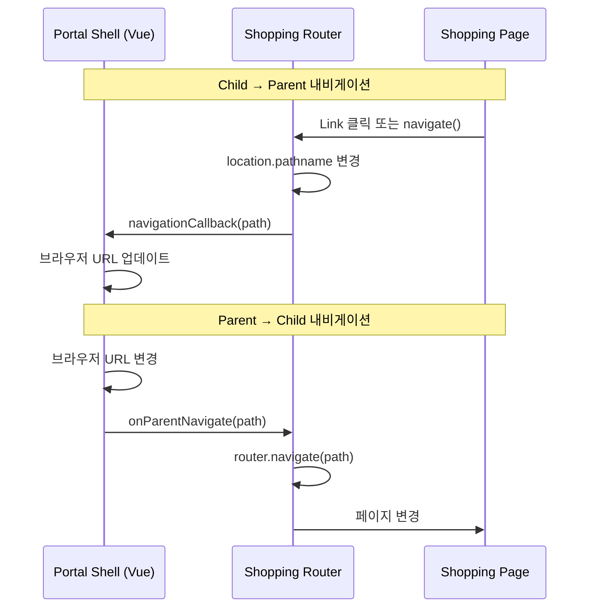

# React Router v6

## 학습 목표
- React Router v6의 핵심 API 이해
- Shopping Frontend의 라우팅 구조 분석
- Embedded/Standalone 모드별 라우터 설정 학습

---

## 1. React Router v6 개요

```
┌─────────────────────────────────────────────────────────────────────────────┐
│                       REACT ROUTER v6                                        │
├─────────────────────────────────────────────────────────────────────────────┤
│                                                                              │
│   createBrowserRouter   ─────►  Standalone 모드 (브라우저 URL)               │
│   createMemoryRouter    ─────►  Embedded 모드 (메모리 상태)                  │
│   Routes + Route        ─────►  라우트 선언                                   │
│   Navigate              ─────►  프로그래매틱 리다이렉트                        │
│   Outlet                ─────►  중첩 라우트 렌더링                            │
│   useParams             ─────►  URL 파라미터 추출                            │
│   useNavigate           ─────►  프로그래매틱 내비게이션                       │
│   useLocation           ─────►  현재 위치 정보                                │
│   Link                  ─────►  선언적 내비게이션                             │
│                                                                              │
└─────────────────────────────────────────────────────────────────────────────┘
```

### 1.1 v5 → v6 주요 변경사항

| v5 | v6 |
|----|----|
| `<Switch>` | `<Routes>` |
| `<Route component={...}>` | `<Route element={<Component />}>` |
| `exact` prop | 자동으로 exact 매칭 |
| `useHistory()` | `useNavigate()` |
| 상대 경로 지원 제한적 | 강력한 상대 경로 지원 |

---

## 2. Router 생성

### 2.1 BrowserRouter vs MemoryRouter

**Portal Universe 패턴 (router/index.tsx)**
```tsx
export const createRouter = (options: {
  isEmbedded?: boolean
  basePath?: string
  initialPath?: string
}) => {
  const { isEmbedded = false, basePath = '/shopping', initialPath = '/' } = options

  if (isEmbedded) {
    // Memory router for embedded mode
    // Portal Shell이 URL을 관리하고, Shopping은 내부 상태만 관리
    return createMemoryRouter(routes, {
      initialEntries: [initialPath],
      initialIndex: 0
    })
  }

  // Browser router for standalone mode
  return createBrowserRouter(routes, {
    basename: basePath
  })
}
```

### 2.2 언제 어떤 Router를 사용할까?

| 모드 | Router | URL | 사용 사례 |
|------|--------|-----|----------|
| **Standalone** | `BrowserRouter` | `http://localhost:30002/products/1` | 독립 실행 |
| **Embedded** | `MemoryRouter` | 메모리 상태 | Module Federation Remote |

---

## 3. Route 정의

### 3.1 기본 Route

**Portal Universe 패턴**
```tsx
const routes = [
  {
    path: '/',
    element: <Layout />,
    children: [
      {
        index: true, // path: '' 와 동일
        element: (
          <Suspense fallback={<PageLoader />}>
            <ProductListPage />
          </Suspense>
        )
      },
      {
        path: 'products',
        element: (
          <Suspense fallback={<PageLoader />}>
            <ProductListPage />
          </Suspense>
        )
      },
      {
        path: 'products/:productId',
        element: (
          <Suspense fallback={<PageLoader />}>
            <ProductDetailPage />
          </Suspense>
        )
      }
    ]
  }
]
```

### 3.2 중첩 라우트 (Nested Routes)

```tsx
const routes = [
  {
    path: '/',
    element: <Layout />, // 부모 레이아웃
    children: [
      {
        path: 'admin',
        element: (
          <AdminWrapper>
            <AdminLayout />
          </AdminWrapper>
        ),
        children: [
          {
            path: 'products', // /admin/products
            element: <AdminProductListPage />
          },
          {
            path: 'products/new', // /admin/products/new
            element: <AdminProductFormPage />
          },
          {
            path: 'products/:id', // /admin/products/123
            element: <AdminProductFormPage />
          }
        ]
      }
    ]
  }
]
```

### 3.3 Outlet - 중첩 라우트 렌더링

```tsx
// Layout.tsx
import { Outlet } from 'react-router-dom'

const Layout: React.FC = () => (
  <>
    <NavigationSync /> {/* 공통 컴포넌트 */}
    <Suspense fallback={<PageLoader />}>
      <Outlet /> {/* 자식 라우트가 여기에 렌더링 */}
    </Suspense>
  </>
)
```

---

## 4. Navigation

### 4.1 Link - 선언적 내비게이션

```tsx
import { Link } from 'react-router-dom'

function ProductCard({ product }: Props) {
  return (
    <Link to={`/products/${product.id}`}>
      <div className="card">
        <h3>{product.name}</h3>
        <p>{product.price}</p>
      </div>
    </Link>
  )
}
```

### 4.2 useNavigate - 프로그래매틱 내비게이션

```tsx
import { useNavigate } from 'react-router-dom'

function CheckoutPage() {
  const navigate = useNavigate()

  useEffect(() => {
    if (cart && cart.items.length === 0) {
      navigate('/cart') // 리다이렉트
    }
  }, [cart, navigate])

  const handleSuccess = () => {
    navigate('/orders', { replace: true }) // 히스토리 대체
  }

  const goBack = () => {
    navigate(-1) // 뒤로 가기
  }

  return (
    <div>
      <button onClick={goBack}>Back</button>
    </div>
  )
}
```

### 4.3 Navigate - 선언적 리다이렉트

```tsx
const routes = [
  {
    path: '*',
    element: <Navigate to="/" replace />
  }
]
```

---

## 5. Hooks

### 5.1 useParams - URL 파라미터

```tsx
import { useParams } from 'react-router-dom'

function ProductDetailPage() {
  // URL: /products/123
  const { productId } = useParams<{ productId: string }>()

  useEffect(() => {
    if (productId) {
      fetchProduct(Number(productId))
    }
  }, [productId])

  return <div>Product ID: {productId}</div>
}
```

### 5.2 useSearchParams - Query String

**Portal Universe 코드 분석 (ProductListPage.tsx)**
```tsx
import { useSearchParams } from 'react-router-dom'

function ProductListPage() {
  const [searchParams, setSearchParams] = useSearchParams()

  // URL: /products?page=2&keyword=laptop&category=electronics
  const currentPage = parseInt(searchParams.get('page') || '0')
  const searchKeyword = searchParams.get('keyword') || ''
  const category = searchParams.get('category') || ''

  // 검색 처리
  const handleSearch = (e: React.FormEvent) => {
    e.preventDefault()
    const params = new URLSearchParams()
    if (searchInput) {
      params.set('keyword', searchInput)
    }
    params.set('page', '0')
    setSearchParams(params)
  }

  // 페이지 변경
  const handlePageChange = (page: number) => {
    const params = new URLSearchParams(searchParams)
    params.set('page', String(page))
    setSearchParams(params)
  }

  return (
    <div>
      <form onSubmit={handleSearch}>
        <input value={searchInput} onChange={...} />
        <button type="submit">Search</button>
      </form>
    </div>
  )
}
```

### 5.3 useLocation - 현재 위치

**Portal Universe 코드 분석 (router/index.tsx)**
```tsx
import { useLocation } from 'react-router-dom'

const NavigationSync: React.FC = () => {
  const location = useLocation()
  const prevPathRef = useRef(location.pathname)

  useEffect(() => {
    if (prevPathRef.current !== location.pathname) {
      console.log(`Path changed: ${prevPathRef.current} → ${location.pathname}`)
      prevPathRef.current = location.pathname
      navigationCallback?.(location.pathname) // Parent에게 알림
    }
  }, [location.pathname])

  return null
}
```

---

## 6. Code Splitting with Lazy

**Portal Universe 패턴 (router/index.tsx)**
```tsx
import { Suspense, lazy } from 'react'

// Lazy load pages
const ProductListPage = lazy(() => import('@/pages/ProductListPage'))
const ProductDetailPage = lazy(() => import('@/pages/ProductDetailPage'))
const CartPage = lazy(() => import('@/pages/CartPage'))

// Loading fallback
const PageLoader: React.FC = () => (
  <div className="min-h-[400px] flex items-center justify-center">
    <div className="flex flex-col items-center gap-4">
      <div className="w-8 h-8 border-4 border-brand-primary border-t-transparent rounded-full animate-spin" />
      <p className="text-text-meta text-sm">Loading...</p>
    </div>
  </div>
)

// Route 정의
const routes = [
  {
    path: '/',
    element: <Layout />,
    children: [
      {
        path: 'products',
        element: (
          <Suspense fallback={<PageLoader />}>
            <ProductListPage />
          </Suspense>
        )
      }
    ]
  }
]
```

---

## 7. Module Federation 통합

### 7.1 Parent-Child Navigation

**Portal Universe 패턴**



### 7.2 NavigationSync 구현

```tsx
// Navigation listener
let navigationCallback: ((path: string) => void) | null = null

export const setNavigationCallback = (callback: ((path: string) => void) | null) => {
  navigationCallback = callback
}

const NavigationSync: React.FC = () => {
  const location = useLocation()
  const prevPathRef = useRef(location.pathname)

  useEffect(() => {
    // 경로가 변경되면 Parent에게 알림
    if (prevPathRef.current !== location.pathname) {
      prevPathRef.current = location.pathname
      navigationCallback?.(location.pathname)
    }
  }, [location.pathname])

  return null
}
```

### 7.3 프로그래매틱 내비게이션

```tsx
let routerInstance: RouterInstance | null = null

export const navigateTo = (path: string) => {
  if (routerInstance) {
    console.log(`📥 Navigating to: ${path}`)
    routerInstance.navigate(path)
  }
}

// bootstrap.tsx에서 사용
return {
  onParentNavigate: (path: string) => {
    navigateTo(path)
  }
}
```

---

## 8. Guards (인증/권한)

### 8.1 RequireAuth - 인증 체크

```tsx
import { Navigate } from 'react-router-dom'
import { useAuthStore } from '@/stores/authStore'

const RequireAuth: React.FC<{ children: React.ReactNode }> = ({ children }) => {
  const { isAuthenticated } = useAuthStore()

  if (!isAuthenticated) {
    return <Navigate to="/login" replace />
  }

  return <>{children}</>
}
```

### 8.2 RequireRole - 권한 체크

```tsx
const RequireRole: React.FC<{
  roles: string[]
  children: React.ReactNode
}> = ({ roles, children }) => {
  const { user } = useAuthStore()

  if (!user || !roles.includes(user.role)) {
    return <Navigate to="/403" replace />
  }

  return <>{children}</>
}
```

### 8.3 Portal Universe 적용 (router/index.tsx)

```tsx
const AdminWrapper: React.FC<{ children: React.ReactNode }> = ({ children }) => (
  <Suspense fallback={<PageLoader />}>
    <RequireAuth>
      <RequireRole roles={['admin']}>
        {children}
      </RequireRole>
    </RequireAuth>
  </Suspense>
)

const routes = [
  {
    path: 'admin',
    element: (
      <AdminWrapper>
        <AdminLayout />
      </AdminWrapper>
    ),
    children: [
      { path: 'products', element: <AdminProductListPage /> }
    ]
  }
]
```

---

## 9. 핵심 정리

| API | 용도 |
|-----|------|
| `createBrowserRouter` | Standalone 모드 (브라우저 URL) |
| `createMemoryRouter` | Embedded 모드 (메모리 상태) |
| `<Outlet />` | 중첩 라우트 렌더링 |
| `<Link />` | 선언적 내비게이션 |
| `useNavigate()` | 프로그래매틱 내비게이션 |
| `useParams()` | URL 파라미터 추출 |
| `useSearchParams()` | Query String 관리 |
| `useLocation()` | 현재 위치 정보 |
| `<Navigate />` | 선언적 리다이렉트 |

---

## 다음 학습

- [Custom Hooks](./custom-hooks.md)
- [Suspense & Lazy Loading](./suspense-lazy.md)
- [Portal Integration](../mfe/portal-integration.md)
