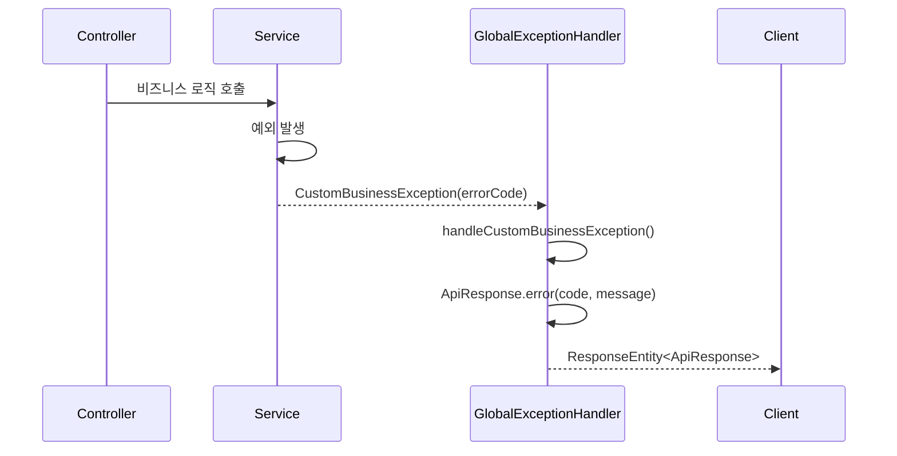
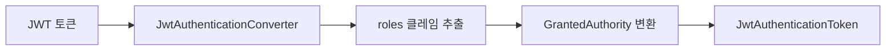

# Common Library API 명세

> Portal Universe 마이크로서비스 프로젝트의 공통 라이브러리 API 명세서입니다.

---

## 📋 개요

| 항목 | 내용 |
|------|------|
| **라이브러리명** | common-library |
| **버전** | 0.0.1-SNAPSHOT |
| **Java 버전** | 17 |
| **Spring Boot** | 3.5.5 |
| **패키지** | `com.portal.universe.commonlibrary` |

common-library는 Portal Universe의 모든 마이크로서비스에서 공통적으로 사용하는 컴포넌트를 제공합니다:
- **응답 포맷 통일**: ApiResponse, ErrorResponse
- **예외 처리**: ErrorCode, CustomBusinessException, GlobalExceptionHandler
- **보안**: JWT 인증 관련 Auto-Configuration
- **이벤트**: Kafka 기반 도메인 이벤트 DTO

---

## 📑 목차

- [응답 (Response)](#응답-response)
  - [ApiResponse\<T\>](#apiresponset)
  - [ErrorResponse](#errorresponse)
- [예외 (Exception)](#예외-exception)
  - [ErrorCode (Interface)](#errorcode-interface)
  - [CommonErrorCode](#commonerrorcode)
  - [CustomBusinessException](#custombusinessexception)
  - [GlobalExceptionHandler](#globalexceptionhandler)
- [보안 (Security)](#보안-security)
  - [JwtSecurityAutoConfiguration](#jwtsecurityautoconfiguration)
  - [JwtAuthenticationConverterAdapter](#jwtauthenticationconverteradapter)
  - [ReactiveJwtAuthenticationConverterAdapter](#reactivejwtauthenticationconverteradapter)
- [이벤트 (Event)](#이벤트-event)
  - [UserSignedUpEvent](#usersignedupevent)
  - [OrderCreatedEvent](#ordercreatedevent)
  - [PaymentCompletedEvent](#paymentcompletedevent)
  - [PaymentFailedEvent](#paymentfailedevent)
  - [OrderConfirmedEvent](#orderconfirmedevent)
  - [OrderCancelledEvent](#ordercancelledevent)
  - [InventoryReservedEvent](#inventoryreservedevent)
  - [DeliveryShippedEvent](#deliveryshippedevent)
- [타입 호환성](#타입-호환성)
- [버전 호환성](#버전-호환성)

---

## 응답 (Response)

### ApiResponse\<T\>

모든 REST API 응답의 표준 래퍼 클래스입니다. API 응답의 일관성을 유지하기 위해 사용됩니다.

**위치:** `com.portal.universe.commonlibrary.response.ApiResponse`

#### 클래스 시그니처

```java
@Getter
@JsonInclude(JsonInclude.Include.NON_NULL)
public class ApiResponse<T> {
    private final boolean success;
    private final T data;
    private final ErrorResponse error;

    // Private constructor
    private ApiResponse(boolean success, T data, ErrorResponse error) { ... }

    // Factory methods
    public static <T> ApiResponse<T> success(T data) { ... }
    public static <T> ApiResponse<T> error(String code, String message) { ... }
}
```

#### 제네릭 파라미터

| 파라미터 | 설명 |
|---------|------|
| `<T>` | 응답 데이터 타입 |

#### 필드

| 필드 | 타입 | 필수 | 설명 |
|------|------|------|------|
| `success` | boolean | ✅ | 요청 성공 여부 |
| `data` | T | ❌ | 성공 시 반환 데이터 (null이면 JSON에서 제외) |
| `error` | ErrorResponse | ❌ | 실패 시 에러 정보 (null이면 JSON에서 제외) |

#### 정적 팩토리 메서드

##### success(T data)

성공 응답을 생성합니다.

```java
public static <T> ApiResponse<T> success(T data)
```

**파라미터:**
- `data` (T): 클라이언트에게 전달할 데이터

**반환:**
- `ApiResponse<T>`: `success=true`, `data=전달된 데이터`, `error=null`

**사용 예시:**

```java
@GetMapping("/{id}")
public ResponseEntity<ApiResponse<ProductResponse>> getProduct(@PathVariable Long id) {
    ProductResponse product = productService.getProduct(id);
    return ResponseEntity.ok(ApiResponse.success(product));
}
```

**응답 예시:**

```json
{
  "success": true,
  "data": {
    "id": 1,
    "name": "Product A",
    "price": 29.99
  }
}
```

##### error(String code, String message)

실패 응답을 생성합니다.

```java
public static <T> ApiResponse<T> error(String code, String message)
```

**파라미터:**
- `code` (String): 애플리케이션 에러 코드 (예: "C001", "S001")
- `message` (String): 클라이언트에게 보여줄 에러 메시지

**반환:**
- `ApiResponse<T>`: `success=false`, `data=null`, `error=ErrorResponse`

**사용 예시:**

```java
ApiResponse<Object> response = ApiResponse.error("C002", "Invalid Input Value");
```

**응답 예시:**

```json
{
  "success": false,
  "error": {
    "code": "C002",
    "message": "Invalid Input Value"
  }
}
```

---

### ErrorResponse

API 실패 응답 시 에러 정보를 담는 DTO 클래스입니다.

**위치:** `com.portal.universe.commonlibrary.response.ErrorResponse`

#### 클래스 시그니처

```java
@Getter
public class ErrorResponse {
    private final String code;
    private final String message;

    public ErrorResponse(String code, String message) { ... }
}
```

#### 필드

| 필드 | 타입 | 설명 |
|------|------|------|
| `code` | String | 에러 코드 (예: "C001", "A001", "S001") |
| `message` | String | 에러 메시지 |

#### JSON 예시

```json
{
  "code": "S001",
  "message": "Product not found"
}
```

---

## 예외 (Exception)

### ErrorCode (Interface)

모든 서비스에서 사용될 오류 코드의 공통 규약입니다.

**위치:** `com.portal.universe.commonlibrary.exception.ErrorCode`

#### 인터페이스 시그니처

```java
public interface ErrorCode {
    HttpStatus getStatus();
    String getCode();
    String getMessage();
}
```

#### 메서드

##### getStatus(): HttpStatus

오류에 해당하는 HTTP 상태 코드를 반환합니다.

**반환:**
- `HttpStatus`: 200, 400, 401, 403, 404, 500 등

**예시:**

```java
public enum ShoppingErrorCode implements ErrorCode {
    PRODUCT_NOT_FOUND(
        HttpStatus.NOT_FOUND,  // ← status
        "S001",
        "Product not found"
    );

    @Override
    public HttpStatus getStatus() {
        return status;
    }
}
```

##### getCode(): String

애플리케이션 내에서 오류를 식별하기 위한 고유 코드를 반환합니다.

**반환:**
- `String`: 에러 코드 (예: "C001", "A001", "S001")

**명명 규칙:**

| 서비스 | 접두사 | 예시 |
|--------|--------|------|
| Common | C | C001, C002, C003 |
| Auth | A | A001, A002, ... |
| Blog | B | B001, B002, ... |
| Shopping | S | S001, S002, ... |

**예시:**

```java
AuthErrorCode.USER_NOT_FOUND.getCode()      // "A001"
ShoppingErrorCode.PRODUCT_NOT_FOUND.getCode() // "S001"
```

##### getMessage(): String

클라이언트에게 보여줄 오류 메시지를 반환합니다.

**반환:**
- `String`: 사용자 친화적인 에러 메시지

**예시:**

```java
AuthErrorCode.INVALID_PASSWORD.getMessage()  // "Invalid password"
```

---

### CommonErrorCode

여러 서비스에서 공통적으로 발생할 수 있는 기본 오류 코드입니다.

**위치:** `com.portal.universe.commonlibrary.exception.CommonErrorCode`

**구현:** ErrorCode

#### Enum 상수

| 상수 | HTTP Status | 코드 | 메시지 |
|-----|-------------|------|--------|
| `INTERNAL_SERVER_ERROR` | 500 INTERNAL_SERVER_ERROR | C001 | Internal Server Error |
| `INVALID_INPUT_VALUE` | 400 BAD_REQUEST | C002 | Invalid Input Value |
| `NOT_FOUND` | 404 NOT_FOUND | C003 | Not Found |

#### 클래스 시그니처

```java
@Getter
public enum CommonErrorCode implements ErrorCode {
    INTERNAL_SERVER_ERROR(HttpStatus.INTERNAL_SERVER_ERROR, "C001", "Internal Server Error"),
    INVALID_INPUT_VALUE(HttpStatus.BAD_REQUEST, "C002", "Invalid Input Value"),
    NOT_FOUND(HttpStatus.NOT_FOUND, "C003", "Not Found");

    private final HttpStatus status;
    private final String code;
    private final String message;

    CommonErrorCode(HttpStatus status, String code, String message) { ... }
}
```

#### 사용 예시

```java
// 존재하지 않는 리소스 요청
throw new CustomBusinessException(CommonErrorCode.NOT_FOUND);

// 유효하지 않은 입력값
throw new CustomBusinessException(CommonErrorCode.INVALID_INPUT_VALUE);
```

---

### CustomBusinessException

시스템 전반에서 사용될 커스텀 비즈니스 예외입니다.

**위치:** `com.portal.universe.commonlibrary.exception.CustomBusinessException`

**상속:** RuntimeException

#### 클래스 시그니처

```java
@Getter
public class CustomBusinessException extends RuntimeException {
    private final ErrorCode errorCode;

    public CustomBusinessException(ErrorCode errorCode) {
        super(errorCode.getMessage());
        this.errorCode = errorCode;
    }
}
```

#### 필드

| 필드 | 타입 | 설명 |
|------|------|------|
| `errorCode` | ErrorCode | 발생한 예외에 해당하는 ErrorCode |

#### 생성자

```java
public CustomBusinessException(ErrorCode errorCode)
```

**파라미터:**
- `errorCode` (ErrorCode): ErrorCode를 구현한 Enum 값

**예시:**

```java
throw new CustomBusinessException(ShoppingErrorCode.INSUFFICIENT_STOCK);
throw new CustomBusinessException(AuthErrorCode.USER_NOT_FOUND);
```

#### 사용 패턴

```java
@Service
public class ProductService {

    @Transactional
    public ProductResponse createProduct(ProductRequest request) {
        // 비즈니스 검증
        if (productRepository.existsByName(request.getName())) {
            throw new CustomBusinessException(
                ShoppingErrorCode.DUPLICATE_PRODUCT
            );
        }

        // 비즈니스 로직
        Product product = new Product(request.getName(), request.getPrice());
        Product saved = productRepository.save(product);

        return new ProductResponse(saved);
    }
}
```

---

### GlobalExceptionHandler

애플리케이션 전역에서 발생하는 예외를 처리하는 핸들러입니다.

**위치:** `com.portal.universe.commonlibrary.exception.GlobalExceptionHandler`

**어노테이션:** `@RestControllerAdvice`

#### 클래스 시그니처

```java
@Slf4j
@RestControllerAdvice
public class GlobalExceptionHandler {

    @ExceptionHandler(CustomBusinessException.class)
    protected ResponseEntity<ApiResponse<Object>> handleCustomBusinessException(
        CustomBusinessException e) { ... }

    @ExceptionHandler(NoResourceFoundException.class)
    protected ResponseEntity<ApiResponse<Object>> handleNoResourceFoundException(
        NoResourceFoundException e) { ... }

    @ExceptionHandler(Exception.class)
    protected ResponseEntity<ApiResponse<Object>> handleException(
        Exception e) { ... }
}
```

#### 처리되는 예외

##### 1. CustomBusinessException

**조건:** 비즈니스 로직에서 발생한 CustomBusinessException

**처리:**
- HTTP Status: `errorCode.getStatus()`
- 응답: `ApiResponse.error(code, message)`
- 로그: ERROR 레벨

**예시:**

```json
HTTP/1.1 400 Bad Request

{
  "success": false,
  "error": {
    "code": "S003",
    "message": "Insufficient stock"
  }
}
```

##### 2. NoResourceFoundException

**조건:** 요청한 리소스를 찾을 수 없음 (404)

**처리:**
- HTTP Status: `404 NOT_FOUND`
- 응답: `ApiResponse.error("C003", "Not Found")`
- 로그: WARN 레벨

**예시:**

```json
HTTP/1.1 404 Not Found

{
  "success": false,
  "error": {
    "code": "C003",
    "message": "Not Found"
  }
}
```

##### 3. Exception (Default)

**조건:** 예측하지 못한 예외

**처리:**
- HTTP Status: `500 INTERNAL_SERVER_ERROR`
- 응답: `ApiResponse.error("C001", "Internal Server Error")`
- 로그: ERROR 레벨 (스택 트레이스 포함)

**예시:**

```json
HTTP/1.1 500 Internal Server Error

{
  "success": false,
  "error": {
    "code": "C001",
    "message": "Internal Server Error"
  }
}
```

#### 예외 처리 흐름



---

## 보안 (Security)

### JwtSecurityAutoConfiguration

JWT 관련 보안 설정을 자동으로 구성하는 Auto-Configuration 클래스입니다.

**위치:** `com.portal.universe.commonlibrary.security.config.JwtSecurityAutoConfiguration`

**어노테이션:** `@AutoConfiguration`

#### 활성화 조건

- `JwtAuthenticationConverter` 클래스가 클래스패스에 있음
- Spring Boot 애플리케이션 시작 시 자동으로 로드

#### 제공 Bean

##### 1. Servlet 환경: JwtAuthenticationConverter

**조건:**
- Spring MVC (Servlet) 기반 애플리케이션
- `@ConditionalOnWebApplication(type = SERVLET)`
- JwtAuthenticationConverter Bean이 정의되지 않음

**제공:**

```java
@Bean
@ConditionalOnWebApplication(type = ConditionalOnWebApplication.Type.SERVLET)
@ConditionalOnMissingBean(JwtAuthenticationConverter.class)
public JwtAuthenticationConverter jwtAuthenticationConverter() {
    return JwtAuthenticationConverterAdapter.createDefault();
}
```

**설정:**
- 클레임 이름: `"roles"`
- 권한 접두사: `""` (없음)

##### 2. Reactive 환경: Converter\<Jwt, Mono\<AbstractAuthenticationToken\>\>

**조건:**
- Spring WebFlux (Reactive) 기반 애플리케이션
- `@ConditionalOnWebApplication(type = REACTIVE)`
- reactiveJwtAuthenticationConverter Bean이 정의되지 않음

**제공:**

```java
@Bean
@ConditionalOnWebApplication(type = ConditionalOnWebApplication.Type.REACTIVE)
@ConditionalOnMissingBean(name = "reactiveJwtAuthenticationConverter")
public Converter<Jwt, Mono<AbstractAuthenticationToken>>
    reactiveJwtAuthenticationConverter() {
    return new ReactiveJwtAuthenticationConverterAdapter();
}
```

**설정:**
- 클레임 이름: `"roles"`
- 권한 접두사: `""` (없음)

#### 동작 원리

1. 애플리케이션의 타입(Servlet 또는 Reactive)을 감지합니다.
2. 해당 환경에 맞는 JWT 권한 변환기(Converter) Bean을 자동으로 등록합니다.
3. 만약 각 마이크로서비스에서 동일한 타입의 Bean을 직접 정의한 경우, 이 자동 설정은 동작하지 않습니다. (`@ConditionalOnMissingBean`)

---

### JwtAuthenticationConverterAdapter

**Spring MVC 환경**에서 JWT의 `roles` 클레임을 권한으로 변환하는 어댑터입니다.

**위치:** `com.portal.universe.commonlibrary.security.converter.JwtAuthenticationConverterAdapter`

#### 정적 팩토리 메서드

##### create(String authoritiesClaimName, String authorityPrefix)

커스텀 설정을 사용하여 JwtAuthenticationConverter를 생성합니다.

```java
public static JwtAuthenticationConverter create(
    String authoritiesClaimName,
    String authorityPrefix)
```

**파라미터:**
- `authoritiesClaimName` (String): JWT에서 권한을 담은 클레임 이름 (예: "roles", "scope")
- `authorityPrefix` (String): 각 권한에 추가할 접두사 (예: "ROLE_")

**반환:**
- `JwtAuthenticationConverter`: 설정된 컨버터

**예시:**

```java
// JWT 클레임이 "permissions"이고, 접두사가 "PERM_"인 경우
JwtAuthenticationConverter converter =
    JwtAuthenticationConverterAdapter.create("permissions", "PERM_");
```

##### createDefault()

기본 설정을 사용하여 JwtAuthenticationConverter를 생성합니다.

```java
public static JwtAuthenticationConverter createDefault()
```

**설정:**
- 클레임 이름: `"roles"`
- 권한 접두사: `""` (없음)

**반환:**
- `JwtAuthenticationConverter`: 기본 설정이 적용된 컨버터

**예시:**

```java
JwtAuthenticationConverter converter =
    JwtAuthenticationConverterAdapter.createDefault();
```

**처리 흐름:**



---

### ReactiveJwtAuthenticationConverterAdapter

**Spring WebFlux 환경**에서 JWT의 `roles` 클레임을 권한으로 변환하는 Reactive 컨버터입니다.

**위치:** `com.portal.universe.commonlibrary.security.converter.ReactiveJwtAuthenticationConverterAdapter`

**구현:** `Converter<Jwt, Mono<AbstractAuthenticationToken>>`

#### 생성자

##### ReactiveJwtAuthenticationConverterAdapter(String authoritiesClaimName, String authorityPrefix)

커스텀 설정을 사용하여 생성합니다.

```java
public ReactiveJwtAuthenticationConverterAdapter(
    String authoritiesClaimName,
    String authorityPrefix)
```

**파라미터:**
- `authoritiesClaimName` (String): JWT에서 권한을 담은 클레임 이름
- `authorityPrefix` (String): 각 권한에 추가할 접두사

##### ReactiveJwtAuthenticationConverterAdapter()

기본 설정을 사용하여 생성합니다.

```java
public ReactiveJwtAuthenticationConverterAdapter()
```

**설정:**
- 클레임 이름: `"roles"`
- 권한 접두사: `""` (없음)

#### 메서드

##### convert(Jwt jwt): Mono\<AbstractAuthenticationToken\>

JWT를 인증 토큰으로 변환합니다.

```java
@Override
public Mono<AbstractAuthenticationToken> convert(Jwt jwt)
```

**파라미터:**
- `jwt` (Jwt): Spring Security가 디코딩한 JWT 객체

**반환:**
- `Mono<AbstractAuthenticationToken>`: 사용자 권한이 포함된 인증 토큰

**처리 흐름:**
1. JWT에서 "roles" 클레임 추출
2. 권한 문자열을 GrantedAuthority로 변환
3. JwtAuthenticationToken 생성 및 Mono로 반환

**예시:**

```java
// JWT 클레임:
// {
//   "sub": "user123",
//   "roles": ["ROLE_USER", "ROLE_ADMIN"]
// }

converter.convert(jwt).subscribe(authentication -> {
    // authentication.getAuthorities() = [ROLE_USER, ROLE_ADMIN]
});
```

---

## 이벤트 (Event)

### UserSignedUpEvent

사용자 가입 시 발행되는 이벤트입니다.

**위치:** `com.portal.universe.common.event.UserSignedUpEvent`

**타입:** Record (불변)

#### 클래스 시그니처

```java
public record UserSignedUpEvent(
    String userId,
    String email,
    String name
) {}
```

#### 필드

| 필드 | 타입 | 설명 |
|------|------|------|
| `userId` | String | 생성된 사용자 ID |
| `email` | String | 사용자 이메일 |
| `name` | String | 사용자 이름 |

#### 사용 예시

```java
// 이벤트 발행 (Auth Service)
kafkaTemplate.send("user-signup-events",
    new UserSignedUpEvent("user123", "user@example.com", "John Doe"));

// 이벤트 구독 (Shopping Service)
@KafkaListener(topics = "user-signup-events")
public void handleUserSignedUp(UserSignedUpEvent event) {
    // 사용자 정보 동기화
    userSyncService.syncUser(event.userId(), event.email(), event.name());
}
```

#### JSON 직렬화

```json
{
  "userId": "user123",
  "email": "user@example.com",
  "name": "John Doe"
}
```

---

### OrderCreatedEvent

주문 생성 시 발행되는 이벤트입니다.

**위치:** `com.portal.universe.common.event.shopping.OrderCreatedEvent`

**타입:** Record (불변)

#### 클래스 시그니처

```java
public record OrderCreatedEvent(
    String orderNumber,
    String userId,
    BigDecimal totalAmount,
    int itemCount,
    List<OrderItemInfo> items,
    LocalDateTime createdAt
) {
    public record OrderItemInfo(
        Long productId,
        String productName,
        int quantity,
        BigDecimal price
    ) {}
}
```

#### 필드

| 필드 | 타입 | 설명 |
|------|------|------|
| `orderNumber` | String | 주문 번호 |
| `userId` | String | 사용자 ID |
| `totalAmount` | BigDecimal | 총 주문 금액 |
| `itemCount` | int | 상품 개수 |
| `items` | List\<OrderItemInfo\> | 주문 상품 목록 |
| `createdAt` | LocalDateTime | 주문 생성 시간 |

#### 중첩 Record: OrderItemInfo

| 필드 | 타입 | 설명 |
|------|------|------|
| `productId` | Long | 상품 ID |
| `productName` | String | 상품 이름 |
| `quantity` | int | 수량 |
| `price` | BigDecimal | 단가 |

#### JSON 직렬화

```json
{
  "orderNumber": "ORD-20260118-001",
  "userId": "user123",
  "totalAmount": 99.99,
  "itemCount": 2,
  "items": [
    {
      "productId": 1,
      "productName": "Product A",
      "quantity": 2,
      "price": 29.99
    },
    {
      "productId": 2,
      "productName": "Product B",
      "quantity": 1,
      "price": 40.01
    }
  ],
  "createdAt": "2026-01-18T10:30:00"
}
```

---

### PaymentCompletedEvent

결제 완료 시 발행되는 이벤트입니다.

**위치:** `com.portal.universe.common.event.shopping.PaymentCompletedEvent`

**타입:** Record (불변)

#### 클래스 시그니처

```java
public record PaymentCompletedEvent(
    String paymentNumber,
    String orderNumber,
    String userId,
    BigDecimal amount,
    String paymentMethod,
    String pgTransactionId,
    LocalDateTime paidAt
) {}
```

#### 필드

| 필드 | 타입 | 설명 |
|------|------|------|
| `paymentNumber` | String | 결제 번호 |
| `orderNumber` | String | 주문 번호 |
| `userId` | String | 사용자 ID |
| `amount` | BigDecimal | 결제 금액 |
| `paymentMethod` | String | 결제 수단 (CREDIT_CARD, PAYPAL 등) |
| `pgTransactionId` | String | PG사 거래 ID |
| `paidAt` | LocalDateTime | 결제 완료 시간 |

#### JSON 직렬화

```json
{
  "paymentNumber": "PAY-20260118-001",
  "orderNumber": "ORD-20260118-001",
  "userId": "user123",
  "amount": 99.99,
  "paymentMethod": "CREDIT_CARD",
  "pgTransactionId": "TXN-1234567890",
  "paidAt": "2026-01-18T10:35:00"
}
```

---

### PaymentFailedEvent

결제 실패 시 발행되는 이벤트입니다.

**위치:** `com.portal.universe.common.event.shopping.PaymentFailedEvent`

**타입:** Record (불변)

#### 클래스 시그니처

```java
public record PaymentFailedEvent(
    String paymentNumber,
    String orderNumber,
    String userId,
    BigDecimal amount,
    String paymentMethod,
    String failureReason,
    LocalDateTime failedAt
) {}
```

#### 필드

| 필드 | 타입 | 설명 |
|------|------|------|
| `paymentNumber` | String | 결제 번호 |
| `orderNumber` | String | 주문 번호 |
| `userId` | String | 사용자 ID |
| `amount` | BigDecimal | 시도된 결제 금액 |
| `paymentMethod` | String | 결제 수단 |
| `failureReason` | String | 실패 사유 |
| `failedAt` | LocalDateTime | 실패 시간 |

#### JSON 직렬화

```json
{
  "paymentNumber": "PAY-20260118-002",
  "orderNumber": "ORD-20260118-002",
  "userId": "user456",
  "amount": 149.99,
  "paymentMethod": "CREDIT_CARD",
  "failureReason": "Insufficient funds",
  "failedAt": "2026-01-18T11:00:00"
}
```

---

### OrderConfirmedEvent

주문 확정 시 발행되는 이벤트입니다.

**위치:** `com.portal.universe.common.event.shopping.OrderConfirmedEvent`

**타입:** Record (불변)

#### 클래스 시그니처

```java
public record OrderConfirmedEvent(
    String orderNumber,
    String userId,
    BigDecimal totalAmount,
    String paymentNumber,
    LocalDateTime confirmedAt
) {}
```

#### 필드

| 필드 | 타입 | 설명 |
|------|------|------|
| `orderNumber` | String | 주문 번호 |
| `userId` | String | 사용자 ID |
| `totalAmount` | BigDecimal | 총 주문 금액 |
| `paymentNumber` | String | 결제 번호 |
| `confirmedAt` | LocalDateTime | 확정 시간 |

#### JSON 직렬화

```json
{
  "orderNumber": "ORD-20260118-001",
  "userId": "user123",
  "totalAmount": 99.99,
  "paymentNumber": "PAY-20260118-001",
  "confirmedAt": "2026-01-18T10:40:00"
}
```

---

### OrderCancelledEvent

주문 취소 시 발행되는 이벤트입니다.

**위치:** `com.portal.universe.common.event.shopping.OrderCancelledEvent`

**타입:** Record (불변)

#### 클래스 시그니처

```java
public record OrderCancelledEvent(
    String orderNumber,
    String userId,
    BigDecimal totalAmount,
    String cancelReason,
    LocalDateTime cancelledAt
) {}
```

#### 필드

| 필드 | 타입 | 설명 |
|------|------|------|
| `orderNumber` | String | 주문 번호 |
| `userId` | String | 사용자 ID |
| `totalAmount` | BigDecimal | 총 주문 금액 |
| `cancelReason` | String | 취소 사유 |
| `cancelledAt` | LocalDateTime | 취소 시간 |

#### JSON 직렬화

```json
{
  "orderNumber": "ORD-20260118-003",
  "userId": "user789",
  "totalAmount": 199.99,
  "cancelReason": "Customer request",
  "cancelledAt": "2026-01-18T12:00:00"
}
```

---

### InventoryReservedEvent

재고 예약 시 발행되는 이벤트입니다.

**위치:** `com.portal.universe.common.event.shopping.InventoryReservedEvent`

**타입:** Record (불변)

#### 클래스 시그니처

```java
public record InventoryReservedEvent(
    String orderNumber,
    String userId,
    Map<Long, Integer> reservedQuantities, // productId -> quantity
    LocalDateTime reservedAt
) {}
```

#### 필드

| 필드 | 타입 | 설명 |
|------|------|------|
| `orderNumber` | String | 주문 번호 |
| `userId` | String | 사용자 ID |
| `reservedQuantities` | Map\<Long, Integer\> | 예약된 수량 (상품ID → 수량) |
| `reservedAt` | LocalDateTime | 예약 시간 |

#### JSON 직렬화

```json
{
  "orderNumber": "ORD-20260118-001",
  "userId": "user123",
  "reservedQuantities": {
    "1": 2,
    "2": 1
  },
  "reservedAt": "2026-01-18T10:31:00"
}
```

---

### DeliveryShippedEvent

배송 시작 시 발행되는 이벤트입니다.

**위치:** `com.portal.universe.common.event.shopping.DeliveryShippedEvent`

**타입:** Record (불변)

#### 클래스 시그니처

```java
public record DeliveryShippedEvent(
    String trackingNumber,
    String orderNumber,
    String userId,
    String carrier,
    LocalDate estimatedDeliveryDate,
    LocalDateTime shippedAt
) {}
```

#### 필드

| 필드 | 타입 | 설명 |
|------|------|------|
| `trackingNumber` | String | 배송 추적 번호 |
| `orderNumber` | String | 주문 번호 |
| `userId` | String | 사용자 ID |
| `carrier` | String | 배송사 |
| `estimatedDeliveryDate` | LocalDate | 예상 배송 날짜 |
| `shippedAt` | LocalDateTime | 배송 시작 시간 |

#### JSON 직렬화

```json
{
  "trackingNumber": "TRK-20260118-001",
  "orderNumber": "ORD-20260118-001",
  "userId": "user123",
  "carrier": "CJ Logistics",
  "estimatedDeliveryDate": "2026-01-20",
  "shippedAt": "2026-01-18T14:00:00"
}
```

---

## 타입 호환성

### 날짜/시간

이벤트에서 사용되는 `LocalDateTime`과 `LocalDate`는 ISO 8601 형식으로 직렬화됩니다.

**LocalDateTime 예시:**
```json
{
  "createdAt": "2026-01-18T10:30:00"
}
```

**LocalDate 예시:**
```json
{
  "estimatedDeliveryDate": "2026-01-20"
}
```

### 금액

`BigDecimal`은 JSON 문자열 또는 숫자로 직렬화될 수 있습니다. 정밀도를 유지하기 위해 문자열 사용을 권장합니다.

**문자열 (권장):**
```json
{
  "totalAmount": "99.99",
  "price": "29.99"
}
```

**숫자:**
```json
{
  "totalAmount": 99.99,
  "price": 29.99
}
```

### 컬렉션

`List`와 `Map`은 표준 JSON 배열 및 객체로 직렬화됩니다.

**List 예시:**
```json
{
  "items": [
    {"productId": 1, "quantity": 2},
    {"productId": 2, "quantity": 1}
  ]
}
```

**Map 예시:**
```json
{
  "reservedQuantities": {
    "1": 2,
    "2": 1
  }
}
```

---

## 버전 호환성

현재 common-library 버전: **0.0.1-SNAPSHOT**

### 호환성 정책

- **주 버전 (Major)**: 주요 API 변경 시 증가 (하위 호환성 없음)
- **부 버전 (Minor)**: 새 기능 추가 시 증가 (하위 호환성 유지)
- **패치 버전 (Patch)**: 버그 수정 시 증가 (하위 호환성 유지)

### Changelog

#### v0.0.1-SNAPSHOT (2026-01-18)
- 최초 릴리즈
- ApiResponse, ErrorResponse 추가
- ErrorCode, CommonErrorCode, CustomBusinessException, GlobalExceptionHandler 추가
- JwtSecurityAutoConfiguration 추가
- 도메인 이벤트 DTO 추가 (UserSignedUpEvent, OrderCreatedEvent 등)

---

## 🔗 관련 문서

- [아키텍처 문서](../architecture/ARCHITECTURE.md)
- [에러 처리 규칙](/.claude/rules/error-handling.md)
- [백엔드 패턴](/.claude/rules/backend-patterns.md)

---

**최종 수정:** 2026-01-18
**API 버전:** v1
**문서 버전:** 1.0
