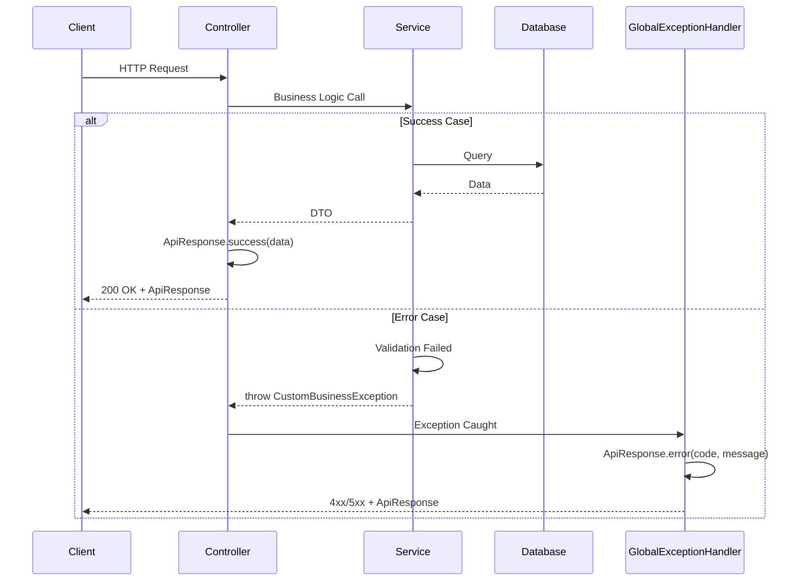
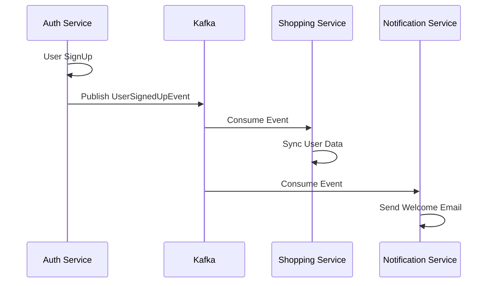
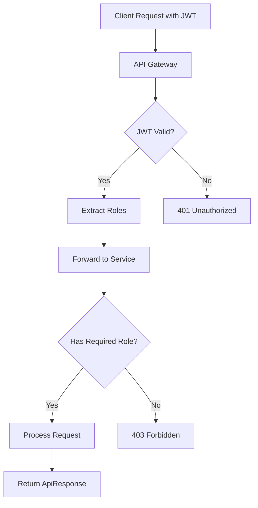

# Common Library 사용 가이드

## 개요

이 가이드는 각 마이크로서비스에서 `common-library`를 실제로 사용하는 방법을 단계별로 설명합니다. common-library는 Portal Universe의 모든 서비스에서 **API 응답 표준화**, **예외 처리**, **JWT 보안**, **이벤트 기반 통신**을 일관되게 구현하기 위한 공유 라이브러리입니다.

## 목차

- [설정](#설정)
- [API 응답](#api-응답)
- [예외 처리](#예외-처리)
- [JWT 보안](#jwt-보안)
- [이벤트 기반 통신](#이벤트-기반-통신)
- [서비스별 가이드](#서비스별-가이드)
- [체크리스트](#체크리스트)
- [문제 해결](#문제-해결)

---

## 설정

### 1단계: build.gradle에 의존성 추가

모든 마이크로서비스는 `build.gradle`에 common-library 의존성을 추가해야 합니다.

```gradle
dependencies {
    implementation 'com.portal.universe:common-library:0.0.1-SNAPSHOT'

    // JWT 보안을 사용하는 경우
    implementation 'org.springframework.boot:spring-boot-starter-security'
    implementation 'org.springframework.security:spring-security-oauth2-resource-server'
    implementation 'org.springframework.security:spring-security-oauth2-jose'

    // 이벤트 발행/구독을 사용하는 경우
    implementation 'org.springframework.kafka:spring-kafka'
}
```

### 2단계: application.yml 구성

JWT 보안을 사용하는 서비스는 다음 설정을 추가합니다:

#### 로컬 개발 환경

```yaml
spring:
  security:
    oauth2:
      resourceserver:
        jwt:
          issuer-uri: http://localhost:8081
          jwk-set-uri: http://localhost:8081/.well-known/jwks.json
```

#### Docker Compose 환경

```yaml
spring:
  security:
    oauth2:
      resourceserver:
        jwt:
          issuer-uri: http://auth-service:8081
          jwk-set-uri: http://auth-service:8081/.well-known/jwks.json
```

#### Kubernetes 환경

```yaml
spring:
  security:
    oauth2:
      resourceserver:
        jwt:
          issuer-uri: http://auth-service.default.svc.cluster.local:8081
          jwk-set-uri: http://auth-service.default.svc.cluster.local:8081/.well-known/jwks.json
```

### 3단계: 자동 설정 확인

common-library는 Spring Boot Auto-Configuration을 통해 자동으로 다음 Bean들을 등록합니다:

- `GlobalExceptionHandler` - 전역 예외 처리
- `JwtAuthenticationConverter` (Servlet) 또는 `ReactiveJwtAuthenticationConverter` (Reactive) - JWT 권한 변환

**로그 확인:**
```
INFO ... : GlobalExceptionHandler initialized
INFO ... : Registering JwtAuthenticationConverter...
```

---

## API 응답

### 성공 응답 작성

모든 Controller 메서드는 `ApiResponse<T>`로 감싼 응답을 반환해야 합니다.

#### 데이터 반환 예시

```java
package com.portal.universe.shoppingservice.controller;

import com.portal.universe.commonlibrary.response.ApiResponse;
import lombok.RequiredArgsConstructor;
import org.springframework.http.ResponseEntity;
import org.springframework.web.bind.annotation.*;

import java.util.List;

@RestController
@RequestMapping("/api/v1/products")
@RequiredArgsConstructor
public class ProductController {

    private final ProductService productService;

    /**
     * 단일 상품 조회
     */
    @GetMapping("/{id}")
    public ResponseEntity<ApiResponse<ProductResponse>> getProduct(
            @PathVariable Long id) {
        ProductResponse product = productService.getProduct(id);
        return ResponseEntity.ok(ApiResponse.success(product));
    }

    /**
     * 전체 상품 목록 조회
     */
    @GetMapping
    public ResponseEntity<ApiResponse<List<ProductResponse>>> getAllProducts() {
        List<ProductResponse> products = productService.getAllProducts();
        return ResponseEntity.ok(ApiResponse.success(products));
    }
}
```

**응답 예시 (200 OK):**
```json
{
  "success": true,
  "data": {
    "id": 1,
    "name": "Product A",
    "price": 29.99
  }
}
```

#### null 데이터 반환 (생성/수정/삭제)

`ApiResponse.success(null)`은 JSON에서 `data` 필드를 완전히 제외합니다.

```java
@PostMapping
public ResponseEntity<ApiResponse<Void>> createProduct(
        @RequestBody @Valid ProductRequest request) {
    productService.createProduct(request);
    return ResponseEntity.status(HttpStatus.CREATED)
        .body(ApiResponse.success(null));
}

@DeleteMapping("/{id}")
public ResponseEntity<ApiResponse<Void>> deleteProduct(
        @PathVariable Long id) {
    productService.deleteProduct(id);
    return ResponseEntity.ok(ApiResponse.success(null));
}
```

**응답 예시 (201 Created):**
```json
{
  "success": true
}
```

#### 응답 DTO 설계 패턴

ResponseDTO는 Lombok `@Getter`로 표시하고, 필드를 `final`로 선언합니다:

```java
package com.portal.universe.shoppingservice.dto;

import lombok.Getter;
import java.math.BigDecimal;
import java.time.LocalDateTime;

@Getter
public class ProductResponse {
    private final Long id;
    private final String name;
    private final BigDecimal price;
    private final int stock;
    private final LocalDateTime createdAt;

    public ProductResponse(Product product) {
        this.id = product.getId();
        this.name = product.getName();
        this.price = product.getPrice();
        this.stock = product.getStock();
        this.createdAt = product.getCreatedAt();
    }
}
```

---

## 예외 처리

### ErrorCode Enum 정의

각 서비스는 자신의 `[Service]ErrorCode` Enum을 정의합니다.

#### 서비스별 에러코드 접두사

| 서비스 | 접두사 | 예시 |
|--------|--------|------|
| Common | C | C001, C002, C003 |
| Auth | A | A001, A002, ... |
| Blog | B | B001, B002, B003, ... |
| Shopping | S | S001, S002, S003, ... |
| Notification | N | N001, N002, ... |

#### Shopping Service 예시

```java
package com.portal.universe.shoppingservice.common.exception;

import com.portal.universe.commonlibrary.exception.ErrorCode;
import lombok.Getter;
import org.springframework.http.HttpStatus;

@Getter
public enum ShoppingErrorCode implements ErrorCode {

    // 상품 관련 (S001 ~ S099)
    PRODUCT_NOT_FOUND(
        HttpStatus.NOT_FOUND,
        "S001",
        "Product not found"
    ),
    DUPLICATE_PRODUCT(
        HttpStatus.BAD_REQUEST,
        "S002",
        "Product with same name already exists"
    ),
    INVALID_QUANTITY(
        HttpStatus.BAD_REQUEST,
        "S003",
        "Invalid quantity value"
    ),
    INSUFFICIENT_STOCK(
        HttpStatus.BAD_REQUEST,
        "S004",
        "Insufficient stock for product"
    ),

    // 주문 관련 (S100 ~ S199)
    ORDER_NOT_FOUND(
        HttpStatus.NOT_FOUND,
        "S100",
        "Order not found"
    ),
    INVALID_ORDER_STATE(
        HttpStatus.BAD_REQUEST,
        "S101",
        "Invalid order state for this operation"
    ),
    ORDER_ALREADY_CANCELLED(
        HttpStatus.BAD_REQUEST,
        "S102",
        "Order has already been cancelled"
    ),

    // 결제 관련 (S200 ~ S299)
    PAYMENT_FAILED(
        HttpStatus.BAD_REQUEST,
        "S200",
        "Payment processing failed"
    ),
    INVALID_PAYMENT_METHOD(
        HttpStatus.BAD_REQUEST,
        "S201",
        "Invalid payment method"
    );

    private final HttpStatus status;
    private final String code;
    private final String message;

    ShoppingErrorCode(HttpStatus status, String code, String message) {
        this.status = status;
        this.code = code;
        this.message = message;
    }
}
```

#### Blog Service 예시

```java
package com.portal.universe.blogservice.common.exception;

import com.portal.universe.commonlibrary.exception.ErrorCode;
import lombok.Getter;
import org.springframework.http.HttpStatus;

@Getter
public enum BlogErrorCode implements ErrorCode {

    // 게시글 관련
    POST_NOT_FOUND(
        HttpStatus.NOT_FOUND,
        "B001",
        "Post not found"
    ),
    DUPLICATE_TITLE(
        HttpStatus.BAD_REQUEST,
        "B002",
        "Post with same title already exists"
    ),

    // 댓글 관련
    COMMENT_NOT_FOUND(
        HttpStatus.NOT_FOUND,
        "B003",
        "Comment not found"
    );

    private final HttpStatus status;
    private final String code;
    private final String message;

    BlogErrorCode(HttpStatus status, String code, String message) {
        this.status = status;
        this.code = code;
        this.message = message;
    }
}
```

### Service에서 예외 발생

Service 클래스에서 `CustomBusinessException`을 발생시킵니다.

```java
package com.portal.universe.shoppingservice.service;

import com.portal.universe.commonlibrary.exception.CustomBusinessException;
import com.portal.universe.shoppingservice.common.exception.ShoppingErrorCode;
import lombok.RequiredArgsConstructor;
import org.springframework.stereotype.Service;
import org.springframework.transaction.annotation.Transactional;

@Service
@RequiredArgsConstructor
public class ProductService {

    private final ProductRepository productRepository;

    /**
     * 상품 조회
     */
    public ProductResponse getProduct(Long id) {
        return productRepository.findById(id)
            .map(ProductResponse::new)
            .orElseThrow(() -> new CustomBusinessException(
                ShoppingErrorCode.PRODUCT_NOT_FOUND
            ));
    }

    /**
     * 상품 생성
     */
    @Transactional
    public ProductResponse createProduct(ProductRequest request) {
        // 중복 검증
        if (productRepository.existsByName(request.getName())) {
            throw new CustomBusinessException(
                ShoppingErrorCode.DUPLICATE_PRODUCT
            );
        }

        // 수량 검증
        if (request.getQuantity() <= 0) {
            throw new CustomBusinessException(
                ShoppingErrorCode.INVALID_QUANTITY
            );
        }

        // 엔티티 생성 및 저장
        Product product = Product.builder()
            .name(request.getName())
            .price(request.getPrice())
            .stock(request.getQuantity())
            .build();

        Product saved = productRepository.save(product);

        return new ProductResponse(saved);
    }

    /**
     * 재고 감소
     */
    @Transactional
    public void decreaseStock(Long productId, int quantity) {
        Product product = productRepository.findById(productId)
            .orElseThrow(() -> new CustomBusinessException(
                ShoppingErrorCode.PRODUCT_NOT_FOUND
            ));

        if (product.getStock() < quantity) {
            throw new CustomBusinessException(
                ShoppingErrorCode.INSUFFICIENT_STOCK
            );
        }

        product.decreaseStock(quantity);
    }
}
```

### 예외 처리 결과

발생된 예외는 `GlobalExceptionHandler`에 의해 자동으로 처리되어 API 응답으로 변환됩니다.

**404 응답 예시:**
```json
HTTP/1.1 404 Not Found

{
  "success": false,
  "error": {
    "code": "S001",
    "message": "Product not found"
  }
}
```

**400 응답 예시:**
```json
HTTP/1.1 400 Bad Request

{
  "success": false,
  "error": {
    "code": "S004",
    "message": "Insufficient stock for product"
  }
}
```

### 예외 로깅

`GlobalExceptionHandler`가 자동으로 로깅하므로, 서비스 개발자는 별도의 로깅 처리가 불필요합니다.

```
[ERROR] handleCustomBusinessException: Insufficient stock for product
com.portal.universe.commonlibrary.exception.CustomBusinessException: Insufficient stock for product
    at com.portal.universe.shoppingservice.service.ProductService.decreaseStock(ProductService.java:45)
    ...
```

---

## JWT 보안

### 자동 설정 확인

common-library를 추가하면 `JwtSecurityAutoConfiguration`이 자동으로 로드됩니다.

```
spring-boot-starter-security 감지
    ↓
JwtSecurityAutoConfiguration 자동 로드
    ↓
JwtAuthenticationConverter Bean 등록 (Servlet)
또는
ReactiveJwtAuthenticationConverter Bean 등록 (Reactive)
```

**애플리케이션 로그:**
```
INFO ... : Registering JwtAuthenticationConverter...
INFO ... : JWT Security Auto-Configuration enabled
```

### Spring Security 설정 (선택적 커스터마이징)

기본 설정으로 충분하면 별도 설정이 불필요합니다. 필요한 경우 다음과 같이 커스터마이징할 수 있습니다:

#### Servlet 환경 (Spring MVC)

```java
package com.portal.universe.shoppingservice.config;

import org.springframework.context.annotation.Bean;
import org.springframework.context.annotation.Configuration;
import org.springframework.security.config.annotation.method.configuration.EnableMethodSecurity;
import org.springframework.security.config.annotation.web.builders.HttpSecurity;
import org.springframework.security.config.annotation.web.configuration.EnableWebSecurity;
import org.springframework.security.web.SecurityFilterChain;

@Configuration
@EnableWebSecurity
@EnableMethodSecurity // @PreAuthorize, @Secured 사용 가능
public class SecurityConfig {

    @Bean
    public SecurityFilterChain filterChain(HttpSecurity http) throws Exception {
        http
            .authorizeHttpRequests(auth -> auth
                .requestMatchers("/api/public/**").permitAll()
                .requestMatchers("/actuator/health").permitAll()
                .requestMatchers("/api/v1/**").authenticated()
                .anyRequest().authenticated()
            )
            .oauth2ResourceServer(oauth2 -> oauth2
                .jwt(jwt -> {
                    // common-library의 JwtAuthenticationConverter 자동 사용
                })
            )
            .csrf(csrf -> csrf.disable()); // REST API는 CSRF 비활성화

        return http.build();
    }
}
```

#### Reactive 환경 (Spring WebFlux - API Gateway)

```java
package com.portal.universe.apigateway.config;

import org.springframework.context.annotation.Bean;
import org.springframework.context.annotation.Configuration;
import org.springframework.security.config.annotation.web.reactive.EnableWebFluxSecurity;
import org.springframework.security.config.web.server.ServerHttpSecurity;
import org.springframework.security.web.server.SecurityWebFilterChain;

@Configuration
@EnableWebFluxSecurity
public class SecurityConfig {

    @Bean
    public SecurityWebFilterChain springSecurityFilterChain(ServerHttpSecurity http) {
        http
            .authorizeExchange(exchange -> exchange
                .pathMatchers("/api/public/**").permitAll()
                .pathMatchers("/actuator/health").permitAll()
                .pathMatchers("/api/v1/**").authenticated()
                .anyExchange().authenticated()
            )
            .oauth2ResourceServer(oauth2 -> oauth2
                .jwt(jwt -> {
                    // common-library의 ReactiveJwtAuthenticationConverter 자동 사용
                })
            )
            .csrf(csrf -> csrf.disable());

        return http.build();
    }
}
```

### 권한 기반 접근 제어

Spring Security의 `@PreAuthorize`, `@Secured` 등을 사용합니다.

```java
package com.portal.universe.shoppingservice.controller;

import org.springframework.security.access.prepost.PreAuthorize;
import org.springframework.web.bind.annotation.*;

@RestController
@RequestMapping("/api/v1/admin/products")
public class AdminProductController {

    /**
     * ROLE_ADMIN 권한만 접근 가능
     */
    @PreAuthorize("hasRole('ADMIN')")
    @PostMapping
    public ResponseEntity<ApiResponse<ProductResponse>> createProduct(
            @RequestBody ProductRequest request) {
        // ...
    }

    /**
     * ROLE_USER 또는 ROLE_ADMIN 권한 필요
     */
    @PreAuthorize("hasAnyRole('USER', 'ADMIN')")
    @GetMapping("/{id}")
    public ResponseEntity<ApiResponse<ProductResponse>> getProduct(
            @PathVariable Long id) {
        // ...
    }

    /**
     * 특정 권한(authorities) 체크
     */
    @PreAuthorize("hasAuthority('WRITE_PRODUCT')")
    @PutMapping("/{id}")
    public ResponseEntity<ApiResponse<ProductResponse>> updateProduct(
            @PathVariable Long id,
            @RequestBody ProductRequest request) {
        // ...
    }
}
```

### 현재 사용자 정보 접근

```java
package com.portal.universe.shoppingservice.controller;

import org.springframework.security.core.annotation.AuthenticationPrincipal;
import org.springframework.security.oauth2.jwt.Jwt;
import org.springframework.web.bind.annotation.*;

@RestController
@RequestMapping("/api/v1/users")
public class UserController {

    /**
     * JWT에서 사용자 정보 추출
     */
    @GetMapping("/me")
    public ResponseEntity<ApiResponse<UserInfo>> getCurrentUser(
            @AuthenticationPrincipal Jwt jwt) {

        String userId = jwt.getSubject();
        String email = jwt.getClaimAsString("email");
        List<String> roles = jwt.getClaimAsStringList("roles");

        UserInfo userInfo = new UserInfo(userId, email, roles);

        return ResponseEntity.ok(ApiResponse.success(userInfo));
    }
}
```

**JWT 페이로드 예시:**
```json
{
  "sub": "user123",
  "email": "user@example.com",
  "roles": ["ROLE_USER"],
  "iss": "http://auth-service:8081",
  "exp": 1705577824
}
```

---

## 이벤트 기반 통신

### 이벤트 발행 (Publisher)

Kafka를 사용하여 이벤트를 발행합니다.

#### 주문 생성 이벤트 발행 예시

```java
package com.portal.universe.shoppingservice.service;

import com.portal.universe.common.event.shopping.OrderCreatedEvent;
import lombok.RequiredArgsConstructor;
import org.springframework.kafka.core.KafkaTemplate;
import org.springframework.stereotype.Service;
import org.springframework.transaction.annotation.Transactional;

@Service
@RequiredArgsConstructor
public class OrderService {

    private final OrderRepository orderRepository;
    private final KafkaTemplate<String, OrderCreatedEvent> kafkaTemplate;

    @Transactional
    public OrderResponse createOrder(OrderRequest request) {
        // 1. 주문 생성
        Order order = Order.builder()
            .userId(request.getUserId())
            .build();

        for (OrderItemRequest itemRequest : request.getItems()) {
            order.addItem(
                itemRequest.getProductId(),
                itemRequest.getProductName(),
                itemRequest.getQuantity(),
                itemRequest.getPrice()
            );
        }

        Order saved = orderRepository.save(order);

        // 2. 이벤트 객체 생성
        OrderCreatedEvent event = new OrderCreatedEvent(
            saved.getOrderNumber(),
            saved.getUserId(),
            saved.getTotalAmount(),
            saved.getItemCount(),
            saved.getItems().stream()
                .map(item -> new OrderCreatedEvent.OrderItemInfo(
                    item.getProductId(),
                    item.getProductName(),
                    item.getQuantity(),
                    item.getPrice()
                ))
                .toList(),
            saved.getCreatedAt()
        );

        // 3. Kafka 토픽으로 이벤트 발행
        kafkaTemplate.send("order-created-events", event);

        // 4. 응답 반환
        return new OrderResponse(saved);
    }
}
```

### 이벤트 구독 (Subscriber)

#### Notification Service에서 이벤트 구독

```java
package com.portal.universe.notificationservice.service;

import com.portal.universe.common.event.UserSignedUpEvent;
import com.portal.universe.common.event.shopping.OrderCreatedEvent;
import com.portal.universe.common.event.shopping.PaymentCompletedEvent;
import lombok.RequiredArgsConstructor;
import lombok.extern.slf4j.Slf4j;
import org.springframework.kafka.annotation.KafkaListener;
import org.springframework.stereotype.Service;

@Slf4j
@Service
@RequiredArgsConstructor
public class EventListenerService {

    private final EmailService emailService;

    /**
     * 사용자 가입 이벤트 처리
     */
    @KafkaListener(topics = "user-signup-events", groupId = "notification-service")
    public void handleUserSignedUp(UserSignedUpEvent event) {
        log.info("User signed up: {}", event.email());

        // 환영 이메일 발송
        String message = String.format(
            "Welcome %s! Your account has been created successfully.",
            event.name()
        );

        emailService.sendEmail(
            event.email(),
            "Welcome to Portal Universe",
            message
        );
    }

    /**
     * 주문 생성 이벤트 처리
     */
    @KafkaListener(topics = "order-created-events", groupId = "notification-service")
    public void handleOrderCreated(OrderCreatedEvent event) {
        log.info("Order created: {}", event.orderNumber());

        // 주문 확인 이메일 발송
        String message = String.format(
            "Your order %s has been created with total amount: $%s",
            event.orderNumber(),
            event.totalAmount()
        );

        emailService.sendEmail(
            getUserEmail(event.userId()),
            "Order Confirmation",
            message
        );
    }

    /**
     * 결제 완료 이벤트 처리
     */
    @KafkaListener(topics = "payment-completed-events", groupId = "notification-service")
    public void handlePaymentCompleted(PaymentCompletedEvent event) {
        log.info("Payment completed: {}", event.paymentNumber());

        // 결제 영수증 발송
        String message = String.format(
            "Payment of $%s has been completed for order %s",
            event.amount(),
            event.orderNumber()
        );

        emailService.sendEmail(
            getUserEmail(event.userId()),
            "Payment Confirmation",
            message
        );
    }

    private String getUserEmail(String userId) {
        // User 조회 로직
        return "user@example.com";
    }
}
```

#### Shopping Service에서 사용자 가입 이벤트 구독

```java
package com.portal.universe.shoppingservice.service;

import com.portal.universe.common.event.UserSignedUpEvent;
import lombok.RequiredArgsConstructor;
import lombok.extern.slf4j.Slf4j;
import org.springframework.kafka.annotation.KafkaListener;
import org.springframework.stereotype.Service;

@Slf4j
@Service
@RequiredArgsConstructor
public class UserSyncService {

    private final UserRepository userRepository;

    /**
     * Auth Service에서 발행한 사용자 가입 이벤트를 구독하여
     * Shopping Service의 User 테이블에 동기화
     */
    @KafkaListener(topics = "user-signup-events", groupId = "shopping-service")
    public void handleUserSignedUp(UserSignedUpEvent event) {
        log.info("Syncing user from Auth Service: {}", event.email());

        User user = User.builder()
            .authUserId(event.userId())
            .email(event.email())
            .name(event.name())
            .build();

        userRepository.save(user);

        log.info("User synced successfully: {}", event.userId());
    }
}
```

### Kafka 설정

#### Producer 설정 (Shopping Service)

```yaml
spring:
  kafka:
    bootstrap-servers: localhost:9092
    producer:
      key-serializer: org.apache.kafka.common.serialization.StringSerializer
      value-serializer: org.springframework.kafka.support.serializer.JsonSerializer
      acks: all
      retries: 3
      properties:
        max.in.flight.requests.per.connection: 1
```

#### Consumer 설정 (Notification Service)

```yaml
spring:
  kafka:
    bootstrap-servers: localhost:9092
    consumer:
      group-id: notification-service
      key-deserializer: org.apache.kafka.common.serialization.StringDeserializer
      value-deserializer: org.springframework.kafka.support.serializer.JsonDeserializer
      auto-offset-reset: earliest
      properties:
        spring.json.type.mapping: >
          userSignedUpEvent:com.portal.universe.common.event.UserSignedUpEvent,
          orderCreatedEvent:com.portal.universe.common.event.shopping.OrderCreatedEvent,
          paymentCompletedEvent:com.portal.universe.common.event.shopping.PaymentCompletedEvent,
          paymentFailedEvent:com.portal.universe.common.event.shopping.PaymentFailedEvent
```

---

## 서비스별 가이드

### 1. Auth Service (인증 서비스)

#### 사용하는 기능
- ✅ ApiResponse (응답 표준화)
- ✅ ErrorCode 및 CustomBusinessException
- ✅ UserSignedUpEvent 발행

#### build.gradle

```gradle
dependencies {
    implementation 'com.portal.universe:common-library:0.0.1-SNAPSHOT'
    implementation 'org.springframework.boot:spring-boot-starter-security'
    implementation 'org.springframework.security:spring-security-oauth2-authorization-server'
    implementation 'org.springframework.kafka:spring-kafka'
}
```

#### 주요 클래스

```java
package com.portal.universe.authservice.service;

import com.portal.universe.authservice.common.exception.AuthErrorCode;
import com.portal.universe.common.event.UserSignedUpEvent;
import com.portal.universe.commonlibrary.exception.CustomBusinessException;
import lombok.RequiredArgsConstructor;
import org.springframework.kafka.core.KafkaTemplate;
import org.springframework.security.crypto.password.PasswordEncoder;
import org.springframework.stereotype.Service;
import org.springframework.transaction.annotation.Transactional;

@Service
@RequiredArgsConstructor
public class AuthService {

    private final UserRepository userRepository;
    private final PasswordEncoder passwordEncoder;
    private final KafkaTemplate<String, UserSignedUpEvent> kafkaTemplate;

    @Transactional
    public SignUpResponse signUp(SignUpRequest request) {
        // 이메일 중복 검증
        if (userRepository.existsByEmail(request.getEmail())) {
            throw new CustomBusinessException(
                AuthErrorCode.DUPLICATE_EMAIL
            );
        }

        // 사용자 생성
        User user = User.builder()
            .email(request.getEmail())
            .password(passwordEncoder.encode(request.getPassword()))
            .name(request.getName())
            .build();

        User saved = userRepository.save(user);

        // 이벤트 발행
        UserSignedUpEvent event = new UserSignedUpEvent(
            saved.getId(),
            saved.getEmail(),
            saved.getName()
        );
        kafkaTemplate.send("user-signup-events", event);

        return new SignUpResponse(saved.getId(), saved.getEmail());
    }
}
```

---

### 2. Shopping Service (쇼핑 서비스)

#### 사용하는 기능
- ✅ ApiResponse (응답 표준화)
- ✅ ErrorCode 및 CustomBusinessException
- ✅ Shopping 도메인 이벤트 발행
- ✅ UserSignedUpEvent 구독
- ✅ JWT 보안

#### build.gradle

```gradle
dependencies {
    implementation 'com.portal.universe:common-library:0.0.1-SNAPSHOT'
    implementation 'org.springframework.boot:spring-boot-starter-security'
    implementation 'org.springframework.security:spring-security-oauth2-resource-server'
    implementation 'org.springframework.security:spring-security-oauth2-jose'
    implementation 'org.springframework.kafka:spring-kafka'
}
```

#### 주요 클래스

```java
package com.portal.universe.shoppingservice.service;

import com.portal.universe.commonlibrary.exception.CustomBusinessException;
import com.portal.universe.shoppingservice.common.exception.ShoppingErrorCode;
import lombok.RequiredArgsConstructor;
import org.springframework.stereotype.Service;
import org.springframework.transaction.annotation.Transactional;

@Service
@RequiredArgsConstructor
public class ProductService {

    private final ProductRepository productRepository;

    public ProductResponse getProduct(Long id) {
        return productRepository.findById(id)
            .map(ProductResponse::new)
            .orElseThrow(() -> new CustomBusinessException(
                ShoppingErrorCode.PRODUCT_NOT_FOUND
            ));
    }

    @Transactional
    public ProductResponse createProduct(ProductRequest request) {
        if (productRepository.existsByName(request.getName())) {
            throw new CustomBusinessException(
                ShoppingErrorCode.DUPLICATE_PRODUCT
            );
        }

        Product product = Product.builder()
            .name(request.getName())
            .price(request.getPrice())
            .stock(request.getStock())
            .build();

        Product saved = productRepository.save(product);

        return new ProductResponse(saved);
    }
}
```

---

### 3. Blog Service (블로그 서비스)

#### 사용하는 기능
- ✅ ApiResponse (응답 표준화)
- ✅ ErrorCode 및 CustomBusinessException
- ✅ JWT 보안 (댓글 작성자 인증)

#### build.gradle

```gradle
dependencies {
    implementation 'com.portal.universe:common-library:0.0.1-SNAPSHOT'
    implementation 'org.springframework.boot:spring-boot-starter-security'
    implementation 'org.springframework.security:spring-security-oauth2-resource-server'
    implementation 'org.springframework.security:spring-security-oauth2-jose'
}
```

#### 주요 클래스

```java
package com.portal.universe.blogservice.service;

import com.portal.universe.blogservice.common.exception.BlogErrorCode;
import com.portal.universe.commonlibrary.exception.CustomBusinessException;
import lombok.RequiredArgsConstructor;
import org.springframework.stereotype.Service;
import org.springframework.transaction.annotation.Transactional;

@Service
@RequiredArgsConstructor
public class PostService {

    private final PostRepository postRepository;

    @Transactional
    public PostResponse createPost(PostRequest request) {
        if (postRepository.existsByTitle(request.getTitle())) {
            throw new CustomBusinessException(
                BlogErrorCode.DUPLICATE_TITLE
            );
        }

        Post post = Post.builder()
            .title(request.getTitle())
            .content(request.getContent())
            .build();

        Post saved = postRepository.save(post);

        return new PostResponse(saved);
    }

    public PostResponse getPost(String id) {
        return postRepository.findById(id)
            .map(PostResponse::new)
            .orElseThrow(() -> new CustomBusinessException(
                BlogErrorCode.POST_NOT_FOUND
            ));
    }
}
```

---

### 4. Notification Service (알림 서비스)

#### 사용하는 기능
- ✅ 모든 도메인 이벤트 구독
- ✅ ApiResponse (상태 응답)
- ✅ 에러 처리

#### build.gradle

```gradle
dependencies {
    implementation 'com.portal.universe:common-library:0.0.1-SNAPSHOT'
    implementation 'org.springframework.kafka:spring-kafka'
}
```

#### 주요 클래스

위의 [이벤트 구독](#이벤트-구독-subscriber) 섹션 참조

---

### 5. API Gateway (게이트웨이)

#### 사용하는 기능
- ✅ JWT 보안 (Reactive)
- ✅ 요청 라우팅 및 인증
- ✅ 응답 처리

#### build.gradle

```gradle
dependencies {
    implementation 'com.portal.universe:common-library:0.0.1-SNAPSHOT'
    implementation 'org.springframework.cloud:spring-cloud-starter-gateway'
    implementation 'org.springframework.boot:spring-boot-starter-webflux'
    implementation 'org.springframework.boot:spring-boot-starter-security'
    implementation 'org.springframework.security:spring-security-oauth2-resource-server'
    implementation 'org.springframework.security:spring-security-oauth2-jose'
}
```

#### 주요 설정

```java
package com.portal.universe.apigateway.config;

import org.springframework.cloud.gateway.route.RouteLocator;
import org.springframework.cloud.gateway.route.builder.RouteLocatorBuilder;
import org.springframework.context.annotation.Bean;
import org.springframework.context.annotation.Configuration;

@Configuration
public class GatewayConfig {

    @Bean
    public RouteLocator routes(RouteLocatorBuilder builder) {
        return builder.routes()
            .route("auth-service", r -> r
                .path("/api/v1/auth/**")
                .uri("http://auth-service:8081"))
            .route("shopping-service", r -> r
                .path("/api/v1/shopping/**")
                .uri("http://shopping-service:8083"))
            .route("blog-service", r -> r
                .path("/api/v1/blog/**")
                .uri("http://blog-service:8082"))
            .route("notification-service", r -> r
                .path("/api/v1/notifications/**")
                .uri("http://notification-service:8084"))
            .build();
    }
}
```

---

## 체크리스트

새 마이크로서비스를 생성할 때 다음을 확인하세요:

### 의존성 설정
- [ ] build.gradle에 `common-library` 의존성 추가
- [ ] JWT 보안 사용 시 `spring-boot-starter-security` 추가
- [ ] 이벤트 사용 시 `spring-kafka` 추가

### 설정 파일
- [ ] application.yml에 JWT 설정 추가 (필요 시)
- [ ] Kafka bootstrap-servers 설정 (필요 시)
- [ ] 환경별 설정 분리 (local, docker, k8s)

### 코드 작성
- [ ] `[Service]ErrorCode` Enum 정의 (ErrorCode 인터페이스 구현)
- [ ] 모든 Controller가 `ApiResponse<T>`로 응답 래핑
- [ ] Service에서 `CustomBusinessException` 사용
- [ ] JWT가 필요한 엔드포인트에 `@PreAuthorize` 추가

### 이벤트
- [ ] Kafka 토픽 정의
- [ ] 이벤트 발행 코드 작성 (Producer)
- [ ] 이벤트 구독 코드 작성 (Consumer)
- [ ] type-mapping 설정 추가

### 테스트
- [ ] Controller 테스트 - ApiResponse 형식 검증
- [ ] Service 테스트 - CustomBusinessException 발생 검증
- [ ] 통합 테스트 - JWT 인증 검증
- [ ] 이벤트 테스트 - Kafka 발행/구독 검증

---

## 문제 해결

### JWT 토큰이 인식되지 않음

**증상:** 401 Unauthorized

**원인:**
1. JWT 설정이 잘못되었을 가능성
2. issuer-uri와 실제 토큰의 "iss" 클레임 불일치
3. jwk-set-uri 접근 실패

**해결:**

1. application.yml 확인
```yaml
spring:
  security:
    oauth2:
      resourceserver:
        jwt:
          issuer-uri: http://auth-service:8081  # 정확한 주소 확인
          jwk-set-uri: http://auth-service:8081/.well-known/jwks.json
```

2. JWT 토큰의 "iss" 클레임 확인
```bash
# JWT 디코딩 (jwt.io 또는 jq 사용)
echo "eyJhbGc..." | base64 -d | jq .
```

3. Auth Service 연결 확인
```bash
curl http://auth-service:8081/.well-known/jwks.json
```

---

### CustomBusinessException이 처리되지 않음

**증상:** 500 Internal Server Error with stack trace

**원인:** GlobalExceptionHandler가 등록되지 않았을 가능성

**해결:**

1. common-library 의존성 확인
```gradle
dependencies {
    implementation 'com.portal.universe:common-library:0.0.1-SNAPSHOT'
}
```

2. 애플리케이션 로그 확인
```
INFO ... : GlobalExceptionHandler initialized
```

3. 패키지 스캔 범위 확인
```java
@SpringBootApplication
// 기본적으로 현재 패키지 및 하위 패키지를 스캔
// common-library는 자동으로 스캔됨
public class ShoppingServiceApplication {
    // ...
}
```

---

### Kafka 이벤트가 역직렬화되지 않음

**증상:** JsonMappingException, ClassNotFoundException

**원인:** type-mapping 설정이 누락되었거나 잘못됨

**해결:**

Consumer 설정에 type-mapping 추가:

```yaml
spring:
  kafka:
    consumer:
      properties:
        spring.json.type.mapping: >
          userSignedUpEvent:com.portal.universe.common.event.UserSignedUpEvent,
          orderCreatedEvent:com.portal.universe.common.event.shopping.OrderCreatedEvent,
          paymentCompletedEvent:com.portal.universe.common.event.shopping.PaymentCompletedEvent
```

**중요:**
- 왼쪽은 이벤트 타입 힌트 (camelCase)
- 오른쪽은 정확한 Java 클래스 경로
- 쉼표로 구분

---

### API Gateway에서 JWT 검증 실패

**증상:** Gateway를 통한 요청이 401 반환

**원인:** Reactive 환경 설정 누락

**해결:**

1. Reactive JWT Converter 자동 등록 확인
```
INFO ... : Registering ReactiveJwtAuthenticationConverter...
```

2. SecurityWebFilterChain 설정 확인
```java
@Bean
public SecurityWebFilterChain springSecurityFilterChain(ServerHttpSecurity http) {
    http
        .oauth2ResourceServer(oauth2 -> oauth2
            .jwt(jwt -> {
                // common-library의 ReactiveJwtAuthenticationConverter 자동 사용
            })
        );
    return http.build();
}
```

---

### CORS 에러 발생

**증상:** Browser에서 "CORS policy" 오류

**원인:** API Gateway 또는 개별 서비스에서 CORS 설정 누락

**해결:**

API Gateway에 CORS 설정 추가:

```java
@Configuration
public class CorsConfig {

    @Bean
    public CorsWebFilter corsWebFilter() {
        CorsConfiguration corsConfig = new CorsConfiguration();
        corsConfig.setAllowedOrigins(List.of("http://localhost:30000"));
        corsConfig.setAllowedMethods(List.of("GET", "POST", "PUT", "DELETE", "OPTIONS"));
        corsConfig.setAllowedHeaders(List.of("*"));
        corsConfig.setAllowCredentials(true);

        UrlBasedCorsConfigurationSource source = new UrlBasedCorsConfigurationSource();
        source.registerCorsConfiguration("/**", corsConfig);

        return new CorsWebFilter(source);
    }
}
```

---

## Mermaid 다이어그램

### API 응답 흐름



### 이벤트 기반 통신 흐름



### JWT 인증 흐름



---

## 참고 자료

### 공식 문서
- [Spring Boot Auto-Configuration](https://docs.spring.io/spring-boot/docs/current/reference/html/using.html#using.auto-configuration)
- [Spring Security OAuth2 Resource Server](https://docs.spring.io/spring-security/reference/servlet/oauth2/resource-server/index.html)
- [Spring for Apache Kafka](https://spring.io/projects/spring-kafka)

### Portal Universe 내부 문서
- [Common Library Architecture](../ARCHITECTURE.md)
- [Common Library API Reference](../API.md)
- [Backend Code Patterns](/.claude/rules/backend-patterns.md)
- [Error Handling Rules](/.claude/rules/error-handling.md)

---

**최종 수정:** 2026-01-18
**버전:** 1.0
**작성자:** Portal Universe Team
