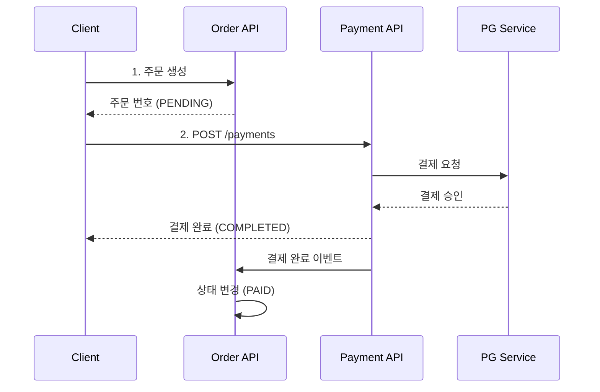

# Payment API

> 결제 관리 API (처리, 조회, 취소, 환불)

---

## 📋 개요

| 항목 | 내용 |
|------|------|
| **Base URL** | `/api/shopping/payments` |
| **인증** | Bearer Token 필요 (필수) |
| **버전** | v1 |

---

## 📑 API 목록

| Method | Endpoint | 설명 | 권한 |
|--------|----------|------|------|
| POST | `/` | 결제 처리 | USER |
| GET | `/{paymentNumber}` | 결제 조회 | USER |
| POST | `/{paymentNumber}/cancel` | 결제 취소 | USER |
| POST | `/{paymentNumber}/refund` | 결제 환불 | ADMIN |

---

## 🔹 결제 처리

결제를 처리합니다.

### Request

```http
POST /api/shopping/payments
Content-Type: application/json
Authorization: Bearer {token}

{
  "orderNumber": "ORD-20260118-001",
  "paymentMethod": "CARD",
  "amount": 70000,
  "cardInfo": {
    "cardNumber": "1234-5678-9012-3456",
    "expiryDate": "12/28",
    "cvc": "123"
  }
}
```

### Request Body

| 필드 | 타입 | 필수 | 설명 | 제약조건 |
|------|------|------|------|----------|
| `orderNumber` | string | ✅ | 주문 번호 | - |
| `paymentMethod` | string | ✅ | 결제 방법 | CARD, BANK, VIRTUAL_ACCOUNT |
| `amount` | integer | ✅ | 결제 금액 | 양수 |
| `cardInfo` | object | ⚠️ | 카드 정보 | CARD일 때 필수 |
| `cardInfo.cardNumber` | string | ⚠️ | 카드 번호 | 16자리 |
| `cardInfo.expiryDate` | string | ⚠️ | 유효기간 | MM/YY 형식 |
| `cardInfo.cvc` | string | ⚠️ | CVC | 3~4자리 |

### Payment Method

| 값 | 설명 |
|----|------|
| `CARD` | 신용/체크카드 |
| `BANK` | 실시간 계좌이체 |
| `VIRTUAL_ACCOUNT` | 가상계좌 |

### Response (200 OK)

```json
{
  "success": true,
  "data": {
    "paymentNumber": "PAY-20260118-001",
    "orderNumber": "ORD-20260118-001",
    "userId": "user123",
    "paymentMethod": "CARD",
    "amount": 70000,
    "status": "COMPLETED",
    "transactionId": "TXN-ABC123",
    "paidAt": "2026-01-18T10:35:00Z",
    "createdAt": "2026-01-18T10:35:00Z"
  },
  "timestamp": "2026-01-18T10:35:00Z"
}
```

### Payment Status

| Status | 설명 |
|--------|------|
| `PENDING` | 결제 대기 |
| `PROCESSING` | 결제 처리 중 |
| `COMPLETED` | 결제 완료 |
| `FAILED` | 결제 실패 |
| `CANCELLED` | 결제 취소 |
| `REFUNDED` | 환불 완료 |

### Error Response

```json
{
  "success": false,
  "code": "S008",
  "message": "결제 처리에 실패했습니다.",
  "timestamp": "2026-01-18T10:35:00Z"
}
```

---

## 🔹 결제 조회

결제 번호로 결제를 조회합니다.

### Request

```http
GET /api/shopping/payments/{paymentNumber}
Authorization: Bearer {token}
```

### Path Parameters

| 파라미터 | 타입 | 필수 | 설명 |
|----------|------|------|------|
| `paymentNumber` | string | ✅ | 결제 번호 (예: PAY-20260118-001) |

### Response (200 OK)

```json
{
  "success": true,
  "data": {
    "paymentNumber": "PAY-20260118-001",
    "orderNumber": "ORD-20260118-001",
    "userId": "user123",
    "paymentMethod": "CARD",
    "amount": 70000,
    "status": "COMPLETED",
    "transactionId": "TXN-ABC123",
    "paidAt": "2026-01-18T10:35:00Z",
    "createdAt": "2026-01-18T10:35:00Z",
    "updatedAt": "2026-01-18T10:35:00Z"
  },
  "timestamp": "2026-01-18T10:40:00Z"
}
```

### Error Response

```json
{
  "success": false,
  "code": "S009",
  "message": "결제를 찾을 수 없습니다.",
  "timestamp": "2026-01-18T10:40:00Z"
}
```

---

## 🔹 결제 취소

결제를 취소합니다. 결제 완료 후 일정 시간 내에만 취소 가능합니다.

### Request

```http
POST /api/shopping/payments/{paymentNumber}/cancel
Authorization: Bearer {token}
```

### Path Parameters

| 파라미터 | 타입 | 필수 | 설명 |
|----------|------|------|------|
| `paymentNumber` | string | ✅ | 결제 번호 |

### Response (200 OK)

```json
{
  "success": true,
  "data": {
    "paymentNumber": "PAY-20260118-001",
    "orderNumber": "ORD-20260118-001",
    "status": "CANCELLED",
    "amount": 70000,
    "cancelledAt": "2026-01-18T11:00:00Z",
    "updatedAt": "2026-01-18T11:00:00Z"
  },
  "timestamp": "2026-01-18T11:00:00Z"
}
```

### Error Response

```json
{
  "success": false,
  "code": "S010",
  "message": "이미 취소된 결제입니다.",
  "timestamp": "2026-01-18T11:00:00Z"
}
```

```json
{
  "success": false,
  "code": "S011",
  "message": "결제 취소 가능 시간이 지났습니다.",
  "timestamp": "2026-01-18T11:00:00Z"
}
```

---

## 🔹 결제 환불 (관리자 전용)

결제를 환불합니다. 관리자만 사용 가능합니다.

### Request

```http
POST /api/shopping/payments/{paymentNumber}/refund
Authorization: Bearer {admin_token}
```

### Path Parameters

| 파라미터 | 타입 | 필수 | 설명 |
|----------|------|------|------|
| `paymentNumber` | string | ✅ | 결제 번호 |

### Response (200 OK)

```json
{
  "success": true,
  "data": {
    "paymentNumber": "PAY-20260118-001",
    "orderNumber": "ORD-20260118-001",
    "status": "REFUNDED",
    "amount": 70000,
    "refundedAt": "2026-01-18T12:00:00Z",
    "updatedAt": "2026-01-18T12:00:00Z"
  },
  "timestamp": "2026-01-18T12:00:00Z"
}
```

---

## 🔄 결제 워크플로우



---

## ⚠️ 에러 코드

| Code | HTTP Status | 설명 |
|------|-------------|------|
| `S006` | 404 | 주문을 찾을 수 없습니다 |
| `S008` | 400 | 결제 처리에 실패했습니다 |
| `S009` | 404 | 결제를 찾을 수 없습니다 |
| `S010` | 400 | 이미 취소된 결제입니다 |
| `S011` | 400 | 결제 취소 가능 시간이 지났습니다 |
| `S012` | 400 | 결제 금액이 일치하지 않습니다 |
| `C001` | 401 | 인증 필요 |
| `C002` | 403 | 권한 없음 (ADMIN 전용) |

---

## 💳 결제 방법별 추가 정보

### 신용/체크카드 (CARD)

- 카드 번호, 유효기간, CVC 필수
- 즉시 결제 처리
- 취소 가능 기간: 결제 후 7일

### 실시간 계좌이체 (BANK)

- 은행 선택 필요
- 실시간 이체 처리
- 취소 불가 (환불만 가능)

### 가상계좌 (VIRTUAL_ACCOUNT)

- 가상계좌 발급
- 입금 대기 상태 유지
- 미입금 시 자동 취소

---

## 🔗 관련 문서

- [Order API](./order-api.md)

---

**최종 업데이트**: 2026-01-18
