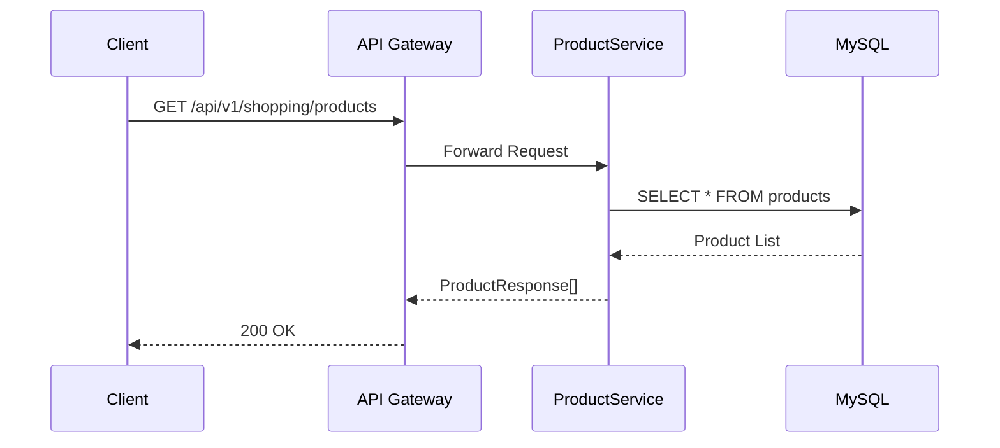
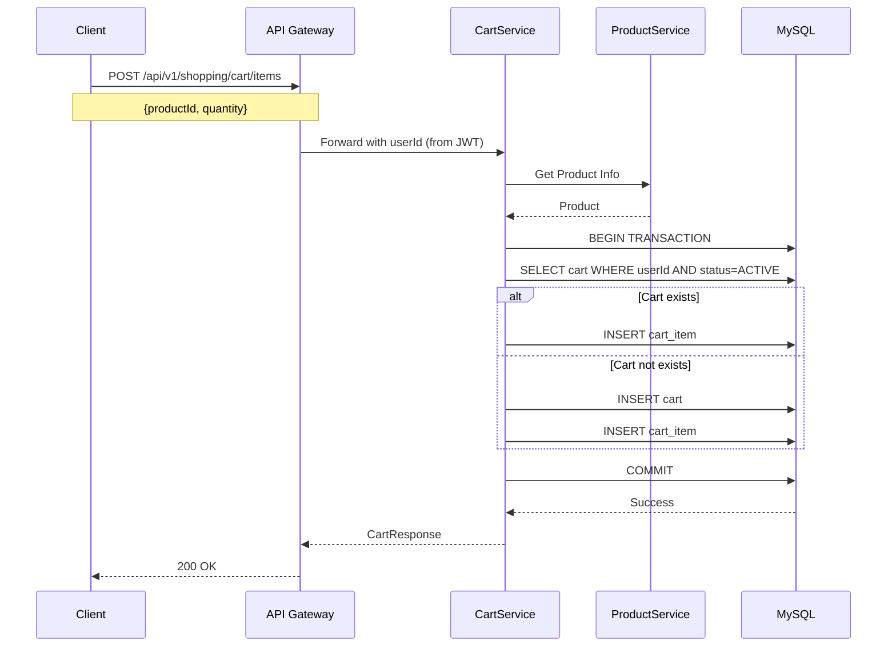
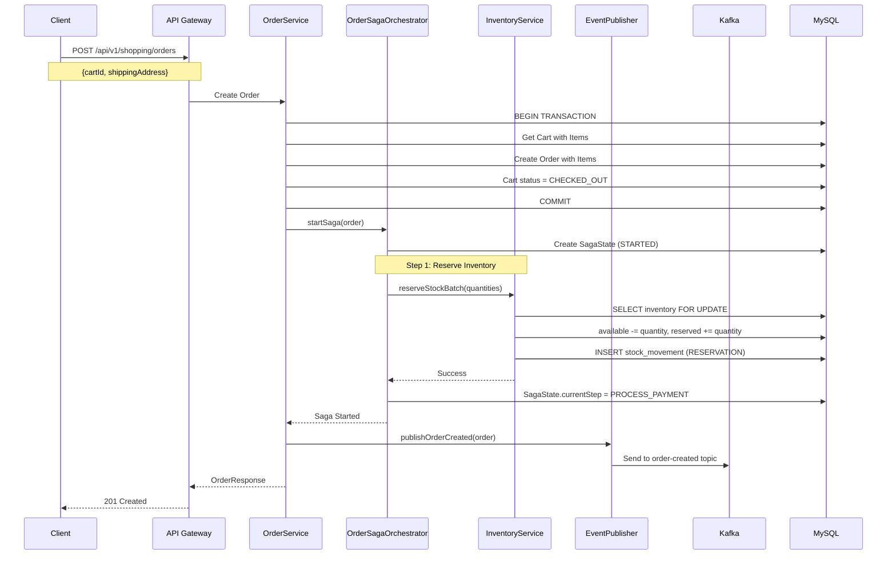
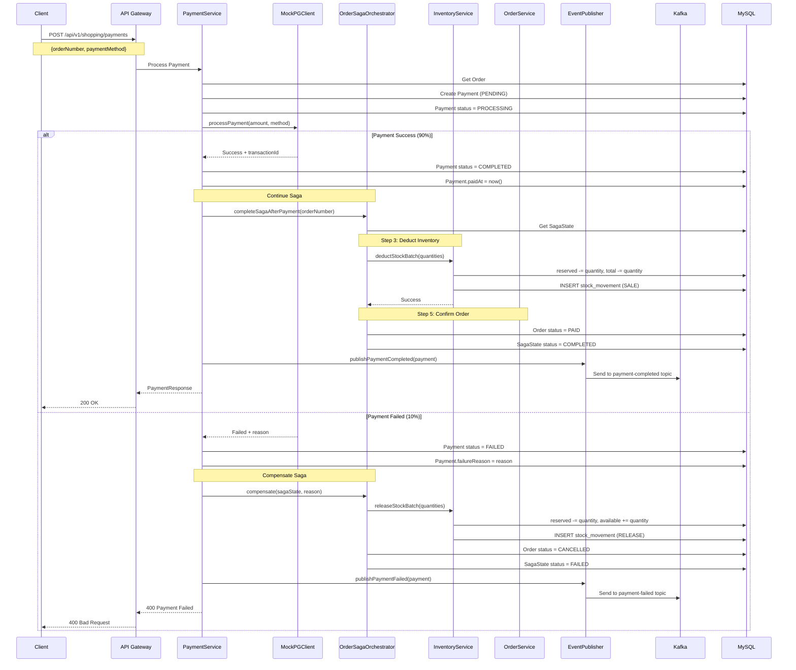
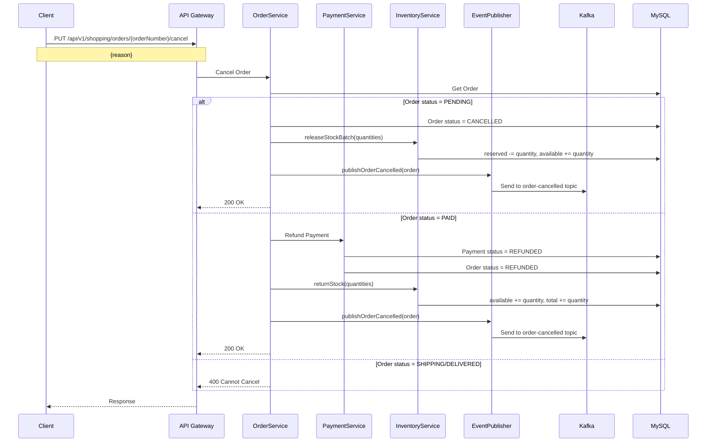
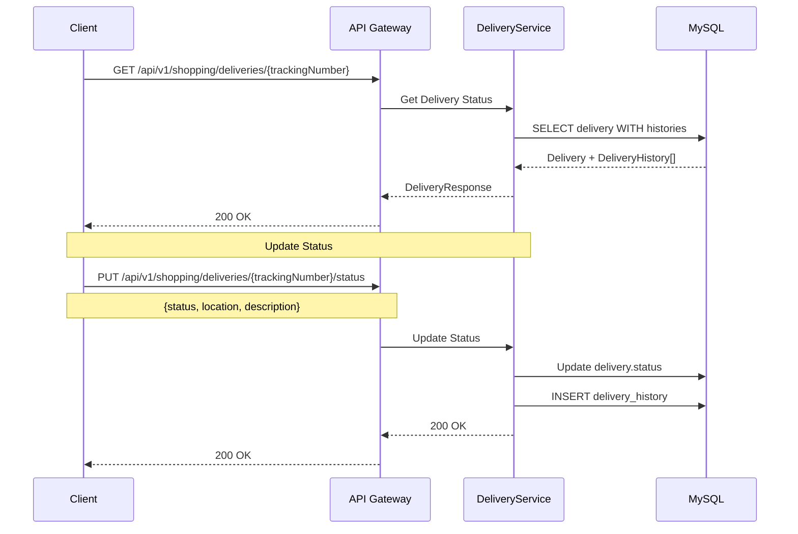
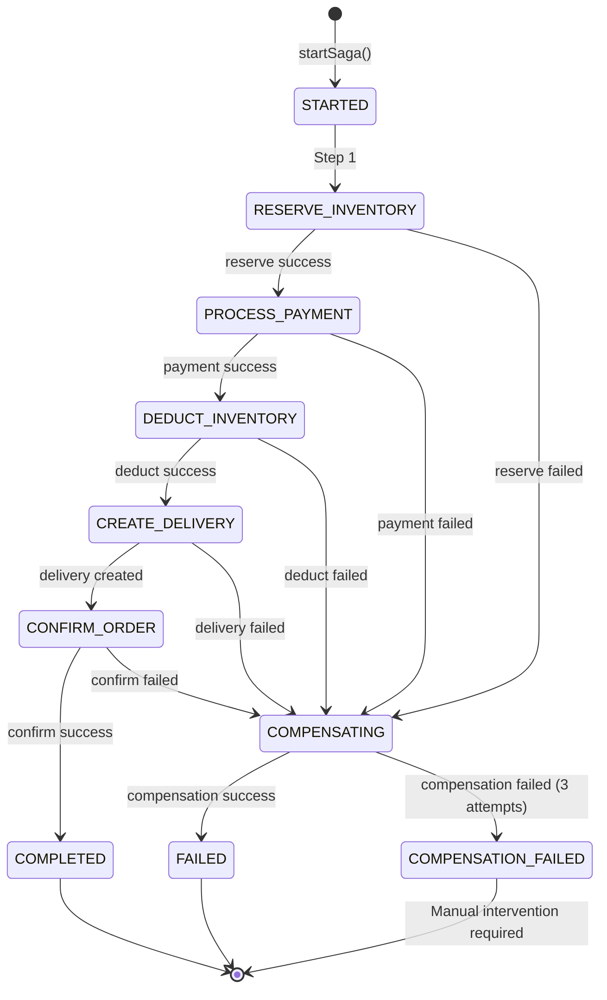
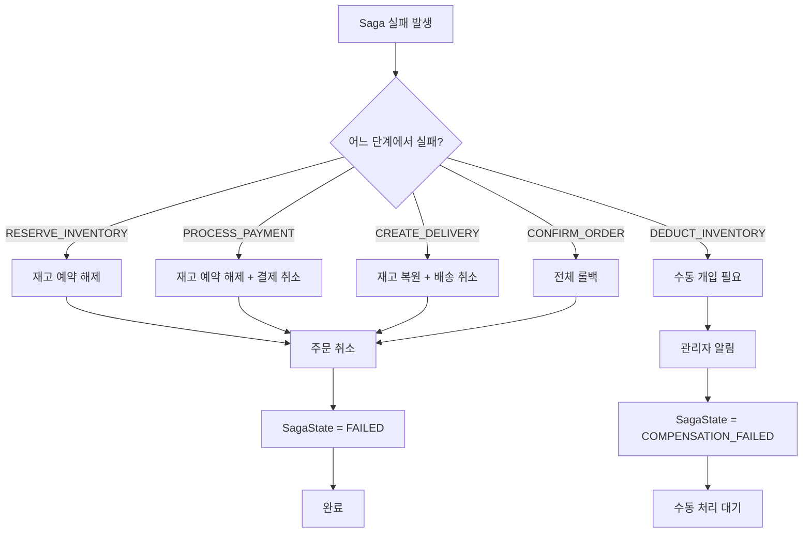
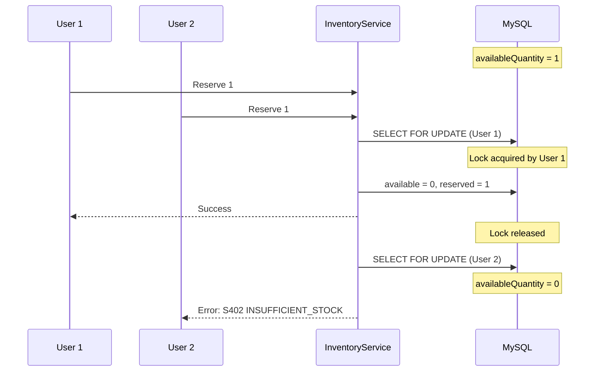

# Shopping Service Data Flow

## 📋 개요

Shopping Service의 주요 데이터 흐름과 이벤트 처리 과정을 설명합니다. 특히 주문 생성부터 결제, 재고 처리, 배송까지의 전체 흐름과 Saga 패턴을 통한 분산 트랜잭션 처리를 다룹니다.

---

## 🔄 주요 데이터 흐름

### 1. 상품 조회



**설명**:
1. 클라이언트가 상품 목록 조회 요청
2. API Gateway가 JWT 검증 후 ProductService로 라우팅
3. ProductService가 DB에서 활성 상품 조회
4. 상품 정보를 DTO로 변환하여 반환

---

### 2. 장바구니 추가



**설명**:
1. 클라이언트가 장바구니에 상품 추가 요청
2. JWT에서 userId 추출
3. 사용자의 활성 장바구니 조회 (없으면 생성)
4. 상품 정보 조회 (가격 스냅샷 저장)
5. CartItem 추가 및 저장
6. 이미 같은 상품이 있으면 S106 에러 발생

---

### 3. 주문 생성 (Saga Pattern)



**설명**:
1. 클라이언트가 주문 생성 요청 (장바구니 ID + 배송지)
2. OrderService가 장바구니 항목으로 주문 생성 (상태: PENDING)
3. OrderSagaOrchestrator가 Saga 시작
4. **Step 1**: 재고 예약
   - Pessimistic Lock으로 재고 조회
   - availableQuantity → reservedQuantity 이동
   - StockMovement 기록 (타입: RESERVATION)
5. 재고 예약 성공 시 다음 단계로 진행
6. OrderCreatedEvent 발행 (Kafka)
7. 클라이언트에 주문 번호 반환

---

### 4. 결제 처리 및 Saga 완료



**설명**:

#### 결제 성공 시:
1. Payment 생성 (상태: PENDING → PROCESSING)
2. MockPGClient 호출 (90% 성공률)
3. PG 성공 응답 → Payment.status = COMPLETED
4. **Saga 계속 진행**:
   - Step 3: 재고 차감 (reserved → 0, total 감소)
   - Step 4: 배송 생성 (별도 서비스, skip)
   - Step 5: 주문 확정 (Order.status = PAID)
   - SagaState.status = COMPLETED
5. PaymentCompletedEvent 발행

#### 결제 실패 시:
1. PG 실패 응답 → Payment.status = FAILED
2. **Saga 보상(Compensation)**:
   - 예약된 재고 해제 (reserved → available)
   - StockMovement 기록 (타입: RELEASE)
   - 주문 취소 (Order.status = CANCELLED)
   - SagaState.status = FAILED
3. PaymentFailedEvent 발행
4. 클라이언트에 실패 응답

---

### 5. 주문 취소



**설명**:
1. 주문 상태에 따라 다른 처리:
   - **PENDING**: 재고 예약 해제
   - **PAID**: 결제 환불 + 재고 복원 (반품)
   - **SHIPPING/DELIVERED**: 취소 불가 (S203 에러)
2. OrderCancelledEvent 발행

---

### 6. 배송 추적



**설명**:
1. 운송장 번호로 배송 상태 조회
2. 모든 배송 이력 함께 반환
3. 상태 업데이트 시 DeliveryHistory 자동 생성

---

## 📨 이벤트/메시지 흐름

### Kafka Topics

```mermaid
graph LR
    subgraph "Shopping Service (Publisher)"
        OS[OrderService]
        PS[PaymentService]
        IS[InventoryService]
        DS[DeliveryService]
    end

    subgraph "Kafka Topics"
        T1[order-created]
        T2[order-confirmed]
        T3[order-cancelled]
        T4[payment-completed]
        T5[payment-failed]
        T6[inventory-reserved]
        T7[delivery-shipped]
    end

    subgraph "Consumers"
        NS[NotificationService]
        AS[AnalyticsService]
        WH[WarehouseService]
    end

    OS --> T1
    OS --> T2
    OS --> T3
    PS --> T4
    PS --> T5
    IS --> T6
    DS --> T7

    T1 & T2 & T3 --> NS
    T1 & T2 & T3 & T4 & T5 --> AS
    T7 --> WH
```



### 이벤트 목록

| 이벤트 | Topic | 발행자 | 구독자 | Payload |
|--------|-------|--------|--------|---------|
| OrderCreatedEvent | order-created | OrderService | NotificationService | orderNumber, userId, totalAmount, items |
| OrderConfirmedEvent | order-confirmed | OrderService | NotificationService | orderNumber, userId |
| OrderCancelledEvent | order-cancelled | OrderService | NotificationService, InventoryService | orderNumber, userId, reason |
| PaymentCompletedEvent | payment-completed | PaymentService | NotificationService, OrderService | paymentNumber, orderNumber, amount |
| PaymentFailedEvent | payment-failed | PaymentService | NotificationService | paymentNumber, orderNumber, reason |
| InventoryReservedEvent | inventory-reserved | InventoryService | WarehouseService | orderNumber, productId, quantity |
| DeliveryShippedEvent | delivery-shipped | DeliveryService | NotificationService, TrackingService | trackingNumber, orderNumber |

---

## 🔄 Saga Pattern 상세

### Saga State Machine



### Saga Steps

| Step | 단계명 | 작업 | 보상(Compensation) |
|------|--------|------|-------------------|
| 1 | RESERVE_INVENTORY | 재고 예약 (available → reserved) | 재고 해제 (reserved → available) |
| 2 | PROCESS_PAYMENT | 결제 처리 (외부 호출) | 결제 취소/환불 |
| 3 | DEDUCT_INVENTORY | 재고 차감 (reserved 감소, total 감소) | 수동 복원 필요 (반품) |
| 4 | CREATE_DELIVERY | 배송 생성 | 배송 취소 |
| 5 | CONFIRM_ORDER | 주문 확정 (status = PAID) | 주문 취소 |

### Compensation 전략



**보상 실패 시**:
- 최대 3회 재시도
- 3회 실패 시 SagaState.status = COMPENSATION_FAILED
- 관리자에게 알림 발송
- 수동 개입 필요

---

## 🔐 동시성 제어

### 재고 관리 Pessimistic Lock

```java
// InventoryRepository.java
@Lock(LockModeType.PESSIMISTIC_WRITE)
@Query("SELECT i FROM Inventory i WHERE i.productId = :productId")
Optional<Inventory> findByProductIdWithLock(@Param("productId") Long productId);
```

**시나리오**: 두 사용자가 동시에 같은 상품 주문



---

## 📊 성능 고려사항

### 주문 생성 병목

| 구간 | 예상 시간 | 병목 요인 |
|------|-----------|----------|
| 주문 생성 | ~100ms | DB Insert |
| 재고 예약 | ~50ms | Pessimistic Lock |
| 결제 처리 | ~1000ms | 외부 PG 호출 |
| 재고 차감 | ~50ms | DB Update |
| **전체** | **~1.2초** | PG 응답 시간 |

### 최적화 전략

1. **재고 조회 캐싱**: Redis로 가용 재고 캐시 (TTL: 10초)
2. **비동기 처리**: 결제 완료 후 Saga 나머지 단계는 비동기
3. **배치 재고 예약**: 여러 상품을 한 번에 Lock
4. **Connection Pool 조정**: 동시 주문 처리량 증가

---

## 🔗 관련 문서

- [System Overview](./system-overview.md)
- [Order API](../api/api-order.md)
- [Payment API](../api/api-payment.md)
- [Inventory API](../api/api-inventory.md)
- [Saga Pattern Troubleshooting](../troubleshooting/2026/01/TS-20260118-001-saga-compensation.md) (예정)

---

**최종 업데이트**: 2026-01-18
