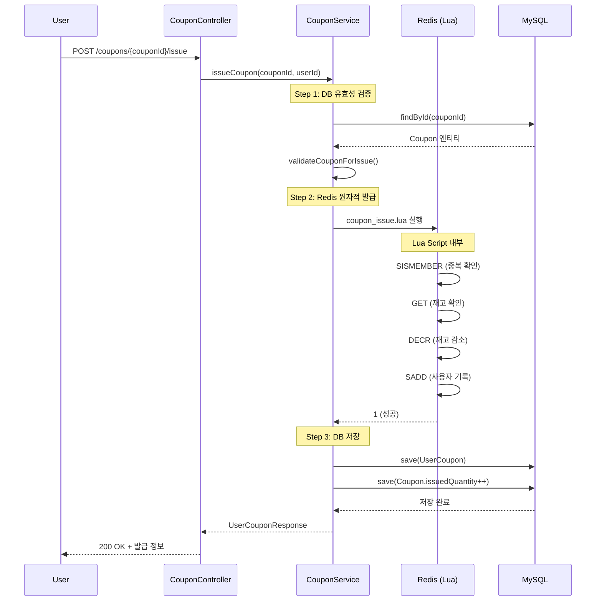
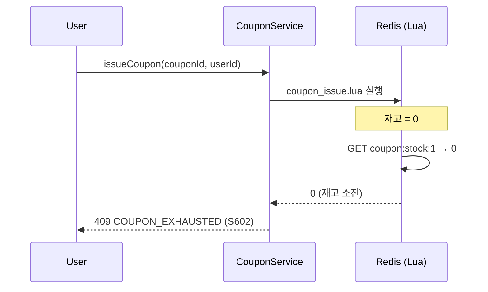
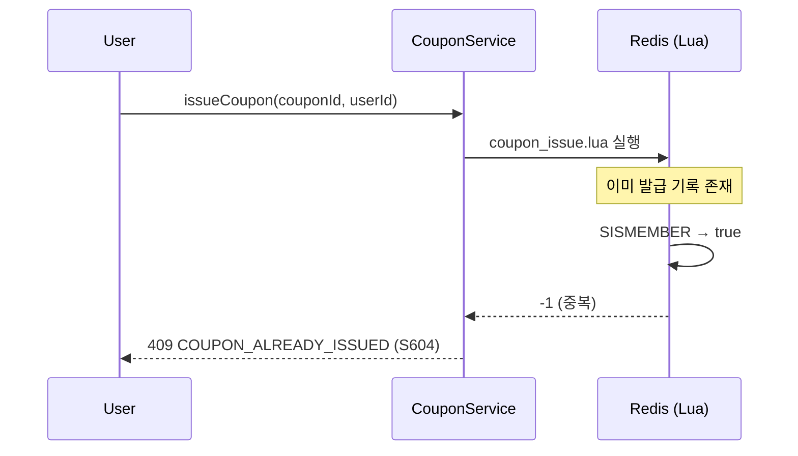

# SCENARIO-001: 선착순 쿠폰 발급

## Overview

마케팅 프로모션 이벤트에서 **정해진 수량의 쿠폰을 선착순으로 발급**하는 시나리오입니다. 동시에 수천 명의 사용자가 발급을 요청해도 정확히 지정된 수량만 발급되어야 합니다.

---

## Actors

| Actor | 역할 | 책임 |
|-------|------|------|
| **마케팅팀** | 쿠폰 생성자 | 프로모션 쿠폰 생성, 수량/유효기간 설정 |
| **사용자** | 쿠폰 발급자 | 쿠폰 발급 요청 |
| **Shopping Service** | 비즈니스 로직 | 유효성 검증, 발급 처리 |
| **Redis** | 동시성 제어 | Lua 스크립트 원자적 실행 |
| **MySQL** | 데이터 영속화 | Coupon, UserCoupon 저장 |

---

## Triggers

| 트리거 | 조건 | 결과 |
|--------|------|------|
| 쿠폰 생성 | 마케팅팀이 관리자 API 호출 | 쿠폰 엔티티 생성, Redis 재고 초기화 |
| 이벤트 시작 | `startsAt` 시간 도달 | 사용자 발급 가능 상태 |
| 발급 요청 | 사용자가 발급 버튼 클릭 | 쿠폰 발급 프로세스 시작 |
| 재고 소진 | `issuedQuantity >= totalQuantity` | 자동 상태 변경 (EXHAUSTED) |
| 이벤트 종료 | `expiresAt` 시간 도달 | 더 이상 발급 불가 |

---

## Flow

### 1. 사전 준비: 쿠폰 생성

```
마케팅팀 → AdminCouponController → CouponService → DB + Redis
```

1. 마케팅팀이 쿠폰 정보 입력 (이름, 할인율, 수량 10,000개, 유효기간)
2. `POST /admin/coupons` API 호출
3. DB에 Coupon 엔티티 저장
4. Redis에 재고 초기화: `coupon:stock:{couponId} = 10000`

### 2. 정상 흐름: 쿠폰 발급



### 3. 실패 흐름: 재고 소진



### 4. 실패 흐름: 중복 발급



---

## Business Rules

| ID | 규칙 | 설명 | 검증 위치 |
|----|------|------|----------|
| **BR-001** | 1인 1쿠폰 | 동일 사용자가 같은 쿠폰 중복 발급 불가 | Redis SISMEMBER |
| **BR-002** | 재고 초과 불가 | 설정 수량 이상 발급 불가 | Redis DECR + 조건 검사 |
| **BR-003** | 유효기간 검증 | `startsAt` ~ `expiresAt` 사이만 발급 | Java Service |
| **BR-004** | 상태 검증 | ACTIVE 상태인 쿠폰만 발급 | Java Service |
| **BR-005** | 원자성 보장 | 동시 요청 시에도 정확한 수량 발급 | Redis Lua Script |

### 검증 순서

```
1. DB 레벨 (CouponService.validateCouponForIssue)
   ├─ 쿠폰 존재 확인 (S601)
   ├─ 상태 = ACTIVE 확인 (S606)
   ├─ 시작 시간 확인 (S605)
   ├─ 종료 시간 확인 (S603)
   └─ 기본 수량 확인 (S602)

2. Redis 레벨 (coupon_issue.lua)
   ├─ 중복 발급 확인 (S604)
   └─ 실제 재고 확인 및 감소 (S602)
```

---

## Error Cases

| 에러 코드 | HTTP | 원인 | 사용자 메시지 |
|----------|------|------|-------------|
| S601 | 404 | 쿠폰 ID 없음 | "쿠폰을 찾을 수 없습니다" |
| S602 | 409 | 재고 소진 | "쿠폰이 모두 소진되었습니다" |
| S603 | 400 | 유효기간 만료 | "이벤트가 종료되었습니다" |
| S604 | 409 | 중복 발급 | "이미 발급받은 쿠폰입니다" |
| S605 | 400 | 이벤트 미시작 | "이벤트가 아직 시작되지 않았습니다" |
| S606 | 400 | 비활성 쿠폰 | "현재 발급이 중지된 쿠폰입니다" |

### 에러 처리 전략

```java
// Redis 결과에 따른 분기
Long result = couponRedisService.issueCoupon(...);

if (result == -1) {
    // 중복 발급: Redis에서 이미 발급 기록 발견
    throw new CustomBusinessException(ShoppingErrorCode.COUPON_ALREADY_ISSUED);
}
if (result == 0) {
    // 재고 소진: Redis DECR 후 음수 → 롤백됨
    throw new CustomBusinessException(ShoppingErrorCode.COUPON_EXHAUSTED);
}
// result == 1: 성공 → DB 저장 진행
```

---

## Output

### 성공 시 상태 변화

| 컴포넌트 | 변화 |
|----------|------|
| **Redis `coupon:stock:{id}`** | 값 -1 감소 |
| **Redis `coupon:issued:{id}`** | userId 추가 (Set) |
| **MySQL `user_coupons`** | 새 레코드 INSERT |
| **MySQL `coupons.issued_quantity`** | +1 증가 |
| **MySQL `coupons.status`** | (수량 도달 시) → EXHAUSTED |

### 실패 시

- **상태 변화 없음**: Redis Lua 스크립트의 원자성으로 부분 실행 방지
- **적절한 에러 응답**: HTTP 상태 코드 + 에러 코드 + 메시지

### API 응답 예시

```json
// 성공
{
  "success": true,
  "data": {
    "userCouponId": 12345,
    "couponId": 1,
    "couponName": "신규 가입 10% 할인",
    "discountType": "PERCENTAGE",
    "discountValue": 10,
    "status": "AVAILABLE",
    "expiresAt": "2025-02-28T23:59:59"
  }
}

// 실패 (재고 소진)
{
  "success": false,
  "error": {
    "code": "S602",
    "message": "쿠폰이 모두 소진되었습니다"
  }
}
```

---

## Technical Implementation

### 핵심 파일

| 파일 | 역할 |
|------|------|
| `CouponController.java` | REST 엔드포인트 |
| `CouponServiceImpl.java` | 비즈니스 로직 (82-115줄) |
| `CouponRedisService.java` | Redis 연동 |
| `coupon_issue.lua` | 원자적 발급 스크립트 |
| `Coupon.java` | 쿠폰 엔티티 |
| `UserCoupon.java` | 사용자 쿠폰 엔티티 |

### Lua 스크립트 핵심 로직

```lua
-- coupon_issue.lua (간략화)
local stockKey = KEYS[1]    -- coupon:stock:{couponId}
local issuedKey = KEYS[2]   -- coupon:issued:{couponId}
local userId = ARGV[1]

-- 1. 중복 확인
if redis.call('SISMEMBER', issuedKey, userId) == 1 then
    return -1
end

-- 2. 재고 확인
local stock = tonumber(redis.call('GET', stockKey) or 0)
if stock <= 0 then
    return 0
end

-- 3. 재고 감소 (원자적)
local newStock = redis.call('DECR', stockKey)
if newStock < 0 then
    redis.call('INCR', stockKey)  -- 롤백
    return 0
end

-- 4. 발급 기록
redis.call('SADD', issuedKey, userId)
return 1
```

### Redis 데이터 구조

```
coupon:stock:1 = "9850"           # String: 남은 재고
coupon:issued:1 = {101, 102, ...} # Set: 발급받은 사용자 ID
```

---

## Performance Characteristics

### 예상 성능

| 지표 | 값 | 설명 |
|------|-----|------|
| **응답 시간** | 30-50ms | Redis + DB 쓰기 |
| **처리량** | 1,000-2,000 TPS | Redis 기반 |
| **정확도** | 100% | 과잉 발급 불가 |

### 테스트 결과

```
테스트: 100명 동시 요청 vs 50개 쿠폰
결과: 정확히 50명 성공, 50명 S602 에러
검증: CouponConcurrencyTest.java
```

---

## Learning Points

### 1. Redis Lua 스크립트의 원자성

**문제**: 일반적인 Redis 명령어 조합은 Race Condition 발생
```
GET stock → 1
[다른 스레드] GET stock → 1
DECR stock → 0
[다른 스레드] DECR stock → -1  ← 음수 발생!
```

**해결**: Lua 스크립트는 Redis에서 단일 트랜잭션으로 실행
- Redis는 단일 스레드 모델
- 스크립트 실행 중 다른 명령 끼어들 수 없음
- 모든 명령이 원자적으로 완료

### 2. 이중 검증 전략

| 레벨 | 검증 내용 | 이유 |
|------|----------|------|
| DB (1차) | 시간, 상태, 기본 유효성 | 비즈니스 규칙 적용 |
| Redis (2차) | 재고, 중복 | 동시성 제어 |

**왜 둘 다 필요한가?**
- DB만: 동시성 제어 불가 (Lock 성능 저하)
- Redis만: 비즈니스 규칙 검증 어려움

### 3. 트레이드오프

| 선택 | 대안 | 선택 이유 |
|------|------|----------|
| Redis Lua | DB Pessimistic Lock | 높은 TPS 필요 |
| Set 자료구조 | List | O(1) 중복 확인 |
| 2단계 검증 | 단일 레벨 | 각 레벨의 장점 활용 |

### 관련 학습 문서
- [Redis Lua Script 학습 노트](../learning/redis-lua-script-atomicity.md)

---

## Testing Checklist

- [x] 정상 발급 테스트
- [x] 재고 소진 시 에러 반환
- [x] 중복 발급 방지
- [x] 동시 요청 시 정확한 수량 발급 (100명 vs 50쿠폰)
- [x] 스트레스 테스트 (200명 vs 100쿠폰)
- [ ] 부하 테스트 (k6: 10,000 TPS)

### 테스트 파일
- `CouponConcurrencyTest.java` - 동시성 테스트
- `CouponFlowTest.java` - 라이프사이클 테스트

---

## Related

- **PRD**: [PRD-002 쿠폰 시스템](../prd/PRD-002-coupon-system.md)
- **ADR**: [ADR-003 쿠폰 동시성 전략](../adr/ADR-003-coupon-concurrency.md)
- **Learning**: [Redis Lua Script 원자성](../learning/redis-lua-script-atomicity.md)
- **API**: [쿠폰 API 명세](../api/shopping-coupon-api.md)

---

## Revision History

| 날짜 | 변경 내용 | 작성자 |
|------|----------|--------|
| 2025-01-21 | 초안 작성 | Laze |
