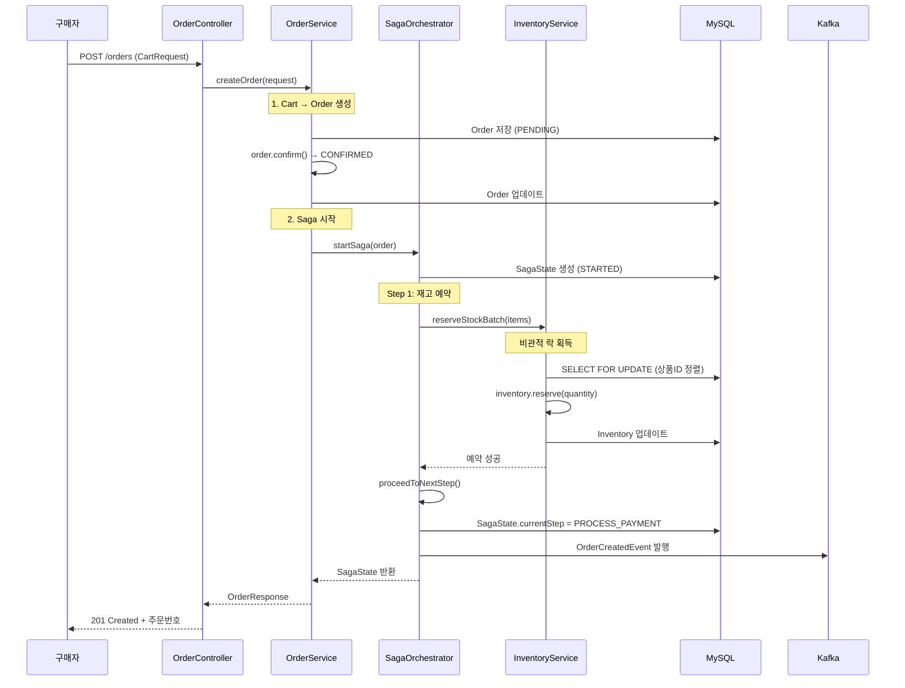
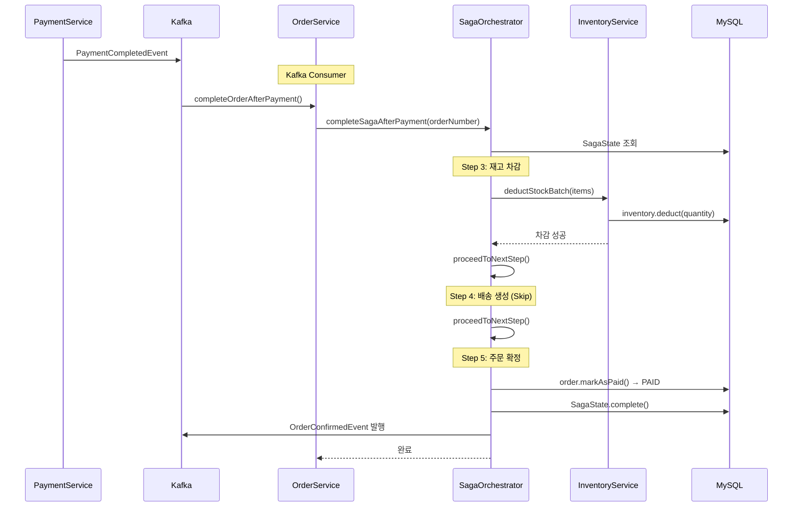
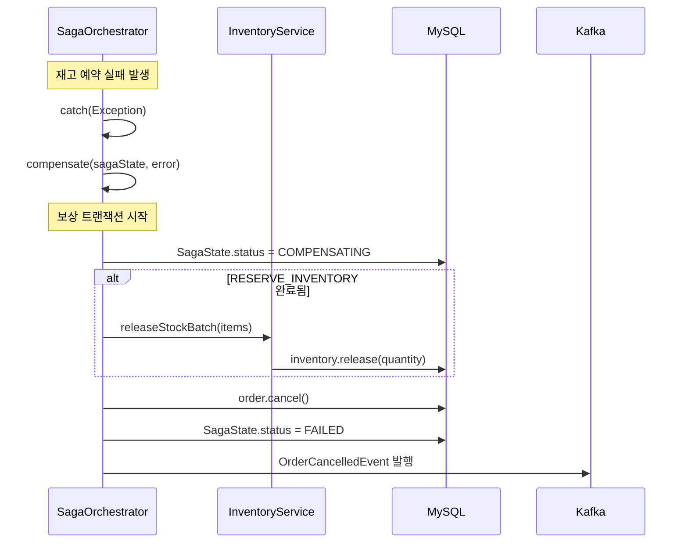

# SCENARIO-002: 주문/결제 Saga 패턴

## Overview

장바구니에서 주문을 생성하고 결제를 완료하는 **분산 트랜잭션**을 Saga 패턴으로 처리하는 시나리오입니다. 재고 예약 → 결제 처리 → 재고 차감 → 배송 생성 → 주문 확정의 5단계로 구성되며, 중간 실패 시 **보상 트랜잭션**으로 일관성을 유지합니다.

---

## Actors

| Actor | 역할 | 책임 |
|-------|------|------|
| **구매자** | 주문 요청자 | 장바구니에서 주문 생성, 결제 진행 |
| **Shopping Service** | Saga Orchestrator | 전체 Saga 흐름 제어, 상태 관리 |
| **Inventory Service** | 재고 관리 | 재고 예약/차감/해제 |
| **Payment Service** | 결제 처리 | 결제 승인, 취소 |
| **Delivery Service** | 배송 관리 | 배송 생성, 취소 |
| **Kafka** | 이벤트 버스 | 서비스 간 비동기 통신 |

---

## Triggers

| 트리거 | 조건 | 결과 |
|--------|------|------|
| 주문 생성 | 구매자가 장바구니에서 "주문하기" 클릭 | Saga 시작 (RESERVE_INVENTORY) |
| 결제 완료 | Payment Service에서 PaymentCompletedEvent 발행 | Saga 재개 (DEDUCT_INVENTORY) |
| 결제 실패 | Payment Service에서 PaymentFailedEvent 발행 | 보상 트랜잭션 시작 |
| 타임아웃 | 결제 대기 시간 초과 | 자동 취소 및 보상 |

---

## Flow

### 5단계 상태 머신 (SagaStep)

```
┌─────────────────────────────────────────────────────────────────────┐
│                         Saga 상태 전이도                              │
├─────────────────────────────────────────────────────────────────────┤
│                                                                     │
│  RESERVE_INVENTORY  →  PROCESS_PAYMENT  →  DEDUCT_INVENTORY        │
│         ↓                     ↓                    ↓                 │
│    (주문 생성 시)         (별도 서비스)        (결제 후 자동)          │
│                                                    ↓                 │
│                                            CREATE_DELIVERY          │
│                                                    ↓                 │
│                                             CONFIRM_ORDER           │
│                                                    ↓                 │
│                                               COMPLETED ✅           │
│                                                                     │
│  ─────────────── 실패 시 역방향 보상 ───────────────                  │
│                                                                     │
│  COMPENSATION_FAILED ← COMPENSATING ← 각 단계 실패                   │
│          🔴                  ⚠️                                      │
└─────────────────────────────────────────────────────────────────────┘
```

### 1. 주문 생성 흐름 (Step 1: RESERVE_INVENTORY)



### 2. 결제 완료 후 흐름 (Step 3-5)



### 3. 실패 및 보상 흐름



---

## Business Rules

| ID | 규칙 | 설명 | 검증 위치 |
|----|------|------|----------|
| **BR-001** | 재고 사전 예약 | 결제 전 재고 확보 필수 | RESERVE_INVENTORY |
| **BR-002** | 단일 Saga | 주문당 하나의 Saga만 존재 | SagaState.orderId unique |
| **BR-003** | 멱등성 보장 | 동일 요청 중복 처리 방지 | sagaId 고유성 |
| **BR-004** | 보상 재시도 | 최대 3회 보상 시도 | MAX_COMPENSATION_ATTEMPTS |
| **BR-005** | 데드락 방지 | 상품 ID 정렬 후 락 획득 | TreeMap 정렬 |
| **BR-006** | 원자적 예약 | 배치 예약 전체 성공/실패 | @Transactional |

### 상태 전이 규칙

```
Order 상태:
PENDING → CONFIRMED → PAID → SHIPPING → DELIVERED
                  ↘         ↘
                CANCELLED  REFUNDED

SagaState 상태:
STARTED → COMPLETED
    ↘
  COMPENSATING → FAILED
        ↘
      COMPENSATION_FAILED (수동 개입 필요)
```

---

## Error Cases

| 에러 | 단계 | 원인 | 보상 |
|------|------|------|------|
| **재고 부족** | RESERVE | 요청 수량 > 가용 재고 | 없음 (미시작) |
| **락 타임아웃** | RESERVE | 3초 이내 락 획득 실패 | 없음 (미시작) |
| **결제 실패** | PAYMENT | PG 승인 거부 | 재고 예약 해제 |
| **결제 타임아웃** | PAYMENT | 응답 지연 | 재고 예약 해제 |
| **재고 차감 실패** | DEDUCT | (드문 케이스) | ⚠️ 수동 개입 |

### 에러 처리 전략

```java
// 보상 트랜잭션 로직
@Transactional(propagation = Propagation.REQUIRES_NEW)
public void compensate(SagaState sagaState, String errorMessage) {
    sagaState.startCompensation(errorMessage);

    // 완료된 단계 역순 보상
    if (sagaState.isStepCompleted(SagaStep.DEDUCT_INVENTORY)) {
        // ⚠️ 차감 후 복원 불가 → 수동 처리 필요
        log.warn("DEDUCT_INVENTORY completed - requires manual intervention");
    }

    if (sagaState.isStepCompleted(SagaStep.RESERVE_INVENTORY)) {
        inventoryService.releaseStockBatch(order.getOrderItems());
    }

    order.cancel("Saga compensation: " + errorMessage);
    sagaState.markAsFailed(errorMessage);
}
```

---

## Output

### 성공 시 상태 변화

| 컴포넌트 | 변화 |
|----------|------|
| **Order** | PENDING → CONFIRMED → PAID |
| **Inventory** | availableQuantity -N, reservedQuantity +N → 0 |
| **SagaState** | STARTED → COMPLETED |
| **Kafka** | OrderCreatedEvent, OrderConfirmedEvent 발행 |

### 실패 시 (보상 후)

| 컴포넌트 | 변화 |
|----------|------|
| **Order** | → CANCELLED |
| **Inventory** | 원복 (release) |
| **SagaState** | → FAILED |
| **Kafka** | OrderCancelledEvent 발행 |

### API 응답 예시

```json
// 주문 생성 성공
{
  "success": true,
  "data": {
    "orderNumber": "ORD-20250121-ABC123",
    "status": "CONFIRMED",
    "totalAmount": 50000,
    "discountAmount": 5000,
    "finalAmount": 45000,
    "items": [...],
    "createdAt": "2025-01-21T10:30:00"
  }
}

// Saga 실패 (재고 부족)
{
  "success": false,
  "error": {
    "code": "S201",
    "message": "재고가 부족합니다"
  }
}
```

---

## Technical Implementation

### 핵심 파일

| 파일 | 역할 |
|------|------|
| `OrderSagaOrchestrator.java` | Saga 흐름 제어 |
| `SagaState.java` | Saga 상태 엔티티 |
| `SagaStep.java` | 5단계 enum |
| `SagaStatus.java` | 상태 enum |
| `OrderServiceImpl.java` | 주문 비즈니스 로직 |
| `InventoryServiceImpl.java` | 재고 관리 |
| `ShoppingEventPublisher.java` | Kafka 이벤트 발행 |

### 데이터베이스 스키마

```sql
-- saga_states 테이블
CREATE TABLE saga_states (
    id BIGINT AUTO_INCREMENT PRIMARY KEY,
    saga_id VARCHAR(50) NOT NULL UNIQUE,
    order_id BIGINT NOT NULL,
    order_number VARCHAR(30) NOT NULL,
    current_step VARCHAR(30) NOT NULL,
    status VARCHAR(30) NOT NULL DEFAULT 'STARTED',
    completed_steps VARCHAR(500),
    last_error_message VARCHAR(1000),
    compensation_attempts INT NOT NULL DEFAULT 0,
    started_at TIMESTAMP NOT NULL,
    completed_at TIMESTAMP,
    INDEX idx_saga_order_id (order_id),
    INDEX idx_saga_status (status)
);
```

### 동시성 제어: 데드락 방지

```java
// 상품 ID 정렬로 락 획득 순서 통일
public void reserveStockBatch(List<OrderItem> items) {
    Map<Long, Integer> sortedQuantities = new TreeMap<>(quantities);

    // 정렬된 순서로 FOR UPDATE 락 획득
    List<Inventory> inventories = inventoryRepository
        .findByProductIdsWithLock(sortedQuantities.keySet());
    // → SELECT * FROM inventory
    //   WHERE product_id IN (...)
    //   ORDER BY product_id
    //   FOR UPDATE
}
```

### Kafka 이벤트 토픽

```java
TOPIC_ORDER_CREATED = "shopping.order.created"
TOPIC_ORDER_CONFIRMED = "shopping.order.confirmed"
TOPIC_ORDER_CANCELLED = "shopping.order.cancelled"
TOPIC_PAYMENT_COMPLETED = "shopping.payment.completed"
TOPIC_PAYMENT_FAILED = "shopping.payment.failed"
```

---

## Performance Characteristics

### 예상 성능

| 지표 | 값 | 설명 |
|------|-----|------|
| **주문 생성** | 100-200ms | DB + 재고 예약 |
| **결제 후 완료** | 50-100ms | 재고 차감 + 상태 업데이트 |
| **보상 트랜잭션** | 50-100ms | 재고 해제 + 취소 |
| **동시 처리량** | 100-500 TPS | 재고 락 병목 |

### 병목 지점

1. **재고 락**: 인기 상품 동시 구매 시 대기
2. **Kafka 지연**: 이벤트 발행/소비 지연
3. **DB 트랜잭션**: 긴 트랜잭션 시 락 유지

---

## Learning Points

### 1. Orchestration vs Choreography

| 패턴 | 장점 | 단점 | 적합 상황 |
|------|------|------|----------|
| **Orchestration** | 흐름 명확, 디버깅 용이 | 단일 장애점 | 복잡한 비즈니스 로직 |
| **Choreography** | 느슨한 결합 | 흐름 파악 어려움 | 단순한 이벤트 체인 |

**Portal Universe 선택: Orchestration**
- 5단계 Saga → 중앙 제어 필요
- 보상 트랜잭션 순서 중요
- 디버깅/모니터링 용이

### 2. 보상 트랜잭션 설계

```
핵심 원칙:
1. 보상은 새로운 트랜잭션 (REQUIRES_NEW)
2. 역순으로 보상 실행
3. 멱등성 보장
4. 재시도 횟수 제한
```

### 3. 데드락 방지 전략

```
문제:
  TX1: Lock(상품A) → Lock(상품B)
  TX2: Lock(상품B) → Lock(상품A)
  → 교착 상태

해결:
  모든 TX: Lock(상품A → 상품B) (ID 오름차순)
  → TreeMap으로 자동 정렬
```

### 관련 학습 문서
- [02-saga-pattern.md](../learning/notes/02-saga-pattern.md)
- [03-concurrency-control.md](../learning/notes/03-concurrency-control.md)

---

## Testing Checklist

- [x] 정상 주문 생성 및 Saga 시작
- [x] 재고 예약 성공/실패
- [ ] 결제 완료 이벤트 수신 후 Saga 완료
- [ ] 결제 실패 시 보상 트랜잭션
- [ ] 보상 재시도 (MAX_COMPENSATION_ATTEMPTS)
- [ ] 동시 주문 시 데드락 미발생

### 테스트 파일
- `SagaCompensationTest.java` - 보상 트랜잭션 테스트
- `OrderFlowTest.java` - 주문 E2E 테스트

---

## Known Issues & TODOs

### 현재 구현 상태

| 단계 | 상태 | 비고 |
|------|------|------|
| RESERVE_INVENTORY | ✅ 완료 | |
| PROCESS_PAYMENT | ⚠️ 외부 서비스 | 리스너 구현 필요 |
| DEDUCT_INVENTORY | ✅ 완료 | |
| CREATE_DELIVERY | ⏭️ Skip | 배송 서비스 통합 필요 |
| CONFIRM_ORDER | ✅ 완료 | |

### 개선 필요 사항

1. **PaymentCompletedEvent 리스너**: Kafka Consumer 구현
2. **배송 서비스 통합**: CREATE_DELIVERY 단계 활성화
3. **타임아웃 처리**: 결제 대기 시간 초과 자동 취소
4. **모니터링 대시보드**: COMPENSATION_FAILED 상태 알림

---

## Related

- **PRD**: [PRD-003 주문 시스템](../prd/PRD-003-order-system.md)
- **ADR**: [ADR-002 Saga 패턴 선택](../adr/ADR-002-saga-pattern.md)
- **Learning**: [02-saga-pattern.md](../learning/notes/02-saga-pattern.md)
- **Scenario**: [SCENARIO-001 선착순 쿠폰 발급](./SCENARIO-001-coupon-issue.md)

---

## Revision History

| 날짜 | 변경 내용 | 작성자 |
|------|----------|--------|
| 2025-01-21 | 초안 작성 | Laze |
