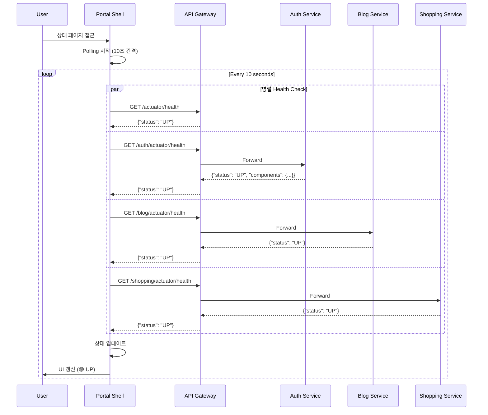
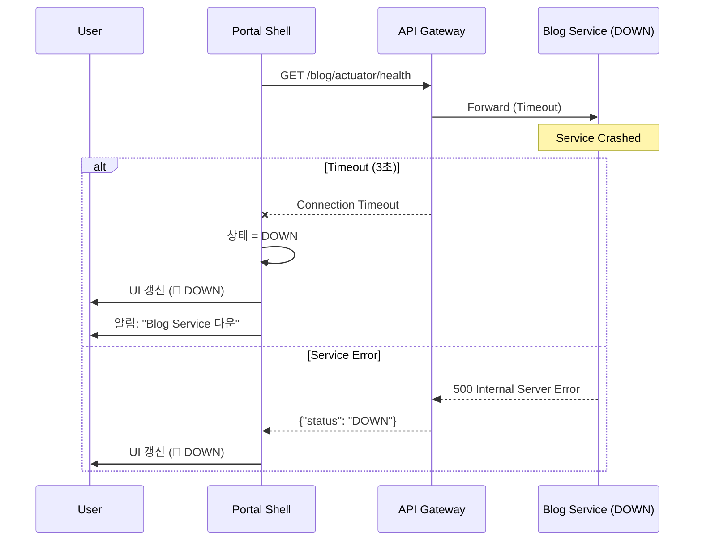
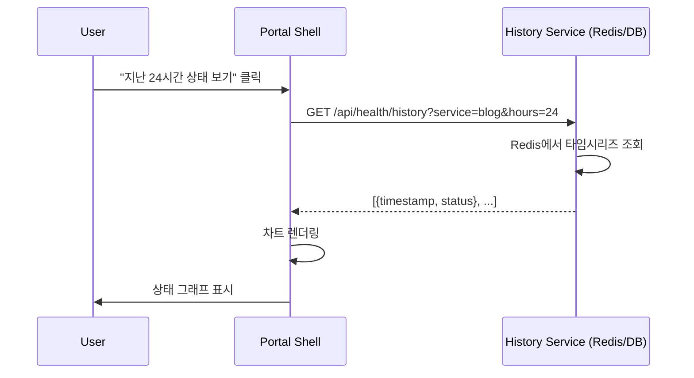

# SCENARIO-005: 서비스 상태 모니터링

## Overview

Portal Shell에서 **각 마이크로서비스의 Health 상태를 실시간으로 확인**하는 시나리오입니다. 개발자, 관리자, 일반 사용자가 시스템 상태를 한눈에 파악할 수 있습니다.

---

## Actors

| Actor | 역할 | 책임 |
|-------|------|------|
| **개발자** | 시스템 모니터링 | 개발/테스트 중 서비스 상태 확인 |
| **관리자** | 운영 모니터링 | 장애 감지 및 대응 |
| **일반 사용자** | 상태 확인 | 서비스 이용 가능 여부 확인 |
| **Portal Shell** | UI 제공 | 상태 표시 및 자동 갱신 |
| **API Gateway** | Health 집계 | 각 서비스의 Health 엔드포인트 라우팅 |
| **각 마이크로서비스** | Health 정보 제공 | Spring Boot Actuator `/actuator/health` |

---

## Triggers

| 트리거 | 조건 | 결과 |
|--------|------|------|
| 페이지 접근 | 사용자가 Service Status 페이지 방문 | 모든 서비스 Health Check 실행 |
| 자동 갱신 | 5-30초 간격 타이머 | Polling으로 Health 재확인 |
| 서비스 배포 | 새 버전 배포 또는 재시작 | 상태가 DOWN → UP으로 변경 |
| 장애 발생 | 서비스 크래시 또는 네트워크 단절 | 상태가 UP → DOWN으로 변경 |
| 수동 새로고침 | 사용자가 새로고침 버튼 클릭 | 즉시 Health Check 재실행 |

---

## Flow

### 1. 정상 흐름: 서비스 상태 조회



### 2. 장애 흐름: 서비스 다운 감지



### 3. 상태 히스토리 조회 (선택사항)



---

## Business Rules

| ID | 규칙 | 설명 | 검증 위치 |
|----|------|------|----------|
| **BR-001** | 인증 불필요 | Health 엔드포인트는 공개 API | API Gateway |
| **BR-002** | Timeout 3초 | 3초 이내 응답 없으면 DOWN | Portal Shell |
| **BR-003** | 상태 정의 | UP, DOWN, DEGRADED 3가지 | Portal Shell |
| **BR-004** | Polling 간격 | 최소 5초, 최대 30초 | Portal Shell |
| **BR-005** | 병렬 요청 | 모든 Health Check 동시 실행 | Portal Shell |

### 상태 판단 기준

| 상태 | 조건 | UI 표시 |
|------|------|---------|
| **UP** (🟢) | HTTP 200 + `status: "UP"` | 초록색, "정상" |
| **DOWN** (🔴) | Timeout 또는 HTTP 5xx | 빨간색, "다운" |
| **DEGRADED** (🟡) | HTTP 200 + `status: "DOWN"` 또는 일부 컴포넌트 다운 | 노란색, "일부 장애" |

---

## Error Cases

| 에러 | 원인 | 처리 |
|------|------|------|
| Network Timeout | 서비스 응답 없음 (3초 이상) | 상태 DOWN, 사용자에게 알림 |
| 500 Internal Server Error | 서비스 내부 오류 | 상태 DOWN, 에러 메시지 표시 |
| 503 Service Unavailable | 서비스 재시작 중 | 상태 DEGRADED, "재시작 중" 메시지 |
| CORS Error | Gateway CORS 설정 누락 | 브라우저 콘솔 에러, Health Check 실패 |
| API Gateway Down | Gateway 자체 다운 | 모든 서비스 DOWN 표시 |

### 에러 처리 전략

```typescript
// Portal Shell - Health Check Logic
async function checkServiceHealth(serviceUrl: string): Promise<ServiceStatus> {
  try {
    const response = await fetch(serviceUrl, {
      timeout: 3000,
      headers: { 'Accept': 'application/json' }
    })

    if (response.ok) {
      const data = await response.json()
      return data.status === 'UP' ? 'UP' : 'DEGRADED'
    } else {
      return 'DOWN'
    }
  } catch (error) {
    console.error(`Health check failed for ${serviceUrl}:`, error)
    return 'DOWN'
  }
}
```

---

## Output

### 성공 시 UI 표시

```
┌─────────────────────────────────────────┐
│   🏥 Service Status                     │
├─────────────────────────────────────────┤
│ 🟢 API Gateway           UP    (52ms)   │
│ 🟢 Auth Service          UP    (23ms)   │
│ 🟢 Blog Service          UP    (18ms)   │
│ 🟢 Shopping Service      UP    (31ms)   │
│ 🟡 Notification Service  DEGRADED       │
│                                         │
│ 마지막 업데이트: 2026-01-21 14:35:22    │
│ 다음 갱신: 7초 후                       │
│                                         │
│ [🔄 수동 새로고침]  [⚙️ 설정]          │
└─────────────────────────────────────────┘
```

### 장애 시 UI 표시

```
┌─────────────────────────────────────────┐
│   🏥 Service Status  ⚠️ 일부 서비스 다운 │
├─────────────────────────────────────────┤
│ 🟢 API Gateway           UP    (48ms)   │
│ 🟢 Auth Service          UP    (22ms)   │
│ 🔴 Blog Service          DOWN  (Timeout)│
│ 🟢 Shopping Service      UP    (29ms)   │
│ 🔴 Notification Service  DOWN           │
│                                         │
│ ⚠️ Blog Service: Connection Timeout    │
│    마지막 정상: 5분 전                  │
│                                         │
│ [🔄 수동 새로고침]  [📊 히스토리]      │
└─────────────────────────────────────────┘
```

### API 응답 예시

**API Gateway Health:**
```json
{
  "status": "UP",
  "components": {
    "diskSpace": { "status": "UP" },
    "ping": { "status": "UP" }
  }
}
```

**Auth Service Health:**
```json
{
  "status": "UP",
  "components": {
    "db": { "status": "UP", "details": { "database": "PostgreSQL" } },
    "redis": { "status": "UP" },
    "diskSpace": { "status": "UP" }
  }
}
```

**Blog Service Down:**
```json
{
  "status": "DOWN",
  "components": {
    "db": { "status": "DOWN", "details": { "error": "Connection refused" } }
  }
}
```

---

## Technical Implementation

### 핵심 파일

| 파일 | 역할 |
|------|------|
| `frontend/portal-shell/src/pages/ServiceStatus.vue` | 상태 페이지 UI |
| `frontend/portal-shell/src/composables/useHealthCheck.ts` | Health Check 로직 |
| `frontend/portal-shell/src/stores/serviceStatusStore.ts` | 상태 관리 (Pinia) |
| `services/api-gateway/src/main/resources/application.yml` | Health 엔드포인트 노출 설정 |

### Frontend 구조 (Vue 3)

```vue
<!-- ServiceStatus.vue -->
<script setup lang="ts">
import { useHealthCheck } from '@/composables/useHealthCheck'
import { useServiceStatusStore } from '@/stores/serviceStatusStore'

const store = useServiceStatusStore()
const { startPolling, stopPolling, checkAll } = useHealthCheck()

onMounted(() => {
  checkAll() // 초기 확인
  startPolling(10000) // 10초 간격 Polling
})

onUnmounted(() => {
  stopPolling()
})
</script>

<template>
  <div class="service-status">
    <ServiceStatusCard
      v-for="service in store.services"
      :key="service.name"
      :service="service"
    />
  </div>
</template>
```

```typescript
// useHealthCheck.ts
export function useHealthCheck() {
  const store = useServiceStatusStore()
  let intervalId: number | null = null

  const checkService = async (serviceUrl: string) => {
    const startTime = Date.now()
    try {
      const response = await fetch(serviceUrl, { timeout: 3000 })
      const data = await response.json()
      return {
        status: data.status === 'UP' ? 'UP' : 'DEGRADED',
        responseTime: Date.now() - startTime,
        timestamp: new Date().toISOString()
      }
    } catch {
      return { status: 'DOWN', responseTime: null, timestamp: new Date().toISOString() }
    }
  }

  const checkAll = async () => {
    const services = [
      { name: 'API Gateway', url: '/actuator/health' },
      { name: 'Auth Service', url: '/auth/actuator/health' },
      { name: 'Blog Service', url: '/blog/actuator/health' },
      { name: 'Shopping Service', url: '/shopping/actuator/health' }
    ]

    const results = await Promise.all(
      services.map(s => checkService(s.url).then(r => ({ ...s, ...r })))
    )

    store.updateStatuses(results)
  }

  const startPolling = (interval: number) => {
    if (intervalId) clearInterval(intervalId)
    intervalId = setInterval(checkAll, interval)
  }

  const stopPolling = () => {
    if (intervalId) {
      clearInterval(intervalId)
      intervalId = null
    }
  }

  return { checkAll, startPolling, stopPolling }
}
```

### Backend 설정 (Spring Boot)

**application.yml (모든 서비스):**
```yaml
management:
  endpoints:
    web:
      exposure:
        include: health,info
      base-path: /actuator
  endpoint:
    health:
      show-details: when-authorized
      show-components: always
  health:
    defaults:
      enabled: true
```

**API Gateway CORS 설정:**
```java
@Configuration
public class CorsConfig {
    @Bean
    public CorsWebFilter corsFilter() {
        return new CorsWebFilter(source -> {
            CorsConfiguration config = new CorsConfiguration();
            config.addAllowedOrigin("http://localhost:30000");
            config.addAllowedMethod("GET");
            config.addAllowedHeader("*");
            config.addExposedHeader("*");
            return config;
        });
    }
}
```

---

## Performance Characteristics

### 예상 성능

| 지표 | 값 | 설명 |
|------|-----|------|
| **Health Check 응답 시간** | 10-50ms | Actuator 경량 엔드포인트 |
| **Polling 간격** | 10초 (기본) | 설정 가능 (5-30초) |
| **Timeout** | 3초 | 응답 없으면 DOWN 처리 |
| **병렬 요청 수** | 4-6개 | 서비스 수에 비례 |

### 네트워크 트래픽

```
1회 Health Check: ~1KB × 5개 서비스 = 5KB
1분 (10초 간격): 6회 × 5KB = 30KB
1시간: 360회 × 5KB = 1.8MB
```

---

## Learning Points

### 1. Polling vs WebSocket

**Polling 방식 채택 이유:**

| 선택 | 대안 | 선택 이유 |
|------|------|----------|
| Polling | WebSocket | 단순성, 서버 부하 낮음, 구현 비용 낮음 |

**트레이드오프:**
- ✅ **Polling**: 구현 간단, 상태 변화 빈도 낮음, WebSocket 인프라 불필요
- ❌ **WebSocket**: 실시간성 우수하나, 서버 부하 증가, 연결 관리 복잡

### 2. Spring Boot Actuator

**Health 엔드포인트의 장점:**
- `/actuator/health`: DB, Redis 등 의존성 자동 체크
- `HealthIndicator` 커스터마이징 가능
- 프로덕션 환경에서 표준 모니터링 도구

### 3. 인증 제외 전략

**왜 Health 엔드포인트에 인증이 불필요한가?**
- 민감한 정보 포함 안 함 (show-details: when-authorized)
- 공개 모니터링 페이지 목적
- Kubernetes Liveness/Readiness Probe도 인증 불가

### 관련 학습 문서
- [ADR-007 서비스 상태 모니터링 전략](../adr/ADR-007-service-status-monitoring.md)

---

## Testing Checklist

- [ ] 모든 서비스 UP 시 정상 표시
- [ ] 1개 서비스 DOWN 시 UI 업데이트
- [ ] Timeout 3초 이후 DOWN 처리
- [ ] Polling 자동 갱신 동작
- [ ] 수동 새로고침 버튼 동작
- [ ] 브라우저 탭 비활성화 시 Polling 중단
- [ ] CORS 정상 동작 확인
- [ ] 모바일 반응형 UI
- [ ] (선택) 히스토리 데이터 저장 및 조회

---

## Related

- **ADR**: [ADR-007 서비스 상태 모니터링 전략](../adr/ADR-007-service-status-monitoring.md)
- **Architecture**: [시스템 아키텍처 개요](../architecture/system-overview.md)
- **CLAUDE.md**: [프로젝트 가이드](../../.claude/CLAUDE.md)

---

## Revision History

| 날짜 | 변경 내용 | 작성자 |
|------|----------|--------|
| 2026-01-21 | 초안 작성 | Laze |
