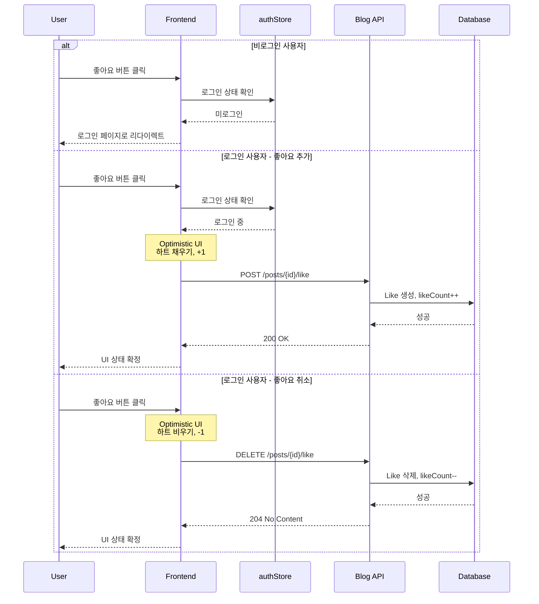

# 게시글 좋아요 기능 시나리오

## Overview

사용자가 게시글에 좋아요를 남기거나 취소하는 시나리오입니다. 비로그인 사용자는 로그인 유도되며, 로그인 사용자는 Optimistic UI로 즉각적인 피드백을 받습니다.

## Actors

| Actor | 역할 | 설명 |
|-------|------|------|
| 비로그인 사용자 | 게스트 | 좋아요 클릭 시 로그인 유도 |
| 로그인 사용자 | 좋아요 주체 | 좋아요 토글 (생성/취소) |
| 시스템 | 처리자 | 좋아요 상태 관리 및 카운트 업데이트 |

## User Stories

### Story 1: 비로그인 사용자의 좋아요 시도
```
As a 비로그인 사용자
I want 게시글에 좋아요를 클릭
So that 흥미로운 콘텐츠를 표시하고 싶음
```

### Story 2: 로그인 사용자의 좋아요
```
As a 로그인 사용자
I want 게시글에 좋아요를 추가/제거
So that 관심 있는 게시글을 즉시 피드백할 수 있음
```

### Story 3: 좋아요 수 확인
```
As a 모든 사용자
I want 게시글의 좋아요 수를 확인
So that 인기 있는 게시글을 파악할 수 있음
```

## Triggers

| 트리거 | 조건 | 결과 |
|--------|------|------|
| 좋아요 버튼 클릭 (비로그인) | 인증 토큰 없음 | 로그인 페이지로 리다이렉트 |
| 좋아요 버튼 클릭 (로그인) | 인증 토큰 있음, 좋아요 안 한 상태 | 좋아요 생성 |
| 좋아요 버튼 클릭 (로그인) | 인증 토큰 있음, 좋아요 한 상태 | 좋아요 취소 |
| 게시글 목록 조회 | 페이지 로드 | 각 게시글의 좋아요 수 표시 |
| 게시글 상세 조회 | 페이지 로드 | 좋아요 수 + 현재 사용자 좋아요 여부 |

## Flow

### 정상 흐름 1: 비로그인 사용자

1. 사용자가 게시글에서 좋아요 버튼 클릭
2. Frontend가 authStore에서 로그인 상태 확인
3. 미로그인 상태 감지
4. 로그인 페이지로 리다이렉트 (returnUrl 포함)
5. 로그인 성공 후 원래 게시글로 복귀

### 정상 흐름 2: 로그인 사용자 (좋아요 추가)

1. 사용자가 좋아요 버튼 클릭
2. **Optimistic UI**: 즉시 UI 업데이트 (하트 채우기, 카운트 +1)
3. API 요청: `POST /api/v1/posts/{postId}/like`
4. 서버가 Like 엔티티 생성, Post의 likeCount 증가
5. 성공 응답 수신
6. UI 상태 확정

### 정상 흐름 3: 로그인 사용자 (좋아요 취소)

1. 사용자가 좋아요 버튼 클릭 (이미 좋아요 상태)
2. **Optimistic UI**: 즉시 UI 업데이트 (하트 비우기, 카운트 -1)
3. API 요청: `DELETE /api/v1/posts/{postId}/like`
4. 서버가 Like 엔티티 삭제, Post의 likeCount 감소
5. 성공 응답 수신
6. UI 상태 확정

### 시퀀스 다이어그램



## Business Rules

| 규칙 | 설명 | 위반 시 |
|------|------|---------|
| BR-001 | 좋아요는 로그인 사용자만 가능 | 401 Unauthorized 반환 |
| BR-002 | 동일 게시글에 1인 1좋아요 | 중복 시 이전 좋아요 취소 처리 |
| BR-003 | 삭제된 게시글은 좋아요 불가 | 404 Not Found 반환 |
| BR-004 | likeCount는 음수 불가 | 0 이하로 감소 방지 |

## API Endpoints

### 1. 좋아요 추가

**Request**
```http
POST /api/v1/posts/{postId}/like
Authorization: Bearer {token}
```

**Response (성공)**
```json
{
  "success": true,
  "data": {
    "postId": 123,
    "liked": true,
    "likeCount": 45
  },
  "error": null
}
```

### 2. 좋아요 취소

**Request**
```http
DELETE /api/v1/posts/{postId}/like
Authorization: Bearer {token}
```

**Response (성공)**
```json
{
  "success": true,
  "data": {
    "postId": 123,
    "liked": false,
    "likeCount": 44
  },
  "error": null
}
```

### 3. 좋아요 상태 조회

**Request**
```http
GET /api/v1/posts/{postId}/like
Authorization: Bearer {token}
```

**Response (성공)**
```json
{
  "success": true,
  "data": {
    "postId": 123,
    "liked": true,
    "likeCount": 45
  },
  "error": null
}
```

## Error Cases

| 에러 코드 | HTTP Status | 원인 | Frontend 처리 |
|-----------|-------------|------|--------------|
| A001 | 401 | 인증 토큰 없음 | 로그인 페이지 리다이렉트 |
| A002 | 401 | 토큰 만료 | 토큰 갱신 후 재시도 |
| B001 | 404 | 게시글 없음 | "게시글을 찾을 수 없습니다" 메시지 표시 |
| B002 | 404 | 게시글 삭제됨 | "삭제된 게시글입니다" 메시지 표시 |
| C001 | 500 | 서버 오류 | Optimistic UI 롤백, 재시도 버튼 |

### Optimistic UI 실패 시 처리

1. API 요청 실패 감지
2. UI를 이전 상태로 롤백
3. 토스트 메시지: "좋아요 처리 중 오류가 발생했습니다"
4. 재시도 버튼 제공 (선택)

## UI Components

### Vue 컴포넌트 구조

```
PostLikeButton.vue          # 좋아요 버튼 컴포넌트
├── props
│   ├── postId: number
│   ├── initialLiked: boolean
│   └── initialCount: number
├── state
│   ├── liked: Ref<boolean>      # Optimistic UI 상태
│   ├── likeCount: Ref<number>   # Optimistic UI 카운트
│   └── loading: Ref<boolean>
└── methods
    ├── toggleLike()
    ├── handleLikeSuccess()
    └── handleLikeError()
```

### 컴포넌트 위치

- **PostLikeButton.vue**: `frontend/blog-frontend/src/components/post/PostLikeButton.vue`
- **PostCard.vue** (좋아요 버튼 사용): `frontend/blog-frontend/src/components/post/PostCard.vue`
- **PostDetail.vue** (좋아요 버튼 사용): `frontend/blog-frontend/src/views/PostDetail.vue`

### 사용 예시

```vue
<template>
  <PostLikeButton
    :post-id="post.id"
    :initial-liked="post.liked"
    :initial-count="post.likeCount"
    @like-changed="handleLikeChanged"
  />
</template>
```

## Output

### 성공 시

**Database**
- Like 엔티티 생성/삭제
- Post.likeCount 증가/감소

**Frontend**
- 하트 아이콘 상태 변경 (채움/비움)
- 좋아요 수 업데이트
- 애니메이션 효과 (선택)

### 실패 시

**Optimistic UI 롤백**
- 하트 아이콘 이전 상태로 복귀
- 좋아요 수 이전 값으로 복귀
- 에러 메시지 표시

## Learning Points

### Optimistic UI 패턴

**장점**
- 즉각적인 사용자 피드백
- 네트워크 지연 체감 감소
- 더 나은 사용자 경험

**주의사항**
- 실패 시 롤백 로직 필수
- 동시성 이슈 (여러 탭에서 동시 클릭)
- 에러 처리 명확히

**참고 문서**
- [Optimistic UI 패턴](../learning/optimistic-ui-pattern.md)

### likeCount 동시성 제어

**방식**: Pessimistic Lock 사용
```java
@Lock(LockModeType.PESSIMISTIC_WRITE)
Optional<Post> findByIdForUpdate(Long id);
```

**선택 이유**
- 좋아요는 동시 요청이 많지 않음
- 정확한 카운트가 중요
- 트레이드오프: 약간의 성능 희생 vs 정확성

**대안**
- Optimistic Lock: 재시도 로직 필요, 복잡도 증가
- Redis Counter: 별도 인프라 필요, 과도한 설계

## Related

- [PRD-001 Blog Service 요구사항](../prd/PRD-001-blog-service.md)
- [API-001 Blog API 명세](../api/API-001-blog-api.md)
- [Optimistic UI 패턴](../learning/optimistic-ui-pattern.md)
