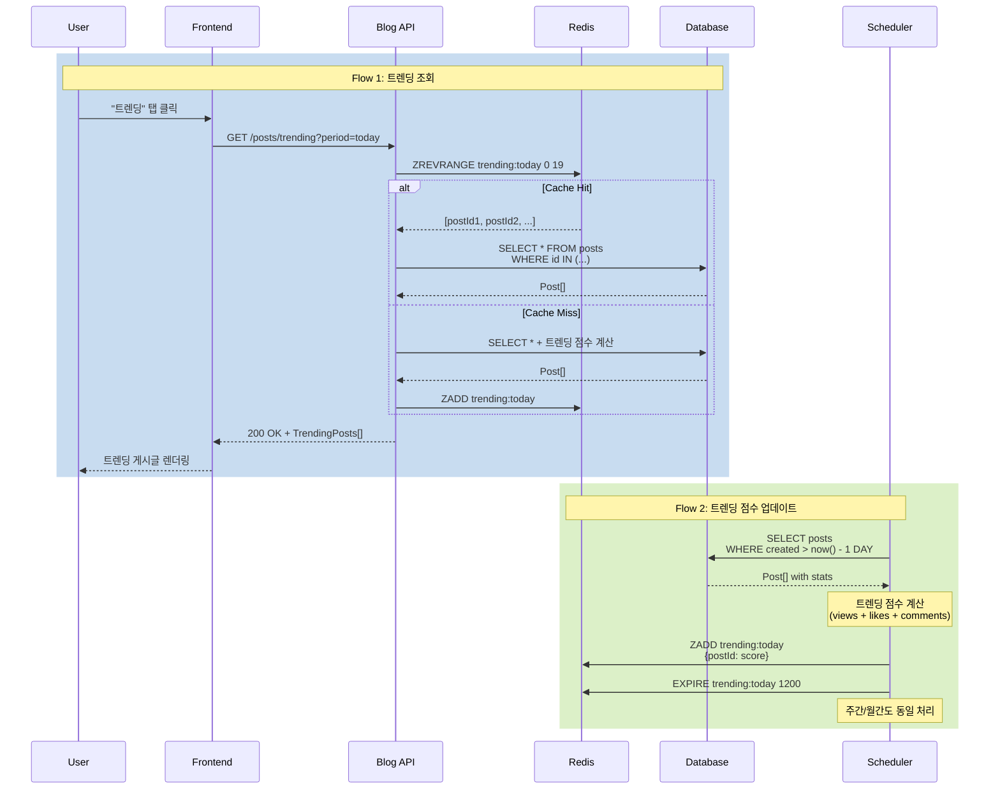

# 트렌딩 게시글 시나리오

## Overview

사용자가 인기 있는 게시글을 빠르게 발견할 수 있도록 트렌딩 게시글을 제공하는 시나리오입니다. 조회수, 좋아요, 댓글 등을 종합하여 트렌딩 점수를 계산하고, 기간별 필터를 통해 최신 인기 콘텐츠를 노출합니다.

## Actors

| Actor | 역할 | 설명 |
|-------|------|------|
| 독자 | 콘텐츠 발견자 | 인기 게시글 탐색 |
| 시스템 | 랭킹 계산자 | 트렌딩 점수 계산 및 순위 관리 |
| 스케줄러 | 자동화 주체 | 주기적 랭킹 업데이트 |

## User Stories

### Story 1: 메인 페이지에서 트렌딩 확인
```
As a 독자
I want 메인 페이지에서 트렌딩 게시글을 확인
So that 인기 있는 콘텐츠를 빠르게 발견할 수 있음
```

### Story 2: 기간별 트렌딩 필터
```
As a 독자
I want 오늘/이번 주/이번 달 트렌딩을 선택
So that 최신 인기 게시글을 확인할 수 있음
```

### Story 3: 실시간 트렌딩 업데이트
```
As a 독자
I want 트렌딩 목록이 주기적으로 업데이트
So that 최신 인기 트렌드를 놓치지 않을 수 있음
```

## Triggers

| 트리거 | 조건 | 결과 |
|--------|------|------|
| 메인 페이지 로드 | 사용자 접속 | 트렌딩 게시글 표시 (기본: 오늘) |
| 탭 전환 | "최신" ↔ "트렌딩" 클릭 | 게시글 목록 전환 |
| 기간 필터 변경 | "오늘/주간/월간" 선택 | 해당 기간 트렌딩 조회 |
| 스케줄러 실행 | 매 10분마다 | 트렌딩 점수 재계산 및 캐시 갱신 |

## Flow

### 정상 흐름 1: 메인 페이지 트렌딩 탭

1. 사용자가 메인 페이지 접속 (`/`)
2. 상단 탭 표시: [최신] [트렌딩]
3. "트렌딩" 탭 클릭
4. 기간 필터 표시: [오늘] [이번 주] [이번 달]
5. 기본값: "오늘" 선택
6. API 요청: `GET /api/v1/posts/trending?period=today&page=0&size=20`
7. 트렌딩 게시글 목록 렌더링
   - 순위 뱃지 (1, 2, 3, ...)
   - 제목, 요약, 작성자
   - 트렌딩 점수 (선택: 좋아요, 댓글, 조회수)
   - 상승/하강 아이콘 (이전 순위 대비)

### 정상 흐름 2: 기간 필터 변경

1. 사용자가 "이번 주" 필터 클릭
2. API 요청: `GET /api/v1/posts/trending?period=week&page=0&size=20`
3. 이번 주 트렌딩 게시글 렌더링
4. URL 업데이트: `/?tab=trending&period=week`
5. 브라우저 뒤로가기 시 이전 필터 복원

### 정상 흐름 3: 트렌딩 점수 계산 (백엔드 스케줄러)

1. 스케줄러가 매 10분마다 실행 (`@Scheduled(cron = "0 */10 * * * *")`)
2. 각 기간별(오늘, 주간, 월간) 게시글 조회
3. 트렌딩 점수 계산
   ```
   score = (views * 1) + (likes * 10) + (comments * 20)
   decay = exp(-age_hours / 24)  # 시간 감쇠
   final_score = score * decay
   ```
4. Redis Sorted Set에 저장
   - Key: `trending:today`, `trending:week`, `trending:month`
   - Score: final_score
   - Member: post_id
5. TTL 설정: 20분 (스케줄러 주기의 2배)

### 정상 흐름 4: 캐시 기반 트렌딩 조회

1. API 요청 수신: `GET /api/v1/posts/trending?period=today`
2. Redis에서 조회: `ZREVRANGE trending:today 0 19 WITHSCORES`
3. Cache Hit 시:
   - Post ID 리스트 조회
   - DB에서 Post 정보 일괄 조회 (IN 쿼리)
   - 응답 반환
4. Cache Miss 시:
   - DB에서 직접 계산 및 조회
   - Redis에 저장 후 반환

### 시퀀스 다이어그램



## Business Rules

| 규칙 | 설명 | 위반 시 |
|------|------|---------|
| BR-001 | 비공개 게시글은 트렌딩에서 제외 | 공개 게시글만 집계 |
| BR-002 | 트렌딩 점수는 시간에 따라 감쇠 | 오래된 게시글 순위 하락 |
| BR-003 | 최소 조회수 10 이상만 트렌딩 대상 | 스팸 방지 |
| BR-004 | 트렌딩 캐시 TTL은 스케줄러 주기의 2배 | 데이터 신선도 보장 |
| BR-005 | 작성자 자신의 조회는 트렌딩 점수에서 제외 | 점수 조작 방지 |

## Trending Score Formula

### 기본 점수 계산

```javascript
const calculateBaseScore = (post) => {
  const viewWeight = 1
  const likeWeight = 10
  const commentWeight = 20

  return (
    post.viewCount * viewWeight +
    post.likeCount * likeWeight +
    post.commentCount * commentWeight
  )
}
```

### 시간 감쇠 적용

```javascript
const calculateDecay = (publishedDate) => {
  const ageHours = (Date.now() - publishedDate) / (1000 * 60 * 60)
  const halfLife = 24  // 24시간마다 점수 절반으로 감소
  return Math.exp(-ageHours / halfLife)
}

const calculateTrendingScore = (post) => {
  const baseScore = calculateBaseScore(post)
  const decay = calculateDecay(post.publishedDate)
  return baseScore * decay
}
```

### 예시

| 게시글 | 조회수 | 좋아요 | 댓글 | 작성일 | 기본 점수 | 감쇠 | 최종 점수 |
|--------|--------|--------|------|--------|----------|------|----------|
| A | 1000 | 50 | 10 | 2시간 전 | 1700 | 0.92 | 1564 |
| B | 500 | 100 | 20 | 12시간 전 | 1900 | 0.61 | 1159 |
| C | 2000 | 30 | 5 | 1일 전 | 2400 | 0.37 | 888 |

→ 순위: A > B > C

## API Endpoints

### 1. 트렌딩 게시글 조회

**Request**
```http
GET /api/v1/posts/trending?period=today&page=0&size=20
```

**Query Parameters**
- `period`: `today` | `week` | `month` (기본값: `today`)
- `page`, `size`: 페이지네이션

**Response**
```json
{
  "success": true,
  "data": {
    "content": [
      {
        "id": 101,
        "title": "Spring Boot 3.2 새로운 기능",
        "summary": "Spring Boot 3.2의 주요 변경사항",
        "author": {
          "id": 1,
          "name": "Laze"
        },
        "tags": ["spring-boot", "java"],
        "viewCount": 1250,
        "likeCount": 42,
        "commentCount": 8,
        "trendingScore": 1564.5,
        "trendingRank": 1,
        "rankChange": 0,  // 이전 대비: 0(신규), +2(상승), -1(하락)
        "publishedDate": "2026-01-21T08:00:00"
      }
    ],
    "pageable": {
      "pageNumber": 0,
      "pageSize": 20,
      "totalElements": 50,
      "totalPages": 3
    }
  }
}
```

### 2. 트렌딩 점수 재계산 (관리자 전용)

**Request**
```http
POST /api/v1/admin/trending/recalculate
Authorization: Bearer {admin-token}
```

**Response**
```json
{
  "success": true,
  "data": {
    "message": "트렌딩 점수가 재계산되었습니다",
    "processedCount": 150,
    "duration": "2.3s"
  }
}
```

## Error Cases

| 에러 코드 | HTTP Status | 원인 | Frontend 처리 |
|-----------|-------------|------|--------------|
| B008 | 400 | 잘못된 기간 파라미터 | "올바른 기간을 선택하세요" 메시지 |
| C001 | 500 | Redis 장애 | DB 직접 조회로 폴백 |
| C002 | 503 | 서비스 과부하 | 재시도 버튼 제공 |

## UI Components

### Vue 컴포넌트 구조

```
HomePage.vue                      # 메인 페이지
├── TabNavigation.vue             # 탭 네비게이션
│   ├── [최신]
│   └── [트렌딩]
└── TrendingSection.vue           # 트렌딩 섹션
    ├── PeriodFilter.vue          # 기간 필터
    │   ├── [오늘]
    │   ├── [이번 주]
    │   └── [이번 달]
    └── TrendingPostList.vue      # 트렌딩 게시글 목록
        └── TrendingPostCard.vue  # 트렌딩 게시글 카드
            ├── RankBadge.vue     # 순위 뱃지
            ├── RankChangeIcon.vue # 순위 변동 아이콘
            └── PostStats.vue     # 통계 (조회, 좋아요, 댓글)
```

### 컴포넌트 위치

- **HomePage.vue**: `frontend/blog-frontend/src/views/HomePage.vue`
- **TrendingSection.vue**: `frontend/blog-frontend/src/components/trending/TrendingSection.vue`
- **TrendingPostCard.vue**: `frontend/blog-frontend/src/components/trending/TrendingPostCard.vue`

### 라우팅

```typescript
{
  path: '/',
  name: 'Home',
  component: HomePage,
  // Query: ?tab=trending&period=week
}
```

## Output

### 트렌딩 섹션 UI

**상단**
```
[최신] [트렌딩 ✓]

기간: [오늘 ✓] [이번 주] [이번 달]
```

**게시글 카드 (1위)**
```
┌─────────────────────────────────────────┐
│ [1위 🔥]                        [↑ +2]  │
│                                          │
│ Spring Boot 3.2 새로운 기능               │
│ Spring Boot 3.2의 주요 변경사항을...      │
│                                          │
│ Laze • 2시간 전 • #spring-boot #java    │
│ 👁 1,250  ❤️ 42  💬 8                    │
└─────────────────────────────────────────┘
```

### 순위 변동 아이콘

- `↑ +2` (초록색): 2단계 상승
- `↓ -1` (빨간색): 1단계 하락
- `━` (회색): 변동 없음
- `NEW` (파란색): 신규 진입

## Learning Points

### 트렌딩 알고리즘 선택

**Hacker News 알고리즘**
```
score = (upvotes - 1) / (age_hours + 2)^1.8
```

**Reddit 알고리즘**
```
score = log10(upvotes) + (timestamp / 45000)
```

**현재 선택**
- 가중치 기반 점수 + 지수 감쇠
- 이유: 간단하고 직관적, 커스터마이징 용이

**참고 문서**
- [트렌딩 알고리즘 비교](../learning/trending-algorithm-comparison.md)

### Redis Sorted Set 활용

**장점**
- O(log N) 성능 (순위 조회)
- 자동 정렬
- Atomic 연산

**주의사항**
- 메모리 사용량 (전체 게시글 저장 시)
- TTL 관리 필수
- Cache Stampede 방지 (Lock 사용)

### 트렌딩 점수 조작 방지

1. **작성자 조회 제외**: 쿠키/세션으로 감지
2. **IP 기반 중복 제거**: 동일 IP에서 1시간 내 중복 조회 무시
3. **봇 필터링**: User-Agent 검증
4. **최소 임계값**: 조회수 10 이상만 트렌딩 진입

## Related

- [PRD-001 Blog Service 요구사항](../prd/PRD-001-blog-service.md)
- [API-001 Blog API 명세](../api/API-001-blog-api.md)
- [ADR-002 캐싱 전략](../adr/ADR-002-caching-strategy.md)
- [SCENARIO-007 태그 탐색 시나리오](./SCENARIO-007-tag-discovery.md)
- [Learning: 트렌딩 알고리즘 비교](../learning/trending-algorithm-comparison.md)
