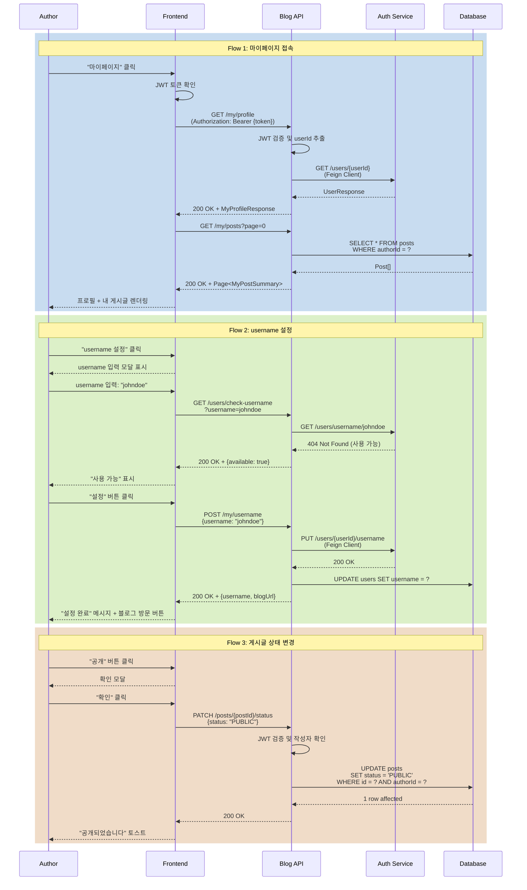

# 마이페이지 관리 시나리오

## Overview

로그인한 사용자가 마이페이지에서 자신의 프로필을 관리하고, 작성한 게시글을 조회/수정/삭제하며, username을 최초 1회 설정하는 시나리오입니다.

## Actors

| Actor | 역할 | 설명 |
|-------|------|------|
| 작성자 | 블로그 소유자 | 로그인한 사용자, 자신의 콘텐츠 관리 |
| 시스템 | 데이터 관리자 | 프로필 및 게시글 정보 저장/조회 |
| auth-service | 사용자 인증/정보 제공자 | JWT 검증, 사용자 정보 업데이트 |

## User Stories

### Story 1: 마이페이지 접속
```
As a 작성자
I want 마이페이지에 접속하여 내 정보를 확인
So that 프로필과 게시글을 관리할 수 있음
```

### Story 2: username 최초 설정
```
As a 신규 작성자
I want username을 한 번만 설정
So that 나만의 블로그 주소(/@username)를 가질 수 있음
```

### Story 3: 프로필 수정
```
As a 작성자
I want 프로필 정보를 수정
So that 최신 정보를 유지하고 개성을 표현할 수 있음
```

### Story 4: 내 게시글 관리
```
As a 작성자
I want 내가 작성한 모든 게시글을 보고 관리
So that 공개/비공개/임시저장 상태를 제어하고 수정/삭제할 수 있음
```

### Story 5: 게시글 필터링
```
As a 작성자
I want 게시글을 상태별/시리즈별로 필터링
So that 원하는 게시글을 빠르게 찾을 수 있음
```

## Triggers

| 트리거 | 조건 | 결과 |
|--------|------|------|
| 마이페이지 메뉴 클릭 | 로그인 상태 | `/my` 페이지 이동 |
| 프로필 이미지 클릭 | 헤더에서 자신의 프로필 클릭 | 마이페이지 이동 |
| 게시글 작성 완료 | 첫 게시글 작성 후 | username 설정 모달 표시 (미설정 시) |
| 직접 URL 입력 | `/my` 입력 | 인증 확인 → 마이페이지 또는 로그인 페이지 |

## Flow

### 정상 흐름 1: 마이페이지 첫 접속

1. 작성자가 헤더의 "마이페이지" 메뉴 클릭
2. Frontend가 인증 상태 확인
   - Store에서 JWT 토큰 확인
   - 없으면 로그인 페이지로 리다이렉트 (`/login?redirect=/my`)
3. 마이페이지 라우터 이동 (`/my`)
4. API 요청: `GET /api/v1/blog/my/profile`
   - JWT 토큰 포함 (Authorization 헤더)
5. Backend가 JWT에서 userId 추출
6. auth-service로 사용자 정보 조회 (Feign Client)
7. 프로필 정보 응답
   - userId, email, displayName
   - username (nullable)
   - profileImageUrl, bio
8. Frontend가 프로필 섹션 렌더링
9. username 미설정 시:
   - "username을 설정하여 블로그를 시작하세요" 배너 표시
10. 내 게시글 목록 자동 로드
    - API 요청: `GET /api/v1/blog/my/posts?page=0&size=20`
11. 게시글 카드 목록 표시 (공개/비공개/임시저장 모두)

### 정상 흐름 2: username 최초 설정

1. 작성자가 "username 설정" 버튼 클릭
2. username 설정 모달 표시
   - 입력 필드: username (영문 소문자, 숫자, 하이픈, 언더스코어, 3-20자)
   - 실시간 중복 확인 (debounce 500ms)
   - 규칙 안내: "한 번 설정하면 변경할 수 없습니다"
3. 작성자가 username 입력 (`johndoe`)
4. 중복 확인 API 요청 (debounced)
   - API: `GET /api/v1/blog/users/check-username?username=johndoe`
   - 사용 가능: "✅ 사용 가능한 username입니다"
   - 중복: "❌ 이미 사용 중인 username입니다"
5. 작성자가 "설정" 버튼 클릭
6. API 요청: `POST /api/v1/blog/my/username`
   ```json
   {
     "username": "johndoe"
   }
   ```
7. Backend 처리:
   - JWT에서 userId 추출
   - 중복 확인 (race condition 방지)
   - auth-service에 username 업데이트 요청 (Feign Client)
   - blog-service 내부 사용자 정보 동기화
8. 성공 응답:
   ```json
   {
     "success": true,
     "data": {
       "username": "johndoe",
       "blogUrl": "/@johndoe"
     }
   }
   ```
9. 모달 닫기, 성공 메시지 표시
10. "블로그 방문하기" 버튼 표시 → `/@johndoe` 이동

### 정상 흐름 3: 프로필 수정

1. 작성자가 "프로필 수정" 버튼 클릭
2. 프로필 수정 폼 표시
   - displayName (닉네임)
   - bio (자기소개, 최대 200자)
   - profileImageUrl (이미지 URL 또는 업로드)
   - socialLinks (GitHub, Twitter 등)
3. 작성자가 정보 수정
4. "저장" 버튼 클릭
5. API 요청: `PUT /api/v1/blog/my/profile`
   ```json
   {
     "displayName": "John Doe",
     "bio": "Backend Developer interested in Spring Boot",
     "profileImageUrl": "https://cdn.example.com/profile/johndoe.jpg",
     "socialLinks": {
       "github": "https://github.com/johndoe",
       "twitter": "https://twitter.com/johndoe"
     }
   }
   ```
6. Backend 처리:
   - JWT에서 userId 추출
   - auth-service에 프로필 업데이트 요청 (Feign Client)
   - 성공 응답 반환
7. Frontend가 프로필 정보 갱신
8. "저장되었습니다" 토스트 메시지

### 정상 흐름 4: 내 게시글 목록 조회 및 필터링

1. 마이페이지 게시글 섹션에 탭 표시
   - [전체] [공개] [비공개] [임시저장]
2. 작성자가 "비공개" 탭 클릭
3. API 요청: `GET /api/v1/blog/my/posts?status=PRIVATE&page=0&size=20`
4. 비공개 게시글 목록 렌더링
5. 각 게시글 카드에 액션 버튼 표시
   - [수정] [삭제] [상태 변경]
6. 정렬 옵션 변경
   - 최신순 / 오래된 순 / 조회수 순
7. 시리즈 필터 적용 (선택)
   - 시리즈 드롭다운에서 선택
   - 해당 시리즈 게시글만 필터링

### 정상 흐름 5: 게시글 상태 변경

1. 작성자가 임시저장 게시글의 "공개" 버튼 클릭
2. 확인 모달: "이 게시글을 공개하시겠습니까?"
3. "확인" 클릭
4. API 요청: `PATCH /api/v1/blog/posts/{postId}/status`
   ```json
   {
     "status": "PUBLIC"
   }
   ```
5. Backend 처리:
   - JWT에서 userId 추출
   - 게시글 작성자 확인 (본인만 가능)
   - 상태 업데이트
   - publishedAt 설정 (최초 공개 시)
6. 성공 응답
7. 게시글 카드 상태 업데이트
8. "공개되었습니다" 토스트 메시지

### 정상 흐름 6: 게시글 삭제

1. 작성자가 게시글의 "삭제" 버튼 클릭
2. 확인 모달: "정말로 삭제하시겠습니까? 복구할 수 없습니다."
3. "삭제" 버튼 클릭
4. API 요청: `DELETE /api/v1/blog/posts/{postId}`
5. Backend 처리:
   - JWT에서 userId 추출
   - 게시글 작성자 확인
   - Soft delete 또는 Hard delete (설계 선택)
6. 성공 응답
7. 게시글 카드 제거
8. "삭제되었습니다" 토스트 메시지

### 시퀀스 다이어그램



## Business Rules

| 규칙 | 설명 | 위반 시 |
|------|------|---------|
| BR-001 | username은 최초 1회만 설정 가능 | 409 CONFLICT 반환 |
| BR-002 | username은 3-20자 (영문 소문자, 숫자, -, _) | 400 BAD REQUEST |
| BR-003 | username은 전체 시스템에서 고유 | 409 CONFLICT |
| BR-004 | 본인 게시글만 수정/삭제 가능 | 403 FORBIDDEN |
| BR-005 | 임시저장 게시글은 본인만 조회 가능 | 목록에서 제외 |
| BR-006 | displayName은 2-50자 | 400 BAD REQUEST |
| BR-007 | bio는 최대 200자 | 400 BAD REQUEST |

## API Endpoints

### 1. 내 프로필 조회

**Request**
```http
GET /api/v1/blog/my/profile
Authorization: Bearer {JWT_TOKEN}
```

**Response**
```json
{
  "success": true,
  "data": {
    "userId": "user-uuid-1234",
    "email": "john@example.com",
    "username": "johndoe",
    "displayName": "John Doe",
    "bio": "Backend Developer interested in Spring Boot",
    "profileImageUrl": "https://cdn.example.com/profile/johndoe.jpg",
    "socialLinks": {
      "github": "https://github.com/johndoe",
      "twitter": "https://twitter.com/johndoe"
    },
    "postCount": 42,
    "followerCount": 128,
    "followingCount": 56,
    "createdAt": "2025-01-15T10:00:00",
    "blogUrl": "/@johndoe"
  }
}
```

### 2. username 중복 확인

**Request**
```http
GET /api/v1/blog/users/check-username?username=johndoe
```

**Response**
```json
{
  "success": true,
  "data": {
    "username": "johndoe",
    "available": true
  }
}
```

### 3. username 설정

**Request**
```http
POST /api/v1/blog/my/username
Authorization: Bearer {JWT_TOKEN}
Content-Type: application/json

{
  "username": "johndoe"
}
```

**Response**
```json
{
  "success": true,
  "data": {
    "username": "johndoe",
    "blogUrl": "/@johndoe"
  }
}
```

### 4. 프로필 수정

**Request**
```http
PUT /api/v1/blog/my/profile
Authorization: Bearer {JWT_TOKEN}
Content-Type: application/json

{
  "displayName": "John Doe",
  "bio": "Backend Developer interested in Spring Boot",
  "profileImageUrl": "https://cdn.example.com/profile/johndoe.jpg",
  "socialLinks": {
    "github": "https://github.com/johndoe",
    "twitter": "https://twitter.com/johndoe"
  }
}
```

**Response**
```json
{
  "success": true,
  "data": {
    "userId": "user-uuid-1234",
    "displayName": "John Doe",
    "bio": "Backend Developer interested in Spring Boot",
    "profileImageUrl": "https://cdn.example.com/profile/johndoe.jpg",
    "socialLinks": {
      "github": "https://github.com/johndoe",
      "twitter": "https://twitter.com/johndoe"
    },
    "updatedAt": "2026-01-21T15:30:00"
  }
}
```

### 5. 내 게시글 목록 조회

**Request**
```http
GET /api/v1/blog/my/posts?status=ALL&page=0&size=20&sort=createdAt,desc
Authorization: Bearer {JWT_TOKEN}
```

**Query Parameters**
- `status`: `ALL` | `PUBLIC` | `PRIVATE` | `DRAFT` (기본값: ALL)
- `seriesId`: 시리즈 ID (선택)
- `sort`: 정렬 (createdAt,desc | viewCount,desc | likeCount,desc)
- `page`, `size`: 페이지네이션

**Response**
```json
{
  "success": true,
  "data": {
    "content": [
      {
        "id": "post-id-1",
        "title": "Spring Boot 3.2 새로운 기능",
        "summary": "Spring Boot 3.2의 주요 변경사항을...",
        "thumbnailUrl": "https://cdn.example.com/thumbnails/post1.jpg",
        "status": "PUBLIC",
        "tags": ["spring-boot", "java"],
        "series": {
          "id": "series-id-1",
          "name": "Spring Boot 완벽 가이드"
        },
        "viewCount": 1250,
        "likeCount": 42,
        "commentCount": 8,
        "createdAt": "2026-01-20T10:00:00",
        "publishedAt": "2026-01-21T08:00:00",
        "updatedAt": "2026-01-21T12:00:00"
      }
    ],
    "pageable": {
      "pageNumber": 0,
      "pageSize": 20,
      "totalElements": 42,
      "totalPages": 3
    }
  }
}
```

### 6. 게시글 상태 변경

**Request**
```http
PATCH /api/v1/blog/posts/{postId}/status
Authorization: Bearer {JWT_TOKEN}
Content-Type: application/json

{
  "status": "PUBLIC"
}
```

**Response**
```json
{
  "success": true,
  "data": {
    "postId": "post-id-1",
    "status": "PUBLIC",
    "publishedAt": "2026-01-21T15:00:00"
  }
}
```

### 7. 게시글 삭제

**Request**
```http
DELETE /api/v1/blog/posts/{postId}
Authorization: Bearer {JWT_TOKEN}
```

**Response**
```json
{
  "success": true,
  "data": {
    "postId": "post-id-1",
    "deleted": true
  }
}
```

## Error Cases

| 에러 코드 | HTTP Status | 원인 | Frontend 처리 |
|-----------|-------------|------|--------------|
| C002 | 401 | 인증 토큰 없음/만료 | 로그인 페이지로 리다이렉트 |
| B030 | 400 | 잘못된 username 형식 | "3-20자, 영문 소문자/숫자/-/_ 만 가능" 메시지 |
| B031 | 409 | username 중복 | "이미 사용 중인 username입니다" |
| B032 | 409 | username 이미 설정됨 | "이미 username이 설정되어 있습니다" |
| B033 | 403 | 타인의 게시글 수정/삭제 시도 | "권한이 없습니다" 메시지 |
| B034 | 404 | 게시글 미존재 | "게시글을 찾을 수 없습니다" |
| A001 | 500 | auth-service 오류 | "일시적인 오류가 발생했습니다" + 재시도 |

## UI Components

### Vue 컴포넌트 구조

```
MyPage.vue                          # 마이페이지 메인
├── ProfileSection.vue              # 프로필 섹션
│   ├── ProfileHeader.vue           # 프로필 헤더
│   ├── ProfileEditForm.vue         # 프로필 수정 폼
│   └── UsernameSetupModal.vue      # username 설정 모달
├── MyPostsSection.vue              # 내 게시글 섹션
│   ├── PostStatusTabs.vue          # 상태 탭 (전체/공개/비공개/임시저장)
│   ├── PostFilterBar.vue           # 필터/정렬 바
│   └── MyPostCard.vue              # 내 게시글 카드
│       ├── PostStatusBadge.vue     # 상태 뱃지
│       └── PostActionMenu.vue      # 액션 메뉴 (수정/삭제/상태변경)
└── StatsSection.vue                # 통계 섹션 (게시글 수, 조회수 총합 등)
```

### 컴포넌트 위치

- **MyPage.vue**: `frontend/blog-frontend/src/views/MyPage.vue`
- **ProfileSection.vue**: `frontend/blog-frontend/src/components/my/ProfileSection.vue`
- **MyPostsSection.vue**: `frontend/blog-frontend/src/components/my/MyPostsSection.vue`

### 라우팅

```typescript
{
  path: '/my',
  name: 'MyPage',
  component: MyPage,
  meta: {
    requiresAuth: true,
    title: '마이페이지'
  },
  beforeEnter: (to, from, next) => {
    const authStore = useAuthStore()
    if (!authStore.isAuthenticated) {
      next({ name: 'Login', query: { redirect: '/my' } })
    } else {
      next()
    }
  }
}
```

## Output

### 마이페이지 UI

**프로필 섹션 (username 미설정)**
```
┌─────────────────────────────────────────────┐
│  ⚠️  username을 설정하여 블로그를 시작하세요│
│  [username 설정하기]                         │
└─────────────────────────────────────────────┘

┌─────────────────────────────────────────────┐
│  [프로필 이미지]          [프로필 수정]     │
│                                              │
│  John Doe                                    │
│  john@example.com                            │
│  Backend Developer interested in Spring Boot│
│                                              │
│  📝 42개 게시글  👁 15,342 총 조회수        │
└─────────────────────────────────────────────┘
```

**username 설정 모달**
```
┌─────────────────────────────────────────────┐
│  username 설정                               │
│  ─────────────────────────────────────────  │
│                                              │
│  블로그 주소: /@[          ]                 │
│  ┌────────────────────────────────────────┐ │
│  │ johndoe                                │ │
│  └────────────────────────────────────────┘ │
│  ✅ 사용 가능한 username입니다              │
│                                              │
│  📌 주의사항:                                │
│  • 3-20자 (영문 소문자, 숫자, -, _ 가능)    │
│  • 한 번 설정하면 변경할 수 없습니다        │
│                                              │
│  [취소]                          [설정]     │
└─────────────────────────────────────────────┘
```

**내 게시글 섹션**
```
┌─────────────────────────────────────────────┐
│  내 게시글                                   │
│                                              │
│  [전체 42] [공개 35] [비공개 5] [임시저장 2]│
│                                              │
│  [시리즈 ▼] [태그 ▼]           [최신순 ▼]  │
│                                              │
│  ┌───────────────────────────────────────┐  │
│  │ [🔒 비공개]  Spring Boot 3.2 새로운 기능│
│  │                                        │  │
│  │ 2026.01.21 • 👁 1,250 ❤️ 42 💬 8     │  │
│  │                                        │  │
│  │ [수정] [공개로 전환] [삭제]           │  │
│  └───────────────────────────────────────┘  │
│                                              │
│  ┌───────────────────────────────────────┐  │
│  │ [✏️ 임시저장]  JPA N+1 문제 해결하기   │
│  │                                        │  │
│  │ 2026.01.20 • 👁 0 ❤️ 0 💬 0          │  │
│  │                                        │  │
│  │ [수정] [공개] [삭제]                  │  │
│  └───────────────────────────────────────┘  │
└─────────────────────────────────────────────┘
```

### 상태 뱃지

- `🌐 공개` (초록색)
- `🔒 비공개` (회색)
- `✏️ 임시저장` (주황색)

## Learning Points

### username 변경 불가 정책

**이유**
1. URL 안정성: 외부에서 공유된 `/@username` 링크 유효성 유지
2. SEO: 검색 엔진 인덱싱 안정성
3. 브랜드 일관성: username은 개인 브랜드의 일부

**대안**
- displayName은 언제든지 변경 가능 (노출명)
- username 변경 요청 시 관리자 승인 프로세스 (향후)

**벤치마크**
- Velog: username 변경 불가
- Medium: username 변경 가능하지만 리다이렉트 유지
- GitHub: username 변경 가능하지만 경고 메시지

### Soft Delete vs Hard Delete

**선택: Soft Delete**

**구현**
```java
@Document(collection = "posts")
public class Post {
    // ...
    private LocalDateTime deletedAt;
    private boolean deleted = false;
}

// 조회 시 deleted=false 필터링
Query query = new Query(
    Criteria.where("deleted").is(false)
        .and("authorId").is(authorId)
);
```

**장점**
- 실수로 삭제 시 복구 가능
- 데이터 분석 유지 (통계)
- 감사 로그 유지

**단점**
- 저장 공간 증가
- 쿼리 복잡도 증가

**참고 문서**
- [학습 노트: Soft Delete 패턴](../learning/soft-delete-pattern.md)

### JWT에서 userId 추출 vs DB 조회

**JWT 방식 선택 (현재)**
- 장점: DB 조회 불필요, 빠름
- 단점: 토큰 갱신 전까지 정보 업데이트 안 됨

**사용자 정보가 필요한 경우**
- JWT에 userId만 포함
- auth-service에 Feign Client로 조회
- 캐싱 전략 적용 (Redis, 5분 TTL)

## Related

- [SCENARIO-009 사용자 블로그 방문 시나리오](./SCENARIO-009-user-blog-view.md)
- [PRD: Phase 1-A Blog UX Enhancement](../prd/phase1a-blog-ux.md)
- [ADR: Feign Client vs Kafka for User Info Sync](../adr/ADR-007-user-info-sync.md)
