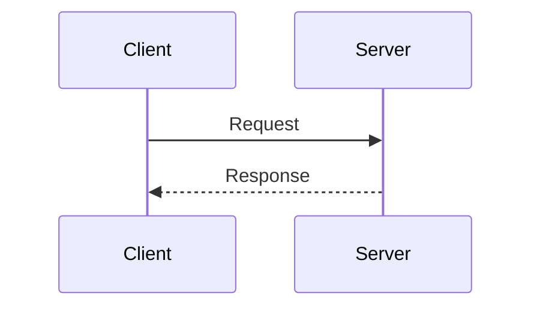
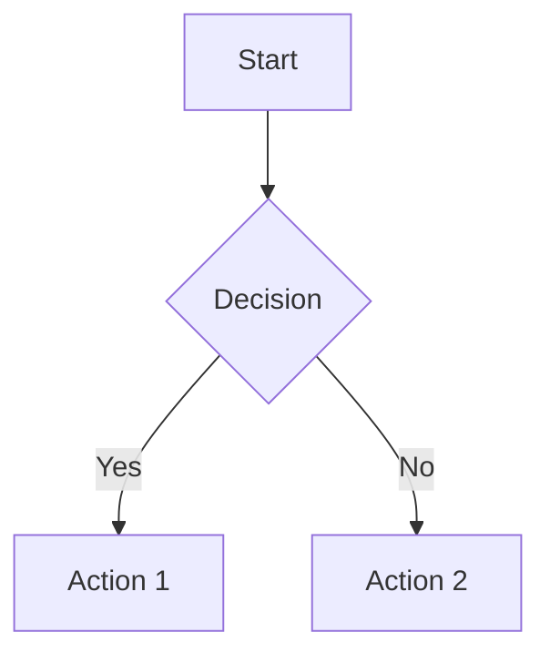
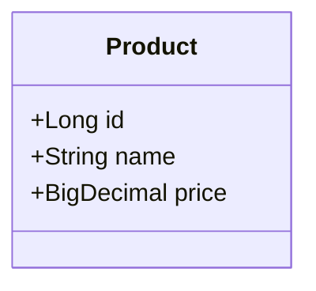

# Diagrams 작성 가이드

## 📋 개요
시스템 다이어그램을 작성하고 관리하는 가이드입니다.

## 📁 구조
```
diagrams/
├── source/      # 원본 (Mermaid, Draw.io 등)
└── exported/    # 내보낸 이미지 (PNG, SVG)
```

## 🎨 권장 도구
1. **Mermaid** (권장): Markdown 내 작성
2. **Draw.io**: 복잡한 다이어그램
3. **PlantUML**: UML 다이어그램

## 📝 Mermaid 예시

### Sequence Diagram


### Flowchart


### Class Diagram


## 📐 명명 규칙
- 파일명: `[topic]-[type].md` 또는 `.png`
- 예시: `system-architecture-overview.md`
- 내보낸 이미지: 같은 이름 + 확장자

## ✅ 체크리스트
- [ ] source와 exported 버전이 동기화되었는가?
- [ ] 다이어그램 설명이 포함되었는가?
- [ ] README 인덱스에 추가했는가?
