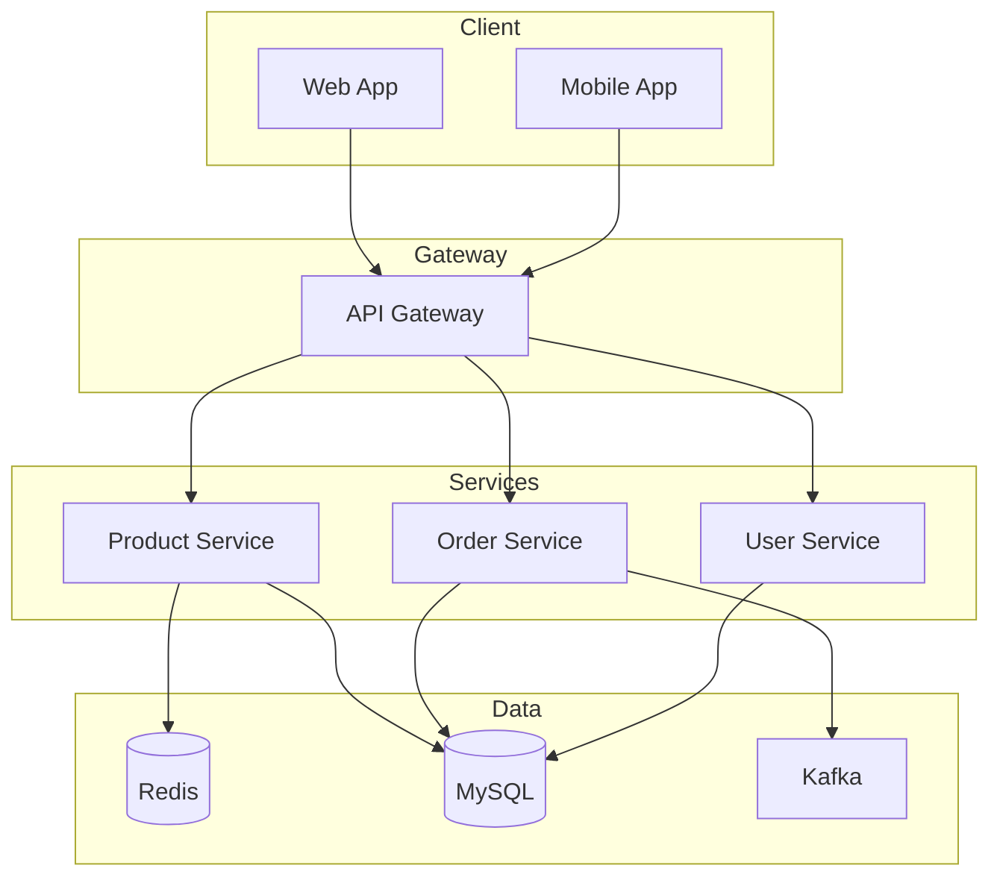

# System Architecture Diagram

```mermaid
graph TB
    subgraph Client
        Web[Web App]
        Mobile[Mobile App]
    end

    subgraph Gateway
        GW[API Gateway]
    end

    subgraph Services
        PS[Product Service]
        OS[Order Service]
        US[User Service]
    end

    subgraph Data
        Redis[(Redis)]
        MySQL[(MySQL)]
        Kafka[Kafka]
    end

    Web --> GW
    Mobile --> GW
    GW --> PS
    GW --> OS
    GW --> US
    PS --> Redis
    PS --> MySQL
    OS --> MySQL
    OS --> Kafka
    US --> MySQL
```
