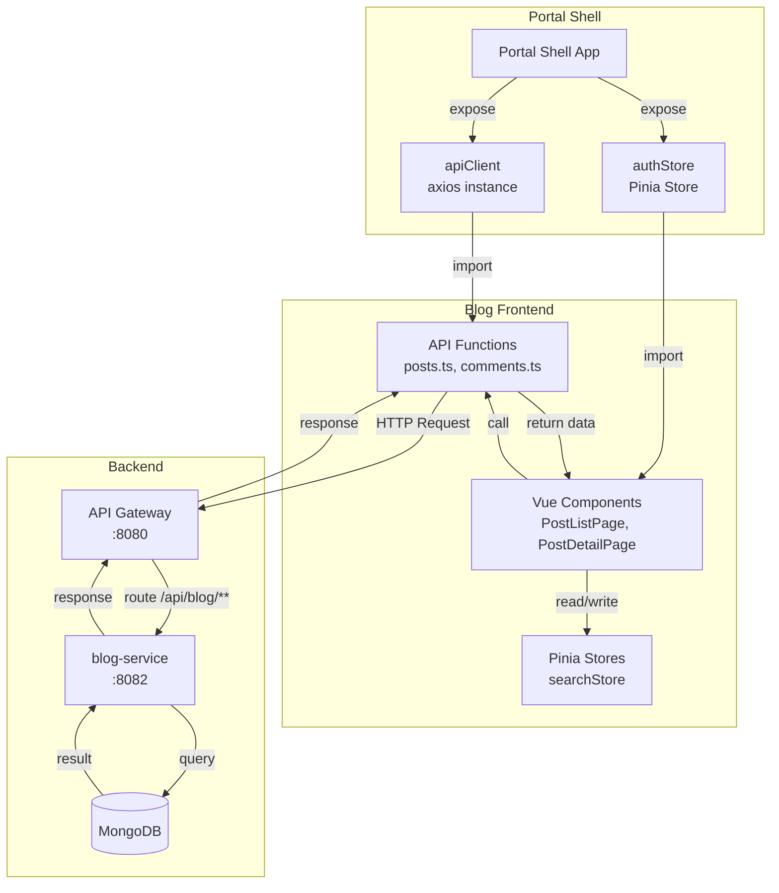
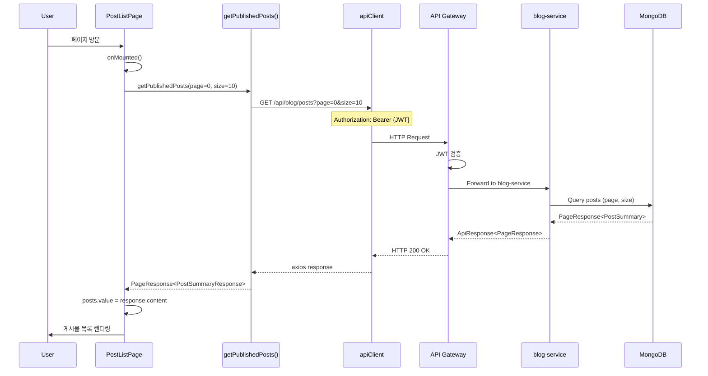
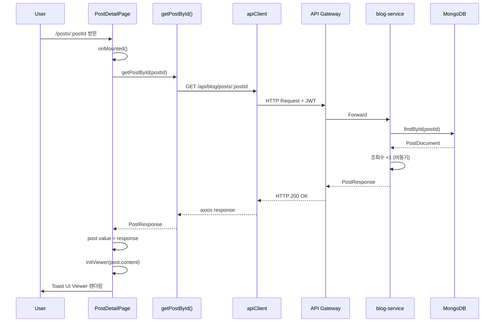
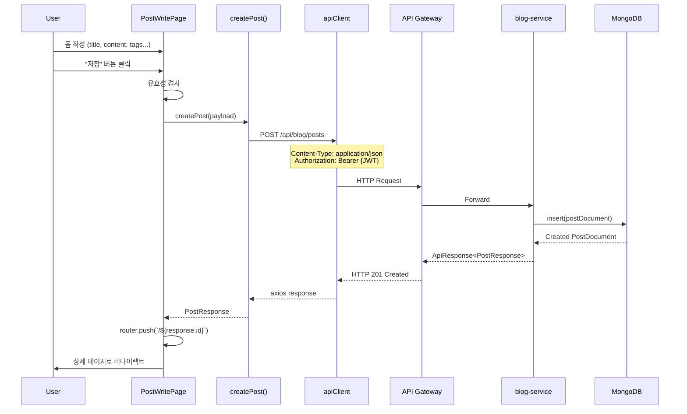
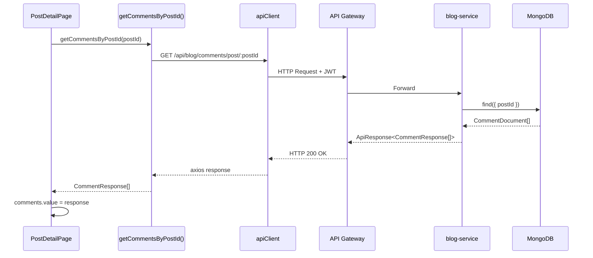
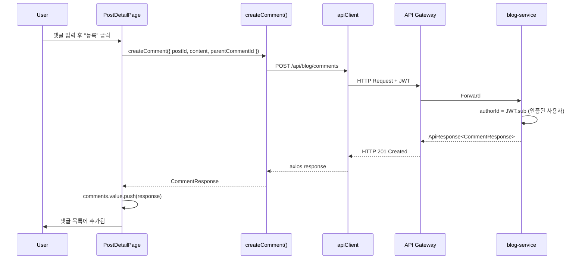
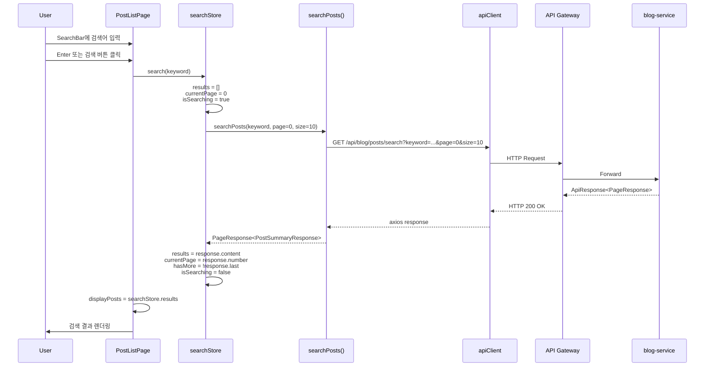
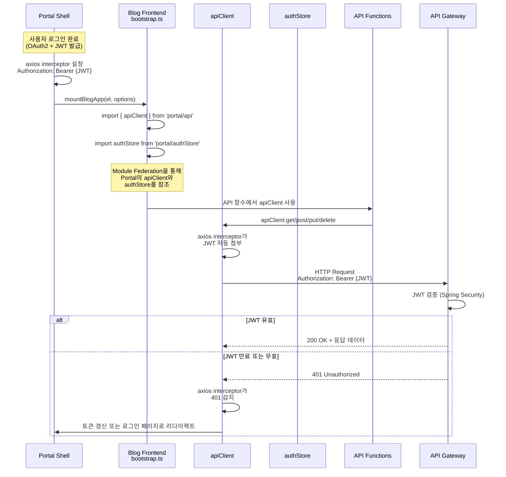
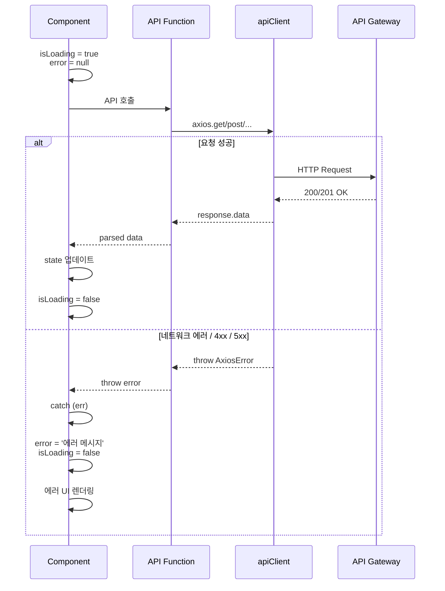

# Blog Frontend Data Flow

## 📋 개요

Blog Frontend는 Vue 3 기반의 마이크로 프론트엔드로, API Gateway를 통해 blog-service와 통신하며, Pinia를 사용하여 상태를 관리합니다. Portal Shell에서 주입받은 `apiClient`와 `authStore`를 통해 인증된 요청을 전송하고, 응답 데이터를 컴포넌트에 반영합니다.

**핵심 특징**:
- Portal Shell에서 주입된 `apiClient` (axios 인스턴스) 사용
- API Gateway를 통한 중앙집중식 라우팅 (`/api/blog/**`)
- Pinia를 활용한 반응형 상태 관리
- 컴포넌트 레벨 에러 처리

---

## 🔄 전체 데이터 흐름 아키텍처



---

## 📨 주요 데이터 흐름

### 1. 게시물 목록 조회 (Pagination)



**설명**:
1. 사용자가 PostListPage 방문
2. `onMounted()` 훅에서 `getPublishedPosts()` 호출
3. API 함수가 `apiClient.get('/api/blog/posts')` 호출
4. `apiClient`는 Portal Shell에서 주입된 axios 인스턴스 (JWT 자동 첨부)
5. API Gateway가 JWT 검증 후 blog-service로 라우팅
6. blog-service가 MongoDB 쿼리 후 PageResponse 반환
7. 응답 데이터를 `posts.value`에 저장
8. Vue의 반응형 시스템이 자동으로 UI 업데이트

---

### 2. 게시물 상세 조회 (조회수 증가)



**설명**:
1. 사용자가 게시물 상세 페이지 방문 (URL 파라미터에 postId 포함)
2. `route.params.postId`로 ID 추출 후 `getPostById()` 호출
3. blog-service가 게시물 조회 후 조회수 증가 (비동기 처리)
4. 응답 데이터를 `post.value`에 저장
5. `watch`가 감지하여 Toast UI Viewer 초기화
6. Markdown 콘텐츠가 HTML로 렌더링됨

---

### 3. 게시물 작성/수정



**설명**:
1. 사용자가 게시물 작성 폼 입력
2. 클라이언트 측 유효성 검사 (title, content 필수 등)
3. `createPost()` 함수로 POST 요청 전송
4. blog-service가 MongoDB에 새 게시물 저장
5. 생성된 게시물의 ID를 포함한 응답 반환
6. Vue Router로 상세 페이지(`/:postId`)로 이동

---

### 4. 댓글 CRUD

#### 댓글 목록 조회



#### 댓글 작성



**설명**:
1. 사용자가 댓글 입력 후 등록 버튼 클릭
2. `createComment()` 함수로 POST 요청 전송
3. blog-service가 JWT에서 `authorId` 추출 (인증된 사용자)
4. MongoDB에 댓글 저장 후 응답 반환
5. `comments.value.push()`로 로컬 상태에 추가 (즉시 UI 반영)

---

### 5. 검색 (Pinia Store 활용)



**설명**:
1. 사용자가 SearchBar에서 검색어 입력
2. `searchStore.search(keyword)` 호출 (Pinia action)
3. Store가 상태 초기화 (`results = []`, `isSearching = true`)
4. `searchPosts()` API 함수 호출
5. blog-service가 MongoDB 텍스트 검색 실행
6. 응답 데이터를 Store에 저장
7. Vue의 Computed Property가 자동으로 UI 업데이트

---

## 🔐 인증 토큰 흐름

Blog Frontend는 Portal Shell에서 주입받은 `apiClient`와 `authStore`를 통해 인증을 처리합니다.



**핵심 포인트**:
- `apiClient`는 Portal Shell에서 생성된 axios 인스턴스
- axios interceptor가 모든 요청에 `Authorization: Bearer {JWT}` 자동 첨부
- Blog Frontend는 토큰 관리를 직접 하지 않음 (Portal Shell에 위임)
- 401 Unauthorized 발생 시 Portal Shell의 interceptor가 처리

### Portal Shell에서 주입되는 모듈

| 모듈 | 소스 | 설명 |
|------|------|------|
| `apiClient` | `portal/api` | axios 인스턴스 (JWT 자동 첨부) |
| `authStore` | `portal/authStore` | Pinia Store (인증 상태, 사용자 정보) |

**사용 예시**:

```typescript
// src/api/index.ts
import { apiClient } from 'portal/api';
export default apiClient;

// src/views/PostListPage.vue
import { useAuthStore } from 'portal/authStore';
const authStore = useAuthStore();
const isAuthenticated = authStore.isAuthenticated;
```

---

## 🗂️ Pinia 상태 관리 흐름

### searchStore (검색 상태)

```mermaid
graph TB
    subgraph "searchStore State"
        KW[keyword: string]
        RES[results: PostSummaryResponse[]]
        IS[isSearching: boolean]
        ERR[error: string | null]
        CP[currentPage: number]
        TP[totalPages: number]
        HM[hasMore: boolean]
    end

    subgraph "searchStore Actions"
        SEARCH[search<br/>keyword]
        LOAD[loadMore<br/>]
        CLEAR[clear<br/>]
    end

    subgraph "Components"
        PL[PostListPage]
        SB[SearchBar]
    end

    PL -->|watch| RES
    PL -->|watch| IS
    PL -->|watch| ERR
    SB -->|v-model| KW
    SB -->|@search| SEARCH
    SB -->|@clear| CLEAR
    PL -->|scroll to bottom| LOAD
```

**State 흐름**:

1. **새 검색 시작**:
   ```typescript
   searchStore.search('Vue')
   → keyword = 'Vue'
   → results = []
   → currentPage = 0
   → isSearching = true
   → API 호출
   → results = response.content
   → isSearching = false
   ```

2. **추가 페이지 로드**:
   ```typescript
   searchStore.loadMore()
   → isSearching = true
   → API 호출 (currentPage + 1)
   → results = [...results, ...response.content]
   → currentPage = response.number
   → hasMore = !response.last
   → isSearching = false
   ```

3. **검색 초기화**:
   ```typescript
   searchStore.clear()
   → keyword = ''
   → results = []
   → currentPage = 0
   → hasMore = false
   → error = null
   ```

---

## ❌ 에러 처리 흐름

### 컴포넌트 레벨 에러 처리



**에러 처리 패턴**:

```typescript
// 1. 로딩 및 에러 상태 선언
const isLoading = ref(false);
const error = ref<string | null>(null);

// 2. API 호출 시 try-catch
async function loadPosts() {
  try {
    isLoading.value = true;
    error.value = null;

    const response = await getPublishedPosts(page, size);
    posts.value = response.content;

  } catch (err) {
    console.error('Failed to fetch posts:', err);
    error.value = '게시글 목록을 불러올 수 없습니다.';
  } finally {
    isLoading.value = false;
  }
}
```

### API Gateway에서의 에러 응답

| HTTP Status | 설명 | 처리 |
|-------------|------|------|
| `401 Unauthorized` | JWT 만료 또는 무효 | Portal Shell의 interceptor가 로그인 페이지로 리다이렉트 |
| `403 Forbidden` | 권한 없음 | 에러 메시지 표시 ("접근 권한이 없습니다") |
| `404 Not Found` | 리소스 없음 | 에러 메시지 표시 ("존재하지 않는 게시글입니다") |
| `500 Internal Server Error` | 서버 에러 | 에러 메시지 표시 ("서버 오류가 발생했습니다") |

---

## 🔗 API 엔드포인트 맵핑

| Frontend API 함수 | HTTP 메서드 | 경로 | blog-service 컨트롤러 |
|-------------------|-------------|------|------------------------|
| `getPublishedPosts()` | GET | `/api/blog/posts?page=0&size=10` | `PostController.getPublishedPosts()` |
| `getPostById()` | GET | `/api/blog/posts/:postId` | `PostController.getPostById()` |
| `createPost()` | POST | `/api/blog/posts` | `PostController.createPost()` |
| `updatePost()` | PUT | `/api/blog/posts/:postId` | `PostController.updatePost()` |
| `deletePost()` | DELETE | `/api/blog/posts/:postId` | `PostController.deletePost()` |
| `searchPosts()` | GET | `/api/blog/posts/search?keyword=...` | `PostController.searchPosts()` |
| `getCommentsByPostId()` | GET | `/api/blog/comments/post/:postId` | `CommentController.getCommentsByPostId()` |
| `createComment()` | POST | `/api/blog/comments` | `CommentController.createComment()` |
| `updateComment()` | PUT | `/api/blog/comments/:commentId` | `CommentController.updateComment()` |
| `deleteComment()` | DELETE | `/api/blog/comments/:commentId` | `CommentController.deleteComment()` |
| `uploadFile()` | POST | `/api/blog/file/upload` | `FileController.uploadFile()` |

**API Gateway 라우팅 규칙**:
```yaml
/api/blog/** → blog-service:8082/**
```

---

## 📂 데이터 흐름 관련 파일 구조

```
src/
├── api/                          # API 통신 레이어
│   ├── index.ts                  # apiClient export (from 'portal/api')
│   ├── posts.ts                  # Posts API 함수
│   ├── comments.ts               # Comments API 함수
│   └── files.ts                  # Files API 함수
│
├── stores/                       # Pinia 상태 관리
│   └── searchStore.ts            # 검색 상태 (keyword, results, actions)
│
├── views/                        # 페이지 컴포넌트
│   ├── PostListPage.vue          # 목록 조회 + 무한 스크롤
│   ├── PostDetailPage.vue        # 상세 조회 + 댓글 CRUD
│   ├── PostWritePage.vue         # 게시물 작성
│   └── PostEditPage.vue          # 게시물 수정
│
├── components/                   # 재사용 컴포넌트
│   └── PostCard.vue              # 게시물 카드 (목록용)
│
├── types/                        # TypeScript 타입 정의
│   ├── post.ts                   # PostResponse, PostSummaryResponse 등
│   ├── comment.ts                # CommentResponse 등
│   └── api.ts                    # ApiResponse, PageResponse 등
│
└── bootstrap.ts                  # Module Federation 진입점
```

---

## 🚀 최적화 및 모범 사례

### 1. 무한 스크롤 (Intersection Observer)

```typescript
// PostListPage.vue
const loadMoreTrigger = ref<HTMLElement | null>(null);
let observer: IntersectionObserver | null = null;

function setupIntersectionObserver() {
  observer = new IntersectionObserver(
    (entries) => {
      if (entries[0].isIntersecting && canLoadMore.value) {
        loadMore(); // API 호출하여 다음 페이지 로드
      }
    },
    {
      rootMargin: '100px', // 뷰포트 하단 100px 전에 트리거
      threshold: 0.1
    }
  );

  if (loadMoreTrigger.value) {
    observer.observe(loadMoreTrigger.value);
  }
}
```

**장점**:
- 사용자가 스크롤할 때마다 자동으로 다음 페이지 로드
- `rootMargin: '100px'`로 미리 로딩 (부드러운 UX)

### 2. 로컬 상태 즉시 업데이트 (낙관적 업데이트)

```typescript
// PostDetailPage.vue - 댓글 작성
async function handleAddComment() {
  try {
    const comment = await createComment(payload);
    comments.value.push(comment); // 즉시 UI 반영
    newComment.value = '';
  } catch (e) {
    console.error('댓글 추가 실패:', e);
  }
}
```

**장점**:
- API 응답을 기다리지 않고 UI 즉시 업데이트
- 사용자 경험 향상

### 3. Pinia Store를 통한 중앙집중식 검색 상태 관리

```typescript
// 여러 컴포넌트에서 검색 상태 공유
const searchStore = useSearchStore();

// 검색 실행
searchStore.search('Vue');

// 추가 로드
searchStore.loadMore();

// 초기화
searchStore.clear();
```

**장점**:
- 검색 상태가 여러 컴포넌트 간 공유됨
- 코드 중복 감소

### 4. Toast UI Viewer 초기화 (Vue watch 활용)

```typescript
// PostDetailPage.vue
watch(
  [() => post.value, viewerElement],
  async ([newPost, newElement]) => {
    if (newPost?.content && newElement) {
      await nextTick();
      initViewer(newPost.content); // Viewer 초기화
    }
  },
  { immediate: false, flush: 'post' }
);
```

**장점**:
- `post` 데이터와 DOM 요소가 모두 준비된 후 초기화
- 안전한 Viewer 렌더링

---

## 🔗 관련 문서

- [API 명세](../api/README.md)
- [System Overview](./system-overview.md)

---

**최종 업데이트**: 2026-01-18
