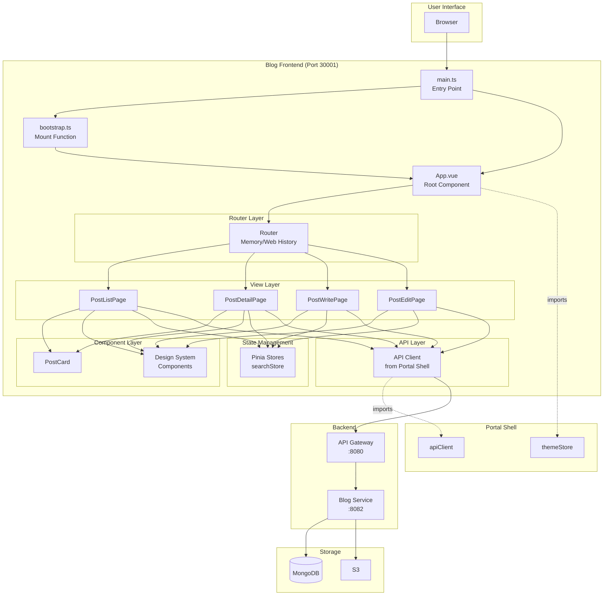
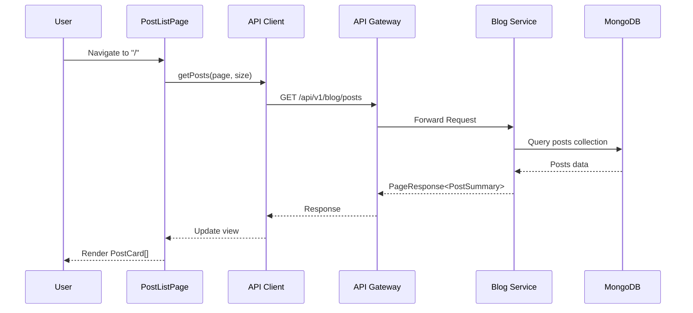
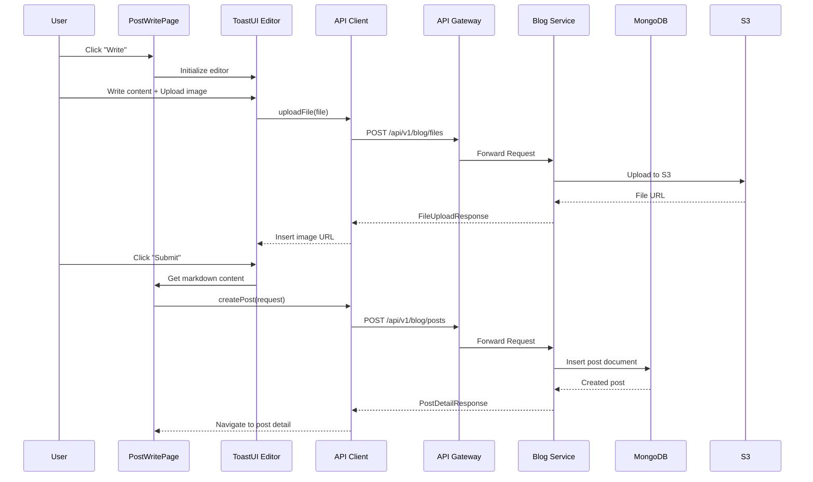

# Blog Frontend System Overview

## 📋 개요

Blog Frontend는 Vue 3 기반의 마이크로 프론트엔드 애플리케이션으로, Module Federation을 통해 Portal Shell에 통합되거나 독립 실행(Standalone) 가능한 **Dual Mode** 아키텍처를 제공합니다.

블로그 게시물의 CRUD(생성, 조회, 수정, 삭제) 기능을 제공하며, ToastUI Editor를 통한 마크다운 편집, 이미지 업로드, 태그/시리즈 관리 등의 기능을 포함합니다.

---

## 🎯 핵심 특징

### 1. Dual Mode Architecture
- **Standalone Mode**: 독립 실행 가능한 SPA (Web History)
- **Embedded Mode**: Portal Shell에 통합되는 Remote 모듈 (Memory History)
- 런타임에 자동 감지 (`window.__POWERED_BY_PORTAL_SHELL__`)

### 2. Module Federation Integration
- Vite + @originjs/vite-plugin-federation
- `./bootstrap` 모듈을 Portal Shell에 노출
- Portal Shell의 `apiClient`, `themeStore` 재사용

### 3. Design System Integration
- `@portal/design-system` 공유 컴포넌트 사용
- `data-service="blog"` 속성을 통한 서비스별 테마 적용
- Portal Shell의 다크모드 동기화

### 4. Rich Editor
- ToastUI Editor 기반 마크다운 편집
- 코드 신택스 하이라이팅 (Prism.js)
- 이미지 업로드 (S3)

---

## 🏗️ High-Level Architecture



---

## 📦 컴포넌트 상세

### 1. Entry Points

#### main.ts (Standalone Mode)
| 항목 | 내용 |
|------|------|
| **역할** | 독립 실행 시 진입점 |
| **History** | Web History (브라우저 URL 관리) |
| **Router** | `createStandaloneBlogRouter()` |
| **감지 방법** | `window.__POWERED_BY_PORTAL_SHELL__ !== true` |

#### bootstrap.ts (Embedded Mode)
| 항목 | 내용 |
|------|------|
| **역할** | Portal Shell 통합 시 진입점 |
| **Export** | `mountBlogApp(el, options)` 함수 |
| **History** | Memory History (Portal Shell이 URL 관리) |
| **Router** | `createBlogRouter('/')` |
| **Lifecycle** | `router`, `onParentNavigate`, `unmount` 반환 |

---

### 2. Router Configuration

```mermaid
graph LR
    A[/] --> B[PostListPage]
    C[/:postId] --> D[PostDetailPage]
    E[/write] --> F[PostWritePage]
    G[/edit/:postId] --> H[PostEditPage]
```

| Route | Component | Description |
|-------|-----------|-------------|
| `/` | PostListPage | 게시물 목록 (검색, 필터링) |
| `/:postId` | PostDetailPage | 게시물 상세 (댓글, 태그) |
| `/write` | PostWritePage | 새 게시물 작성 |
| `/edit/:postId` | PostEditPage | 게시물 수정 |

**Router 모드**:
- **Standalone**: Web History (`createWebHistory('/')`)
- **Embedded**: Memory History (`createMemoryHistory('/')`)

---

### 3. View Layer

#### PostListPage
- 게시물 목록 조회 (페이징)
- 검색 기능 (Pinia searchStore 연동)
- 태그/시리즈 필터링
- PostCard 컴포넌트 렌더링

#### PostDetailPage
- 게시물 상세 조회
- 마크다운 렌더링
- 댓글 목록/작성
- 태그, 시리즈 정보 표시

#### PostWritePage
- ToastUI Editor 통합
- 이미지 업로드 (S3)
- 태그/시리즈 선택
- 임시 저장 기능

#### PostEditPage
- 기존 게시물 불러오기
- ToastUI Editor 수정 모드
- 수정 사항 저장

---

### 4. Component Layer

#### PostCard.vue
| 항목 | 내용 |
|------|------|
| **역할** | 게시물 카드 UI |
| **Props** | `post: PostSummaryResponse` |
| **표시 정보** | 제목, 요약, 태그, 작성일, 조회수 |

#### Design System Components
- `Button`, `Card`, `Badge`, `Input`, `Modal`, `Tag`, `Avatar`, `SearchBar`
- `@portal/design-system`에서 import
- Semantic 클래스 사용 (`bg-bg-page`, `text-text-body` 등)

---

### 5. State Management (Pinia)

#### searchStore
| 항목 | 내용 |
|------|------|
| **역할** | 검색 상태 관리 |
| **State** | `keyword`, `results`, `isSearching`, `error`, `currentPage`, `hasMore` |
| **Actions** | `search(keyword)`, `loadMore()`, `clear()` |
| **API 연동** | `searchPosts(keyword, page, size)` |

---

### 6. API Layer

#### API Client
```typescript
// src/api/index.ts
import apiClient from 'portal/apiClient';  // Portal Shell의 axios 인스턴스 재사용
export default apiClient;
```

| 파일 | 역할 |
|------|------|
| `api/posts.ts` | 게시물 CRUD, 검색 |
| `api/comments.ts` | 댓글 CRUD |
| `api/files.ts` | 이미지 업로드 |
| `api/index.ts` | Portal Shell의 apiClient import |

**주요 특징**:
- Portal Shell의 인증된 axios 인스턴스 재사용
- JWT 토큰 자동 첨부 (Portal Shell의 interceptor)
- 공통 에러 처리

---

### 7. DTO Layer

| 파일 | 역할 |
|------|------|
| `dto/post.ts` | `PostSummaryResponse`, `PostDetailResponse`, `CreatePostRequest`, `UpdatePostRequest` |
| `dto/comment.ts` | `CommentResponse`, `CreateCommentRequest` |
| `dto/tag.ts` | `TagResponse` |
| `dto/series.ts` | `SeriesResponse` |
| `dto/file.ts` | `FileUploadResponse` |

---

## 💾 데이터 흐름

### 게시물 조회 (Read)


### 게시물 작성 (Create)


---

## 🔗 Module Federation 구성

### Vite Configuration
```typescript
// vite.config.ts
federation({
  name: 'blog',
  remotes: {
    portal: env.VITE_PORTAL_SHELL_REMOTE_URL,  // http://localhost:30000/assets/remoteEntry.js
    shopping: env.VITE_SHOPPING_REMOTE_URL     // http://localhost:30002/assets/remoteEntry.js
  },
  filename: 'remoteEntry.js',
  exposes: {
    './bootstrap': './src/bootstrap.ts'  // Portal Shell에서 import 가능
  },
  shared: ['vue', 'pinia', 'axios']      // 중복 번들 방지
})
```

### Portal Shell에서의 사용
```typescript
// Portal Shell에서 Blog 앱 마운트
import { mountBlogApp } from 'blog/bootstrap';

const blogInstance = mountBlogApp(containerEl, {
  initialPath: '/123',
  onNavigate: (path) => {
    console.log('Blog navigated to:', path);
  }
});

// 언마운트
blogInstance.unmount();
```

---

## 🎨 Theme & Styling

### Design Token Integration
```css
/* Base Layer */
--color-green-600: #10b981;

/* Semantic Layer */
--color-brand-primary: var(--color-green-600);

/* Component Layer */
.bg-brand-primary { background-color: var(--color-brand-primary); }
```

### Service-Specific Theme
```vue
<!-- App.vue -->
<script setup>
onMounted(() => {
  document.documentElement.setAttribute('data-service', 'blog');
  // CSS: [data-service="blog"] { /* blog-specific styles */ }
});
</script>
```

### Dark Mode Sync
```typescript
// Embedded Mode: Portal Shell의 themeStore 연동
import { useThemeStore } from 'portal/themeStore';
const themeStore = useThemeStore();

watch(() => themeStore.isDark, (isDark) => {
  document.documentElement.classList.toggle('dark', isDark);
});
```

---

## 🛠️ 기술 스택

### Core
| 기술 | 버전 | 용도 |
|------|------|------|
| Vue | 3.5.21 | UI 프레임워크 |
| Vite | 7.1.7 | 빌드 도구 |
| TypeScript | 5.9.3 | 타입 안전성 |
| Pinia | 3.0.3 | 상태 관리 |
| Vue Router | 4.5.1 | 라우팅 |

### Module Federation
| 기술 | 버전 | 용도 |
|------|------|------|
| @originjs/vite-plugin-federation | 1.4.1 | Vite Module Federation 지원 |

### Editor
| 기술 | 버전 | 용도 |
|------|------|------|
| @toast-ui/editor | 3.2.2 | 마크다운 편집기 |
| @toast-ui/editor-plugin-code-syntax-highlight | 3.1.0 | 코드 하이라이팅 |
| Prism.js | 1.30.0 | 신택스 하이라이팅 |

### HTTP & Auth
| 기술 | 버전 | 용도 |
|------|------|------|
| axios | 1.12.2 | HTTP 클라이언트 (Portal Shell에서 제공) |
| oidc-client-ts | 3.3.0 | OAuth2/OIDC 인증 |

### Design System
| 기술 | 버전 | 용도 |
|------|------|------|
| @portal/design-system | * | 공유 Vue 컴포넌트 |
| TailwindCSS | 3.4.15 | 유틸리티 CSS |

---

## 📁 디렉토리 구조

```
blog-frontend/
├── src/
│   ├── main.ts                # Standalone 모드 진입점
│   ├── bootstrap.ts           # Embedded 모드 진입점 (mountBlogApp)
│   ├── App.vue                # Root 컴포넌트
│   ├── style.css              # Global styles
│   │
│   ├── router/
│   │   └── index.ts           # Router 설정 (Dual Mode)
│   │
│   ├── views/                 # 페이지 컴포넌트
│   │   ├── PostListPage.vue
│   │   ├── PostDetailPage.vue
│   │   ├── PostWritePage.vue
│   │   └── PostEditPage.vue
│   │
│   ├── components/            # 공통 컴포넌트
│   │   ├── PostCard.vue
│   │   └── HelloWorld.vue
│   │
│   ├── api/                   # API 클라이언트
│   │   ├── index.ts           # apiClient import (from Portal Shell)
│   │   ├── posts.ts           # 게시물 API
│   │   ├── comments.ts        # 댓글 API
│   │   └── files.ts           # 파일 업로드 API
│   │
│   ├── stores/                # Pinia Stores
│   │   └── searchStore.ts     # 검색 상태 관리
│   │
│   ├── dto/                   # Data Transfer Objects
│   │   ├── post.ts
│   │   ├── comment.ts
│   │   ├── tag.ts
│   │   ├── series.ts
│   │   └── file.ts
│   │
│   ├── types/                 # TypeScript 타입 정의
│   │   ├── index.ts
│   │   ├── common.ts
│   │   └── federation.d.ts    # Module Federation 타입
│   │
│   ├── config/
│   │   └── assets.ts          # Asset 경로 설정
│   │
│   └── assets/                # 정적 파일 (이미지, 아이콘)
│
├── docs/                      # 문서
│   ├── architecture/
│   │   └── system-overview.md # 이 문서
│   ├── api/
│   └── guides/
│
├── vite.config.ts             # Vite 설정 (Module Federation)
├── tsconfig.json              # TypeScript 설정
├── tailwind.config.js         # TailwindCSS 설정
├── package.json
└── README.md
```

---

## 🚀 빌드 & 실행

### 개발 모드
```bash
npm run dev
# Standalone 모드로 실행: http://localhost:30001
```

### 빌드
```bash
npm run build:dev      # 개발 환경
npm run build:docker   # Docker 환경
npm run build:k8s      # Kubernetes 환경
```

### 프리뷰
```bash
npm run preview
# 빌드된 앱을 http://localhost:30001에서 실행
```

---

## 📊 성능 목표

| 지표 | 목표 | 현재 |
|------|------|------|
| 초기 로딩 시간 | < 1s | TBD |
| Time to Interactive | < 2s | TBD |
| 번들 크기 (gzip) | < 200KB | TBD |
| Lighthouse 점수 | > 90 | TBD |

---

## 🔐 인증 & 인가

### 인증 흐름
1. Portal Shell에서 OAuth2/OIDC 인증 완료
2. Portal Shell의 `apiClient`에 JWT 토큰 자동 첨부
3. Blog Frontend는 Portal Shell의 `apiClient` 재사용
4. API Gateway에서 JWT 검증 후 Blog Service로 라우팅

### 권한
- **게시물 조회**: 인증 불필요
- **게시물 작성/수정/삭제**: 인증 필요
- **댓글 작성**: 인증 필요

---

## 🔗 외부 연동

| 시스템 | 용도 | 프로토콜 | URL |
|--------|------|----------|-----|
| API Gateway | 백엔드 API 호출 | REST | http://localhost:8080 |
| Blog Service | 게시물 CRUD | REST | http://localhost:8082 (Gateway 경유) |
| S3 | 이미지 업로드 | HTTP | AWS S3 (Blog Service가 처리) |
| Portal Shell | apiClient, themeStore 제공 | Module Federation | http://localhost:30000 |

---

## 🧪 테스트 전략

### Unit Tests
- Vue 컴포넌트 (Vitest + Vue Test Utils)
- Pinia Stores
- API 클라이언트 (Mocked)

### Integration Tests
- Router 네비게이션
- API 연동 (MSW)

### E2E Tests
- Playwright
- Standalone & Embedded 모드 테스트

---

## 🐛 알려진 제약사항

### 1. API Client 의존성
- Portal Shell의 `apiClient`에 의존
- Standalone 모드에서는 별도 axios 인스턴스 필요 (현재 미구현)

### 2. Design System 제한
- Vue 컴포넌트만 제공 (React 미지원)
- 일부 컴포넌트만 구현됨 (8개)

### 3. Router History 모드
- Embedded 모드에서 Memory History 사용으로 인한 브라우저 뒤로가기 제한
- Portal Shell이 URL 히스토리를 관리해야 함

---

## 🔗 관련 문서

- [Data Flow Architecture](./data-flow.md)
- [Module Federation Setup](./module-federation.md)
- [API Documentation](../api/README.md)
- [Developer Guide](../guides/getting-started.md)

---

**최종 업데이트**: 2026-01-18
