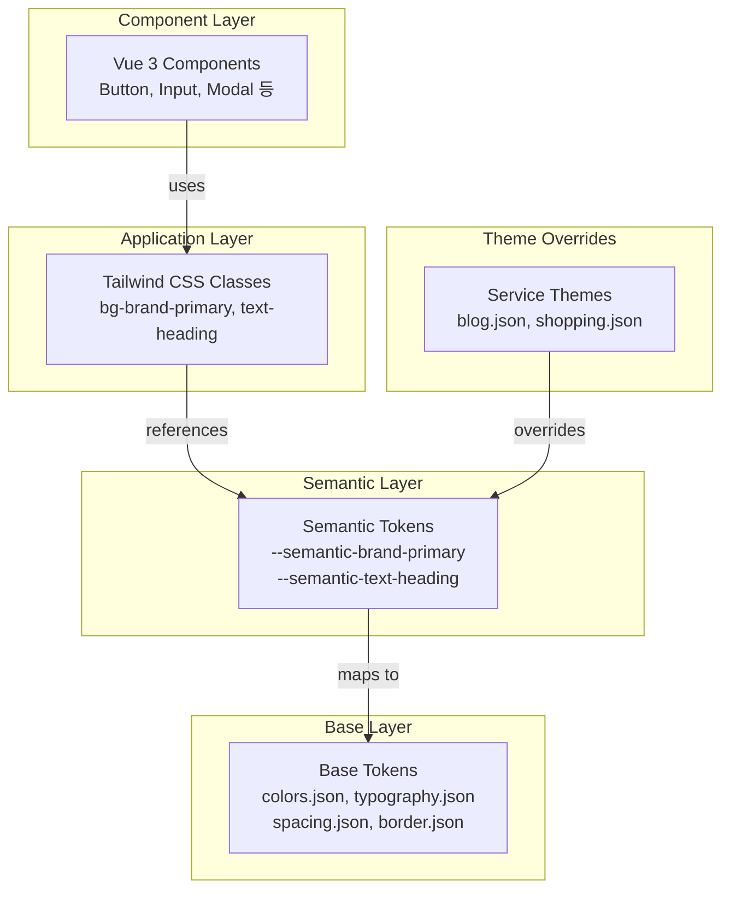

# Design System Architecture

Portal Universe Design System의 아키텍처 문서입니다. 3계층 토큰 시스템, 테마 시스템, 빌드 프로세스를 설명합니다.

---

## 📚 문서 목록

| 문서 | 설명 | 상태 |
|------|------|------|
| [System Overview](./system-overview.md) | 전체 시스템 구조 개요 | ✅ Current |
| [Token System](./token-system.md) | 3계층 토큰 시스템 상세 | ✅ Current |
| [Theming](./theming.md) | 테마 시스템 (Light/Dark, 서비스별) | ✅ Current |

---

## 🎯 핵심 개념

### 3계층 토큰 시스템

```
Base Layer (Primitive)
     ↓
Semantic Layer (Role-based)
     ↓
Component Layer (Application)
```

**설명**:
- **Base**: 원시 디자인 값 (색상 팔레트, 간격, 폰트 크기)
- **Semantic**: 의미 기반 토큰 (text-heading, bg-card, border-default)
- **Component**: 실제 컴포넌트에서 사용 (Tailwind 클래스)

### 서비스별 테마

- **Blog**: Green 톤 (#20C997)
- **Shopping**: Orange 톤 (#FF922B)
- **Portal**: 기본 테마

### 명암 모드

- **Light**: 기본 모드
- **Dark**: 다크 모드

---

## 🏗️ 아키텍처 다이어그램



---

## 📦 기술 스택

| 카테고리 | 기술 |
|---------|------|
| **프레임워크** | Vue 3 (Composition API, `<script setup>`) |
| **빌드 도구** | Vite 7.x |
| **스타일** | TailwindCSS 3.x |
| **토큰 관리** | JSON → CSS Variables |
| **타입 시스템** | TypeScript 5.9 |
| **테스팅** | Vitest, Playwright |
| **문서화** | Storybook 8.x |

---

## 📁 디렉토리 구조

```
frontend/design-system/
├── src/
│   ├── components/       # Vue 컴포넌트
│   ├── composables/      # useTheme, useToast 등
│   ├── tokens/           # Design Tokens (JSON)
│   │   ├── base/         # 원시 토큰
│   │   ├── semantic/     # 의미 기반 토큰
│   │   └── themes/       # 서비스별 테마
│   ├── styles/           # 글로벌 CSS
│   │   └── themes/       # 테마 오버라이드 CSS
│   └── types/            # TypeScript 타입
│
├── scripts/
│   └── build-tokens.js   # 토큰 빌드 스크립트
│
├── tailwind.preset.js    # Tailwind 프리셋
├── vite.config.ts        # Vite 설정
└── package.json
```

---

## 🔗 관련 문서

- [API Reference](../api/README.md) - API 문서
- [개발 가이드](../guides/README.md) - 개발 시작하기

---

**최종 업데이트**: 2026-01-18
