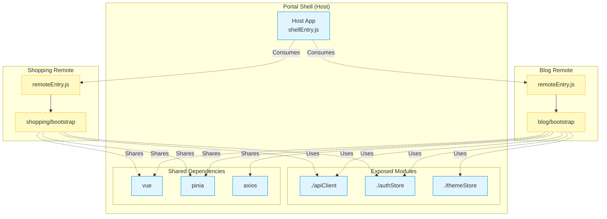

# Module Federation Architecture

## 📋 개요

Portal Shell은 Vite Plugin Federation(@originjs/vite-plugin-federation)을 사용하여 마이크로 프론트엔드 아키텍처를 구현합니다. Host 애플리케이션으로서 여러 Remote 모듈을 런타임에 동적으로 로드하고 통합합니다.

---

## 🏗️ Module Federation 구조



---

## 📄 vite.config.ts 설정

```typescript
federation({
  name: 'portal',
  filename: 'shellEntry.js',

  // Remote 모듈 소비
  remotes: {
    blog: env.VITE_BLOG_REMOTE_URL,
    shopping: env.VITE_SHOPPING_REMOTE_URL,
  },

  // 모듈 노출
  exposes: {
    './apiClient': './src/api/apiClient.ts',
    './authStore': './src/store/auth.ts',
    './themeStore': './src/store/theme.ts',
  },

  // 공유 의존성
  shared: ['vue', 'pinia', 'axios'],
})
```

---

## 🔄 Remote Registry 패턴

### 환경별 Remote URL 관리

Portal Shell은 `remoteRegistry.ts`를 통해 환경별 Remote 설정을 관리합니다.

```typescript
// src/config/remoteRegistry.ts

type RemoteConfig = {
  name: string;              // 표시 이름
  key: string;               // federation key
  url: string;               // remoteEntry.js URL
  module: string;            // 로드할 모듈 경로
  mountFn: string;           // mount 함수 이름
  basePath: string;          // 라우팅 base path
  icon?: string;             // 아이콘
  description?: string;      // 설명
};

const remoteConfigs: Record<EnvironmentMode, RemoteConfig[]> = {
  dev: [
    {
      name: 'Blog',
      key: 'blog',
      url: 'http://localhost:30001/assets/remoteEntry.js',
      module: 'blog/bootstrap',
      mountFn: 'mountBlogApp',
      basePath: '/blog',
    },
  ],
  docker: [...],
  k8s: [...],
};
```

---

## 📦 Remote 모듈 로딩 흐름

```mermaid
sequenceDiagram
    participant Router as Vue Router
    participant RW as RemoteWrapper
    participant Reg as remoteRegistry
    participant Script as <script> Tag
    participant Remote as Remote Module
    participant Container as DOM Container

    Router->>RW: /blog 라우트 매칭
    RW->>Reg: getRemoteConfig('/blog')
    Reg-->>RW: RemoteConfig 반환

    RW->>RW: mounted() 훅 실행
    RW->>RW: remoteContainer ref 생성

    RW->>Script: remoteEntry.js 동적 로드
    Note over RW,Script: new Promise((resolve) => {<br/>  const script = document.createElement('script');<br/>  script.src = config.url;<br/>  script.onload = resolve;<br/>})

    Script-->>RW: 로드 완료

    RW->>Remote: window[config.key] 접근
    Remote-->>RW: 모듈 객체 반환

    RW->>Remote: get(config.module)
    Remote-->>RW: bootstrap 함수 반환

    RW->>Container: DOM 컨테이너 전달
    RW->>Remote: bootstrap(container, shellConfig)

    Note over Remote: Vue 앱 생성 및 마운트<br/>Host의 apiClient, authStore 사용

    Remote-->>Container: 렌더링 완료
```

---

## 🎯 RemoteWrapper.vue 구현

### 역할
- Remote 모듈의 remoteEntry.js를 동적으로 로드
- bootstrap 함수 호출하여 Remote 앱 마운트
- 라우팅 경로 및 Shell Config 전달

### 핵심 코드

```vue
<template>
  <div
    ref="remoteContainer"
    :data-service="config.key"
    class="remote-app-container"
  />
</template>

<script setup lang="ts">
import { ref, onMounted, onBeforeUnmount } from 'vue';
import type { RemoteConfig } from '@/config/remoteRegistry';

const props = defineProps<{
  config: RemoteConfig;
  initialPath?: string;
}>();

const remoteContainer = ref<HTMLElement | null>(null);
let unmountFn: (() => void) | null = null;

onMounted(async () => {
  if (!remoteContainer.value) return;

  // 1. remoteEntry.js 로드
  await loadRemoteEntry(props.config.url);

  // 2. bootstrap 함수 가져오기
  const bootstrap = await getBootstrapFunction(props.config);

  // 3. Remote 앱 마운트
  unmountFn = await bootstrap(remoteContainer.value, {
    initialPath: props.initialPath,
    basePath: props.config.basePath,
  });
});

onBeforeUnmount(() => {
  // Remote 앱 언마운트
  unmountFn?.();
});
</script>
```

---

## 🌐 환경별 Remote URL

### Local Dev
```bash
VITE_BLOG_REMOTE_URL=http://localhost:30001/assets/remoteEntry.js
VITE_SHOPPING_REMOTE_URL=http://localhost:30002/assets/remoteEntry.js
```

### Docker Compose
```yaml
environment:
  VITE_BLOG_REMOTE_URL: http://blog-frontend:30001/assets/remoteEntry.js
  VITE_SHOPPING_REMOTE_URL: http://shopping-frontend:30002/assets/remoteEntry.js
```

### Kubernetes
```yaml
env:
  - name: VITE_BLOG_REMOTE_URL
    value: "http://blog-frontend-service/assets/remoteEntry.js"
  - name: VITE_SHOPPING_REMOTE_URL
    value: "http://shopping-frontend-service/assets/remoteEntry.js"
```

---

## 📤 Exposed Modules

Portal Shell이 Remote 모듈에 제공하는 모듈입니다.

### 1. apiClient

```typescript
// src/api/apiClient.ts
export const apiClient = axios.create({
  baseURL: '/api',
  timeout: 10000,
});

// Interceptor: JWT 토큰 자동 첨부
apiClient.interceptors.request.use((config) => {
  const token = getAccessToken();
  if (token) {
    config.headers.Authorization = `Bearer ${token}`;
  }
  return config;
});
```

**Remote 모듈 사용 예시:**
```typescript
import { apiClient } from 'portal/apiClient';

const response = await apiClient.get('/blog/posts');
```

### 2. authStore

```typescript
// src/store/auth.ts
export const useAuthStore = defineStore('auth', () => {
  const user = ref<PortalUser | null>(null);
  const isAuthenticated = computed(() => user.value !== null);
  const displayName = computed(() => user.value?.profile.nickname || 'Guest');

  function setUser(oidcUser: User) { /* ... */ }
  function logout() { /* ... */ }
  function hasRole(role: string): boolean { /* ... */ }

  return { user, isAuthenticated, displayName, hasRole, setUser, logout };
});
```

**Remote 모듈 사용 예시:**
```typescript
import { useAuthStore } from 'portal/authStore';

const authStore = useAuthStore();
console.log(authStore.displayName); // "사용자 닉네임"
console.log(authStore.hasRole('ROLE_ADMIN')); // true/false
```

### 3. themeStore

```typescript
// src/store/theme.ts
export const useThemeStore = defineStore('theme', {
  state: () => ({ isDark: false }),
  actions: {
    toggle() { /* ... */ },
    initialize() { /* ... */ },
  },
});
```

**Remote 모듈 사용 예시:**
```typescript
import { useThemeStore } from 'portal/themeStore';

const themeStore = useThemeStore();
themeStore.toggle(); // Light ↔ Dark 전환
```

---

## 🔁 Shared Dependencies

Host와 Remote 간 공유되는 의존성입니다. 버전 호환성이 중요합니다.

| Package | Version | 공유 여부 | 비고 |
|---------|---------|-----------|------|
| vue | 3.5.13 | ✅ 공유 | 필수 |
| pinia | 2.3.1 | ✅ 공유 | Store 상태 공유 |
| axios | 1.7.9 | ✅ 공유 | HTTP 클라이언트 |
| vue-router | 4.5.0 | ❌ 독립 | 각 앱이 별도 관리 |

---

## ⚠️ 주의사항

### 1. Remote 모듈 독립성 보장

Remote 모듈은 **standalone 모드**에서도 실행 가능해야 합니다.

```typescript
// blog-frontend/src/bootstrap.ts

export function mountBlogApp(container: HTMLElement, config?: ShellConfig) {
  const app = createApp(App);

  // Standalone 모드: 자체 Router, Store 사용
  if (!config) {
    app.use(createRouter({ ... }));
    app.use(createPinia());
  } else {
    // Integrated 모드: Shell의 리소스 사용
    const authStore = useAuthStore(); // portal/authStore
  }

  app.mount(container);
  return () => app.unmount();
}
```

### 2. 라우팅 충돌 방지

Remote 모듈은 basePath 내에서만 라우팅합니다.

- Portal Shell: `/`, `/signup`, `/callback`
- Blog Remote: `/blog/*` (내부적으로는 `/`, `/posts`, `/posts/:id`)
- Shopping Remote: `/shopping/*`

### 3. 순환 의존성 방지

Host → Remote 방향만 허용. Remote → Host 의존 금지.

```
✅ Remote가 Host의 apiClient 사용
❌ Host가 Remote의 컴포넌트 import
```

---

## 🔍 트러블슈팅

### Remote 모듈 로드 실패

**증상:** `Failed to fetch remoteEntry.js`

**해결:**
1. Remote URL 확인: `console.log(env.VITE_BLOG_REMOTE_URL)`
2. Remote 앱이 실행 중인지 확인: `curl http://localhost:30001/assets/remoteEntry.js`
3. CORS 설정 확인

### Shared Dependencies 버전 불일치

**증상:** `Uncaught TypeError: Cannot read property of undefined`

**해결:**
- `package.json`에서 vue, pinia, axios 버전 일치 확인
- `npm list vue pinia axios` 실행

### Remote 앱이 마운트되지 않음

**증상:** DOM 컨테이너가 비어 있음

**해결:**
1. `bootstrap` 함수가 정상적으로 export되는지 확인
2. `mountFn` 이름이 정확한지 확인 (remoteRegistry.ts)
3. Browser DevTools Console 확인

---

## 📊 성능 최적화

### 1. Remote 모듈 Pre-load

```typescript
// 자주 사용되는 Remote는 미리 로드
router.beforeEach(async (to) => {
  if (to.path.startsWith('/blog')) {
    await loadRemoteEntry(blogConfig.url);
  }
});
```

### 2. Shared Dependencies 최소화

```typescript
// 필요한 것만 공유
shared: ['vue', 'pinia', 'axios'] // ✅
shared: ['vue', 'pinia', 'axios', 'lodash', 'dayjs'] // ❌ (불필요)
```

### 3. Build 최적화

```typescript
build: {
  minify: false, // 디버깅 시
  target: 'esnext',
  rollupOptions: {
    output: {
      manualChunks: {
        vendor: ['vue', 'pinia', 'axios'],
      },
    },
  },
}
```

---

## 🔗 관련 문서

- [System Overview](./system-overview.md)
- [Blog Frontend Architecture](../../blog-frontend/docs/architecture/)
- [Shopping Frontend Architecture](../../shopping-frontend/docs/architecture/)
- [Module Federation 공식 문서](https://module-federation.github.io/)

---

**최종 업데이트**: 2026-01-18
