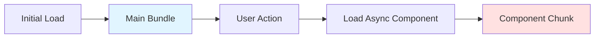

# Async Components

## 학습 목표
- Async Components와 Code Splitting 개념 이해
- Suspense API 활용법 학습
- Portal Shell의 Lazy Loading 패턴 분석

## 개념 설명

### Async Components란?
필요할 때만 로드되는 비동기 컴포넌트로, 초기 번들 사이즈를 줄이고 성능을 최적화합니다.



### Code Splitting 효과

#### Before (All in one bundle)
```
app.js (500KB)
├── Home Component
├── Dashboard Component
├── Settings Component
├── Admin Component (rarely used)
└── Report Component (rarely used)
```

#### After (Code Splitting)
```
app.js (200KB) - Initial
├── home.chunk.js (50KB) - Lazy
├── dashboard.chunk.js (80KB) - Lazy
├── settings.chunk.js (40KB) - Lazy
├── admin.chunk.js (70KB) - Lazy
└── report.chunk.js (60KB) - Lazy
```

## Portal Universe 코드 분석

### 1. Router에서 Lazy Loading

```typescript
// src/router/index.ts
const routes = [
  {
    path: '/',
    name: 'Home',
    component: HomePage,  // ✅ 즉시 로드 (중요 페이지)
    meta: { title: '홈' }
  },
  {
    path: '/dashboard',
    name: 'Dashboard',
    component: DashboardPage,  // ✅ 즉시 로드
    meta: { title: '대시보드' }
  },

  // ✅ Lazy Loading: 404 페이지는 거의 안 보임
  {
    path: '/:pathMatch(.*)*',
    name: 'NotFound',
    component: () => import('../views/NotFound.vue')  // 동적 import
  }
];
```

**핵심 포인트:**
- `import()`: 동적 import로 청크 분리
- 초기 로드 시 NotFound 컴포넌트는 다운로드 안 됨
- 404 페이지 접속 시에만 로드

### 2. App.vue - Suspense 활용

```vue
<script setup lang="ts">
// Suspense는 비동기 컴포넌트의 로딩 상태를 처리합니다
</script>

<template>
  <div class="min-h-screen bg-bg-page">
    <Sidebar />

    <div class="main-content">
      <main>
        <!-- ✅ Suspense: 비동기 컴포넌트 로딩 처리 -->
        <Suspense>
          <template #default>
            <router-view v-slot="{ Component, route }">
              <!-- ✅ KeepAlive: 로드된 컴포넌트 캐싱 -->
              <KeepAlive v-if="route.meta.keepAlive" :max="3">
                <component
                  :is="Component"
                  :key="route.meta.remoteName || route.name"
                />
              </KeepAlive>
              <component
                v-else
                :is="Component"
                :key="route.name"
              />
            </router-view>
          </template>

          <!-- ✅ Fallback: 로딩 중 표시 -->
          <template #fallback>
            <div class="flex items-center justify-center min-h-[400px]">
              <div class="text-center">
                <div class="w-10 h-10 border-2 border-brand-primary
                            border-t-transparent rounded-full animate-spin mx-auto">
                </div>
                <p class="mt-4 text-text-meta text-sm font-medium">Loading...</p>
              </div>
            </div>
          </template>
        </Suspense>
      </main>

      <footer>
        <!-- Footer content -->
      </footer>
    </div>
  </div>
</template>
```

**핵심 포인트:**
- **Suspense**: 비동기 컴포넌트 로딩 상태 관리
- **#default**: 로드 완료 후 표시할 컴포넌트
- **#fallback**: 로딩 중 표시할 UI
- **KeepAlive**: 로드된 Remote 앱 메모리에 캐싱 (최대 3개)

### 3. Module Federation - Remote 컴포넌트

```typescript
// vite.config.ts
export default defineConfig({
  plugins: [
    federation({
      name: 'portal',
      remotes: {
        blog: env.VITE_BLOG_REMOTE_URL,        // ✅ Remote 1
        shopping: env.VITE_SHOPPING_REMOTE_URL // ✅ Remote 2
      },
      // ...
    })
  ]
});
```

```vue
<!-- RemoteWrapper.vue -->
<script setup lang="ts">
import { defineAsyncComponent } from 'vue'

const props = defineProps<{
  config: RemoteConfig
}>()

// ✅ Async Component: Remote 앱 동적 로드
const RemoteApp = defineAsyncComponent(() =>
  import(/* @vite-ignore */ `${props.config.key}/bootstrap`)
)
</script>

<template>
  <Suspense>
    <template #default>
      <RemoteApp :initial-path="initialPath" />
    </template>
    <template #fallback>
      <LoadingSpinner />
    </template>
  </Suspense>
</template>
```

## defineAsyncComponent API

### 기본 사용법

```typescript
import { defineAsyncComponent } from 'vue'

// ✅ 기본 형태
const AsyncComp = defineAsyncComponent(() =>
  import('./components/MyComponent.vue')
)
```

### 고급 옵션

```typescript
const AsyncCompWithOptions = defineAsyncComponent({
  // ✅ Loader 함수
  loader: () => import('./components/Heavy.vue'),

  // ✅ 로딩 컴포넌트
  loadingComponent: LoadingSpinner,

  // ✅ 에러 컴포넌트
  errorComponent: ErrorDisplay,

  // ✅ 로딩 표시 지연 (ms)
  delay: 200,  // 200ms 후에도 로드 안 되면 loadingComponent 표시

  // ✅ 타임아웃 (ms)
  timeout: 3000,  // 3초 초과 시 errorComponent 표시

  // ✅ Suspense 사용 여부
  suspensible: true,  // Suspense와 함께 사용

  // ✅ 에러 핸들러
  onError(error, retry, fail, attempts) {
    if (attempts <= 3) {
      retry()  // 최대 3번 재시도
    } else {
      fail()
    }
  }
})
```

## 실습 예제

### 예제 1: Route Level Code Splitting

```typescript
// router/index.ts
const routes = [
  {
    path: '/',
    component: () => import('@/views/Home.vue')
  },
  {
    path: '/about',
    component: () => import('@/views/About.vue')
  },
  {
    path: '/admin',
    component: () => import('@/views/Admin.vue'),  // 관리자 페이지는 드물게 접근
    meta: { requiresAuth: true, requiresAdmin: true }
  }
]
```

### 예제 2: Component Level Lazy Loading

```vue
<script setup lang="ts">
import { defineAsyncComponent } from 'vue'

// ✅ Heavy Chart 컴포넌트는 클릭 시에만 로드
const HeavyChart = defineAsyncComponent(() =>
  import('./components/HeavyChart.vue')
)

const showChart = ref(false)
</script>

<template>
  <div>
    <button @click="showChart = true">Show Chart</button>

    <Suspense v-if="showChart">
      <template #default>
        <HeavyChart :data="chartData" />
      </template>
      <template #fallback>
        <div>Loading chart...</div>
      </template>
    </Suspense>
  </div>
</template>
```

### 예제 3: Webpack Magic Comments (Vite 지원)

```typescript
// ✅ Chunk 이름 지정
const Admin = () => import(
  /* webpackChunkName: "admin" */
  './views/Admin.vue'
)

// ✅ Prefetch (미리 로드)
const Dashboard = () => import(
  /* webpackPrefetch: true */
  './views/Dashboard.vue'
)

// ✅ Preload (병렬 로드)
const Profile = () => import(
  /* webpackPreload: true */
  './views/Profile.vue'
)
```

### 예제 4: Error Handling

```vue
<script setup lang="ts">
import { defineAsyncComponent, ref } from 'vue'
import ErrorBoundary from './ErrorBoundary.vue'
import LoadingSpinner from './LoadingSpinner.vue'

const RemoteComponent = defineAsyncComponent({
  loader: () => import('./RemoteComponent.vue'),
  loadingComponent: LoadingSpinner,
  errorComponent: ErrorBoundary,
  delay: 200,
  timeout: 5000,
  onError(error, retry, fail, attempts) {
    console.error('Failed to load component:', error)
    if (attempts <= 3) {
      console.log(`Retry attempt ${attempts}`)
      retry()
    } else {
      fail()
    }
  }
})
</script>

<template>
  <RemoteComponent />
</template>
```

### 예제 5: Setup 함수에서 async 사용

```vue
<script setup lang="ts">
// ✅ Top-level await 지원 (Suspense 필요)
const userResponse = await fetch('/api/user')
const user = await userResponse.json()

// ✅ 또는 async setup
async function fetchData() {
  const response = await fetch('/api/data')
  return response.json()
}

const data = await fetchData()
</script>

<template>
  <div>
    <h1>{{ user.name }}</h1>
    <pre>{{ data }}</pre>
  </div>
</template>
```

**부모 컴포넌트:**
```vue
<template>
  <Suspense>
    <template #default>
      <AsyncSetupComponent />
    </template>
    <template #fallback>
      <div>Loading...</div>
    </template>
  </Suspense>
</template>
```

## Suspense 고급 활용

### 1. Nested Suspense

```vue
<template>
  <Suspense>
    <template #default>
      <MainContent>
        <Suspense>
          <template #default>
            <NestedAsyncComponent />
          </template>
          <template #fallback>
            <div>Loading nested...</div>
          </template>
        </Suspense>
      </MainContent>
    </template>
    <template #fallback>
      <div>Loading main...</div>
    </template>
  </Suspense>
</template>
```

### 2. Suspense Events

```vue
<script setup lang="ts">
function onPending() {
  console.log('Suspense pending')
}

function onResolve() {
  console.log('Suspense resolved')
}

function onFallback() {
  console.log('Fallback shown')
}
</script>

<template>
  <Suspense
    @pending="onPending"
    @resolve="onResolve"
    @fallback="onFallback"
  >
    <template #default>
      <AsyncComponent />
    </template>
    <template #fallback>
      <LoadingSpinner />
    </template>
  </Suspense>
</template>
```

### 3. Timeout with Suspense

```vue
<script setup lang="ts">
const showError = ref(false)

onMounted(() => {
  setTimeout(() => {
    showError.value = true
  }, 5000)  // 5초 후 에러 표시
})
</script>

<template>
  <Suspense v-if="!showError">
    <template #default>
      <AsyncComponent />
    </template>
    <template #fallback>
      <LoadingSpinner />
    </template>
  </Suspense>
  <ErrorDisplay v-else message="Loading timeout" />
</template>
```

## 핵심 요약

### Async Components 핵심 개념
1. **Code Splitting**: 번들을 작은 청크로 분리
2. **Lazy Loading**: 필요할 때만 로드
3. **Suspense**: 로딩 상태 자동 관리
4. **KeepAlive**: 로드된 컴포넌트 캐싱

### 사용 패턴
```typescript
// ✅ 기본 Async Component
defineAsyncComponent(() => import('./Component.vue'))

// ✅ 옵션과 함께
defineAsyncComponent({
  loader: () => import('./Component.vue'),
  loadingComponent: LoadingSpinner,
  errorComponent: ErrorDisplay,
  delay: 200,
  timeout: 3000
})
```

### Suspense 패턴
```vue
<Suspense>
  <template #default>
    <AsyncComponent />
  </template>
  <template #fallback>
    <LoadingSpinner />
  </template>
</Suspense>
```

### Best Practices

#### ✅ DO
```typescript
// Route level code splitting
{
  path: '/admin',
  component: () => import('@/views/Admin.vue')
}

// Component level lazy loading
const HeavyComponent = defineAsyncComponent(() =>
  import('./HeavyComponent.vue')
)

// KeepAlive로 캐싱
<KeepAlive :max="3">
  <component :is="currentComponent" />
</KeepAlive>
```

#### ❌ DON'T
```typescript
// ❌ 모든 컴포넌트를 Lazy Loading (오버헤드)
const Button = defineAsyncComponent(() => import('./Button.vue'))

// ❌ 초기 화면에 필요한 컴포넌트 Lazy Loading
const Header = defineAsyncComponent(() => import('./Header.vue'))

// ❌ Suspense 없이 async setup 사용
<AsyncSetupComponent />  // ❌ Suspense 필요
```

### Portal Shell 패턴
- **Router Lazy Loading**: 404 페이지
- **Module Federation**: Remote 앱 (Blog, Shopping)
- **Suspense + KeepAlive**: Remote 앱 로딩 및 캐싱
- **Error Boundary**: `router.onError()` 전역 에러 처리

### 성능 최적화 체크리스트
- [ ] 초기 번들 사이즈 < 200KB
- [ ] Route별 Code Splitting 적용
- [ ] 자주 안 쓰는 컴포넌트 Lazy Loading
- [ ] Suspense로 로딩 UX 개선
- [ ] KeepAlive로 재방문 성능 향상

## 관련 문서
- [Vue Router Advanced](./vue-router-advanced.md)
- [Error Handling Vue](./error-handling-vue.md)
- [Module Federation Host](../mfe/module-federation-host.md)
