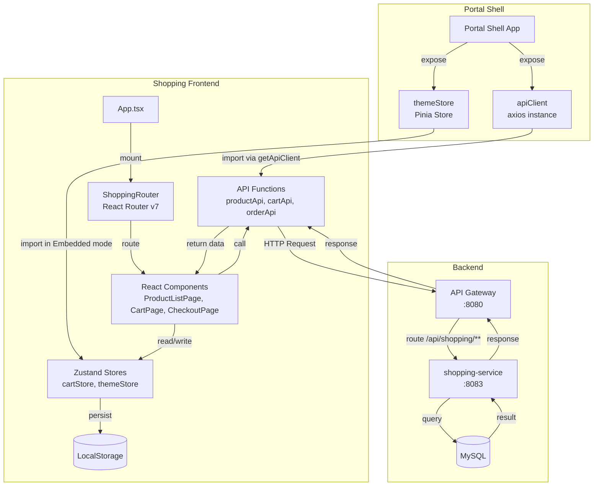
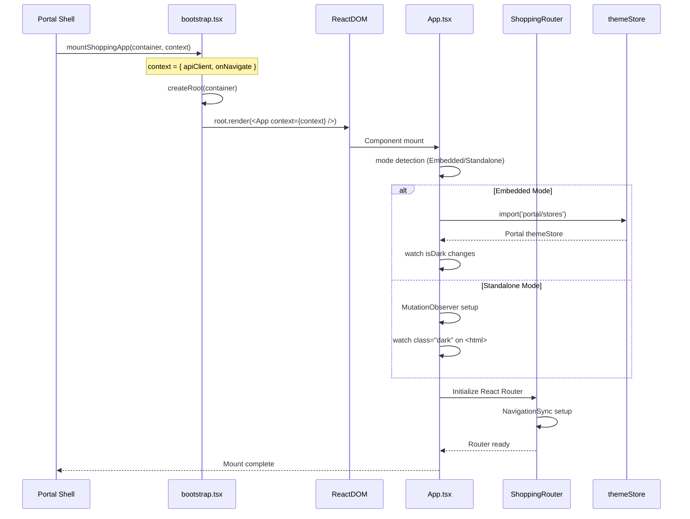
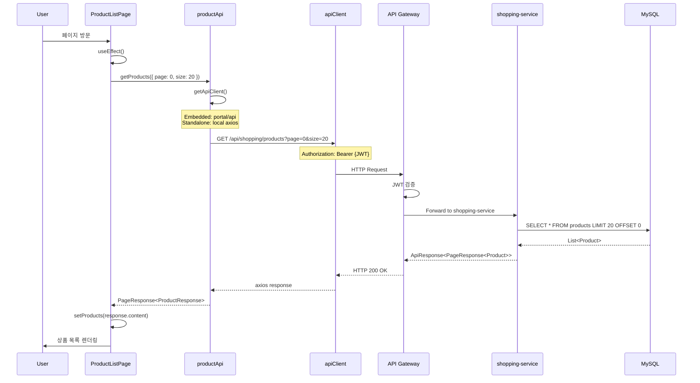
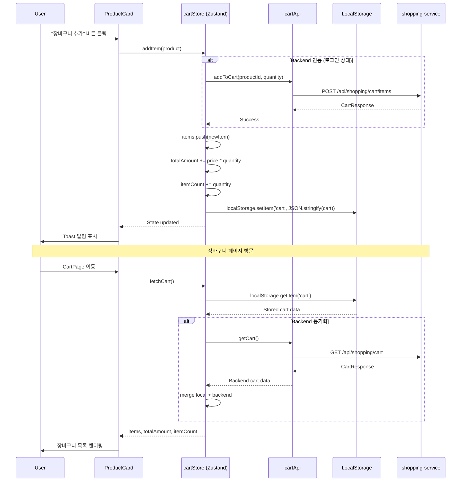
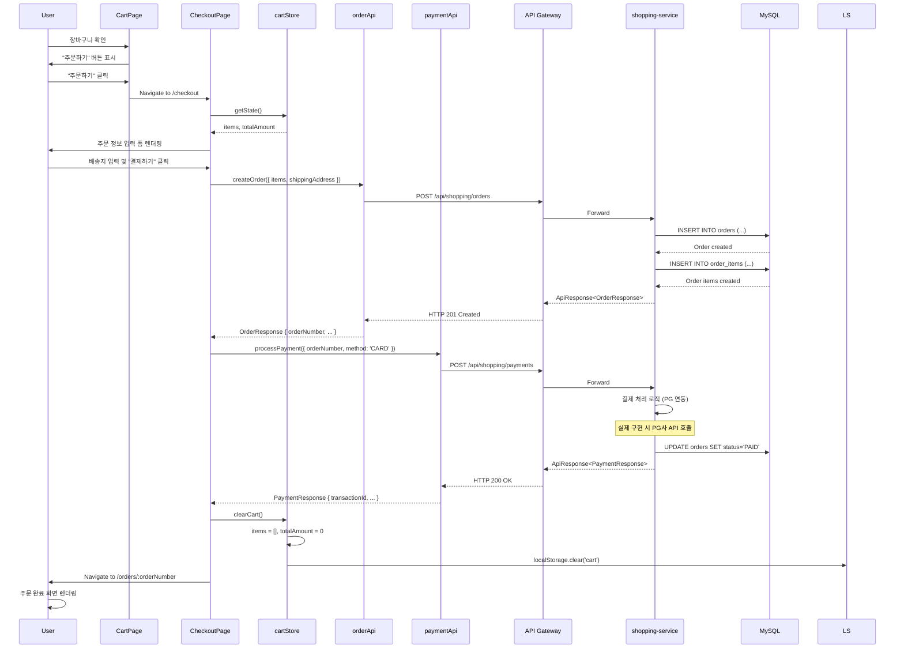
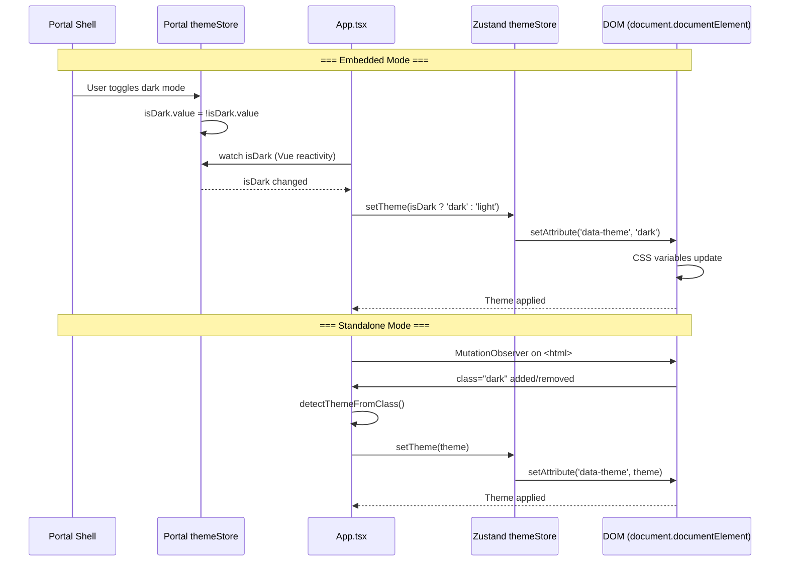
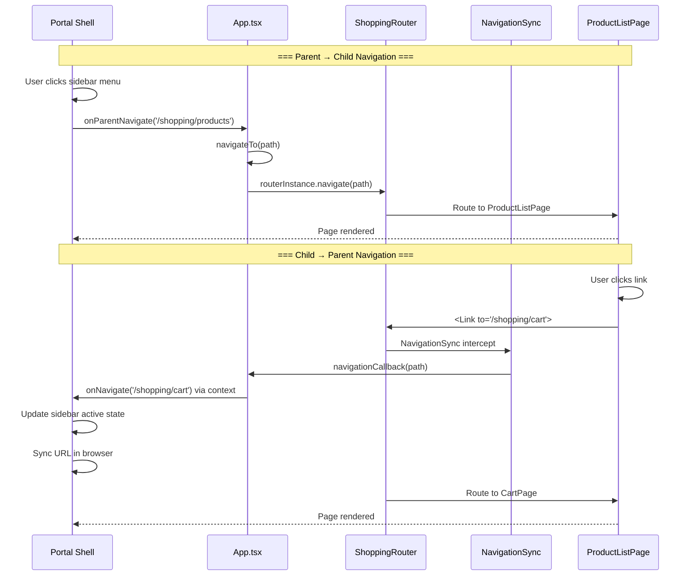

# Shopping Frontend Data Flow

## 📋 개요

Shopping Frontend는 React 18 기반의 마이크로 프론트엔드로, API Gateway를 통해 shopping-service와 통신하며, Zustand를 사용하여 클라이언트 상태를 관리합니다. Portal Shell에서 주입받은 `apiClient`를 통해 인증된 요청을 전송하고, 응답 데이터를 컴포넌트에 반영합니다.

**핵심 특징**:
- Portal Shell에서 주입된 `apiClient` (axios 인스턴스) 사용
- API Gateway를 통한 중앙집중식 라우팅 (`/api/shopping/**`)
- Zustand를 활용한 경량 상태 관리
- LocalStorage를 통한 장바구니 영속성
- Embedded/Standalone 듀얼 모드 지원
- React Router v7을 통한 SPA 라우팅

---

## 🔄 전체 데이터 흐름 아키텍처



---

## 📨 주요 데이터 흐름

### 1. 애플리케이션 마운트 흐름



**설명**:
1. Portal Shell이 `bootstrap.tsx`의 `mountShoppingApp` 함수 호출
2. React 애플리케이션을 지정된 컨테이너에 마운트
3. `App.tsx`가 Embedded/Standalone 모드 감지
4. Embedded 모드: Portal의 `themeStore`를 import하여 테마 동기화
5. Standalone 모드: `MutationObserver`로 `<html class="dark">` 감지
6. `ShoppingRouter` 초기화 및 `NavigationSync` 설정
7. 첫 화면 렌더링 완료

---

### 2. 상품 목록 조회 (Pagination)



**설명**:
1. 사용자가 `ProductListPage` 방문
2. `useEffect()` 훅에서 `productApi.getProducts()` 호출
3. `getApiClient()`가 모드에 따라 적절한 axios 인스턴스 반환
   - **Embedded**: Portal Shell에서 주입받은 `apiClient` (JWT 자동 첨부)
   - **Standalone**: 로컬 axios 인스턴스 (인증 없음)
4. API Gateway가 JWT 검증 후 shopping-service로 라우팅
5. shopping-service가 MySQL 쿼리 후 페이지네이션 응답 반환
6. `setProducts()`로 상태 업데이트
7. React의 상태 변경이 컴포넌트 리렌더링 트리거

---

### 3. 장바구니 관리 흐름 (Zustand + LocalStorage)



**설명**:

#### 3.1 장바구니 추가 (`addItem`)
1. 사용자가 상품 카드에서 "장바구니 추가" 버튼 클릭
2. `cartStore.addItem(product)` 호출
3. 로그인 상태면 `cartApi.addToCart()` 호출하여 Backend에도 저장
4. Zustand 상태 업데이트: `items`, `totalAmount`, `itemCount`
5. **LocalStorage에 영속화**: `localStorage.setItem('cart', ...)`
6. Toast 알림 표시

#### 3.2 장바구니 조회 (`fetchCart`)
1. 사용자가 `CartPage` 방문
2. `cartStore.fetchCart()` 호출
3. LocalStorage에서 기존 장바구니 데이터 로드
4. 로그인 상태면 Backend 장바구니와 병합 (merge)
5. 상태 반영 후 UI 렌더링

#### 3.3 수량 변경 (`updateItemQuantity`)
- `cartStore.updateItemQuantity(productId, newQuantity)` 호출
- Backend API 호출 (로그인 상태)
- LocalStorage 동기화

#### 3.4 상품 삭제 (`removeItem`)
- `cartStore.removeItem(productId)` 호출
- Backend API 호출 (로그인 상태)
- LocalStorage에서도 제거

#### 3.5 장바구니 비우기 (`clearCart`)
- `cartStore.clearCart()` 호출
- Backend API 호출 (로그인 상태)
- LocalStorage 초기화

---

### 4. 주문 생성 및 결제 흐름



**설명**:

#### Phase 1: 주문 생성
1. 사용자가 `CartPage`에서 "주문하기" 버튼 클릭
2. `CheckoutPage`로 이동 (`/checkout`)
3. `cartStore`에서 장바구니 정보 가져오기
4. 배송지 정보 입력 폼 렌더링
5. "결제하기" 버튼 클릭 시 `orderApi.createOrder()` 호출
6. shopping-service가 `orders` 및 `order_items` 테이블에 INSERT
7. **orderNumber** 반환

#### Phase 2: 결제 처리
1. `paymentApi.processPayment()` 호출 (orderNumber, method)
2. shopping-service가 결제 로직 실행 (실제로는 PG사 API 호출)
3. 결제 성공 시 `orders.status = 'PAID'` 업데이트
4. **transactionId** 반환

#### Phase 3: 장바구니 비우기 및 완료 화면
1. `cartStore.clearCart()` 호출
2. LocalStorage 장바구니 데이터 삭제
3. `/orders/:orderNumber` 페이지로 이동
4. `OrderDetailPage`에서 주문 상세 정보 렌더링

---

### 5. 테마 동기화 흐름 (Dark Mode)



**설명**:

#### Embedded Mode (Portal Shell 통합)
1. Portal Shell에서 사용자가 다크 모드 토글
2. Portal의 `themeStore.isDark` 값 변경 (Vue ref)
3. `App.tsx`에서 `watch(isDark, ...)` 콜백 실행
4. Zustand `themeStore.setTheme()` 호출
5. `document.documentElement.setAttribute('data-theme', 'dark')`
6. TailwindCSS가 `data-theme="dark"`에 반응하여 스타일 적용

#### Standalone Mode (독립 실행)
1. `App.tsx`의 `useEffect`에서 `MutationObserver` 설정
2. `<html class="dark">` 속성 변경 감지
3. `detectThemeFromClass()` 함수로 테마 추출
4. Zustand `themeStore.setTheme()` 호출
5. `data-theme` 속성 업데이트
6. TailwindCSS 스타일 적용

**주의사항**:
- Portal Shell은 `class="dark"`를 사용하고, Shopping Frontend는 `data-theme="dark"`를 사용합니다.
- 두 방식을 동기화하기 위해 위 로직이 필요합니다.

---

### 6. 라우팅 동기화 흐름 (Parent ↔ Child Navigation)



**설명**:

#### 6.1 Parent → Child Navigation (Portal Shell → Shopping Frontend)
1. Portal Shell의 사이드바에서 "쇼핑" 메뉴 클릭
2. Portal Shell이 `onParentNavigate('/shopping/products')` 콜백 호출
3. `App.tsx`의 `navigateTo()` 함수 실행
4. `routerInstance.navigate(path)` 호출 (React Router)
5. `ProductListPage` 렌더링

#### 6.2 Child → Parent Navigation (Shopping Frontend → Portal Shell)
1. 사용자가 Shopping Frontend 내부에서 링크 클릭 (예: "장바구니" 버튼)
2. React Router의 `<Link>` 컴포넌트가 라우팅 실행
3. `NavigationSync` 컴포넌트가 라우팅 이벤트 감지
4. `useEffect`에서 `navigationCallback(pathname)` 호출
5. `App.tsx`의 `onNavigate` prop을 통해 Portal Shell에 알림
6. Portal Shell이 사이드바 활성 상태 및 브라우저 URL 동기화
7. 동시에 Shopping Frontend의 페이지도 변경됨

**주의사항**:
- 양방향 동기화를 위해 `onParentNavigate`와 `onNavigate` 콜백이 모두 필요합니다.
- 무한 루프 방지를 위해 `navigateTo()` 함수에서 중복 네비게이션 체크를 수행합니다.

---

## 📊 API 호출 패턴

### API Client 구조

```typescript
// utils/apiClient.ts
import axios, { AxiosInstance } from 'axios';

let apiClientInstance: AxiosInstance | null = null;

export function getApiClient(): AxiosInstance {
  if (apiClientInstance) {
    return apiClientInstance;
  }

  // Standalone 모드: 로컬 axios 인스턴스 생성
  apiClientInstance = axios.create({
    baseURL: 'http://localhost:8080',
    headers: {
      'Content-Type': 'application/json',
    },
  });

  return apiClientInstance;
}

export function setApiClient(client: AxiosInstance): void {
  apiClientInstance = client;
}
```

**사용 방식**:
- **Embedded 모드**: `bootstrap.tsx`에서 Portal의 `apiClient`를 `setApiClient()`로 주입
- **Standalone 모드**: `getApiClient()`가 로컬 axios 인스턴스 반환

---

### API 함수 예시

```typescript
// api/products.ts
import { getApiClient } from '../utils/apiClient';

export async function getProducts(params: { page: number; size: number }) {
  const client = getApiClient();
  const response = await client.get('/api/shopping/products', { params });
  return response.data;
}

// api/cart.ts
export async function addToCart(productId: string, quantity: number) {
  const client = getApiClient();
  const response = await client.post('/api/shopping/cart/items', {
    productId,
    quantity,
  });
  return response.data;
}

// api/orders.ts
export async function createOrder(orderData: CreateOrderRequest) {
  const client = getApiClient();
  const response = await client.post('/api/shopping/orders', orderData);
  return response.data;
}
```

---

## 🗂️ 상태 관리 (Zustand Stores)

### cartStore

```typescript
// stores/cartStore.ts
import { create } from 'zustand';

interface CartItem {
  productId: string;
  name: string;
  price: number;
  quantity: number;
}

interface CartState {
  items: CartItem[];
  totalAmount: number;
  itemCount: number;

  addItem: (product: Product) => void;
  removeItem: (productId: string) => void;
  updateItemQuantity: (productId: string, quantity: number) => void;
  clearCart: () => void;
  fetchCart: () => Promise<void>;
}

export const useCartStore = create<CartState>((set, get) => ({
  items: [],
  totalAmount: 0,
  itemCount: 0,

  addItem: (product) => {
    // Backend API 호출 (로그인 상태)
    // cartApi.addToCart(product.id, 1);

    const { items } = get();
    const existingItem = items.find(item => item.productId === product.id);

    if (existingItem) {
      // 수량 증가
      set({
        items: items.map(item =>
          item.productId === product.id
            ? { ...item, quantity: item.quantity + 1 }
            : item
        ),
      });
    } else {
      // 새 상품 추가
      set({
        items: [...items, {
          productId: product.id,
          name: product.name,
          price: product.price,
          quantity: 1,
        }],
      });
    }

    // totalAmount, itemCount 재계산
    const newState = get();
    set({
      totalAmount: newState.items.reduce((sum, item) => sum + item.price * item.quantity, 0),
      itemCount: newState.items.reduce((sum, item) => sum + item.quantity, 0),
    });

    // LocalStorage 동기화
    localStorage.setItem('cart', JSON.stringify(get()));
  },

  removeItem: (productId) => {
    // Backend API 호출
    // cartApi.removeFromCart(productId);

    set(state => ({
      items: state.items.filter(item => item.productId !== productId),
    }));

    // 재계산 및 LocalStorage 동기화
    const newState = get();
    set({
      totalAmount: newState.items.reduce((sum, item) => sum + item.price * item.quantity, 0),
      itemCount: newState.items.reduce((sum, item) => sum + item.quantity, 0),
    });
    localStorage.setItem('cart', JSON.stringify(get()));
  },

  updateItemQuantity: (productId, quantity) => {
    // Backend API 호출
    // cartApi.updateQuantity(productId, quantity);

    if (quantity <= 0) {
      get().removeItem(productId);
      return;
    }

    set(state => ({
      items: state.items.map(item =>
        item.productId === productId
          ? { ...item, quantity }
          : item
      ),
    }));

    // 재계산 및 LocalStorage 동기화
    const newState = get();
    set({
      totalAmount: newState.items.reduce((sum, item) => sum + item.price * item.quantity, 0),
      itemCount: newState.items.reduce((sum, item) => sum + item.quantity, 0),
    });
    localStorage.setItem('cart', JSON.stringify(get()));
  },

  clearCart: () => {
    // Backend API 호출
    // cartApi.clearCart();

    set({
      items: [],
      totalAmount: 0,
      itemCount: 0,
    });
    localStorage.removeItem('cart');
  },

  fetchCart: async () => {
    // LocalStorage에서 로드
    const stored = localStorage.getItem('cart');
    if (stored) {
      const parsed = JSON.parse(stored);
      set(parsed);
    }

    // Backend와 동기화 (로그인 상태)
    // const backendCart = await cartApi.getCart();
    // merge logic...
  },
}));
```

---

### themeStore

```typescript
// stores/themeStore.ts
import { create } from 'zustand';

interface ThemeState {
  theme: 'light' | 'dark';
  setTheme: (theme: 'light' | 'dark') => void;
}

export const useThemeStore = create<ThemeState>((set) => ({
  theme: 'light',

  setTheme: (theme) => {
    set({ theme });
    document.documentElement.setAttribute('data-theme', theme);
  },
}));
```

---

## 📋 이벤트 흐름 요약

| 이벤트 | 발생 위치 | 처리 로직 | 결과 |
|--------|----------|----------|------|
| **App Mount** | `bootstrap.tsx` | ReactDOM.render() → App.tsx → Router 초기화 | 첫 화면 렌더링 |
| **Product List Load** | `ProductListPage` | useEffect → productApi.getProducts() | 상품 목록 표시 |
| **Add to Cart** | `ProductCard` | cartStore.addItem() → Backend + LocalStorage | 장바구니 추가, Toast 알림 |
| **Cart Update** | `CartPage` | cartStore.updateItemQuantity() | 수량 변경, 금액 재계산 |
| **Order Create** | `CheckoutPage` | orderApi.createOrder() → paymentApi.processPayment() | 주문 생성, 결제 처리 |
| **Theme Toggle** | Portal Shell | watch isDark → setTheme() | 다크 모드 전환 |
| **Navigation (Parent)** | Portal Shell | onParentNavigate() → router.navigate() | 라우팅 변경 |
| **Navigation (Child)** | Shopping Frontend | <Link> → NavigationSync → onNavigate() | Portal에 알림, URL 동기화 |

---

## 🔄 데이터 동기화 전략

### 1. 장바구니 동기화
- **LocalStorage**: 클라이언트 측 영속성 (새로고침 시 유지)
- **Backend API**: 로그인 사용자의 경우 서버에도 저장
- **Merge Logic**: `fetchCart()` 시 Local + Backend 데이터 병합

### 2. 테마 동기화
- **Embedded**: Portal `themeStore` (Vue) → Shopping `themeStore` (Zustand)
- **Standalone**: `MutationObserver` → `class="dark"` 감지 → `data-theme` 업데이트

### 3. 라우팅 동기화
- **Parent → Child**: `onParentNavigate` prop
- **Child → Parent**: `onNavigate` callback
- **중복 방지**: `navigateTo()` 함수에서 현재 경로 체크

---

## 🛠️ 에러 처리 패턴

### API 호출 에러

```typescript
// pages/ProductListPage.tsx
useEffect(() => {
  async function loadProducts() {
    try {
      const response = await productApi.getProducts({ page: 0, size: 20 });
      setProducts(response.content);
    } catch (error) {
      console.error('Failed to load products:', error);
      // Toast 알림 표시
      setError('상품 목록을 불러오는데 실패했습니다.');
    }
  }
  loadProducts();
}, []);
```

### Zustand 액션 에러

```typescript
addItem: async (product) => {
  try {
    // Backend API 호출
    await cartApi.addToCart(product.id, 1);

    // 상태 업데이트
    // ...
  } catch (error) {
    console.error('Failed to add to cart:', error);
    // 롤백 로직 (필요시)
  }
},
```

---

## 📝 미완성 항목 및 TODO

### 1. API 통합
- [ ] `productApi`, `cartApi`, `orderApi`, `paymentApi` 실제 구현
- [ ] Backend 응답 타입 정의 (TypeScript 인터페이스)
- [ ] 에러 핸들링 고도화 (axios interceptor)

### 2. 상태 관리
- [ ] Zustand DevTools 통합
- [ ] cartStore의 Backend 동기화 로직 완성
- [ ] optimistic update 패턴 적용

### 3. 컴포넌트
- [ ] ProductListPage, ProductDetailPage, CartPage, CheckoutPage, OrderDetailPage 구현
- [ ] 로딩 상태 UI (Skeleton, Spinner)
- [ ] 에러 바운더리 (Error Boundary)

### 4. 테스트
- [ ] 단위 테스트 (Jest + React Testing Library)
- [ ] E2E 테스트 (Playwright)

---

## 🔗 관련 문서

- [System Overview](./system-overview.md)
- [API Documentation](../api/README.md)
- [Developer Guides](../guides/README.md)
- [Portal Universe CLAUDE.md](../../../../../CLAUDE.md)

---

**최종 업데이트**: 2026-01-18
