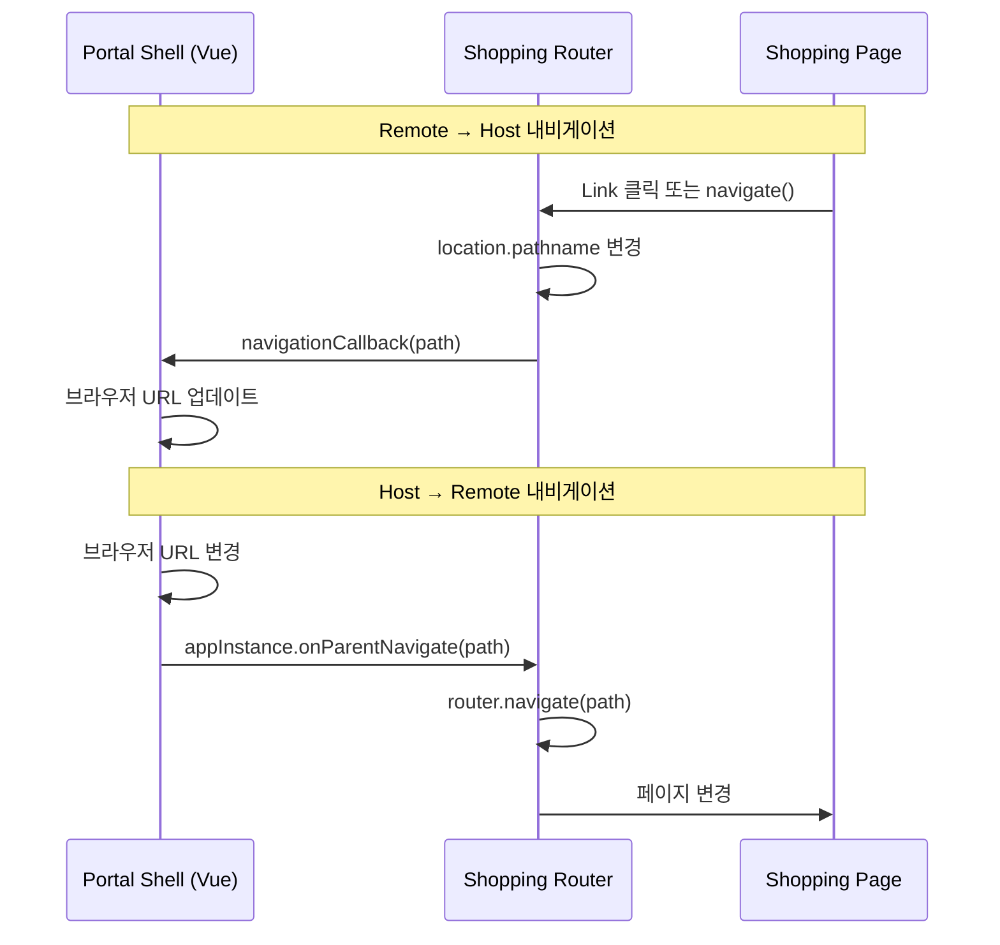

# Portal Integration

## 학습 목표
- Host (Portal Shell)와 Remote (Shopping Frontend) 통신 방식 이해
- Router 동기화, 상태 공유, 테마 동기화 구현 학습
- Module Federation을 통한 모듈 공유 패턴 분석

---

## 1. Host-Remote 통신 개요

```
┌─────────────────────────────────────────────────────────────────────────────┐
│                    HOST-REMOTE COMMUNICATION                                 │
├─────────────────────────────────────────────────────────────────────────────┤
│                                                                              │
│   Router 동기화   ─────►  양방향 경로 동기화                                 │
│   상태 공유      ─────►  authStore, themeStore 공유                          │
│   테마 동기화    ─────►  실시간 다크/라이트 모드 전환                         │
│   Keep-Alive    ─────►  활성화/비활성화 콜백                                 │
│                                                                              │
└─────────────────────────────────────────────────────────────────────────────┘
```

---

## 2. Router 동기화

### 2.1 양방향 내비게이션 플로우



### 2.2 NavigationSync 컴포넌트

**Portal Universe 코드 (router/index.tsx)**
```tsx
// Navigation listener
let navigationCallback: ((path: string) => void) | null = null
let isAppActive = true

export const setAppActive = (active: boolean) => {
  isAppActive = active
}

export const setNavigationCallback = (callback: ((path: string) => void) | null) => {
  navigationCallback = callback
}

// Navigation Sync Component
const NavigationSync: React.FC = () => {
  const location = useLocation()
  const prevPathRef = useRef(location.pathname)

  useEffect(() => {
    // Keep-Alive로 비활성화된 경우 콜백 스킵
    if (!isAppActive) {
      console.log(`⏸️ [Shopping Router] Skipping navigation sync (inactive): ${location.pathname}`)
      prevPathRef.current = location.pathname // 상태만 동기화
      return
    }

    // 경로가 변경되면 Host에게 알림
    if (prevPathRef.current !== location.pathname) {
      console.log(`📍 [Shopping Router] Path changed: ${prevPathRef.current} → ${location.pathname}`)
      prevPathRef.current = location.pathname
      navigationCallback?.(location.pathname)
    }
  }, [location.pathname])

  return null
}
```

### 2.3 프로그래매틱 내비게이션

```tsx
// router/index.tsx
let routerInstance: RouterInstance | null = null

export const navigateTo = (path: string) => {
  if (routerInstance) {
    console.log(`📥 [Shopping Router] Navigating to: ${path}`)
    routerInstance.navigate(path)
  }
}

// bootstrap.tsx에서 사용
return {
  onParentNavigate: (path: string) => {
    const instance = instanceRegistry.get(el)
    if (instance?.isActive) {
      navigateTo(path) // Router에 경로 전달
    }
  }
}
```

### 2.4 Host 측 통합 (Vue)

```vue
<!-- Portal Shell -->
<script setup lang="ts">
import { ref, watch, onMounted } from 'vue'
import { useRouter } from 'vue-router'

const router = useRouter()
const shoppingAppInstance = ref(null)

onMounted(async () => {
  const { mountShoppingApp } = await import('shopping-frontend/bootstrap')

  shoppingAppInstance.value = mountShoppingApp(
    document.getElementById('shopping-container'),
    {
      initialPath: router.currentRoute.value.path.replace('/shopping', ''),

      // Remote → Host 내비게이션
      onNavigate: (path) => {
        const fullPath = `/shopping${path}`
        if (router.currentRoute.value.path !== fullPath) {
          router.push(fullPath)
        }
      },

      theme: isDark.value ? 'dark' : 'light'
    }
  )
})

// Host → Remote 내비게이션
watch(() => router.currentRoute.value.path, (newPath) => {
  if (newPath.startsWith('/shopping')) {
    const remotePath = newPath.replace('/shopping', '') || '/'
    shoppingAppInstance.value?.onParentNavigate(remotePath)
  }
})
</script>
```

---

## 3. 상태 공유

### 3.1 authStore 공유

**Portal Universe 코드 (stores/authStore.ts)**
```tsx
import { create } from 'zustand'

interface AuthState {
  user: User | null
  isAuthenticated: boolean
  syncFromPortal: () => Promise<void>
}

export const useAuthStore = create<AuthState>((set) => ({
  user: null,
  isAuthenticated: false,

  // Portal Shell의 authStore와 동기화
  syncFromPortal: async () => {
    try {
      // Module Federation으로 Portal의 authStore import
      const { useAuthStore: usePortalAuthStore } = await import('portal/authStore')
      const portalAuth = usePortalAuthStore.getState()

      set({
        user: portalAuth.user,
        isAuthenticated: portalAuth.isAuthenticated
      })

      console.log('[Shopping] Synced with Portal authStore:', portalAuth.user)
    } catch (error) {
      console.warn('[Shopping] Failed to sync Portal authStore:', error)
    }
  }
}))
```

**App.tsx에서 동기화**
```tsx
// App.tsx
function App(props: AppProps) {
  const isEmbedded = window.__POWERED_BY_PORTAL_SHELL__ === true

  useEffect(() => {
    if (isEmbedded) {
      // Embedded 모드: Portal Shell의 authStore 동기화
      const authStore = useAuthStore.getState()
      authStore.syncFromPortal().then(() => {
        console.log('[Shopping] Portal Shell authStore synced')
      }).catch((err) => {
        console.warn('[Shopping] Failed to sync authStore:', err)
      })
    }
  }, [isEmbedded])

  return <div>...</div>
}
```

### 3.2 Zustand subscribe 패턴

```tsx
// 실시간 구독 (Portal authStore 변경 감지)
useEffect(() => {
  if (!isEmbedded) return

  let unsubscribe: (() => void) | undefined

  import('portal/authStore')
    .then((module) => {
      // Portal authStore 구독
      unsubscribe = module.useAuthStore.subscribe((portalState) => {
        useAuthStore.setState({
          user: portalState.user,
          isAuthenticated: portalState.isAuthenticated
        })
        console.log('[Shopping] Portal authStore changed:', portalState.user)
      })
    })
    .catch((error) => {
      console.warn('[Shopping] Failed to subscribe Portal authStore:', error)
    })

  return () => unsubscribe?.()
}, [isEmbedded])
```

---

## 4. 테마 동기화

### 4.1 usePortalTheme Hook

**Portal Universe 코드 (hooks/usePortalStore.ts)**
```tsx
import { useState, useEffect } from 'react'

interface PortalTheme {
  isDark: boolean
  isConnected: boolean
}

export function usePortalTheme(): PortalTheme {
  const [theme, setTheme] = useState<PortalTheme>({
    isDark: false,
    isConnected: false
  })

  useEffect(() => {
    const isEmbedded = (window as any).__POWERED_BY_PORTAL_SHELL__ === true

    if (!isEmbedded) {
      return // Standalone 모드
    }

    try {
      // Module Federation으로 Portal Shell의 themeStore import
      import('portal/themeStore').then((module) => {
        const themeStore = module.useThemeStore.getState()

        // 초기 테마 설정
        setTheme({
          isDark: themeStore.isDark,
          isConnected: true
        })

        // 테마 변경 구독
        const unsubscribe = module.useThemeStore.subscribe((state) => {
          setTheme({
            isDark: state.isDark,
            isConnected: true
          })
          console.log(`[Shopping] Portal theme changed: ${state.isDark ? 'dark' : 'light'}`)
        })

        return () => unsubscribe()
      })
    } catch (error) {
      console.warn('[Shopping] Failed to connect Portal themeStore:', error)
    }
  }, [])

  return theme
}
```

### 4.2 App.tsx에서 테마 적용

```tsx
// App.tsx
function App({ theme = 'light' }: AppProps) {
  const isEmbedded = window.__POWERED_BY_PORTAL_SHELL__ === true
  const portalTheme = usePortalTheme()

  // 현재 적용할 테마 결정
  const isDark = isEmbedded && portalTheme.isConnected
    ? portalTheme.isDark
    : theme === 'dark'

  // 테마 적용
  useEffect(() => {
    if (isDark) {
      document.documentElement.classList.add('dark')
    } else {
      document.documentElement.classList.remove('dark')
    }

    // data-theme 속성 동기화
    document.documentElement.setAttribute(
      'data-theme',
      isDark ? 'dark' : 'light'
    )

    console.log(`[Shopping] Theme applied: ${isDark ? 'dark' : 'light'} (source: ${
      isEmbedded && portalTheme.isConnected ? 'Portal adapter' : 'props'
    })`)
  }, [isDark, isEmbedded, portalTheme.isConnected])

  return <div>...</div>
}
```

---

## 5. Keep-Alive 통합

### 5.1 활성화/비활성화 콜백

**Host (Portal Shell - Vue)**
```vue
<template>
  <keep-alive>
    <component
      :is="currentRemoteApp"
      @activated="handleActivated"
      @deactivated="handleDeactivated"
    />
  </keep-alive>
</template>

<script setup lang="ts">
function handleActivated() {
  console.log('[Portal] Shopping app activated')
  shoppingAppInstance.value?.onActivated?.()
}

function handleDeactivated() {
  console.log('[Portal] Shopping app deactivated')
  shoppingAppInstance.value?.onDeactivated?.()
}
</script>
```

**Remote (Shopping - React)**
```tsx
// bootstrap.tsx
return {
  onActivated: () => {
    console.log('🔄 [Shopping] App activated')
    const instance = instanceRegistry.get(el)
    if (instance) {
      instance.isActive = true
      document.documentElement.setAttribute('data-service', 'shopping')
      setAppActive(true) // Router 동기화 재활성화
    }
  },

  onDeactivated: () => {
    console.log('⏸️ [Shopping] App deactivated')
    const instance = instanceRegistry.get(el)
    if (instance) {
      instance.isActive = false
      setAppActive(false) // Router 동기화 비활성화
    }
  }
}
```

---

## 6. Module Federation 설정

### 6.1 Host (Portal Shell) - vite.config.ts

```ts
// portal-shell/vite.config.ts
import { defineConfig } from 'vite'
import vue from '@vitejs/plugin-vue'
import federation from '@originjs/vite-plugin-federation'

export default defineConfig({
  plugins: [
    vue(),
    federation({
      name: 'portal',
      filename: 'remoteEntry.js',

      // 노출할 모듈 (Remote에서 import 가능)
      exposes: {
        './authStore': './src/stores/authStore.ts',
        './themeStore': './src/stores/themeStore.ts',
        './apiClient': './src/api/client.ts'
      },

      // Remote 앱 참조
      remotes: {
        'shopping-frontend': 'http://localhost:30002/assets/remoteEntry.js'
      },

      shared: ['vue', 'vue-router', 'pinia']
    })
  ]
})
```

### 6.2 Remote (Shopping Frontend) - vite.config.ts

```ts
// shopping-frontend/vite.config.ts
import { defineConfig, loadEnv } from 'vite'
import react from '@vitejs/plugin-react'
import federation from '@originjs/vite-plugin-federation'

export default defineConfig(({ mode }) => {
  const env = loadEnv(mode, process.cwd(), '')

  return {
    base: env.VITE_BASE_URL,

    plugins: [
      react(),
      federation({
        name: 'shopping-frontend',
        filename: 'remoteEntry.js',

        // 노출할 모듈
        exposes: {
          './bootstrap': './src/bootstrap.tsx'
        },

        // Portal Shell 모듈 참조
        remotes: {
          portal: env.VITE_PORTAL_SHELL_REMOTE_URL
        },

        shared: ['react', 'react-dom']
      })
    ]
  }
})
```

---

## 7. API 클라이언트 공유

### 7.1 Portal의 apiClient 사용

```tsx
// Shopping Frontend에서 Portal의 apiClient 사용
import { useState, useEffect } from 'react'

function usePortalApiClient() {
  const [apiClient, setApiClient] = useState(null)

  useEffect(() => {
    const isEmbedded = window.__POWERED_BY_PORTAL_SHELL__

    if (isEmbedded) {
      import('portal/apiClient')
        .then((module) => {
          setApiClient(module.default)
          console.log('[Shopping] Using Portal apiClient')
        })
        .catch(() => {
          console.log('[Shopping] Using local apiClient')
        })
    }
  }, [])

  return apiClient
}
```

---

## 8. 에러 처리

### 8.1 Module Federation 로드 실패

```tsx
// App.tsx
useEffect(() => {
  if (!isEmbedded) return

  const syncStores = async () => {
    try {
      const { useAuthStore: usePortalAuthStore } = await import('portal/authStore')
      // ...
    } catch (error) {
      console.warn('[Shopping] Portal modules not available:', error)
      // Fallback: 독립 모드로 동작
    }
  }

  syncStores()
}, [isEmbedded])
```

### 8.2 Network Error 처리

```tsx
// Host에서 Remote 로드 실패 시
try {
  const { mountShoppingApp } = await import('shopping-frontend/bootstrap')
  // ...
} catch (error) {
  console.error('Failed to load Shopping Frontend:', error)
  // Fallback UI 표시
  showErrorMessage('쇼핑 서비스를 불러오는데 실패했습니다.')
}
```

---

## 9. 핵심 정리

| 통신 방식 | Host → Remote | Remote → Host |
|----------|---------------|---------------|
| **Router** | `onParentNavigate(path)` | `navigationCallback(path)` |
| **State** | Module Federation import | subscribe 패턴 |
| **Theme** | `onThemeChange(theme)` | Module Federation import |
| **Keep-Alive** | `onActivated/onDeactivated` | `setAppActive(boolean)` |

---

## 10. 디버깅 팁

```tsx
// 1. Module Federation 연결 확인
console.log('Portal modules:', {
  authStore: await import('portal/authStore'),
  themeStore: await import('portal/themeStore')
})

// 2. Router 동기화 로그
console.log('[Shopping Router]', {
  currentPath: location.pathname,
  isActive: isAppActive,
  callbackSet: !!navigationCallback
})

// 3. 테마 동기화 로그
console.log('[Shopping Theme]', {
  isDark,
  isEmbedded,
  portalConnected: portalTheme.isConnected
})
```

---

## 다음 학습

- [Bootstrap Pattern](./bootstrap-pattern.md)
- [Standalone Mode](./standalone-mode.md)
- [Module Federation Remote](./module-federation-remote.md)
