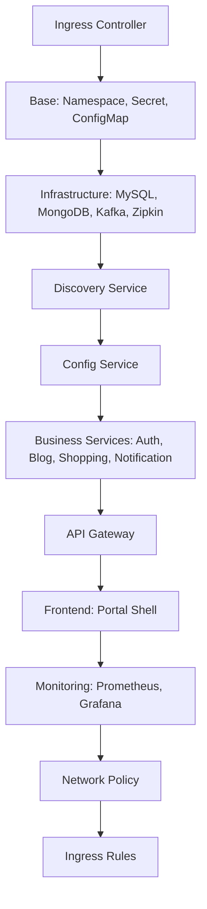

# Kubernetes Deployment Guide

Portal Universe 애플리케이션을 Kubernetes 환경에 배포하는 방법을 안내합니다.

## 목차

1. [Health Check 설정](#1-health-check-설정)
2. [Resource 설정](#2-resource-설정)
3. [환경 변수 및 ConfigMap 연동](#3-환경-변수-및-configmap-연동)
4. [Init Container 패턴](#4-init-container-패턴)
5. [Build & Deploy 스크립트](#5-build--deploy-스크립트)
6. [배포 순서](#6-배포-순서)
7. [접속 정보](#7-접속-정보)

---

## 1. Health Check 설정

Kubernetes는 세 가지 유형의 Health Probe를 통해 Pod의 상태를 관리합니다.

### 1.1 Startup Probe

**역할**: 애플리케이션이 최초로 시작될 때, 완전히 구동될 때까지 대기합니다.

- Spring Boot 애플리케이션은 초기 구동 시간이 걸리므로 충분한 시간을 확보해야 합니다.
- Startup Probe가 성공할 때까지 Liveness/Readiness Probe는 실행되지 않습니다.

```yaml
startupProbe:
  httpGet:
    path: /actuator/health/readiness
    port: 8081
  initialDelaySeconds: 30     # 첫 검사까지 30초 대기
  periodSeconds: 10           # 10초마다 재검사
  failureThreshold: 18        # 최대 18회 실패 허용 (30초 + 10초 × 18 = 최대 3분 30초)
```

### 1.2 Liveness Probe

**역할**: Pod가 정상 동작 중인지 확인합니다. 실패 시 Pod를 재시작합니다.

- 애플리케이션이 데드락 상태에 빠지거나 응답 불가 상태일 때 Pod를 자동으로 재시작합니다.

```yaml
livenessProbe:
  httpGet:
    path: /actuator/health/liveness
    port: 8081
  initialDelaySeconds: 10     # Startup Probe 성공 후 10초 대기
  periodSeconds: 10           # 10초마다 검사
  failureThreshold: 3         # 3회 연속 실패 시 재시작
```

### 1.3 Readiness Probe

**역할**: Pod가 트래픽을 받을 준비가 되었는지 확인합니다. 실패 시 Service에서 제외됩니다.

- 애플리케이션이 아직 준비되지 않았거나 과부하 상태일 때 트래픽을 받지 않도록 합니다.
- Pod는 재시작되지 않고, 준비 상태가 복구되면 다시 트래픽을 받습니다.

```yaml
readinessProbe:
  httpGet:
    path: /actuator/health/readiness
    port: 8081
  initialDelaySeconds: 5      # Startup Probe 성공 후 5초 대기
  periodSeconds: 5            # 5초마다 검사
  failureThreshold: 3         # 3회 연속 실패 시 Service에서 제외
```

### 1.4 Spring Boot Actuator 설정

Health Check를 위해서는 Spring Boot Actuator 엔드포인트가 활성화되어 있어야 합니다.

**application.yaml 설정 예시**:
```yaml
management:
  endpoints:
    web:
      exposure:
        include: health,info,prometheus,metrics
  endpoint:
    health:
      probes:
        enabled: true
      show-details: always
```

---

## 2. Resource 설정

각 Pod의 CPU와 메모리 사용량을 제어하여 클러스터 리소스를 효율적으로 관리합니다.

### 2.1 Requests vs Limits

| 설정 | 의미 | 용도 |
|------|------|------|
| **requests** | 최소 보장 리소스 | Kubernetes Scheduler가 Pod를 배치할 노드를 결정할 때 사용 |
| **limits** | 최대 사용 가능 리소스 | 이 값을 초과하면 CPU는 throttling, 메모리는 OOMKilled 발생 |

### 2.2 권장 설정

```yaml
resources:
  requests:
    cpu: "100m"          # 0.1 core 보장
    memory: "256Mi"      # 256 MiB 보장
  limits:
    cpu: "500m"          # 최대 0.5 core 사용 가능
    memory: "512Mi"      # 최대 512 MiB 사용 가능
```

### 2.3 서비스별 권장값

| 서비스 | CPU Requests | Memory Requests | CPU Limits | Memory Limits |
|--------|--------------|-----------------|------------|---------------|
| **discovery-service** | 100m | 256Mi | 500m | 512Mi |
| **config-service** | 100m | 256Mi | 500m | 512Mi |
| **api-gateway** | 200m | 512Mi | 1000m | 1Gi |
| **auth-service** | 100m | 256Mi | 500m | 512Mi |
| **blog-service** | 100m | 256Mi | 500m | 512Mi |
| **shopping-service** | 100m | 256Mi | 500m | 512Mi |
| **notification-service** | 100m | 256Mi | 500m | 512Mi |
| **portal-shell** | 50m | 128Mi | 200m | 256Mi |

### 2.4 조정 가이드

- **CPU가 지속적으로 throttling되는 경우**: `limits.cpu` 증가
- **메모리 OOMKilled 발생 시**: `limits.memory` 증가
- **Pod가 스케줄링되지 않는 경우**: `requests` 값을 줄이거나 노드 추가

---

## 3. 환경 변수 및 ConfigMap 연동

환경 변수는 ConfigMap과 Secret을 통해 중앙에서 관리합니다.

### 3.1 ConfigMap (공통 환경변수)

**파일 위치**: `k8s/infrastructure/configmap.yaml`

모든 서비스가 공통으로 사용하는 환경 변수를 정의합니다.

```yaml
apiVersion: v1
kind: ConfigMap
metadata:
  name: portal-universe-config
  namespace: portal-universe
data:
  SPRING_PROFILES_ACTIVE: "kubernetes"
  CONFIG_SERVER_URL: "http://config-service:8888"
  EUREKA_CLIENT_SERVICEURL_DEFAULTZONE: "http://discovery-service:8761/eureka/"
  KAFKA_BOOTSTRAP_SERVERS: "kafka:29092"
  MYSQL_HOST: "mysql-db"
  MONGODB_HOST: "mongodb"
  MANAGEMENT_ZIPKIN_TRACING_ENDPOINT: "http://zipkin:9411/api/v2/spans"
  TZ: "Asia/Seoul"
```

### 3.2 Secret (민감 정보)

**파일 위치**: `k8s/base/secret.yaml`

비밀번호, API 키 등 민감한 정보를 정의합니다.

```yaml
apiVersion: v1
kind: Secret
metadata:
  name: portal-universe-secret
  namespace: portal-universe
type: Opaque
data:
  MYSQL_ROOT_PASSWORD: <base64-encoded>
  MYSQL_PASSWORD: <base64-encoded>
  MONGO_INITDB_ROOT_PASSWORD: <base64-encoded>
```

### 3.3 Deployment에서 사용하기

#### 3.3.1 ConfigMap 전체 로드

```yaml
spec:
  containers:
    - name: auth-service
      image: portal-universe-auth-service:latest
      envFrom:
        - configMapRef:
            name: portal-universe-config
```

#### 3.3.2 개별 환경변수 추가

```yaml
env:
  - name: SPRING_PROFILES_ACTIVE
    value: "kubernetes"
  - name: DB_PASSWORD
    valueFrom:
      secretKeyRef:
        name: portal-universe-secret
        key: MYSQL_PASSWORD
```

#### 3.3.3 특정 설정 오버라이드

ConfigMap으로 로드한 후, 특정 서비스에서만 다른 값을 사용하고 싶을 때:

```yaml
env:
  # ConfigMap에서 SPRING_PROFILES_ACTIVE="kubernetes"를 로드했지만
  # 이 서비스에서만 "kubernetes,debug"로 오버라이드
  - name: SPRING_PROFILES_ACTIVE
    value: "kubernetes,debug"
```

---

## 4. Init Container 패턴

### 4.1 역할

Init Container는 메인 컨테이너가 시작되기 전에 실행되어 선행 조건을 만족시킵니다.

Portal Universe에서는 **Config Service가 준비될 때까지 대기**하는 패턴을 사용합니다.

### 4.2 구현 예시

```yaml
spec:
  initContainers:
    - name: wait-for-config
      image: busybox:1.36
      command:
        - sh
        - -c
        - |
          until nc -z config-service 8888; do
            echo "Waiting for config-service..."
            sleep 2
          done
          echo "Config service is ready!"
```

### 4.3 동작 방식

1. Init Container가 먼저 실행됩니다.
2. `nc -z config-service 8888` 명령으로 Config Service의 8888 포트가 열려있는지 확인합니다.
3. 포트가 열려있지 않으면 2초 대기 후 재시도합니다.
4. Config Service가 준비되면 Init Container가 종료됩니다.
5. 메인 컨테이너(auth-service 등)가 시작됩니다.

### 4.4 적용 대상

다음 서비스들은 Config Service에 의존하므로 Init Container를 사용합니다:

- `auth-service`
- `blog-service`
- `shopping-service`
- `notification-service`
- `api-gateway`

---

## 5. Build & Deploy 스크립트

### 5.1 build-and-load.sh

**역할**: 모든 서비스를 빌드하고 Docker 이미지를 생성한 후, Kind 클러스터에 로드합니다.

**위치**: `k8s/scripts/build-and-load.sh`

#### 실행 순서

```bash
./k8s/scripts/build-and-load.sh
```

1. **Gradle 빌드 (백엔드)**
   - `discovery-service`, `config-service`, `api-gateway`, `auth-service`, `blog-service`, `shopping-service`, `notification-service`
   - 각 서비스의 JAR 파일 생성

2. **npm 빌드 (프론트엔드)**
   - `design-system` 먼저 빌드 (다른 프론트엔드 서비스의 의존성)
   - `portal-shell` 빌드

3. **Docker 이미지 빌드**
   - 백엔드: `portal-universe-{service}:latest`
   - 프론트엔드: `portal-universe-portal-shell:latest`

4. **Kind 클러스터에 이미지 로드**
   - `kind load docker-image` 명령으로 로컬 이미지를 Kind 클러스터로 전송

#### 출력 예시

```
🚀 Portal Universe - Build & Load to Kind

📦 Step 1: Gradle Build (Backend Services)
Building discovery-service...
✅ discovery-service built

📦 Step 2: npm Build (Frontend Services)
Building design-system...
✅ design-system built

🐳 Step 3: Docker Build (Backend Services)
Building Docker image: discovery-service...
✅ discovery-service image built

📥 Step 5: Load Images to Kind Cluster
Loading discovery-service to Kind...
✅ discovery-service loaded to Kind

════════════════════════════════════════
🎉 All services built and loaded!
════════════════════════════════════════
```

### 5.2 deploy-all.sh

**역할**: 의존성 순서에 따라 모든 Kubernetes 리소스를 배포합니다.

**위치**: `k8s/scripts/deploy-all.sh`

#### 실행 순서

```bash
./k8s/scripts/deploy-all.sh
```

#### 배포 단계

| 단계 | 내용 | 설명 |
|------|------|------|
| **Step 0** | Ingress Controller 설치 | NGINX Ingress Controller 설치 및 준비 대기 |
| **Step 1** | Base Configuration | Namespace, Secret, ConfigMap 생성 |
| **Step 2** | Infrastructure | MySQL, MongoDB, Kafka, Zipkin 배포 |
| **Step 2.5** | Infrastructure Ready 대기 | 인프라 서비스가 모두 Ready 상태가 될 때까지 대기 |
| **Step 3** | Core Services | Discovery Service, Config Service 순차 배포 |
| **Step 4** | Business Services | Auth, Blog, Shopping, Notification Service 배포 |
| **Step 5** | API Gateway | Gateway 배포 및 Ready 대기 |
| **Step 6** | Frontend | Portal Shell 배포 및 Ready 대기 |
| **Step 7** | Monitoring | Prometheus, Grafana 배포 |
| **Step 8** | Network Policy | 네트워크 격리 정책 적용 |
| **Step 9** | Ingress | 외부 접근을 위한 Ingress 규칙 배포 |
| **Step 10** | Verify | 배포 결과 확인 (Pod 상태 출력) |

#### 출력 예시

```
🚀 Portal Universe - Deploy to Kubernetes

🌐 Step 0: Install Ingress Controller
✅ Ingress Controller already installed

📦 Step 1: Apply Base Configuration
✅ Base configuration applied

🗄️  Step 2: Deploy Infrastructure
Deploying mysql-db...
✅ mysql-db deployed

⏳ Step 2.5: Wait for Infrastructure to be Ready
Waiting for MySQL...
Waiting for MongoDB...
✅ All infrastructure services are ready

⚙️  Step 3: Deploy Core Services
Deploying discovery-service...
deployment "discovery-service" successfully rolled out

💼 Step 4: Deploy Business Services
Deploying auth-service...
✅ auth-service deployed

🌐 Step 5: Deploy API Gateway
deployment "api-gateway" successfully rolled out

🎨 Step 6: Deploy Frontend
deployment "portal-shell" successfully rolled out

📈 Step 7: Deploy Monitoring Services
✅ Prometheus deployed
✅ Grafana deployed

🔒 Step 8: Deploy Network Policy
✅ Network Policy deployed

🚪 Step 9: Deploy Ingress
✅ Ingress deployed

════════════════════════════════════════
🎉 Deployment completed!
════════════════════════════════════════
```

---

## 6. 배포 순서

의존성이 있는 서비스는 반드시 순서를 지켜 배포해야 합니다.



### 6.1 순차 배포가 필요한 이유

1. **Discovery Service**
   - 모든 서비스가 자신을 등록하고 다른 서비스를 찾기 위해 필요
   - 가장 먼저 실행되어야 함

2. **Config Service**
   - 모든 비즈니스 서비스가 설정을 가져오기 위해 필요
   - Discovery Service 다음으로 실행

3. **Business Services**
   - Init Container로 Config Service 준비 대기
   - Config Service가 준비된 후 병렬 배포 가능

4. **API Gateway**
   - 비즈니스 서비스들을 라우팅하므로 후순위 배포

5. **Frontend**
   - API Gateway를 통해 백엔드 서비스에 접근하므로 마지막 배포

---

## 7. 접속 정보

배포 완료 후, 다음 URL로 애플리케이션에 접근할 수 있습니다.

**전제조건**: `/etc/hosts` 파일에 다음 항목 추가
```
127.0.0.1 portal-universe
```

### 7.1 서비스 URL

| 서비스 | URL | 설명 |
|--------|-----|------|
| **메인 애플리케이션** | http://portal-universe:8080 | Portal Shell (메인 화면) |
| **Eureka Dashboard** | http://portal-universe:8080/eureka | 서비스 디스커버리 대시보드 |
| **Grafana** | http://portal-universe:8080/grafana | 메트릭 시각화 (ID: admin, PW: admin) |
| **Prometheus** | http://portal-universe:8080/prometheus | 메트릭 수집기 |
| **Zipkin** | http://portal-universe:8080/zipkin | 분산 추적 (Distributed Tracing) |

### 7.2 Port Forwarding

`deploy-all.sh` 스크립트는 자동으로 Ingress Controller에 Port Forwarding을 설정합니다:

```bash
kubectl port-forward -n ingress-nginx svc/ingress-nginx-controller 8080:80
```

수동으로 Port Forwarding을 중지하려면:
```bash
pkill -f "port-forward.*ingress-nginx"
```

---

## 8. Troubleshooting

### 8.1 Pod가 CrashLoopBackOff 상태인 경우

**원인**: 애플리케이션 시작 실패 또는 Health Check 실패

**확인 방법**:
```bash
# Pod 로그 확인
kubectl logs -n portal-universe <pod-name>

# Pod 상세 정보 확인
kubectl describe pod -n portal-universe <pod-name>
```

**해결 방법**:
- Startup Probe의 `failureThreshold`를 늘려 초기 시작 시간 확보
- Resource Limits를 늘려 메모리/CPU 부족 해결

### 8.2 Init Container가 무한 대기 상태인 경우

**원인**: Config Service가 준비되지 않음

**확인 방법**:
```bash
# Config Service 상태 확인
kubectl get pods -n portal-universe -l app=config-service
kubectl logs -n portal-universe <config-service-pod-name>
```

**해결 방법**:
- Config Service가 정상 실행 중인지 확인
- Config Service의 Health Check 엔드포인트 확인

### 8.3 Service에 트래픽이 전달되지 않는 경우

**원인**: Readiness Probe 실패로 Pod가 Service Endpoint에서 제외됨

**확인 방법**:
```bash
# Service Endpoint 확인
kubectl get endpoints -n portal-universe <service-name>
```

**해결 방법**:
- Pod의 Readiness Probe 설정 확인
- `/actuator/health/readiness` 엔드포인트가 200 OK를 반환하는지 확인

---

## 9. 참고 자료

- [Kubernetes Health Checks](https://kubernetes.io/docs/tasks/configure-pod-container/configure-liveness-readiness-startup-probes/)
- [Kubernetes Resource Management](https://kubernetes.io/docs/concepts/configuration/manage-resources-containers/)
- [ConfigMap and Secret](https://kubernetes.io/docs/concepts/configuration/configmap/)
- [Init Containers](https://kubernetes.io/docs/concepts/workloads/pods/init-containers/)
