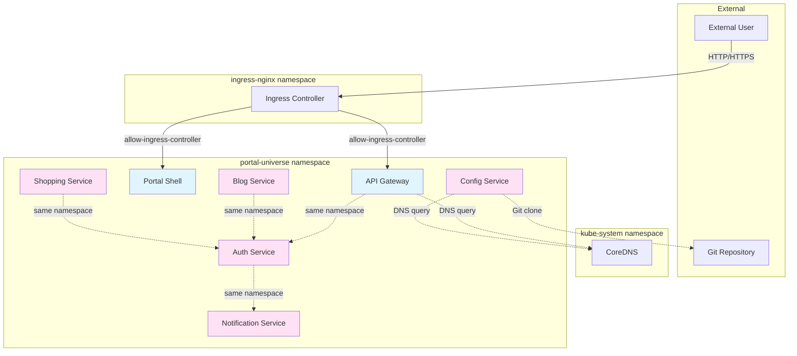

# Network Policy Documentation

---
id: network-policy
title: Network Policy 구성 가이드
type: guide
status: current
created: 2026-01-19
updated: 2026-01-19
author: Laze
tags: [kubernetes, network-policy, security, microservices]
related: []
---

## 개요

이 문서는 Portal Universe 프로젝트의 Kubernetes 환경에서 적용된 Network Policy에 대한 설명과 사용 방법을 다룹니다.

## 도입 배경

### 필요성
- 마이크로서비스 환경에서 서비스 간 통신을 제어하기 위해 도입
- Zero Trust 네트워크 원칙 적용
- 보안 강화를 위한 최소 권한 원칙 구현

### 정책 방식
- **기본 거부 (Default Deny)**: 모든 인바운드 트래픽을 기본적으로 거부
- **화이트리스트 (Whitelist)**: 필요한 트래픽만 명시적으로 허용
- **계층적 접근**: 여러 정책을 조합하여 세밀한 제어

## 적용된 Network Policy 목록

### 1. default-deny-ingress

**목적**: 모든 Pod에 대한 인바운드 트래픽을 기본적으로 거부

**적용 대상**: `portal-universe` 네임스페이스의 모든 Pod

**동작**:
- 명시적으로 허용된 트래픽만 통과
- 다른 정책들의 기준선 역할

**파일 위치**: `k8s/infrastructure/network-policy/default-deny-ingress.yaml`

### 2. allow-same-namespace

**목적**: 동일 네임스페이스 내 Pod 간 통신 허용

**적용 대상**: `portal-universe` 네임스페이스의 모든 Pod

**동작**:
- 네임스페이스 내부 서비스 간 자유로운 통신 보장
- 서비스 간 직접 통신 및 Service Discovery 지원
- 예시:
  - auth-service ↔ notification-service
  - blog-service ↔ auth-service
  - shopping-service ↔ auth-service

**파일 위치**: `k8s/infrastructure/network-policy/allow-same-namespace.yaml`

### 3. allow-ingress-controller

**목적**: Ingress Controller로부터의 트래픽 허용

**적용 대상**:
- api-gateway
- portal-shell
- grafana
- prometheus
- zipkin
- discovery-service

**동작**:
- `ingress-nginx` 네임스페이스의 Ingress Controller만 허용
- 외부 사용자 접근을 위한 진입점 제공
- 모니터링 및 관리 도구 접근 허용

**파일 위치**: `k8s/infrastructure/network-policy/allow-ingress-controller.yaml`

### 4. allow-dns

**목적**: DNS 서비스 및 외부 통신 허용

**적용 대상**: `portal-universe` 네임스페이스의 모든 Pod

**동작**:
1. **DNS 조회 허용**
   - kube-system 네임스페이스의 DNS 서비스 접근
   - UDP/TCP 53 포트 허용

2. **네임스페이스 내부 통신**
   - 동일 네임스페이스 내 모든 트래픽 허용

3. **외부 인터넷 접근**
   - Private IP 대역을 제외한 모든 외부 접근 허용
   - Config Service의 Git 클론 등에 필요
   - 제외 대역:
     - 10.0.0.0/8
     - 172.16.0.0/12
     - 192.168.0.0/16

**파일 위치**: `k8s/infrastructure/network-policy/allow-dns.yaml`

## Network Policy 아키텍처



## 정책 적용 순서

1. **default-deny-ingress** (기본 거부)
2. **allow-same-namespace** (내부 통신 허용)
3. **allow-dns** (DNS 및 외부 통신 허용)
4. **allow-ingress-controller** (외부 진입점 허용)

> ⚠️ **주의**: 정책은 additive 방식으로 동작합니다. 여러 정책이 겹치면 OR 조건으로 허용됩니다.

## 테스트 방법

### 1. Network Policy 적용 확인

```bash
# 모든 Network Policy 목록 조회
kubectl get networkpolicy -n portal-universe

# 특정 정책 상세 확인
kubectl describe networkpolicy default-deny-ingress -n portal-universe
```

### 2. 서비스 간 통신 테스트

```bash
# Pod 목록 확인
kubectl get pods -n portal-universe

# 특정 Pod에서 다른 서비스로 Health Check
kubectl exec -it <pod-name> -n portal-universe -- curl http://auth-service:8081/actuator/health

# DNS 조회 테스트
kubectl exec -it <pod-name> -n portal-universe -- nslookup auth-service

# 외부 인터넷 접근 테스트
kubectl exec -it <pod-name> -n portal-universe -- curl -I https://google.com
```

### 3. 정책 차단 테스트

```bash
# 다른 네임스페이스에서 접근 시도 (실패해야 정상)
kubectl run test-pod --image=curlimages/curl -n default -- sleep 3600
kubectl exec -it test-pod -n default -- curl http://auth-service.portal-universe:8081/actuator/health
# 결과: timeout 또는 connection refused (정상)
```

### 4. 로그 확인

```bash
# Network Policy 관련 로그 확인 (Calico/Cilium 사용 시)
kubectl logs -n kube-system -l k8s-app=calico-node --tail=50
```

## 문제 해결

### 서비스 통신이 안 될 때

1. **Network Policy 확인**
   ```bash
   kubectl get networkpolicy -n portal-universe
   kubectl describe networkpolicy <policy-name> -n portal-universe
   ```

2. **Pod 레이블 확인**
   ```bash
   kubectl get pod <pod-name> -n portal-universe --show-labels
   ```

3. **서비스 엔드포인트 확인**
   ```bash
   kubectl get endpoints <service-name> -n portal-universe
   ```

4. **DNS 조회 확인**
   ```bash
   kubectl exec -it <pod-name> -n portal-universe -- nslookup <service-name>
   ```

### 외부 인터넷 접근이 안 될 때

1. **allow-dns 정책 확인**
   - Private IP 대역 제외 규칙 확인
   - 외부 IP 주소가 Private 대역에 속하지 않는지 확인

2. **DNS 서비스 상태 확인**
   ```bash
   kubectl get svc -n kube-system kube-dns
   kubectl get pods -n kube-system -l k8s-app=kube-dns
   ```

### Config Service Git 클론 실패 시

1. **외부 접근 허용 확인**
   - allow-dns 정책의 egress 규칙 확인
   - Git 서버 IP가 Private 대역이 아닌지 확인

2. **Git 서버 접근 테스트**
   ```bash
   kubectl exec -it <config-pod> -n portal-universe -- curl -I https://github.com
   ```

## 보안 고려사항

### 현재 설정의 보안 수준

✅ **강점**:
- 기본 거부 정책으로 최소 권한 원칙 구현
- 네임스페이스 격리를 통한 서비스 보호
- Ingress Controller를 통한 외부 접근 제어

⚠️ **개선 가능 영역**:
- 서비스별 세밀한 포트 제한 (현재는 네임스페이스 단위)
- Egress 정책 강화 (현재는 외부 인터넷 전체 허용)
- 서비스 메시(Service Mesh) 도입 시 mTLS 추가

### 권장사항

1. **정기적인 정책 검토**
   - 분기별 Network Policy 감사
   - 불필요한 권한 제거

2. **모니터링**
   - Network Policy 위반 로그 수집
   - 비정상 트래픽 패턴 감지

3. **점진적 강화**
   - 서비스별 포트 제한 추가
   - Egress 화이트리스트 구체화
   - Service Mesh 도입 검토

## 관련 문서

- [Kubernetes Network Policies](https://kubernetes.io/docs/concepts/services-networking/network-policies/)
- [k8s/infrastructure/network-policy/](../infrastructure/network-policy/)
- [배포 스크립트](../scripts/deploy.sh)

## 변경 이력

| 날짜 | 변경 내용 | 작성자 |
|------|-----------|--------|
| 2026-01-19 | 최초 작성 | Laze |
