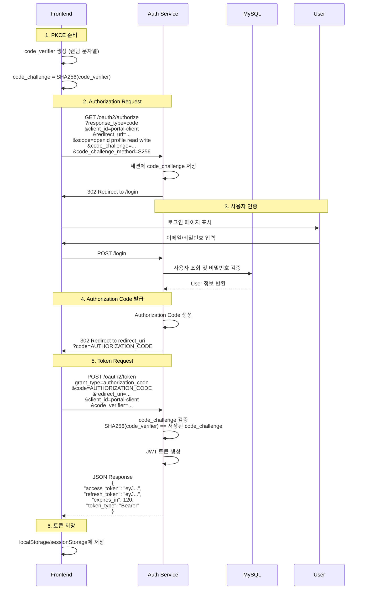
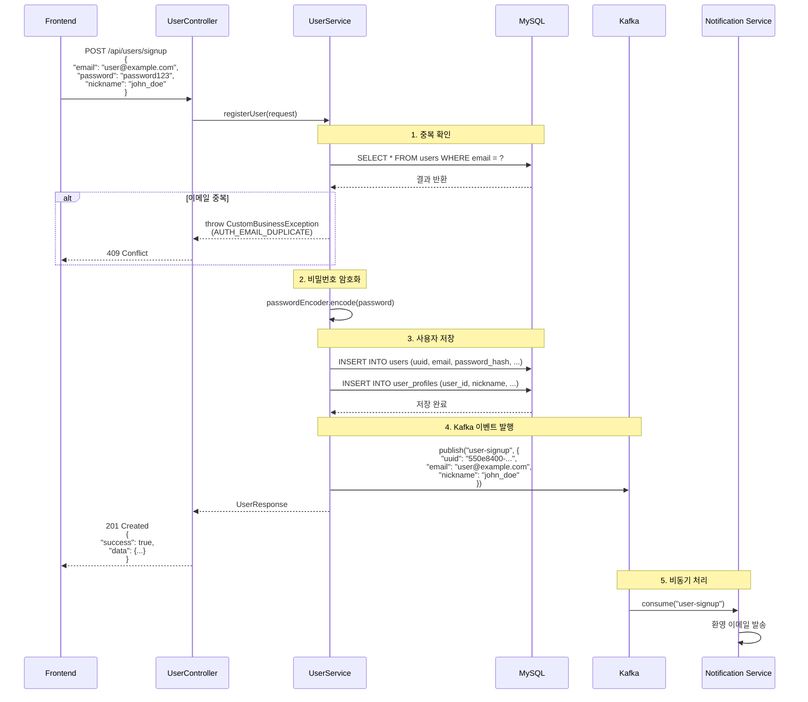
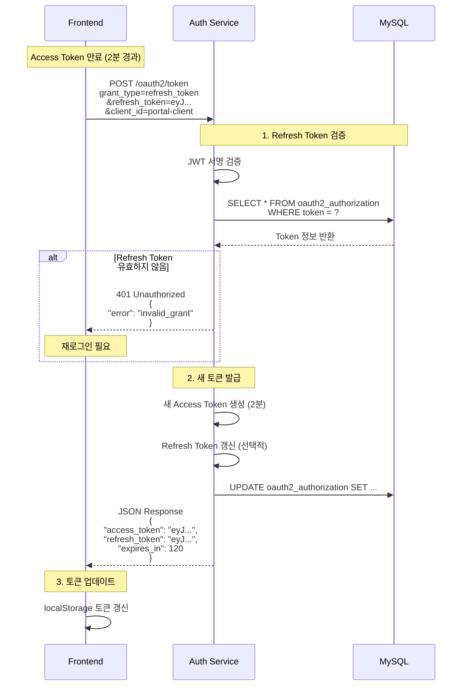
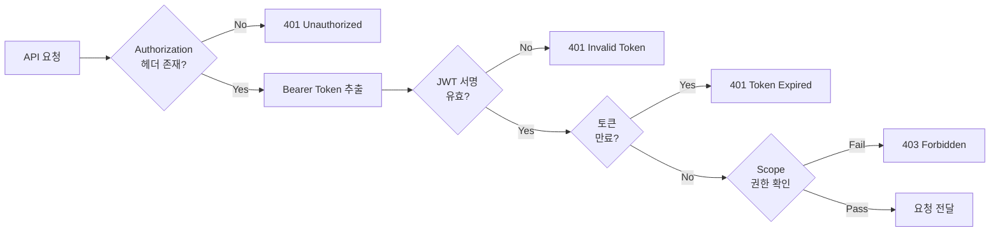

# Auth Service Data Flow

## 📋 개요

Auth Service는 OAuth2 Authorization Code Flow with PKCE를 기반으로 인증/인가를 처리하며, JWT 토큰을 발급합니다. 사용자 등록, 로그인, 토큰 갱신 등의 주요 데이터 흐름을 관리하고, Kafka를 통해 다른 서비스와 비동기로 통신합니다.

### 핵심 컴포넌트

- **OAuth2 Authorization Server**: Spring Authorization Server 기반 인증 서버
- **Token Issuer**: JWT Access Token (2분), Refresh Token 발급
- **User Repository**: MySQL 기반 사용자 정보 저장
- **Kafka Producer**: 사용자 이벤트 발행 (회원가입, 로그인 등)

---

## 🔄 주요 데이터 흐름

### 1. OAuth2 Authorization Code Flow with PKCE

PKCE(Proof Key for Code Exchange)는 Authorization Code 탈취 공격을 방지하기 위한 보안 메커니즘입니다.



#### PKCE 보안 메커니즘

| 항목 | 설명 |
|------|------|
| **code_verifier** | 클라이언트가 생성한 랜덤 문자열 (43-128자) |
| **code_challenge** | `SHA256(code_verifier)` 해시 값 |
| **검증 방식** | 토큰 요청 시 code_verifier를 받아 SHA256 해시 후 저장된 code_challenge와 비교 |
| **보안 효과** | Authorization Code가 탈취되어도 code_verifier 없이는 토큰 발급 불가 |

---

### 2. 회원가입 플로우

사용자 회원가입 시 MySQL에 데이터를 저장하고, Kafka를 통해 notification-service에 이벤트를 전달합니다.



#### 회원가입 데이터베이스 트랜잭션

```java
@Transactional
public UserResponse registerUser(SignupRequest request) {
    // 1. 중복 확인
    if (userRepository.existsByEmail(request.getEmail())) {
        throw new CustomBusinessException(AuthErrorCode.AUTH_EMAIL_DUPLICATE);
    }

    // 2. User 엔티티 생성 및 저장
    User user = User.builder()
        .uuid(UUID.randomUUID().toString())
        .email(request.getEmail())
        .passwordHash(passwordEncoder.encode(request.getPassword()))
        .build();
    userRepository.save(user);

    // 3. UserProfile 저장
    UserProfile profile = UserProfile.builder()
        .user(user)
        .nickname(request.getNickname())
        .build();
    userProfileRepository.save(profile);

    // 4. Kafka 이벤트 발행 (트랜잭션 커밋 후)
    kafkaTemplate.send("user-signup", new UserSignupEvent(user));

    return UserResponse.from(user);
}
```

---

### 3. Token Refresh 플로우

Access Token 만료 시 Refresh Token을 사용하여 새로운 토큰을 발급받습니다.



#### Frontend Axios Interceptor 패턴

```typescript
// Access Token 만료 시 자동 갱신
axios.interceptors.response.use(
  (response) => response,
  async (error) => {
    const originalRequest = error.config;

    if (error.response?.status === 401 && !originalRequest._retry) {
      originalRequest._retry = true;

      try {
        const refreshToken = localStorage.getItem('refresh_token');
        const response = await axios.post('/oauth2/token', {
          grant_type: 'refresh_token',
          refresh_token: refreshToken,
          client_id: 'portal-client'
        });

        const { access_token } = response.data;
        localStorage.setItem('access_token', access_token);

        // 원래 요청 재시도
        originalRequest.headers['Authorization'] = `Bearer ${access_token}`;
        return axios(originalRequest);
      } catch (refreshError) {
        // Refresh Token도 만료 → 로그인 페이지로 이동
        router.push('/login');
        return Promise.reject(refreshError);
      }
    }

    return Promise.reject(error);
  }
);
```

---

## 🔐 JWT 토큰 구조

### Access Token (유효기간: 2분)

```json
{
  "sub": "550e8400-e29b-41d4-a716-446655440000",
  "aud": "portal-client",
  "scope": "openid profile read write",
  "iss": "http://localhost:8081",
  "exp": 1737000120,
  "iat": 1737000000,
  "roles": ["ROLE_USER"],
  "nickname": "john_doe"
}
```

| Claim | 설명 | 예시 |
|-------|------|------|
| `sub` | 사용자 고유 식별자 (UUID) | `550e8400-e29b-41d4-a716-446655440000` |
| `aud` | 토큰 대상 클라이언트 | `portal-client` |
| `scope` | 권한 범위 | `openid profile read write` |
| `iss` | 토큰 발급자 (Issuer) | `http://localhost:8081` |
| `exp` | 만료 시간 (Unix timestamp) | `1737000120` |
| `iat` | 발급 시간 (Issued At) | `1737000000` |
| `roles` | 사용자 역할 | `["ROLE_USER", "ROLE_ADMIN"]` |
| `nickname` | 사용자 닉네임 (커스텀 클레임) | `john_doe` |

### Refresh Token (유효기간: 30일)

```json
{
  "sub": "550e8400-e29b-41d4-a716-446655440000",
  "aud": "portal-client",
  "iss": "http://localhost:8081",
  "exp": 1739592000,
  "iat": 1737000000,
  "token_type": "refresh"
}
```

### 토큰 검증 프로세스 (API Gateway)



---

## 📨 이벤트/메시지 흐름 (Kafka)

Auth Service는 Kafka를 통해 다른 서비스와 비동기로 통신합니다.

### 발행하는 이벤트 (Producer)

| 토픽 | 이벤트 | 발생 시점 | 컨슈머 서비스 |
|------|--------|-----------|---------------|
| `user-signup` | 회원가입 완료 | 신규 사용자 등록 시 | notification-service |
| `user-login` | 로그인 성공 | OAuth2 토큰 발급 시 | notification-service (선택) |
| `password-reset` | 비밀번호 재설정 | 비밀번호 변경 요청 시 | notification-service |

### 이벤트 스키마

#### user-signup 이벤트

```json
{
  "eventId": "evt-20260118-001",
  "eventType": "USER_SIGNUP",
  "timestamp": "2026-01-18T12:34:56Z",
  "payload": {
    "uuid": "550e8400-e29b-41d4-a716-446655440000",
    "email": "user@example.com",
    "nickname": "john_doe",
    "signupMethod": "EMAIL",
    "createdAt": "2026-01-18T12:34:56Z"
  }
}
```

#### user-login 이벤트

```json
{
  "eventId": "evt-20260118-002",
  "eventType": "USER_LOGIN",
  "timestamp": "2026-01-18T13:00:00Z",
  "payload": {
    "uuid": "550e8400-e29b-41d4-a716-446655440000",
    "email": "user@example.com",
    "loginMethod": "OAUTH2",
    "ipAddress": "192.168.1.100",
    "userAgent": "Mozilla/5.0 ..."
  }
}
```

### Kafka Producer 설정

```java
@Configuration
public class KafkaProducerConfig {

    @Bean
    public ProducerFactory<String, UserEvent> producerFactory() {
        Map<String, Object> config = new HashMap<>();
        config.put(ProducerConfig.BOOTSTRAP_SERVERS_CONFIG, "kafka:9092");
        config.put(ProducerConfig.KEY_SERIALIZER_CLASS_CONFIG, StringSerializer.class);
        config.put(ProducerConfig.VALUE_SERIALIZER_CLASS_CONFIG, JsonSerializer.class);
        config.put(ProducerConfig.ACKS_CONFIG, "all"); // 모든 replica 확인
        config.put(ProducerConfig.RETRIES_CONFIG, 3);
        return new DefaultKafkaProducerFactory<>(config);
    }
}
```

---

## 📊 데이터 흐름 요약

```mermaid
graph TB
    subgraph "Frontend"
        FE[Vue/React App]
    end

    subgraph "Auth Service"
        AC[UserController]
        AS[UserService]
        AO[OAuth2 Server]
    end

    subgraph "Data Store"
        DB[(MySQL)]
        KAFKA[Kafka]
    end

    subgraph "Other Services"
        NS[Notification Service]
    end

    FE -->|1. 회원가입| AC
    AC --> AS
    AS -->|2. 저장| DB
    AS -->|3. 이벤트 발행| KAFKA
    KAFKA -->|4. 컨슘| NS

    FE -->|5. OAuth2 인증| AO
    AO -->|6. 사용자 조회| DB
    AO -->|7. JWT 발급| FE

    FE -->|8. API 요청<br/>(Bearer Token)| AC
    AC -->|9. 토큰 검증| AO
    AC -->|10. 데이터 조회| DB
    AC -->|11. 응답| FE

    style FE fill:#e1f5ff
    style KAFKA fill:#fff4e1
    style DB fill:#f0f0f0
```

---

## 🔍 참고 자료

- [OAuth2 Authorization Code Flow RFC](https://datatracker.ietf.org/doc/html/rfc6749#section-4.1)
- [PKCE RFC 7636](https://datatracker.ietf.org/doc/html/rfc7636)
- [JWT RFC 7519](https://datatracker.ietf.org/doc/html/rfc7519)
- Spring Authorization Server Documentation

---

## 📝 변경 이력

| 날짜 | 작성자 | 변경 내용 |
|------|--------|-----------|
| 2026-01-18 | Claude | 초기 문서 작성 |
