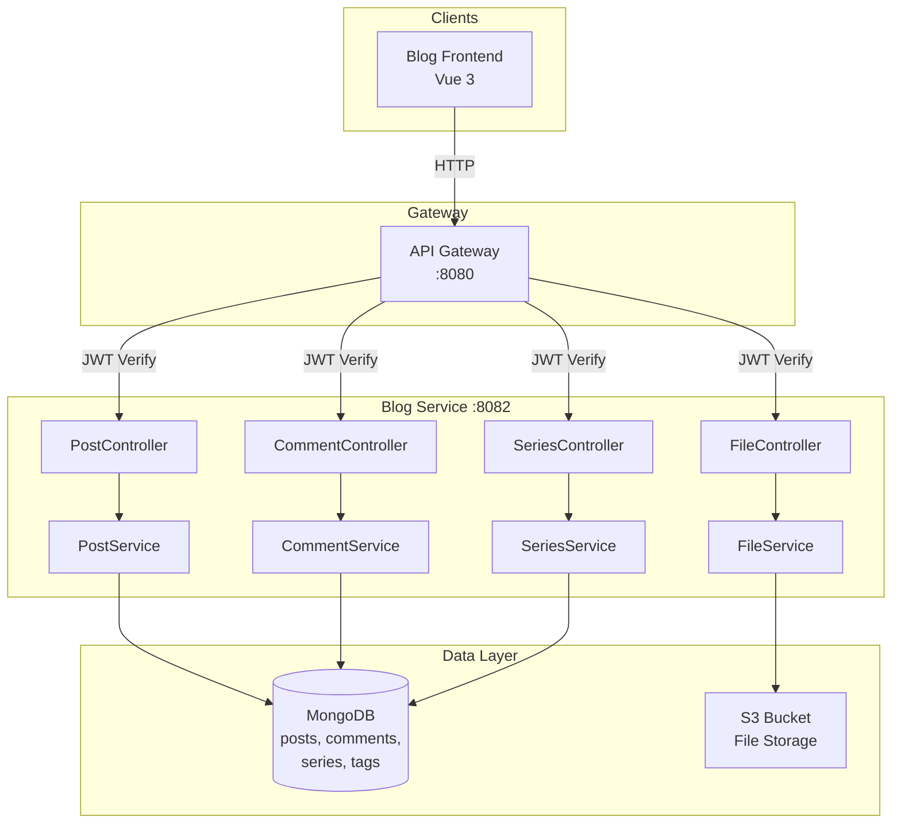
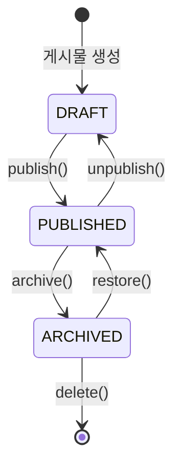
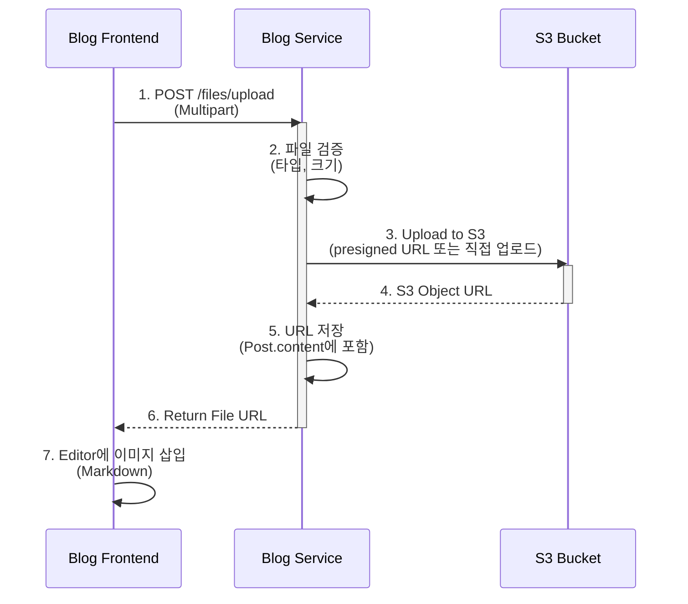

# Blog Service System Overview

## 📋 개요

Blog Service는 Portal Universe의 블로그 기능을 담당하는 마이크로서비스입니다. MongoDB를 사용한 유연한 문서 구조와 S3를 통한 파일 관리를 제공합니다.

**핵심 기능**:
- 블로그 게시물 CRUD (생성, 조회, 수정, 삭제)
- 댓글 시스템 (대댓글 지원)
- 시리즈 관리
- 태그 기반 분류
- 전문 검색 (Full-text Search)
- 파일 업로드 (S3 연동)

---

## 🎯 핵심 특징

- **문서 기반 데이터 모델**: MongoDB를 사용하여 유연한 스키마 관리
- **상태 기반 게시물 관리**: DRAFT → PUBLISHED → ARCHIVED 워크플로우
- **고급 검색**: 키워드, 카테고리, 태그, 기간 등 다양한 조건 조합
- **통계 기능**: 카테고리/태그별 집계 (MongoDB Aggregation)
- **파일 관리**: S3 기반 이미지 및 문서 업로드
- **OAuth2 보안**: API Gateway를 통한 JWT 인증

---

## 🏗️ High-Level Architecture



---

## 📁 도메인 구조

```
services/blog-service/src/main/java/com/portal/blog/
├── post/                    # 게시물 도메인
│   ├── domain/
│   │   ├── Post.java        # 게시물 엔티티
│   │   ├── PostStatus.java  # DRAFT, PUBLISHED, ARCHIVED
│   │   └── PostSortType.java # LATEST, POPULAR, OLDEST
│   ├── dto/
│   │   ├── PostRequest.java
│   │   ├── PostResponse.java
│   │   └── PostSearchCriteria.java
│   ├── repository/
│   │   └── PostRepository.java (MongoRepository)
│   ├── service/
│   │   └── PostService.java
│   └── controller/
│       └── PostController.java
├── comment/                 # 댓글 도메인
│   ├── domain/
│   │   └── Comment.java     # 댓글 엔티티 (대댓글 지원)
│   └── ...
├── series/                  # 시리즈 도메인
│   ├── domain/
│   │   └── Series.java      # 시리즈 엔티티
│   └── ...
├── tag/                     # 태그 도메인
│   ├── domain/
│   │   └── Tag.java
│   └── ...
├── file/                    # 파일 업로드 도메인
│   ├── config/
│   │   └── S3Config.java    # AWS S3 설정
│   ├── service/
│   │   └── FileService.java
│   └── controller/
│       └── FileController.java
├── config/                  # 설정
│   ├── MongoConfig.java
│   ├── SecurityConfig.java
│   └── OpenApiConfig.java
└── exception/
    └── BlogErrorCode.java   # B001-B006
```

---

## 💾 데이터 모델

### Post (게시물)

```java
@Document(collection = "posts")
public class Post {
    @Id
    private String id;                    // MongoDB ObjectId
    private String title;                 // 제목
    private String content;               // 본문 (Markdown)
    private String authorId;              // 작성자 ID (auth-service 연동)
    private String category;              // 카테고리
    private List<String> tags;            // 태그 목록
    private PostStatus status;            // DRAFT | PUBLISHED | ARCHIVED
    private String seriesId;              // 시리즈 ID (optional)
    private int viewCount;                // 조회수
    private LocalDateTime createdAt;      // 생성일
    private LocalDateTime updatedAt;      // 수정일
    private LocalDateTime publishedAt;    // 발행일
}
```

**인덱스**:
```javascript
db.posts.createIndex({ status: 1, publishedAt: -1 })    // 발행된 게시물 조회
db.posts.createIndex({ authorId: 1, status: 1 })        // 작성자별 게시물
db.posts.createIndex({ tags: 1, status: 1 })            // 태그별 게시물
db.posts.createIndex({ title: "text", content: "text" }) // 전문 검색
```

### Comment (댓글)

```java
@Document(collection = "comments")
public class Comment {
    @Id
    private String id;
    private String postId;                // 게시물 ID
    private String authorId;              // 작성자 ID
    private String content;               // 댓글 내용
    private String parentId;              // 대댓글인 경우 부모 댓글 ID
    private LocalDateTime createdAt;      // 생성일
}
```

**인덱스**:
```javascript
db.comments.createIndex({ postId: 1, createdAt: -1 })   // 게시물별 댓글
db.comments.createIndex({ parentId: 1 })                 // 대댓글 조회
```

### Series (시리즈)

```java
@Document(collection = "series")
public class Series {
    @Id
    private String id;
    private String title;                 // 시리즈 제목
    private String description;           // 설명
    private String authorId;              // 작성자 ID
    private List<String> postIds;         // 게시물 ID 목록 (순서 유지)
    private LocalDateTime createdAt;      // 생성일
}
```

---

## 🔄 게시물 상태 흐름



| 상태 | 설명 | 가능한 작업 |
|------|------|------------|
| `DRAFT` | 작성 중 (비공개) | 수정, 발행, 삭제 |
| `PUBLISHED` | 발행됨 (공개) | 수정, 보관, 삭제 |
| `ARCHIVED` | 보관됨 (비공개) | 복원, 삭제 |

---

## 🔍 검색 기능

### 1. 단순 검색 (Simple Search)

**API**: `GET /api/v1/blog/posts/search?keyword=spring`

- 제목(`title`)과 본문(`content`)에서 키워드 검색
- MongoDB Text Index 활용

```java
@Query("{ $text: { $search: ?0 } }")
List<Post> searchByKeyword(String keyword);
```

### 2. 고급 검색 (Advanced Search)

**API**: `POST /api/v1/blog/posts/search/advanced`

**Request Body**:
```json
{
  "keyword": "spring boot",
  "category": "tech",
  "tags": ["java", "backend"],
  "authorId": "user-123",
  "status": "PUBLISHED",
  "startDate": "2024-01-01",
  "endDate": "2024-12-31",
  "sortType": "LATEST",
  "page": 0,
  "size": 10
}
```

**검색 조건**:
- 키워드: 제목/본문 전문 검색
- 카테고리: 정확히 일치
- 태그: 배열 요소 포함 여부
- 작성자: 정확히 일치
- 상태: 정확히 일치
- 기간: `publishedAt` 범위 검색
- 정렬: `LATEST` (최신순), `POPULAR` (인기순), `OLDEST` (오래된순)

---

## 📊 통계 기능

### 카테고리 통계

**API**: `GET /api/v1/blog/posts/stats/categories`

**MongoDB Aggregation**:
```java
Aggregation.newAggregation(
    match(Criteria.where("status").is("PUBLISHED")),
    group("category").count().as("postCount"),
    sort(Sort.Direction.DESC, "postCount")
)
```

**Response**:
```json
[
  { "category": "tech", "postCount": 45 },
  { "category": "lifestyle", "postCount": 28 }
]
```

### 태그 통계

**API**: `GET /api/v1/blog/posts/stats/tags?limit=10`

**Response**:
```json
[
  { "tag": "spring", "count": 45 },
  { "tag": "java", "count": 38 },
  { "tag": "kubernetes", "count": 22 }
]
```

---

## 📤 파일 업로드

### S3 연동 흐름



### 지원 파일 형식

| 타입 | 확장자 | 최대 크기 | 용도 |
|------|--------|-----------|------|
| 이미지 | `.jpg`, `.png`, `.gif`, `.webp` | 10MB | 게시물 내 이미지 |
| 문서 | `.pdf`, `.doc`, `.docx` | 50MB | 첨부 파일 |

### S3 설정 예시

```java
@Configuration
public class S3Config {
    @Value("${aws.s3.bucket-name}")
    private String bucketName;

    @Value("${aws.s3.region}")
    private String region;

    @Bean
    public AmazonS3 amazonS3() {
        return AmazonS3ClientBuilder.standard()
            .withRegion(region)
            .build();
    }
}
```

---

## 🔒 보안 설정

### API 접근 제어

```java
@Configuration
@EnableWebSecurity
public class SecurityConfig {

    @Bean
    public SecurityFilterChain filterChain(HttpSecurity http) {
        return http
            .authorizeHttpRequests(auth -> auth
                // 읽기 작업: 인증 불필요
                .requestMatchers(HttpMethod.GET, "/api/v1/blog/posts/**").permitAll()
                .requestMatchers(HttpMethod.GET, "/api/v1/blog/comments/**").permitAll()

                // 쓰기 작업: 인증 필요
                .requestMatchers(HttpMethod.POST, "/api/v1/blog/posts/**").authenticated()
                .requestMatchers(HttpMethod.PUT, "/api/v1/blog/posts/**").authenticated()
                .requestMatchers(HttpMethod.DELETE, "/api/v1/blog/posts/**").authenticated()

                .anyRequest().authenticated()
            )
            .oauth2ResourceServer(oauth2 -> oauth2
                .jwt(Customizer.withDefaults())
            )
            .build();
    }
}
```

### JWT 클레임 활용

```java
public String extractUserId(Authentication authentication) {
    Jwt jwt = (Jwt) authentication.getPrincipal();
    return jwt.getClaimAsString("sub");  // User ID
}
```

---

## ⚠️ 에러 코드

| 코드 | 메시지 | 설명 | HTTP 상태 |
|------|--------|------|-----------|
| `B001` | Duplicate title | 중복된 제목 | 409 Conflict |
| `B002` | Post not found | 게시물을 찾을 수 없음 | 404 Not Found |
| `B003` | Unauthorized access | 권한 없음 (작성자만 수정/삭제 가능) | 403 Forbidden |
| `B004` | Comment not found | 댓글을 찾을 수 없음 | 404 Not Found |
| `B005` | Series not found | 시리즈를 찾을 수 없음 | 404 Not Found |
| `B006` | File upload failed | 파일 업로드 실패 | 500 Internal Server Error |

**사용 예시**:
```java
if (isDuplicateTitle(request.getTitle())) {
    throw new CustomBusinessException(BlogErrorCode.DUPLICATE_TITLE);
}
```

---

## 📦 컴포넌트 상세

### Blog Service

| 항목 | 내용 |
|------|------|
| **역할** | 블로그 게시물 및 댓글 관리 |
| **기술 스택** | Java 17, Spring Boot 3.5.5, MongoDB, AWS S3 |
| **포트** | 8082 (로컬), 80 (K8s) |
| **의존성** | - Config Service (설정)<br/>- API Gateway (인증)<br/>- MongoDB (데이터 저장)<br/>- S3 (파일 저장) |
| **외부 노출 API** | `/api/v1/blog/**` |

---

## 🔗 외부 연동

| 시스템 | 용도 | 프로토콜 | 인증 |
|--------|------|----------|------|
| **API Gateway** | JWT 인증, 라우팅 | HTTP/REST | OAuth2 JWT |
| **Config Service** | 외부 설정 관리 | HTTP | N/A |
| **AWS S3** | 파일 저장소 | AWS SDK | IAM Role |
| **MongoDB** | 데이터 저장소 | MongoDB Wire Protocol | Username/Password |

---

## 📊 성능 목표

| 지표 | 목표 | 현재 | 비고 |
|------|------|------|------|
| **응답 시간 (p95)** | < 200ms | - | 단일 게시물 조회 |
| **처리량** | 500 TPS | - | 읽기 작업 기준 |
| **가용성** | 99.5% | - | 월간 기준 |
| **검색 응답 시간** | < 500ms | - | 전문 검색 (10개 결과) |

---

## 🔗 관련 문서

- [ADR-001: MongoDB 선택 이유](../../docs/adr/ADR-001-mongodb-selection.md)
- [API 명세서](../api/blog-api-spec.md)
- [Data Flow](./data-flow.md)
- [배포 가이드](../guides/deployment.md)

---

**최종 업데이트**: 2026-01-18
