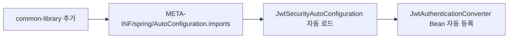
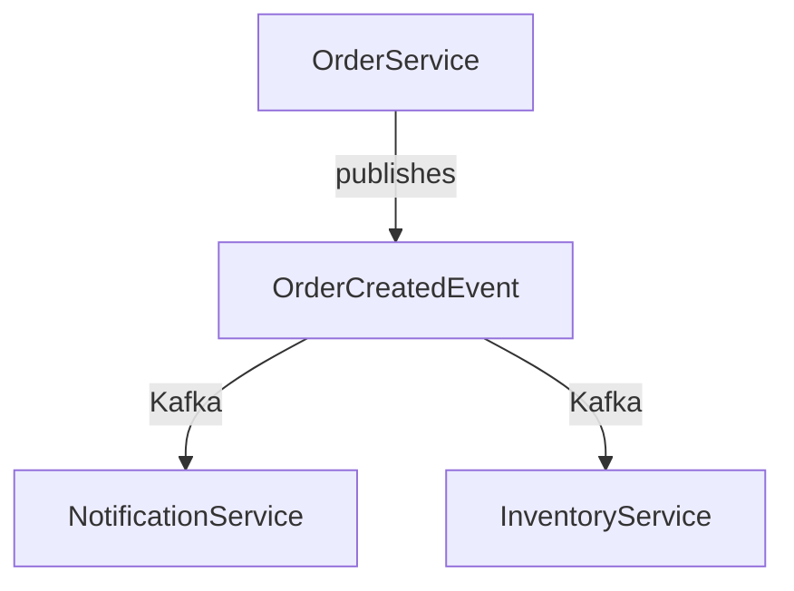
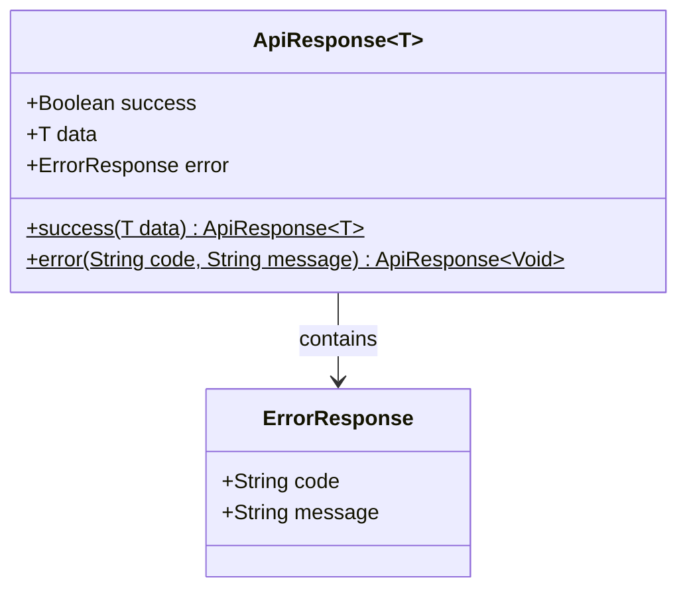
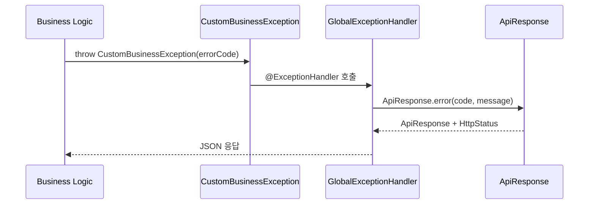
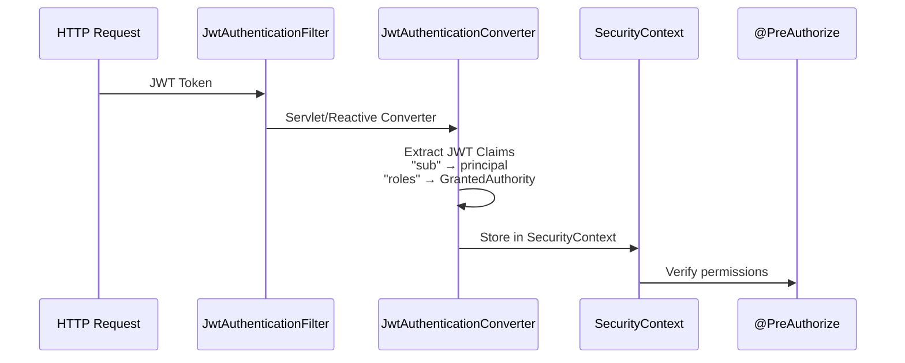

# Common Library 아키텍처 개요

## 📋 개요

common-library는 Portal Universe 마이크로서비스 아키텍처의 핵심 공유 라이브러리입니다. 모든 백엔드 서비스에서 사용하는 공통 기능(예외 처리, 응답 구조, 보안 설정, 도메인 이벤트)을 제공하여 일관성과 유지보수성을 확보합니다.

**주요 제공 기능:**
- 통일된 API 응답 구조 (`ApiResponse<T>`)
- 계약 기반 예외 처리 (`ErrorCode` 인터페이스)
- JWT 보안 자동 설정 (Servlet/Reactive 이중 지원)
- 도메인 이벤트 정의 (Kafka 기반 이벤트 기반 아키텍처)

---

## 🎯 아키텍처 원칙

### 1. 최소 의존성 (Minimal Dependencies)

라이브러리가 사용하는 각 서비스의 빌드 결과물을 최대한 가볍게 유지하기 위해 불필수적인 의존성은 `compileOnly`로 선언합니다.

```gradle
// Provided at compile-time, not included in JAR
compileOnly 'org.springframework.boot:spring-boot-starter-security'
compileOnly 'org.springframework.security:spring-security-oauth2-resource-server'
compileOnly 'org.springframework.boot:spring-boot-starter-webflux'
```

**장점:**
- 각 서비스가 필요한 의존성만 포함
- 버전 충돌 최소화
- 명시적인 의존성 관리

### 2. 자동 설정 (Auto-Configuration)

Spring Boot의 Auto-Configuration 메커니즘을 활용하여 서비스 레벨에서 보일러플레이트 코드를 제거합니다.



**장점:**
- 개발자가 수동 설정 최소화
- 일관된 보안 설정 강제
- 필요 시 `@ConditionalOnMissingBean`으로 오버라이드 가능

### 3. 계약 기반 설계 (Contract-Based Design)

`ErrorCode`를 인터페이스로 정의하여 각 서비스가 구현하도록 강제합니다.

```java
public interface ErrorCode {
    HttpStatus getStatus();
    String getCode();
    String getMessage();
}
```

**장점:**
- 새로운 에러 코드 추가 시 구조 일관성 보장
- IDE의 자동 완성 지원
- 런타임 전에 구조 검증

### 4. 이벤트 기반 비동기 통신

서비스 간 의존성을 최소화하기 위해 Kafka 기반 이벤트 발행/구독 패턴을 사용합니다.



---

## 🏗️ 계층 구조

### 응답 계층 (Response Layer)



| 컴포넌트 | 역할 | 특징 |
|---------|------|------|
| **ApiResponse\<T\>** | JSON 직렬화 대상 | Generic 타입, 불변성 |
| **ErrorResponse** | 에러 정보 래퍼 | code, message 포함 |

**특징:**
- `@JsonInclude(NON_NULL)`: null 필드는 JSON에서 제외
- Generic `<T>`: 모든 응답 타입 지원
- 불변성: private final 필드

### 예외 처리 계층 (Exception Handling Layer)



**예외 계층:**

```
Exception (Java)
    ↓
GlobalExceptionHandler 처리 (500)
    ↓
CustomBusinessException (예측 가능)
    ↓
GlobalExceptionHandler → ApiResponse + ErrorCode.getStatus()
    ↓
NoResourceFoundException (404)
    ↓
GlobalExceptionHandler → ApiResponse + CommonErrorCode.NOT_FOUND
```

### 보안 계층 (Security Layer)



---

## 📦 컴포넌트 상세

### 1. Response 컴포넌트

| 항목 | 내용 |
|------|------|
| **패키지** | `com.portal.universe.commonlibrary.response` |
| **주요 클래스** | `ApiResponse<T>`, `ErrorResponse` |
| **역할** | 통일된 API 응답 구조 제공 |
| **사용 서비스** | 모든 마이크로서비스 |

**주요 메서드:**
```java
// 성공 응답 생성
public static <T> ApiResponse<T> success(T data)

// 실패 응답 생성
public static <T> ApiResponse<T> error(String code, String message)
```

### 2. Exception 컴포넌트

| 항목 | 내용 |
|------|------|
| **패키지** | `com.portal.universe.commonlibrary.exception` |
| **주요 클래스** | `ErrorCode`, `CommonErrorCode`, `CustomBusinessException`, `GlobalExceptionHandler` |
| **역할** | 예외 처리 표준화 |
| **사용 서비스** | 모든 마이크로서비스 |

**에러 코드 명명 규칙:**

| 서비스 | 접두사 | 예시 |
|--------|--------|------|
| Common | C | C001, C002, C003 |
| Auth | A | A001 |
| Blog | B | B001, B002, B003 |
| Shopping | S | S001 |

### 3. Security 컴포넌트

| 항목 | 내용 |
|------|------|
| **패키지** | `com.portal.universe.commonlibrary.security` |
| **주요 클래스** | `JwtSecurityAutoConfiguration`, `JwtAuthenticationConverterAdapter`, `ReactiveJwtAuthenticationConverterAdapter` |
| **역할** | JWT 보안 자동 설정 |
| **지원 환경** | Servlet (Spring MVC), Reactive (Spring WebFlux) |

**자동 설정 로직:**
```java
@Bean
@ConditionalOnWebApplication(type = SERVLET)
@ConditionalOnMissingBean(JwtAuthenticationConverter.class)
public JwtAuthenticationConverter jwtAuthenticationConverter() {
    return JwtAuthenticationConverterAdapter.createDefault();
}
```

### 4. Event 컴포넌트

| 항목 | 내용 |
|------|------|
| **패키지** | `com.portal.universe.common.event` |
| **주요 클래스** | `UserSignedUpEvent`, `OrderCreatedEvent`, `PaymentCompletedEvent` 등 |
| **역할** | 도메인 이벤트 정의 (Kafka 직렬화) |
| **사용 서비스** | 이벤트 발행/구독하는 모든 서비스 |

---

## 🔄 주요 설계 결정 (ADR 요약)

### ADR-001: ApiResponse 단일 래퍼 사용

**상태:** ✅ Accepted

**컨텍스트:**
마이크로서비스마다 다른 응답 구조를 사용하면 클라이언트가 응답 형식을 일일이 처리해야 합니다.

**결정:**
모든 API 응답을 `ApiResponse<T>` 단일 래퍼로 표준화합니다.

**결과:**
- 클라이언트: 단일 응답 형식만 처리
- 서버: 일관된 응답 구조
- 게이트웨이: 응답 검증 자동화 가능

**대안 검토:**
1. ❌ 각 서비스마다 독립적인 응답 구조 - 복잡도 증가, 클라이언트 부담
2. ✅ **ApiResponse\<T\> 표준화** - 선택된 방안
3. ❌ ResponseEntity\<T\>만 사용 - 에러 정보 구조화 부족

### ADR-002: ErrorCode 인터페이스 계약

**상태:** ✅ Accepted

**컨텍스트:**
각 마이크로서비스가 자신의 비즈니스 에러를 정의하되, 구조는 일관되어야 합니다.

**결정:**
ErrorCode를 인터페이스로 정의하고, 각 서비스는 ErrorCode를 구현한 Enum을 작성합니다.

```java
// common-library
public interface ErrorCode { ... }

// auth-service
public enum AuthErrorCode implements ErrorCode { ... }

// shopping-service
public enum ShoppingErrorCode implements ErrorCode { ... }
```

**결과:**
- 컴파일 타임 검증: IDE가 비존재 코드 감지
- 런타임 안정성: 모든 에러 코드가 HttpStatus, code, message 보유
- 확장성: 새 서비스 추가 시 ErrorCode 구현만 하면 됨

### ADR-003: JWT 자동 설정 (Auto-Configuration)

**상태:** ✅ Accepted

**컨텍스트:**
모든 마이크로서비스가 동일한 JWT 처리 로직이 필요하지만, 각 서비스마다 복사 붙여넣기하는 것은 유지보수가 어렵습니다.

**결정:**
Spring Boot Auto-Configuration을 사용하여 `JwtSecurityAutoConfiguration`을 자동 로드합니다.

```
spring-boot-starter-security 의존성 감지
    ↓
META-INF/spring/.../AutoConfiguration.imports 읽기
    ↓
JwtSecurityAutoConfiguration 자동 로드
    ↓
JwtAuthenticationConverter Bean 자동 등록
```

**결과:**
- 서비스는 common-library 추가만으로 JWT 처리 자동 활성화
- 필요 시 `@Bean @ConditionalOnMissingBean`으로 커스터마이징 가능
- 보안 설정 일관성 강제

### ADR-004: Servlet과 Reactive 이중 지원

**상태:** ✅ Accepted

**컨텍스트:**
- Spring MVC (Servlet) 기반 서비스: Auth, Blog, Shopping
- Spring WebFlux (Reactive) 기반 서비스: API Gateway

**결정:**
두 환경 모두 지원하는 별도의 Converter를 제공합니다.

```
JwtSecurityAutoConfiguration
    ├─ @ConditionalOnWebApplication(SERVLET)
    │  └─ JwtAuthenticationConverterAdapter (Spring MVC)
    │
    └─ @ConditionalOnWebApplication(REACTIVE)
       └─ ReactiveJwtAuthenticationConverterAdapter (WebFlux)
```

**결과:**
- Servlet 서비스: `JwtAuthenticationConverter` 사용
- Reactive 서비스: `Converter<Jwt, Mono<...>>` 사용
- 각 환경의 특성에 맞는 구현

### ADR-005: 이벤트 레코드 사용

**상태:** ✅ Accepted

**컨텍스트:**
도메인 이벤트는 불변이어야 하며, Kafka로 직렬화/역직렬화되어야 합니다.

**결정:**
Java 16+ Record를 사용하여 이벤트를 정의합니다.

```java
public record UserSignedUpEvent(
    String userId,
    String email,
    String name
) {}
```

**결과:**
- 불변성: 자동 보장
- 간결함: 보일러플레이트 최소화 (getter, equals, hashCode 자동)
- 직렬화: Jackson/JSON 자동 지원
- 타입 안전성: 구조 검증

---

## 📨 도메인 이벤트

### 인증 도메인 (Auth Domain)

#### UserSignedUpEvent

```java
record UserSignedUpEvent(
    String userId,      // 생성된 사용자 ID
    String email,       // 사용자 이메일
    String name         // 사용자 이름
) {}
```

| 항목 | 내용 |
|------|------|
| **발행자** | Auth Service |
| **구독자** | Shopping Service, Notification Service |
| **발행 조건** | 사용자 가입 완료 |
| **용도** | 사용자 정보 동기화, 가입 환영 이메일 발송 |

### 쇼핑 도메인 (Shopping Domain)

#### OrderCreatedEvent

```java
record OrderCreatedEvent(
    String orderNumber,          // 주문 번호
    String userId,               // 사용자 ID
    BigDecimal totalAmount,      // 총 주문 금액
    int itemCount,               // 상품 개수
    List<OrderItemInfo> items,   // 주문 상품 목록
    LocalDateTime createdAt      // 주문 생성 시간
) {
    record OrderItemInfo(
        Long productId,
        String productName,
        int quantity,
        BigDecimal price
    ) {}
}
```

| 항목 | 내용 |
|------|------|
| **발행자** | Shopping Service |
| **구독자** | Notification Service, Inventory Service |
| **발행 조건** | 주문 생성 |
| **용도** | 재고 예약, 주문 확인 이메일 발송 |

#### PaymentCompletedEvent

```java
record PaymentCompletedEvent(
    String paymentNumber,        // 결제 번호
    String orderNumber,          // 주문 번호
    String userId,               // 사용자 ID
    BigDecimal amount,           // 결제 금액
    String paymentMethod,        // 결제 수단 (CREDIT_CARD, PAYPAL 등)
    String pgTransactionId,      // PG사 거래 ID
    LocalDateTime paidAt         // 결제 완료 시간
) {}
```

| 항목 | 내용 |
|------|------|
| **발행자** | Shopping Service |
| **구독자** | Notification Service, Order Service |
| **발행 조건** | 결제 성공 |
| **용도** | 주문 확인 진행, 결제 영수증 발송 |

#### 기타 이벤트

| 이벤트 | 발행자 | 구독자 | 용도 |
|--------|--------|--------|------|
| `PaymentFailedEvent` | Shopping | Notification | 결제 실패 알림 |
| `OrderConfirmedEvent` | Shopping | Notification | 주문 확정 알림 |
| `OrderCancelledEvent` | Shopping | Notification, Inventory | 재고 해제, 취소 알림 |
| `InventoryReservedEvent` | Shopping | Inventory | 재고 시스템 동기화 |
| `DeliveryShippedEvent` | Shopping | Notification | 배송 알림 발송 |

---

## 📊 응답 구조 예시

### 성공 응답 (200 OK)

```json
{
  "success": true,
  "data": {
    "id": 1,
    "name": "Product A",
    "price": 29.99
  }
}
```

### 실패 응답 (400 Bad Request)

```json
{
  "success": false,
  "error": {
    "code": "C002",
    "message": "Invalid Input Value"
  }
}
```

### 실패 응답 (404 Not Found)

```json
{
  "success": false,
  "error": {
    "code": "C003",
    "message": "Not Found"
  }
}
```

### 실패 응답 (500 Internal Server Error)

```json
{
  "success": false,
  "error": {
    "code": "C001",
    "message": "Internal Server Error"
  }
}
```

---

## 🔐 보안 고려사항

### JWT 클레임 매핑

common-library는 JWT의 `roles` 클레임을 Spring Security의 `GrantedAuthority`로 변환합니다.

```
JWT (Auth Service 발행):
{
  "sub": "user123",
  "email": "user@example.com",
  "roles": ["ROLE_USER", "ROLE_ADMIN"]
}
    ↓
JwtAuthenticationConverterAdapter
    ↓
GrantedAuthority:
- ROLE_USER
- ROLE_ADMIN
```

### 토큰 검증

API Gateway가 발급한 JWT는 각 마이크로서비스에서 검증됩니다.

```yaml
spring:
  security:
    oauth2:
      resourceserver:
        jwt:
          issuer-uri: http://auth-service:8081
          jwk-set-uri: http://auth-service:8081/.well-known/jwks.json
```

---

## ⚡ 성능 고려사항

### API 응답 최적화

```java
@JsonInclude(JsonInclude.Include.NON_NULL)
public class ApiResponse<T> { ... }
```

- null 필드는 JSON에서 제외하여 페이로드 크기 감소
- 네트워크 대역폭 절약

### 이벤트 처리

Kafka를 통한 비동기 처리로:
- 동기 호출 제거 → 응답 시간 단축
- 서비스 간 의존성 감소 → 장애 격리
- 확장성 향상 → 고처리량 지원

---

## 🔄 확장 가능성

### 새로운 에러 코드 추가

1. 해당 서비스의 `[Service]ErrorCode` Enum에 정의
2. ErrorCode 인터페이스의 세 메서드 구현
3. GlobalExceptionHandler가 자동으로 처리

```java
// shopping-service/ShoppingErrorCode.java
public enum ShoppingErrorCode implements ErrorCode {
    PRODUCT_NOT_FOUND(
        HttpStatus.NOT_FOUND,
        "S001",
        "Product not found"
    ),
    INSUFFICIENT_STOCK(
        HttpStatus.BAD_REQUEST,
        "S003",
        "Insufficient stock"
    );

    private final HttpStatus status;
    private final String code;
    private final String message;

    // constructor, getters...
}
```

### 새로운 이벤트 추가

1. `common-library`의 `com.portal.universe.common.event` 패키지에 Record 클래스 추가
2. 모든 필드는 Jackson으로 직렬화 가능해야 함
3. ARCHITECTURE.md에 문서화

```java
public record NewDomainEvent(
    String eventId,
    LocalDateTime occurredAt,
    // other fields...
) {}
```

---

## 🚀 마이그레이션 경로

### 기존 서비스 마이그레이션

#### Step 1: build.gradle에 common-library 추가

```gradle
implementation 'com.portal.universe:common-library:0.0.1-SNAPSHOT'
```

#### Step 2: 기존 ResponseDTO를 ApiResponse\<T\>로 래핑

```java
// Before
@GetMapping("/{id}")
public ResponseEntity<ProductResponse> getProduct(@PathVariable Long id) { ... }

// After
@GetMapping("/{id}")
public ResponseEntity<ApiResponse<ProductResponse>> getProduct(@PathVariable Long id) {
    return ResponseEntity.ok(ApiResponse.success(productService.getProduct(id)));
}
```

#### Step 3: ErrorCode 정의

```java
public enum ProductErrorCode implements ErrorCode { ... }
```

#### Step 4: service.yml 설정 추가

```yaml
spring:
  security:
    oauth2:
      resourceserver:
        jwt:
          issuer-uri: http://auth-service:8081
```

---

## 📂 디렉토리 구조

```
common-library/
├── src/main/java/com/portal/universe/
│   ├── commonlibrary/
│   │   ├── response/
│   │   │   ├── ApiResponse.java
│   │   │   └── ErrorResponse.java
│   │   ├── exception/
│   │   │   ├── ErrorCode.java
│   │   │   ├── CommonErrorCode.java
│   │   │   ├── CustomBusinessException.java
│   │   │   └── GlobalExceptionHandler.java
│   │   └── security/
│   │       ├── config/
│   │       │   └── JwtSecurityAutoConfiguration.java
│   │       └── converter/
│   │           ├── JwtAuthenticationConverterAdapter.java
│   │           └── ReactiveJwtAuthenticationConverterAdapter.java
│   └── common/
│       └── event/
│           ├── UserSignedUpEvent.java
│           └── shopping/
│               ├── OrderCreatedEvent.java
│               ├── PaymentCompletedEvent.java
│               └── ...
└── src/main/resources/
    └── META-INF/spring/
        └── org.springframework.boot.autoconfigure.AutoConfiguration.imports
```

---

## 🔗 관련 문서

- [Common Library README](../README.md)
- [Backend Code Patterns](/.claude/rules/backend-patterns.md)
- [Error Handling Rules](/.claude/rules/error-handling.md)

---

**최종 업데이트**: 2026-01-18
