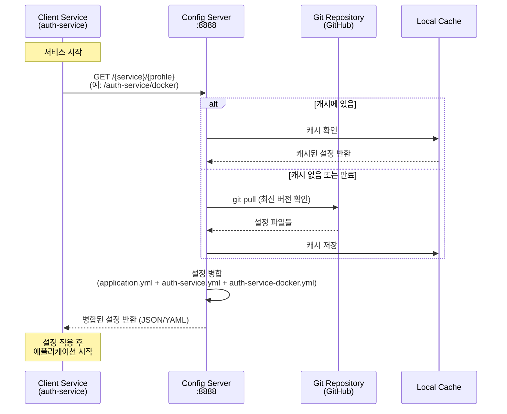
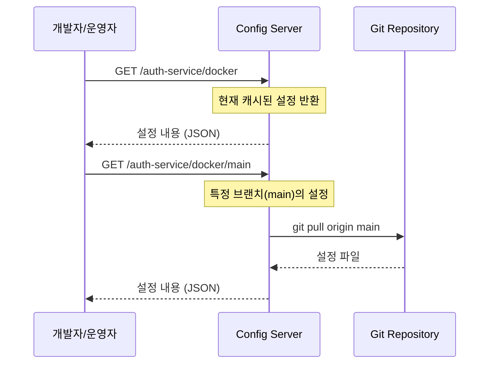
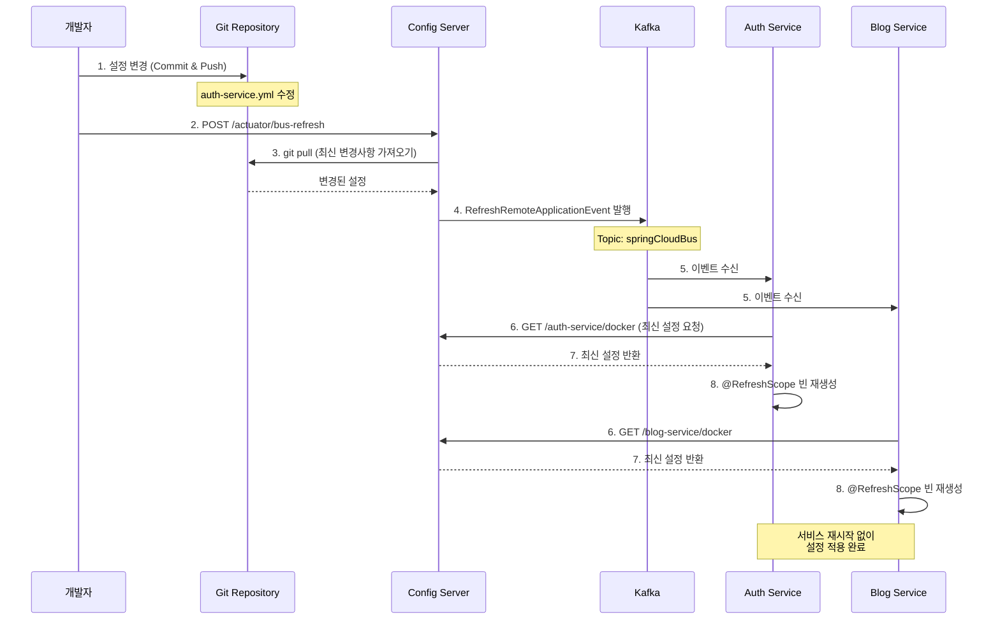
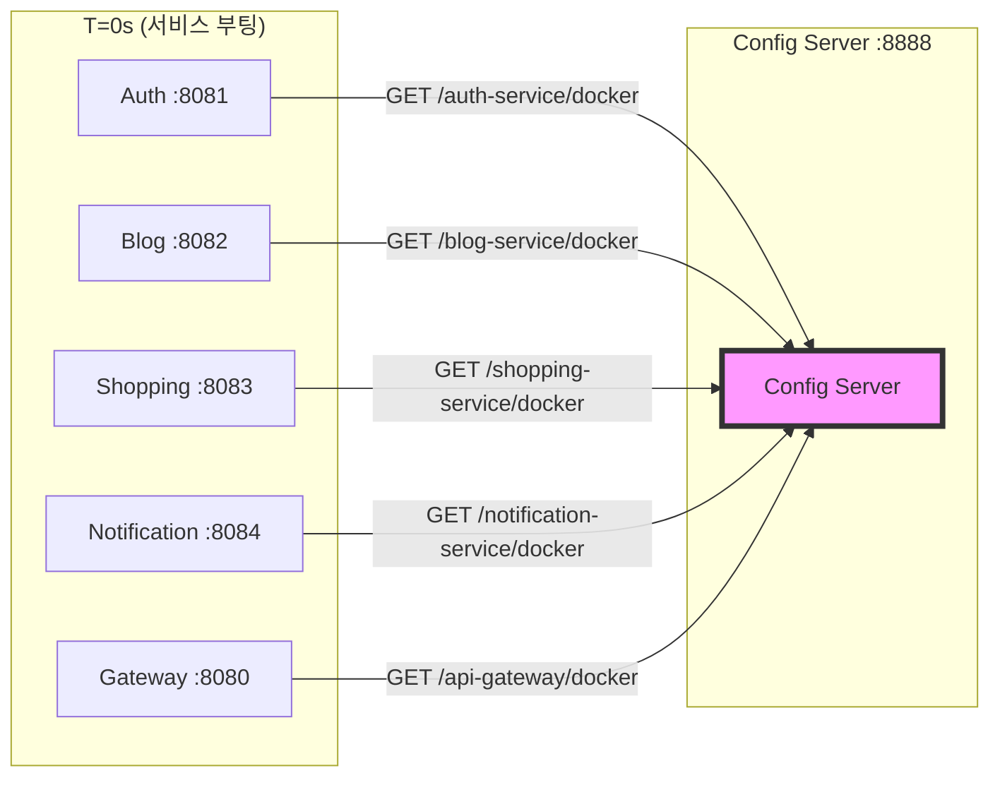
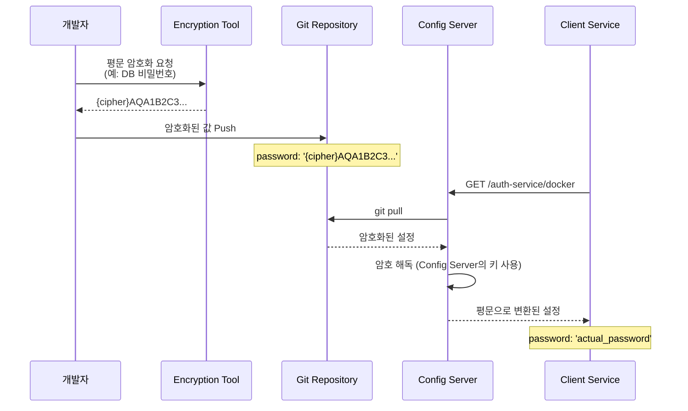
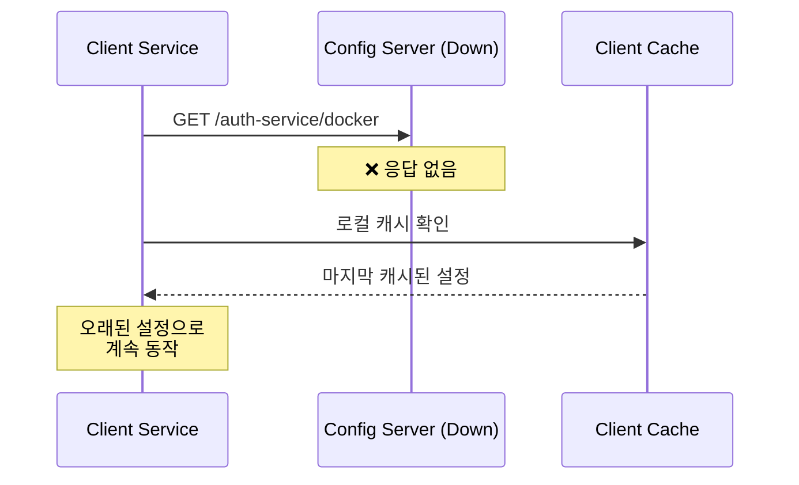
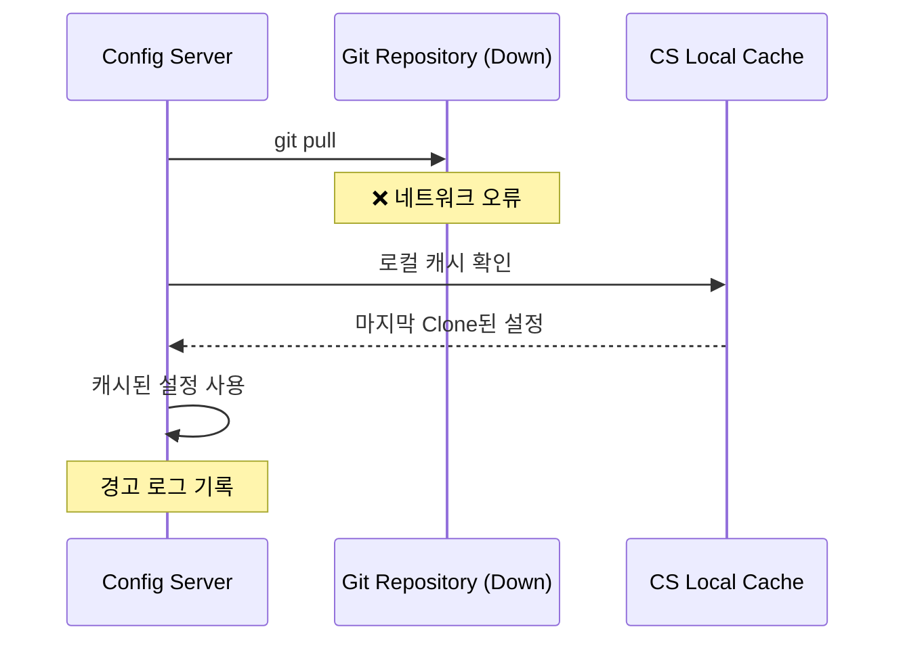

# Config Service Data Flow

## 📋 개요

Config Service의 설정 데이터 흐름을 설명합니다. Git 저장소에서 설정을 가져와 클라이언트 서비스에 제공하는 전체 프로세스를 다룹니다.

---

## 🔄 주요 데이터 흐름

### 1. 서비스 부팅 시 설정 로드



**단계별 설명**:

1. **서비스 부팅**: 클라이언트 서비스(예: auth-service)가 시작될 때 Config Server에 설정 요청
2. **설정 요청**: `GET /auth-service/docker` 형식으로 서비스명과 프로파일 전달
3. **캐시 확인**: Config Server는 로컬 캐시 확인
4. **Git Pull**: 캐시가 없거나 만료된 경우 Git 저장소에서 최신 버전 가져오기
5. **설정 병합**: 우선순위에 따라 설정 파일 병합
   - `application.yml` (공통)
   - `auth-service.yml` (서비스별)
   - `auth-service-docker.yml` (환경별)
6. **응답**: 병합된 설정을 JSON 또는 YAML 형식으로 반환
7. **적용**: 클라이언트는 받은 설정으로 Spring Context 초기화

---

### 2. 런타임 설정 조회



**사용 사례**:
- 운영자가 현재 적용된 설정 확인
- 특정 브랜치의 설정 미리보기
- 디버깅 목적으로 설정 값 검증

**API 예시**:
```bash
# 기본 (main 브랜치)
curl http://config-service:8888/auth-service/docker

# 특정 브랜치
curl http://config-service:8888/auth-service/docker/feature-branch

# 특정 커밋
curl http://config-service:8888/auth-service/docker/a1b2c3d
```

---

### 3. 설정 변경 및 동적 갱신



**단계별 설명**:

1. **설정 변경**: 개발자가 Git 저장소의 설정 파일 수정 후 Push
2. **갱신 트리거**: `/actuator/bus-refresh` 엔드포인트 호출
3. **Config Server 갱신**: Git 저장소에서 최신 변경사항 Pull
4. **이벤트 발행**: Spring Cloud Bus를 통해 Kafka에 갱신 이벤트 발행
5. **이벤트 수신**: 모든 클라이언트 서비스가 Kafka에서 이벤트 수신
6. **설정 재요청**: 각 서비스가 Config Server에 최신 설정 요청
7. **설정 반환**: Config Server가 최신 설정 반환
8. **빈 재생성**: `@RefreshScope`가 붙은 빈들만 재생성하여 새 설정 적용

**주의사항**:
- `@RefreshScope`가 붙은 빈만 동적 갱신 가능
- DB 연결 정보 등 일부 설정은 재시작 필요
- 갱신 실패 시 롤백 불가 (주의 필요)

---

## 📁 설정 파일 구조 및 우선순위

### Git 저장소 구조

```
portal-universe-config-repo/
├── application.yml              # 모든 서비스 공통 설정
├── application-docker.yml       # 모든 서비스 docker 프로파일 공통
├── application-k8s.yml          # 모든 서비스 k8s 프로파일 공통
├── auth-service.yml             # auth-service 기본 설정
├── auth-service-docker.yml      # auth-service docker 설정
├── auth-service-k8s.yml         # auth-service k8s 설정
├── blog-service.yml
├── blog-service-docker.yml
├── blog-service-k8s.yml
├── shopping-service.yml
├── shopping-service-docker.yml
└── ...
```

### 설정 병합 예시

**요청**: `GET /auth-service/docker`

```yaml
# 1. application.yml (공통)
logging:
  level:
    root: INFO

# 2. application-docker.yml (공통 + docker)
spring:
  kafka:
    bootstrap-servers: kafka:9092

# 3. auth-service.yml (서비스별)
server:
  port: 8081
spring:
  datasource:
    url: jdbc:mysql://localhost:3306/auth

# 4. auth-service-docker.yml (서비스별 + docker)
spring:
  datasource:
    url: jdbc:mysql://mysql:3306/auth  # 덮어쓰기

# 최종 병합 결과
logging:
  level:
    root: INFO
spring:
  kafka:
    bootstrap-servers: kafka:9092
  datasource:
    url: jdbc:mysql://mysql:3306/auth  # docker 프로파일 값으로 덮어씀
server:
  port: 8081
```

---

## 🔄 설정 갱신 전략 비교

| 방식 | 적용 시점 | 장점 | 단점 | 사용 시나리오 |
|------|-----------|------|------|---------------|
| **서비스 재시작** | 재시작 시 | - 모든 설정 적용 가능<br/>- 안전함 | - 다운타임 발생<br/>- 느림 | - DB 연결 정보 변경<br/>- 대규모 설정 변경 |
| **동적 갱신 (Bus)** | 즉시 | - 다운타임 없음<br/>- 빠름 | - 일부 설정만 가능<br/>- 복잡함 | - 로그 레벨 변경<br/>- 기능 플래그 토글 |
| **클라이언트 /refresh** | 수동 트리거 | - 서비스별 제어 가능 | - 수동 작업 필요<br/>- 모든 인스턴스 호출 필요 | - 특정 서비스만 갱신<br/>- 테스트 환경 |

---

## 📊 설정 요청 패턴

### 부팅 시 집중 요청



**특징**:
- 모든 서비스가 동시에 설정 요청 → Config Server 부하 집중
- Config Server는 Git Clone/Pull 후 캐싱하여 후속 요청 빠르게 처리

### 정상 운영 시

- 런타임에는 설정 요청 거의 없음 (각 서비스가 메모리에 캐싱)
- 갱신 이벤트 발생 시에만 재요청

---

## 🔐 암호화된 설정 처리 흐름



**암호화 키 관리**:
- Config Server는 대칭키 또는 비대칭키로 암호화/복호화
- 키는 환경 변수나 파일로 Config Server에만 제공
- 클라이언트는 평문 설정을 받음 (복호화는 서버에서)

---

## 🚨 장애 시나리오

### Scenario 1: Config Server 다운



**결과**: 서비스는 마지막 캐시된 설정으로 동작 (부분 가용성 유지)

---

### Scenario 2: Git 저장소 접근 불가



**결과**: Config Server는 로컬 캐시된 설정을 계속 제공

---

## 📈 성능 최적화

### Git Clone 최적화

```yaml
spring:
  cloud:
    config:
      server:
        git:
          uri: https://github.com/L-a-z-e/portal-universe-config-repo.git
          clone-on-start: true  # 시작 시 미리 Clone
          force-pull: true      # 로컬 변경사항 무시하고 강제 Pull
```

### 캐싱 전략

- **Config Server 캐싱**: Git 저장소를 로컬에 Clone하여 반복 요청 빠르게 처리
- **Client 캐싱**: 각 서비스가 설정을 메모리에 캐싱하여 Config Server 부하 감소

---

## 🛠️ 디버깅

### 설정 우선순위 확인

```bash
# Actuator env 엔드포인트로 실제 적용된 설정 확인
curl http://auth-service:8081/actuator/env
```

### Config Server 로그 확인

```bash
# Git Pull 로그
grep "Fetching config from" config-service.log

# 설정 요청 로그
grep "GET /auth-service/docker" config-service.log
```

---

## 🔗 관련 문서

- [Config Service System Overview](./system-overview.md)
- [Config Repository](https://github.com/L-a-z-e/portal-universe-config-repo)
- [Spring Cloud Bus 가이드](../guides/spring-cloud-bus.md)

---

**최종 업데이트**: 2026-01-18
