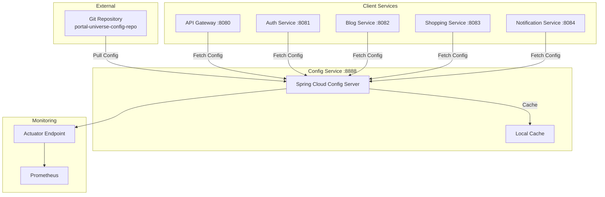

# Config Service System Overview

## 📋 개요

Config Service는 Spring Cloud Config Server를 기반으로 한 중앙 집중식 설정 관리 서비스입니다. Git 저장소를 통해 모든 마이크로서비스의 설정을 외부화하고, 환경별(local, docker, k8s) 설정을 제공합니다.

**핵심 역할**:
- 모든 마이크로서비스의 설정을 Git 기반으로 중앙 관리
- 환경별 프로파일(local, docker, k8s) 설정 제공
- 설정 변경 시 동적 갱신 지원 (Spring Cloud Bus + Kafka)
- 설정 암호화/복호화 기능 제공

---

## 🎯 핵심 특징

- **중앙 집중식 관리**: 모든 서비스 설정을 하나의 Git 저장소에서 관리
- **버전 관리**: Git을 통한 설정 이력 추적 및 롤백 가능
- **환경별 설정**: local, docker, k8s 프로파일별 설정 분리
- **동적 갱신**: 서비스 재시작 없이 설정 변경 적용
- **암호화 지원**: 민감한 정보(DB 비밀번호 등) 암호화 저장
- **고가용성**: 설정 캐싱을 통한 장애 대응

---

## 🏗️ High-Level Architecture



---

## 📦 컴포넌트 상세

### Config Service

| 항목 | 내용 |
|------|------|
| **역할** | 중앙 집중식 설정 관리 서버 |
| **기술 스택** | Spring Boot 3.5.5, Spring Cloud Config Server 2025.0.0 |
| **포트** | 8888 |
| **의존성** | Git Repository, Spring Boot Actuator, Micrometer |
| **주요 기능** | - Git 기반 설정 저장소 연동<br/>- 환경별 설정 제공<br/>- 설정 캐싱<br/>- Actuator Health Check |

### Git Repository

| 항목 | 내용 |
|------|------|
| **리포지토리** | https://github.com/L-a-z-e/portal-universe-config-repo.git |
| **브랜치** | main |
| **구조** | - application.yml (공통 설정)<br/>- {service}.yml (서비스별 설정)<br/>- {service}-{profile}.yml (환경별 설정) |

### Client Services

Config Service를 사용하는 클라이언트 서비스 목록:

| 서비스 | 포트 | 역할 |
|--------|------|------|
| API Gateway | 8080 | Spring Cloud Gateway, 라우팅 |
| Auth Service | 8081 | OAuth2 인증 서버 |
| Blog Service | 8082 | 블로그 CRUD |
| Shopping Service | 8083 | 전자상거래 |
| Notification Service | 8084 | Kafka 이벤트 컨슈머 |

---

## 💾 설정 우선순위

Config Service는 다음 우선순위로 설정을 병합합니다 (높은 순서대로):

1. **환경 변수 / 시스템 프로퍼티** (최우선)
2. **Config Server의 {service}-{profile}.yml** (예: auth-service-docker.yml)
3. **Config Server의 {service}.yml** (예: auth-service.yml)
4. **Config Server의 application.yml** (공통 설정)
5. **서비스 로컬 application.yml** (최하위)

### 예시: auth-service의 설정 병합

```
환경: docker 프로파일
실제 적용 순서:
1. services/auth-service/src/main/resources/application.yml (로컬)
2. config-repo/application.yml (공통)
3. config-repo/auth-service.yml (서비스별)
4. config-repo/auth-service-docker.yml (환경별)
5. 환경 변수: SPRING_DATASOURCE_PASSWORD=xxx (최종 덮어쓰기)
```

---

## 🔗 외부 연동

| 시스템 | 용도 | 프로토콜 |
|--------|------|----------|
| Git Repository | 설정 저장소 | HTTPS (Clone/Pull) |
| Client Services | 설정 요청 | REST (HTTP) |
| Prometheus | 메트릭 수집 | HTTP (/actuator/prometheus) |

---

## 📊 모니터링

### Actuator Endpoints

| Endpoint | 용도 | 접근 경로 |
|----------|------|-----------|
| Health | 서비스 상태 확인 | `GET /actuator/health` |
| Prometheus | 메트릭 노출 | `GET /actuator/prometheus` |
| Info | 서비스 정보 | `GET /actuator/info` |

### 주요 메트릭

| 메트릭 | 설명 |
|--------|------|
| `http_server_requests_seconds` | HTTP 요청 응답 시간 |
| `jvm_memory_used_bytes` | JVM 메모리 사용량 |
| `system_cpu_usage` | CPU 사용률 |

---

## 📊 성능 목표

| 지표 | 목표 | 비고 |
|------|------|------|
| 응답 시간 (p95) | < 500ms | 설정 요청 응답 |
| 가용성 | 99.5% | 클라이언트 캐싱으로 장애 대응 |
| Git Sync 주기 | 즉시 | 요청 시마다 최신 버전 확인 |

---

## 🔒 보안

### 설정 암호화

Config Server는 암호화된 프로퍼티를 지원합니다:

```yaml
# config-repo/auth-service.yml
spring:
  datasource:
    password: '{cipher}AQA...' # 암호화된 값
```

### 접근 제어

현재 구현:
- ❌ 인증 없음 (내부 네트워크만 접근 가능)

프로덕션 권장사항:
- ✅ Spring Security를 통한 Basic Auth
- ✅ 네트워크 정책으로 클라이언트만 접근 허용
- ✅ Git 저장소 Private 설정

---

## 📈 확장성

### 수평 확장 (Scale Out)

Config Service는 Stateless하므로 수평 확장 가능:
- Kubernetes에서 replicas 증가
- 로드 밸런서를 통한 분산 요청

### 캐싱 전략

- **서버 캐싱**: Git 저장소를 로컬에 Clone하여 캐싱
- **클라이언트 캐싱**: 각 서비스가 설정을 메모리에 캐싱
- **장애 시**: 클라이언트는 마지막 캐시된 설정으로 동작

---

## 🔄 설정 갱신 전략

### 정적 갱신 (서비스 재시작)

```bash
# 서비스 재시작 시 자동으로 최신 설정 적용
kubectl rollout restart deployment/auth-service
```

### 동적 갱신 (Spring Cloud Bus)

```bash
# Config 저장소 변경 후
curl -X POST http://config-service:8888/actuator/bus-refresh
# → 모든 서비스에 갱신 이벤트 전파 (Kafka 사용)
```

---

## 🛠️ 운영 가이드

### 설정 변경 절차

1. Git 저장소에서 설정 파일 수정
2. Commit & Push
3. (선택) `/actuator/bus-refresh` 호출로 동적 갱신
4. (또는) 서비스 재시작으로 반영

### 트러블슈팅

| 문제 | 원인 | 해결 |
|------|------|------|
| 설정을 못 가져옴 | Git 저장소 접근 불가 | 네트워크, 인증 확인 |
| 오래된 설정 적용 | 캐시 미갱신 | `/actuator/refresh` 호출 |
| Config Server 다운 | 단일 장애점 | 클라이언트 캐시로 임시 동작 |

---

## 🔗 관련 문서

- [Config Service Data Flow](./data-flow.md)
- [Config Repository](https://github.com/L-a-z-e/portal-universe-config-repo)

---

**최종 업데이트**: 2026-01-18
