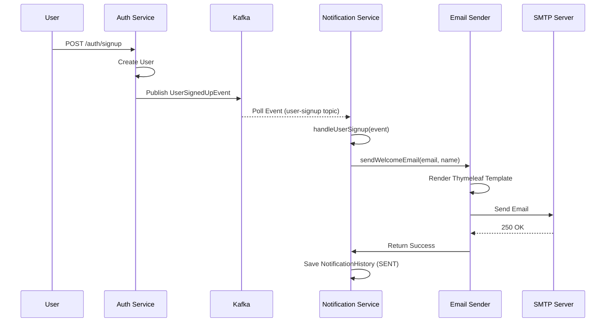
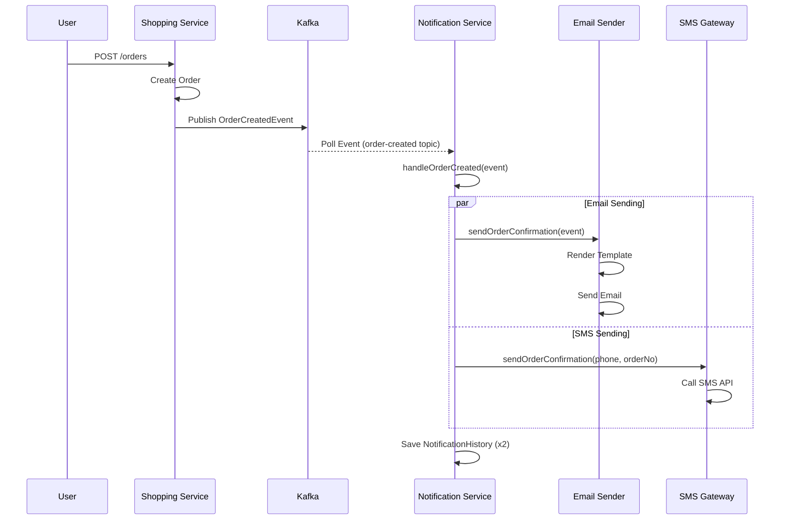

# Notification Service 시스템 아키텍처

## 1. 시스템 개요

Portal Universe의 Notification Service는 이벤트 기반 알림 처리 시스템으로, Kafka Consumer를 통해 다양한 비즈니스 이벤트를 수신하고 사용자에게 적절한 채널(Email, SMS, Push)로 알림을 전송하는 역할을 수행합니다.

### 주요 역할

- **이벤트 구독**: Kafka 토픽을 구독하여 비즈니스 이벤트를 수신
- **알림 발송**: Email, SMS, Push 등 다양한 채널을 통한 알림 전송
- **템플릿 관리**: Thymeleaf 기반 이메일 템플릿 처리
- **이력 관리**: 발송된 알림의 성공/실패 이력 저장
- **재시도 처리**: 실패한 알림에 대한 자동 재시도 전략
- **DLQ 관리**: Dead Letter Queue를 통한 영구 실패 메시지 처리

### 기술적 특징

- **비동기 이벤트 처리**: Kafka Consumer를 통한 느슨한 결합(Loose Coupling)
- **확장 가능한 구조**: 새로운 이벤트 타입 추가 용이
- **멀티 채널 지원**: 단일 이벤트로 다중 채널 알림 발송
- **관측 가능성**: Micrometer를 통한 메트릭 수집 및 Prometheus 연동

## 2. 아키텍처 다이어그램

### 2.1 전체 구조

```
┌──────────────────────────────────────────────────────────────────────┐
│                            Kafka Cluster                              │
│  ┌──────────────┐  ┌──────────────┐  ┌──────────────────┐           │
│  │ user-signup  │  │order-created │  │ delivery-status  │           │
│  │    Topic     │  │    Topic     │  │      Topic       │           │
│  └──────┬───────┘  └──────┬───────┘  └──────┬───────────┘           │
│         │                 │                  │                        │
└─────────┼─────────────────┼──────────────────┼────────────────────────┘
          │                 │                  │
          └─────────────────┼──────────────────┘
                            │
                            │ Kafka Consumer
                            │ @KafkaListener
                            ▼
         ┌──────────────────────────────────────────────────┐
         │         Notification Service (Port 8084)         │
         │            Spring Boot Application               │
         ├──────────────────────────────────────────────────┤
         │                                                  │
         │  ┌────────────────────────────────────────────┐ │
         │  │      NotificationConsumer.java             │ │
         │  │  - @KafkaListener (user-signup)            │ │
         │  │  - @KafkaListener (order-created)          │ │
         │  │  - @KafkaListener (delivery-status)        │ │
         │  └─────────────────┬──────────────────────────┘ │
         │                    │                            │
         │                    │ Event Routing              │
         │                    ▼                            │
         │  ┌─────────────────────────────────────────┐   │
         │  │   Notification Service Layer            │   │
         │  │  - EmailSender                          │   │
         │  │  - SmsSender                            │   │
         │  │  - PushSender                           │   │
         │  └─────────────────┬───────────────────────┘   │
         │                    │                            │
         │                    │ Send Notification          │
         │                    ▼                            │
         │  ┌─────────────────────────────────────────┐   │
         │  │     External Services                   │   │
         │  │  - SMTP Server (JavaMailSender)         │   │
         │  │  - SMS Gateway API                      │   │
         │  │  - Push Notification Service (FCM)      │   │
         │  └─────────────────────────────────────────┘   │
         │                    │                            │
         │                    │ Save History               │
         │                    ▼                            │
         │  ┌─────────────────────────────────────────┐   │
         │  │   NotificationHistoryRepository         │   │
         │  │   (JPA Entity: NotificationHistory)     │   │
         │  └─────────────────┬───────────────────────┘   │
         │                    │                            │
         └────────────────────┼────────────────────────────┘
                              │
                              ▼
                    ┌──────────────────┐
                    │  Database (MySQL) │
                    │ notification_     │
                    │     history       │
                    └──────────────────┘
```

### 2.2 Kafka Consumer 흐름

```
┌────────────────────────────────────────────────────────────────────┐
│                   Kafka Message Processing Flow                     │
└────────────────────────────────────────────────────────────────────┘

  Kafka Topic
      │
      │ Poll Messages
      ▼
┌──────────────────┐
│ Consumer Group:  │ ◄─── Configuration: groupId = "notification-group"
│ notification-    │      - Auto-offset commit: true
│     group        │      - Max poll records: 10
└────────┬─────────┘
         │
         │ Deserialize
         ▼
┌──────────────────┐
│  Event DTO       │ ◄─── UserSignedUpEvent, OrderCreatedEvent
│  (Java Record)   │      - JSON → Java Object
└────────┬─────────┘
         │
         │ @KafkaListener
         ▼
┌──────────────────────────────────────────────────────────────┐
│              handleUserSignup(event)                          │
│              handleOrderCreated(event)                        │
└────────┬─────────────────────────────────────────────────────┘
         │
         │ Success?
         ├─ Yes ──────────────────┐
         │                         ▼
         │                   [ Commit Offset ]
         │
         │ No (Exception)
         ├─ Retry (3회) ──────────┐
         │                         │
         │                         │ Still Failed?
         │                         ▼
         │                 ┌───────────────────┐
         └────────────────►│ Dead Letter Topic │
                           │  (user-signup.DLT)│
                           └───────────────────┘
```

## 3. 핵심 컴포넌트

### 3.1 NotificationConsumer.java

Kafka 메시지를 수신하는 진입점(Entry Point)입니다.

**위치**: `com.portal.universe.notificationservice.consumer.NotificationConsumer`

**주요 기능**:

- **이벤트 리스닝**: `@KafkaListener` 어노테이션을 통해 특정 토픽 구독
- **이벤트 라우팅**: 이벤트 타입에 따라 적절한 발송 로직 호출
- **로깅**: 수신한 이벤트 정보 기록

**구독 토픽 목록**:

| 토픽 | 이벤트 타입 | 발행자 | 용도 |
|------|-----------|--------|------|
| `user-signup` | UserSignedUpEvent | auth-service | 회원가입 환영 이메일 발송 |
| `order-created` | OrderCreatedEvent | shopping-service | 주문 확인 이메일/SMS 발송 |
| `delivery-status` | DeliveryStatusEvent | shopping-service | 배송 상태 변경 알림 |

**코드 예시**:
```java
@Service
public class NotificationConsumer {

    private static final Logger log = LoggerFactory.getLogger(NotificationConsumer.class);

    @KafkaListener(topics = "user-signup", groupId = "notification-group")
    public void handleUserSignup(UserSignedUpEvent event) {
        log.info("Received user signup event: {}", event);
        // 환영 이메일 발송 로직
        emailSender.sendWelcomeEmail(event.email(), event.name());
    }

    @KafkaListener(topics = "order-created", groupId = "notification-group")
    public void handleOrderCreated(OrderCreatedEvent event) {
        log.info("Received order created event: {}", event);
        // 주문 확인 이메일/SMS 발송
        emailSender.sendOrderConfirmation(event);
        smsSender.sendOrderConfirmation(event.userPhone(), event.orderNumber());
    }
}
```

### 3.2 EmailSender.java

이메일 발송을 담당하는 서비스입니다.

**주요 기능**:

- **템플릿 처리**: Thymeleaf를 사용한 HTML 이메일 템플릿 렌더링
- **SMTP 발송**: JavaMailSender를 통한 이메일 전송
- **멀티파트 지원**: 첨부파일 및 HTML 콘텐츠 처리

**구현 예시**:
```java
@Service
@RequiredArgsConstructor
public class EmailSender {

    private final JavaMailSender mailSender;
    private final TemplateEngine templateEngine;

    public void sendWelcomeEmail(String to, String name) {
        Context context = new Context();
        context.setVariable("name", name);

        String html = templateEngine.process("welcome", context);

        MimeMessage message = mailSender.createMimeMessage();
        MimeMessageHelper helper = new MimeMessageHelper(message, true, "UTF-8");
        helper.setTo(to);
        helper.setSubject("Welcome to Portal Universe!");
        helper.setText(html, true);

        mailSender.send(message);
    }
}
```

**이메일 템플릿 목록**:

```
templates/
├── welcome.html             # 회원가입 환영 이메일
├── order-confirmation.html  # 주문 확인 이메일
├── order-cancelled.html     # 주문 취소 알림
├── delivery-started.html    # 배송 시작 알림
└── delivery-completed.html  # 배송 완료 알림
```

### 3.3 SmsSender.java

SMS 발송을 담당하는 서비스입니다.

**주요 기능**:

- **SMS Gateway 연동**: 외부 SMS API 호출
- **메시지 템플릿**: 상황별 SMS 템플릿 관리
- **발송 이력 기록**: 성공/실패 여부 저장

**구현 방식**:
- RestTemplate 또는 WebClient를 통한 HTTP API 호출
- 비동기 발송 지원 (`@Async`)

### 3.4 PushSender.java

Push 알림 발송을 담당하는 서비스입니다.

**주요 기능**:

- **FCM 연동**: Firebase Cloud Messaging을 통한 푸시 알림
- **디바이스 토큰 관리**: 사용자별 디바이스 토큰 조회
- **멀티 디바이스 지원**: 동일 사용자의 여러 기기에 동시 발송

### 3.5 NotificationHistory (Entity)

발송된 알림의 이력을 저장하는 JPA 엔티티입니다.

**스키마**:
```java
@Entity
public class NotificationHistory {
    @Id @GeneratedValue
    private Long id;
    private String userId;
    private NotificationType type;    // EMAIL, SMS, PUSH
    private String recipient;         // 이메일/전화번호
    private String subject;
    private String content;
    private NotificationStatus status; // SENT, FAILED, PENDING
    private String errorMessage;
    private LocalDateTime createdAt;
    private LocalDateTime sentAt;
}
```

**용도**:
- 알림 발송 이력 추적
- 재발송 판단 근거
- 통계 및 리포팅

## 4. 이벤트 흐름

### 4.1 회원가입 환영 이메일 발송 흐름



**단계별 설명**:
1. 사용자가 Auth Service에 회원가입 요청
2. Auth Service가 사용자 생성 후 Kafka에 `UserSignedUpEvent` 발행
3. Notification Service의 Consumer가 이벤트 수신
4. `handleUserSignup` 메서드에서 이메일 발송 로직 호출
5. EmailSender가 Thymeleaf 템플릿 렌더링
6. JavaMailSender를 통해 SMTP 서버로 이메일 전송
7. 발송 결과를 NotificationHistory 테이블에 저장

### 4.2 주문 확인 이메일/SMS 발송 흐름



**특징**:
- 단일 이벤트로 다중 채널(Email + SMS) 동시 발송
- 병렬 처리를 통한 성능 최적화

## 5. 에러 처리

### 5.1 재시도 전략

Kafka Consumer는 메시지 처리 실패 시 자동 재시도를 수행합니다.

**설정 (KafkaConsumerConfig.java)**:
```java
@Configuration
public class KafkaConsumerConfig {

    @Bean
    public ConcurrentKafkaListenerContainerFactory<String, Object>
           kafkaListenerContainerFactory() {

        ConcurrentKafkaListenerContainerFactory<String, Object> factory =
            new ConcurrentKafkaListenerContainerFactory<>();

        // 재시도 설정: 1초 간격, 3회 재시도
        factory.setCommonErrorHandler(new DefaultErrorHandler(
            new FixedBackOff(1000L, 3L)
        ));

        return factory;
    }
}
```

**재시도 흐름**:
```
Message Processing Failed
    ↓
Wait 1 second
    ↓
Retry (1/3)
    ↓ Failed
Wait 1 second
    ↓
Retry (2/3)
    ↓ Failed
Wait 1 second
    ↓
Retry (3/3)
    ↓ Still Failed
Send to Dead Letter Topic (DLT)
```

### 5.2 Dead Letter Queue (DLQ)

재시도 후에도 실패한 메시지는 Dead Letter Topic으로 이동됩니다.

**DLT 네이밍 규칙**:
```
원본 토픽: user-signup
DLT:       user-signup.DLT

원본 토픽: order-created
DLT:       order-created.DLT
```

**DLQ 처리**:
```java
@KafkaListener(topics = "user-signup.DLT", groupId = "dlq-group")
public void handleDeadLetter(ConsumerRecord<String, Object> record) {
    log.error("Dead letter received: topic={}, key={}, value={}",
        record.topic(), record.key(), record.value());

    // 1. 에러 로그 저장
    // 2. 관리자 알림 발송
    // 3. 수동 처리 대기열에 추가
}
```

### 5.3 에러 타입별 처리

| 에러 타입 | 재시도 여부 | DLQ 전송 | 비고 |
|----------|-----------|---------|------|
| DeserializationException | ❌ | ✅ | 메시지 형식 오류 |
| SmtpException | ✅ (3회) | ✅ | SMTP 서버 장애 |
| TemplateNotFoundException | ❌ | ✅ | 템플릿 파일 누락 |
| SmsApiException | ✅ (3회) | ✅ | SMS Gateway 장애 |
| NetworkException | ✅ (3회) | ✅ | 네트워크 일시 장애 |

## 6. 기술 스택

### Core Framework

| 기술 | 버전 | 역할 |
|------|------|------|
| Spring Boot | 3.5.5 | 애플리케이션 프레임워크 |
| Java | 17 | 런타임 환경 |

### Messaging

| 기술 | 역할 |
|------|------|
| Spring Kafka | Kafka Consumer 구현 |
| Kafka Client | Kafka 클라이언트 라이브러리 |

### Notification Channels

| 기술 | 용도 |
|------|------|
| JavaMailSender (spring-boot-starter-mail) | 이메일 발송 |
| Thymeleaf | HTML 이메일 템플릿 |
| RestTemplate/WebClient | SMS Gateway API 호출 |
| Firebase Admin SDK | FCM Push 알림 |

### Data Persistence

| 기술 | 용도 |
|------|------|
| Spring Data JPA | NotificationHistory 저장 |
| MySQL | 데이터베이스 |

### Observability

| 기술 | 역할 |
|------|------|
| Micrometer | 메트릭 수집 |
| Prometheus | 메트릭 저장소 |
| Spring Boot Actuator | 헬스체크, 메트릭 엔드포인트 |
| Zipkin | 분산 추적 |

### Configuration

| 기술 | 설명 |
|------|------|
| Spring Cloud Config Client | Config Service 연동 |

## 7. 모니터링

### 7.1 Health Check

**엔드포인트**: `/actuator/health`

**응답 예시**:
```json
{
  "status": "UP",
  "components": {
    "diskSpace": {"status": "UP"},
    "kafka": {
      "status": "UP",
      "details": {
        "clusterId": "kafka-cluster-1",
        "consumerGroups": ["notification-group"]
      }
    },
    "db": {
      "status": "UP",
      "details": {
        "database": "MySQL",
        "validationQuery": "isValid()"
      }
    }
  }
}
```

### 7.2 메트릭

**Prometheus 엔드포인트**: `/actuator/prometheus`

**주요 메트릭**:

| 메트릭 | 설명 | 타입 |
|--------|------|------|
| `kafka_consumer_records_consumed_total` | 수신한 메시지 총 개수 | Counter |
| `kafka_consumer_records_lag` | Consumer Lag (처리 지연) | Gauge |
| `notification_sent_total{type="email"}` | 발송된 이메일 수 | Counter |
| `notification_sent_total{type="sms"}` | 발송된 SMS 수 | Counter |
| `notification_sent_total{type="push"}` | 발송된 Push 알림 수 | Counter |
| `notification_failed_total{type="email"}` | 실패한 이메일 수 | Counter |
| `notification_processing_seconds` | 알림 처리 시간 | Histogram |

**Grafana 대시보드 항목**:
- Consumer Lag 트렌드
- 시간대별 알림 발송량
- 채널별 성공/실패율
- 평균 처리 시간

### 7.3 로깅

**로그 레벨**:
- `INFO`: 이벤트 수신, 발송 성공
- `WARN`: 재시도 발생
- `ERROR`: 발송 실패, DLQ 전송

**로그 예시**:
```
2026-01-18 10:30:00 INFO  [notification-group] Received user signup event: UserSignedUpEvent[userId=user123, email=user@example.com]
2026-01-18 10:30:01 INFO  [EmailSender] Sending welcome email to: user@example.com
2026-01-18 10:30:02 INFO  [EmailSender] Email sent successfully: messageId=<1234@smtp.example.com>
```

## 8. 배포 및 운영

### 8.1 프로필별 설정

**local**:
- Kafka: localhost:9092
- SMTP: localhost:1025 (MailHog)
- MySQL: localhost:3306

**docker**:
- Kafka: kafka:9092
- SMTP: smtp-server:587
- MySQL: mysql:3306

**k8s**:
- Kafka: kafka-service.default.svc.cluster.local:9092
- SMTP: 외부 SMTP 서버 (Gmail SMTP, SendGrid 등)
- MySQL: mysql-service.default.svc.cluster.local:3306

### 8.2 환경 변수

**application-docker.yml 예시**:
```yaml
spring:
  kafka:
    bootstrap-servers: kafka:9092
    consumer:
      group-id: notification-group
      auto-offset-reset: earliest

  mail:
    host: smtp.example.com
    port: 587
    username: ${SMTP_USERNAME}
    password: ${SMTP_PASSWORD}
    properties:
      mail.smtp.auth: true
      mail.smtp.starttls.enable: true

  datasource:
    url: jdbc:mysql://mysql:3306/notification_db
    username: ${DB_USERNAME}
    password: ${DB_PASSWORD}
```

### 8.3 스케일링 전략

**Consumer 그룹 파티션 할당**:
- Kafka 토픽의 파티션 수 = 최대 Consumer 인스턴스 수
- 예: user-signup 토픽이 3개 파티션 → 최대 3개 인스턴스 배포 가능

**수평 확장**:
```bash
# Kubernetes에서 Pod 수 증가
kubectl scale deployment notification-service --replicas=3

# Docker Compose에서 스케일링
docker-compose up -d --scale notification-service=3
```

**주의사항**:
- Consumer 인스턴스 수 > 파티션 수인 경우 일부 인스턴스는 유휴 상태
- Consumer Rebalancing으로 인한 일시적 지연 발생 가능

## 9. 확장 포인트

### 9.1 새로운 이벤트 타입 추가

**단계**:
1. 이벤트 DTO 정의 (common-library 또는 로컬)
2. NotificationConsumer에 `@KafkaListener` 메서드 추가
3. 적절한 Sender 호출
4. 필요시 새 템플릿 작성

**예시 (배송 완료 알림)**:
```java
@KafkaListener(topics = "delivery-completed", groupId = "notification-group")
public void handleDeliveryCompleted(DeliveryCompletedEvent event) {
    log.info("Received delivery completed event: {}", event);

    emailSender.sendDeliveryCompletedEmail(
        event.userEmail(),
        event.orderNumber()
    );

    pushSender.sendDeliveryCompletedPush(
        event.userId(),
        "Your order has been delivered!"
    );
}
```

### 9.2 새로운 알림 채널 추가

**예: Slack 알림 추가**:
```java
@Service
@RequiredArgsConstructor
public class SlackSender {

    private final WebClient slackWebClient;

    public void sendSlackNotification(String channel, String message) {
        slackWebClient.post()
            .uri("/api/chat.postMessage")
            .bodyValue(new SlackMessage(channel, message))
            .retrieve()
            .bodyToMono(Void.class)
            .block();
    }
}
```

### 9.3 알림 스케줄링

**예: 일일 요약 이메일**:
```java
@Component
public class ScheduledNotificationService {

    @Scheduled(cron = "0 0 9 * * *") // 매일 오전 9시
    public void sendDailySummary() {
        List<User> users = userRepository.findAllActive();

        for (User user : users) {
            emailSender.sendDailySummary(
                user.getEmail(),
                generateSummary(user)
            );
        }
    }
}
```

## 10. 트러블슈팅

### 10.1 Consumer Lag 증가

**증상**: Kafka Consumer가 메시지를 처리하는 속도보다 생성 속도가 빠름

**원인**:
- 이메일/SMS 발송 지연
- Consumer 인스턴스 부족
- 네트워크 지연

**해결**:
1. Consumer 인스턴스 수 증가
2. 병렬 처리 최적화 (`concurrency` 설정)
3. SMTP/SMS Gateway 성능 점검

**설정 예시**:
```yaml
spring:
  kafka:
    listener:
      concurrency: 3  # 각 인스턴스에서 3개 스레드로 병렬 처리
```

### 10.2 이메일 발송 실패

**증상**: SMTP 예외 발생, 이메일 미전송

**체크리스트**:
- SMTP 서버 접근 가능한가?
- SMTP 인증 정보 올바른가?
- TLS/SSL 설정 맞는가?
- 발신자 이메일 유효한가?
- 수신자 이메일 형식 올바른가?

**로그 확인**:
```bash
kubectl logs -f notification-service-pod | grep "SmtpException"
```

**해결**:
```yaml
# TLS 활성화
spring:
  mail:
    properties:
      mail.smtp.starttls.enable: true
      mail.smtp.starttls.required: true
      mail.smtp.ssl.trust: smtp.gmail.com
```

### 10.3 DLQ 메시지 수동 재처리

**증상**: Dead Letter Topic에 메시지 누적

**원인**:
- 일시적 장애 (SMTP 서버 다운타임)
- 템플릿 파일 누락
- 잘못된 이벤트 데이터

**재처리 절차**:
1. DLQ 메시지 확인
   ```bash
   kafka-console-consumer --bootstrap-server kafka:9092 \
       --topic user-signup.DLT --from-beginning
   ```

2. 원인 분석 및 수정

3. 수동 재발행
   ```bash
   # 관리자 API 또는 Kafka 재발행 스크립트 사용
   curl -X POST http://notification-service:8084/admin/retry-dlq \
       -H "Content-Type: application/json" \
       -d '{"topic": "user-signup.DLT", "key": "event-123"}'
   ```

### 10.4 템플릿 렌더링 오류

**증상**: TemplateNotFoundException

**원인**:
- 템플릿 파일 경로 오류
- 변수명 불일치

**해결**:
```java
// 템플릿 경로 확인
// src/main/resources/templates/welcome.html 위치 확인

// 변수명 매칭 확인
Context context = new Context();
context.setVariable("name", userName); // 템플릿의 ${name}과 일치해야 함
```

## 11. 보안 고려사항

### 11.1 민감 정보 보호

- **SMTP 비밀번호**: 환경 변수 또는 Secret Manager 사용
- **SMS Gateway API Key**: 암호화된 설정 파일 또는 Vault 사용
- **이메일 내용**: PII(개인식별정보) 최소화

### 11.2 Rate Limiting

**이메일 발송량 제한**:
```java
@Service
public class RateLimitedEmailSender {

    private final RateLimiter rateLimiter =
        RateLimiter.create(10.0); // 초당 10개 제한

    public void sendEmail(String to, String subject, String body) {
        rateLimiter.acquire(); // 토큰 획득 대기
        mailSender.send(createMessage(to, subject, body));
    }
}
```

## 12. 참고 자료

### 공식 문서
- [Spring for Apache Kafka](https://docs.spring.io/spring-kafka/docs/current/reference/html/)
- [JavaMailSender API](https://docs.spring.io/spring-framework/docs/current/javadoc-api/org/springframework/mail/javamail/JavaMailSender.html)
- [Thymeleaf Templates](https://www.thymeleaf.org/doc/tutorials/3.1/usingthymeleaf.html)

### 프로젝트 내부 문서
- [Notification Service API 문서](../api/README.md)
- [이메일 템플릿 가이드](../guides/email-templates.md)
- [운영 가이드](../../docs/runbooks/notification-service-operations.md)

### 관련 서비스 문서
- [Auth Service: Kafka 이벤트 발행](../../auth-service/docs/guides/kafka-events.md)
- [Shopping Service: 주문 이벤트](../../shopping-service/docs/guides/order-events.md)

---

**문서 버전**: 1.0.0
**최종 검토**: 2026-01-18
**다음 리뷰 예정**: 2026-04-18
